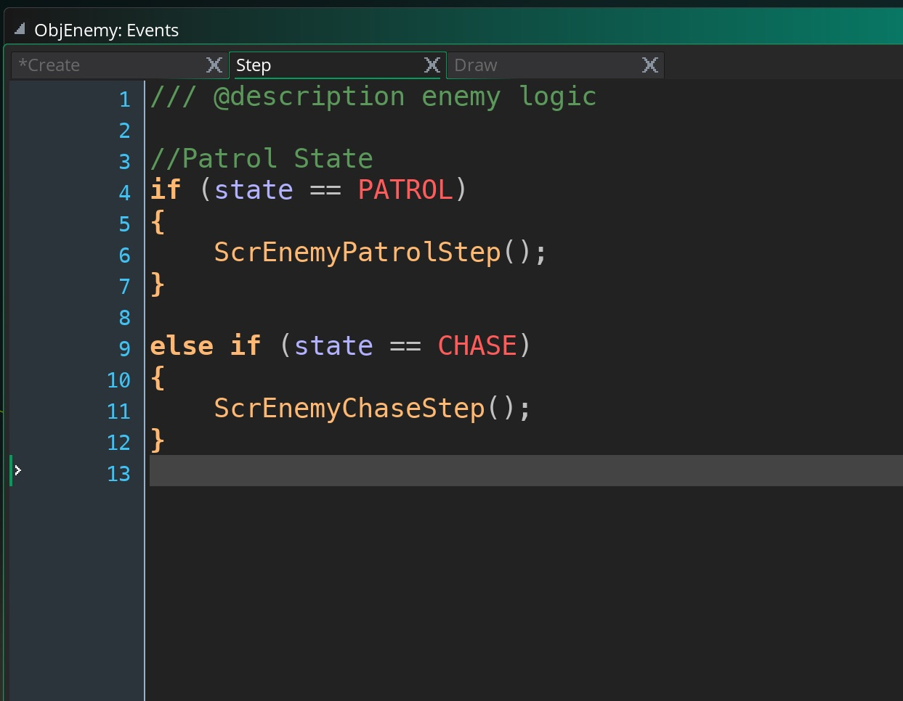
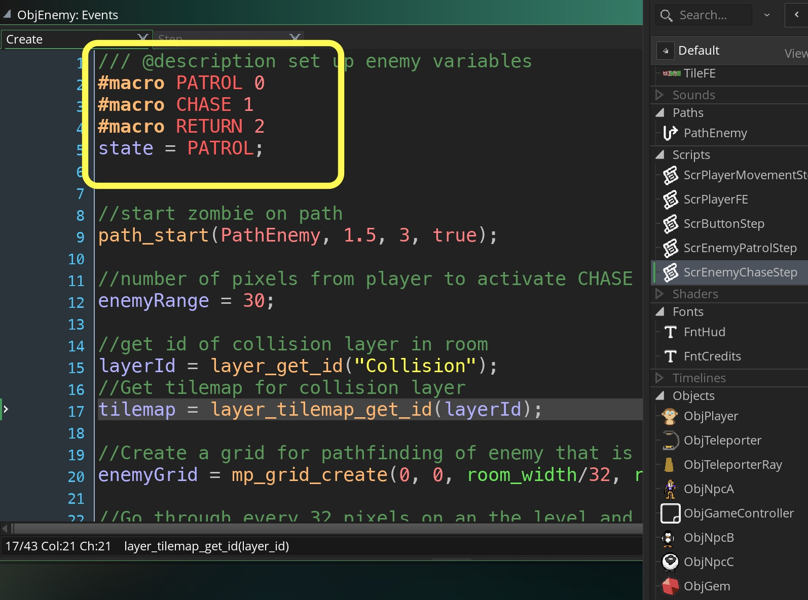
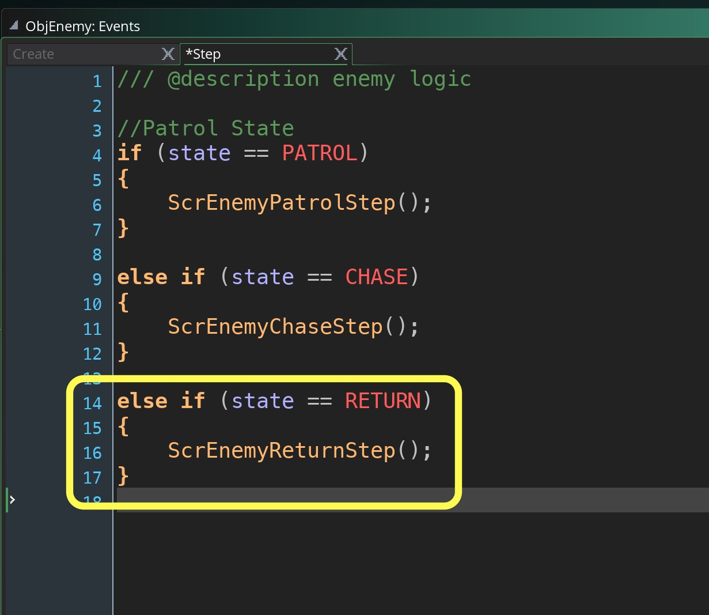

___ 
## Enemy Chasing Part II

<div class = "row">
<div class="col-12">
<div markdown = "1">

{:start="{{ num }}"}
{{ num }}. Now we set up this grid because gamemaker provides a function that dynamically creates a path based on this collision grid so the enemy won't run into a grid section.

> **mp_grid_path(id, path, xstart, ystart, xgoal, ygoal, allowdiag)**<br><br>**Returns**: Boolean.<br><br>**Description**: With this function you can create a path that will navigate from a start point to a finish point using an mp_grid that you have previously defined, avoiding any obstacles that have already been added into the grid. The xstart and ystart arguments indicate the start of the path in room coordinates, while xgoal, ygoal arguments indicate the destination. You can also select either horizontal/vertical movement only, or allow full diagonal movements by specifying true in the allowdiag argument. The function returns either true (it succeeded in finding a path) or false (it failed) as well as setting the chosen path. - GameMaker Manual

___ 
<div class = "row">
<div class="col-12 col-lg-4 align-self-center">
<div markdown = "1">

{:start="{{ num }}"}
{{ num }}. Open the **Create Event** on `ObjEnemy` and add a faster chase speeed:
</div>
</div>
<div class="col-12 col-lg-8">
<div markdown = "1">
```c
//speed that enemy runs at in CHASE state
enemyChaseSpeed = 4;

//add new path for enemy to use for chasing player
enemyChase = path_add();
```
</div>
</div>
</div>

___ 
<div class = "row">
<div class="col-12 col-lg-4 align-self-center">
<div markdown = "1">

{:start="{{ num }}"}
{{ num }}. Delete the **Draw Event** on `ObjEnemy` so that we can see the level properly.  Then create a new **Script** called `ScrEnemyChaseStep` and add:  
</div>
</div>
<div class="col-12 col-lg-8">
<div markdown = "1">
```c
mp_grid_path(enemyGrid, enemyChase, x, y, ObjPlayer.x, ObjPlayer.y, false );
path_start(enemyChase, enemyChaseSpeed, 0, true);
```
</div>
</div>
</div>

___ 
<div class = "row">
<div class="col-12 col-lg-4 align-self-center">
<div markdown = "1">

{:start="{{ num }}"}
{{ num }}. Edit the **Step Event** on `ObjEnemy` to call this script at the end:
</div>
</div>
<div class="col-12 col-lg-8">
<div markdown = "1">
```c
else if (state == CHASE)
{
    ScrEnemyMovementStep();
    ScrEnemyChaseStep();
}
```
</div>
</div>
</div>
<div class = "row">
<div class="col-12">
 
</div>
</div>

___ 
<div class = "row">
<div class="col-12 col-lg-4 align-self-center">
<div markdown = "1">

{:start="{{ num }}"}
{{ num }}. Now you run the game and the enemy when you get very, very close should start chasing you.  The zombie updates every frame so he mirrors your every move.  Now enemies are supposed to be a bit slower so we don't want to update his path every frame.  We want to only update it every 20 frames.  Now add to **Create Event** on `ObjEnemy` at the end:  
</div>
</div>
<div class="col-12 col-lg-8">
<div markdown = "1">
```c
//delay for enemies pathfinding
enemyDelay = 20;
timer = enemyDelay;
```
</div>
</div>
</div>

___ 
<div class = "row">
<div class="col-12 col-lg-4 align-self-center">
<div markdown = "1">

{:start="{{ num }}"}
{{ num }}. Open `ScrEnemyChaseStep` and replace all of the old script with:   
</div>
</div>
<div class="col-12 col-lg-8">
<div markdown = "1">
```c
if (timer >= zombieDelay)
{ 
    mp_grid_path(zombieGrid, zombieChase, x, y, ObjPlayer.x, ObjPlayer.y, false );
    path_start(zombieChase, zombieChaseSpeed, 0, true);
    timer = 0;
}
else
{
    timer++;
}
```
</div>
</div>
</div>

___ 
<div class = "row">
<div class="col-12 col-lg-4 align-self-center">
<div markdown = "1">

{:start="{{ num }}"}
{{ num }}.  Now we need to switch back to PATROL mode when the player gets too far away. We need to get the enemy back to the starting point of his patrol.  We will a new state `RETURN`.  Open the **Create Event** in `ObjEnemy` and add to the macros:
</div>
</div>
<div class="col-12 col-lg-8">
<div markdown = "1">
```c
#macro RETURN 2
```
</div>
</div>
</div>
<div class = "row">
<div class="col-12">
 
</div>
</div>

 ___ 
<div class = "row">
<div class="col-12 col-lg-4 align-self-center">
<div markdown = "1">

{:start="{{ num }}"}
{{ num }}. Open `ScrEnemyChaseStep` and add to the end of the script.  This will check to see if it should chase else go back to patrol.  We end the path of the enemy chase and switch to the **RETURN** state when the player has gone twice the trigger distance away from the enemy.
</div>
</div>
<div class="col-12 col-lg-8">
<div markdown = "1">
```c
if (distance_to_point(ObjPlayer.x, ObjPlayer.y) > (enemyRange * 2))
{
    path_end();
    state = RETURN;
}
```
</div>
</div>
</div>

 ___ 
<div class = "row">
<div class="col-12 col-lg-4 align-self-center">
<div markdown = "1">

{:start="{{ num }}"}
{{ num }}. Run the game and go to the enemy.  Run away, once you get to a certain distance the enemy should stop.  Take a look at the video:
</div>
</div>
<div class="col-12 col-lg-8">
<div class="embed-responsive embed-responsive-16by9">
<iframe class="embed-responsive-item" src="https://www.youtube.com/embed/0c0f51kKs3Y?autoplay=1&rel=0&controls=0&amp&showinfo=0&version=3&loop=1&playlist=0c0f51kKs3Y" frameborder="0" allowfullscreen></iframe>
</div>
</div>
</div>

 ___ 
<div class = "row">
<div class="col-12">
<div markdown = "1">

{:start="{{ num }}"}
{{ num }}. Now how does we know where the player returns to.  We know we them to go back to the PathZombie that we created.  It would be a difficult problem to return to the closest point, so we will just make the zombie return the the beginning of the path.  How do we do this?  There is a new GameMaker function called `path_get_x()` and `path_get_y()`.

> **path_get_x(ind, pos)**<br><br>**Returns**: Real. <br><br>**Description**: With this function you can get the x coordinate of a position on any given path. 0 is the start of the path, 1 is the end of the path, and anything in between equates to that far through the path. This needn't be a defining point of the path, it can be anywhere on it. - GameMaker Manual
</div>
</div>
</div>

 ___ 
<div class = "row">
<div class="col-12 col-lg-4 align-self-center">
<div markdown = "1">

{:start="{{ num }}"}
{{ num }}. The other function will get the y component. We are going to pos 0 at the begining of the path.  Open `ScrEnemyChaseStep` and replace what is in the check to return to the PATROL state.  Please note that we commented out path_end() as we will use this path to return to the original point.
</div>
</div>
<div class="col-12 col-lg-8">
<div markdown = "1">
```c
if (distance_to_point(ObjPlayer.x, ObjPlayer.y) > (enemyRange * 2))
{
    //path_end();
    state = RETURN;
    returnX = path_get_x(PathEnemy, 0);
    returnY = path_get_y(PathEnemy, 0);
    mp_grid_path(enemyGrid, enemyChase, x, y, returnX, returnY, false);
    path_start(enemyChase, enemyChaseSpeed, 0, true);
}
```
</div>
</div>
</div>

___ 
<div class = "row">
<div class="col-12 col-lg-4 align-self-center">
<div markdown = "1">

{:start="{{ num }}"}
{{ num }}. Now test the game and and see what happens.  The player goes back to the 0 point then just keeps running in place.  Why is this?  Well the zombie has reached its destination.  So what we will add is a check to see if the Zombie is close enough to return to the PATROL state. Create a new **Script** called `ScrZombieReturnStep` and add:
</div>
</div>
<div class="col-12 col-lg-8">
<div markdown = "1">
```c
if (distance_to_point(returnX, returnY) <= enemyChaseSpeed + 12)
{
    path_end();
    path_start(PathEnemy, 1.5, 3, true);
    state = PATROL;
}
```
</div>
</div>
</div>

___ 
<div class = "row">
<div class="col-12 col-lg-4 align-self-center">
<div markdown = "1">

{:start="{{ num }}"}
{{ num }}. Now call this script by calling it in the `ObjEnemy` **Step** event by adding at the end:
</div>
</div>
<div class="col-12 col-lg-8">
<div markdown = "1">
```c
else if (state == RETURN)
{
    ScrEnemyMovementStep();
    ScrEnemyReturnStep();
}
```
</div>
</div>
</div>
<div class = "row">
<div class="col-12">
 
</div>
</div>

___ 
<div class = "row">
<div class="col-12 col-lg-4 align-self-center">
<div markdown = "1">

{:start="{{ num }}"}
{{ num }}. Now test the game and make sure the player is going in between states.  It might be useful that if the player is in RETURN mode that if the player gets too close that they will go back to CHASE state.  This is easy to edit by opening the `ScrEnemyReturnStep` and you need to add to the end:
</div>
</div>
<div class="col-12 col-lg-8">
<div markdown = "1">
```c
if (distance_to_point(ObjPlayer.x, ObjPlayer.y) < enemyRange && state == PATROL)
{
    state = CHASE;
    path_end();
}
```
</div>
</div>
</div>

___ 
<div class = "row">
<div class="col-12 col-lg-4 align-self-center">
<div markdown = "1">

{:start="{{ num }}"}
{{ num }}. Test this carefully and make sure the enemy switches states correctly.  Once you know it is working correctly change `ObjEnemy` **Create Script** to something like: `enemyRange = 150;` which is better.  Your video should look like:
</div>
</div>
<div class="col-12 col-lg-8">
<div class="embed-responsive embed-responsive-16by9">
<iframe class="embed-responsive-item" src="https://www.youtube.com/embed/q9s65yaR3LY?autoplay=1&rel=0&controls=0&amp&showinfo=0&version=3&loop=1&playlist=q9s65yaR3LY" frameborder="0" allowfullscreen></iframe>
</div>
</div>
</div>

___ 
<div class = "row">
<div class="col-12">
<div markdown = "1">

{:start="{{ num }}"}
{{ num }}. On the next page we will add audio as our final step in this prototype
</div>
</div>
</div>
___ 
<br><br>
[<- Previous](AdventureGame_15.html)&nbsp;&nbsp;&nbsp;[Home](../../index.html)&nbsp;&nbsp;&nbsp;[Continue ->](AdventureGame_17.html)
<br />  
<br />  
<br />  
<br /> 
<br />  
<br />   