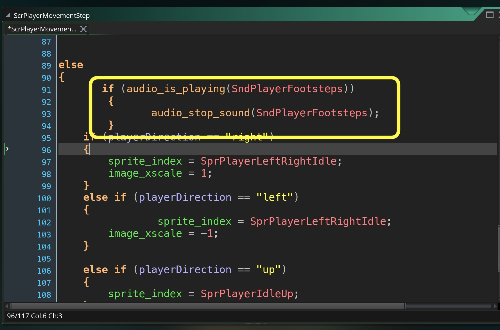

___ 
## Audio

<div class = "row">
<div class="col-12 col-lg-4 align-self-center">
<div markdown = "1">

{:start="{{ num }}"}
{{ num }}. If the core mechanic does not include auido, we typically wait until we are happy with what we have before we add audio.  Now I am generally happy with what we have done to date so lets make it sound good.  Lets create a new **Sound** and click on the folder icon to load **Music - Teller of the Tales** in the asset folder you downloaded.  Play it and make sure it works.  Name the resource `SndMusic`.  OK, we want to start this in the front end.  Now just to be sure we want to make sure that the music isn't playing first.  Open `ObjTitle` and add a new **Create Event** and add:  
</div>
</div>
<div class="col-12 col-lg-8">
<div markdown = "1">
```c
if (!audio_is_playing(SndMusic))
{
	audio_play_sound(SndMusic, 1, true);
}
```
</div>
</div>
</div>

___ 
<div class = "row">
<div class="col-12 col-lg-6 align-self-center">
<div markdown = "1">

{:start="{{ num }}"}
{{ num }}. Run the game and you should hear music.  Now lets create a button sound for when the player steps on it in the Front End. Create a new **Sound** file and import the **SndButtonPress124900__greencouch__beeps-18** sound effect and call it `SndButtonPress`.  Play it and listen to it.
</div>
</div>
<div class="col-12 col-lg-6">

</div>
</div>

<div class = "row">
<div class="col-12 col-lg-4 align-self-center">
<div markdown = "1">

{:start="{{ num }}"}
{{ num }}. So where did we check to see if the player was pressing the button?  It is in **_ScrButtonStep_**.  Now we don't want it to trigger every frame just the first time in or when ```image_index == 0``` before we set it to ```1```.
</div>
</div>
<div class="col-12 col-lg-8">
<div markdown = "1">
```c
//if player is standing on button and button is not pressed
if (image_index != 2 && place_meeting (x, y, ObjPlayer))
{
    if (image_index == 0)
    {
        audio_play_sound(SndButtonPress, 2, false);
    }
    image_index = 1; //move text to highlighted state
    if (sprite_index == SprFeStart) //move ObjButtonStart to highlighted state
    {
```
</div>
</div>
</div>
<div class = "row">
<div class="col-12">
 
</div>
</div>

___ 
<div class = "row">
<div class="col-12 col-lg-4 align-self-center">
<div markdown = "1">

{:start="{{ num }}"}
{{ num }}. Now that sounds good, what about triggering the same sound on the release?  In the second if we play the audio only if ```image_index == 1```:  
</div>
</div>
<div class="col-12 col-lg-8">
<div markdown = "1">
```c
//else if player is not standing on button and button is not pressed
else if (image_index != 2 && !place_meeting (x, y, ObjPlayer))
{
    if (image_index == 1)
    {
        audio_play_sound(SndButtonPress, 2, false);
    }
    image_index = 0;
    if (sprite_index == SprFeStart) //Move start back to non highlighted
    {
```
</div>
</div>
</div>
<div class = "row">
<div class="col-12">
 
</div>
</div>

___ 
<div class = "row">
<div class="col-12 col-lg-4 align-self-center">
<div markdown = "1">

{:start="{{ num }}"}
{{ num }}. Play it.  Hmmm, sounds too much the same.  Lets use a click for when you walk off the button. Create a new **audio** file and import the sound **SndButtonRelease** and call it **_SndButtonRelease_**.  Change the audio to:
</div>
</div>
<div class="col-12 col-lg-8">
<div markdown = "1">
```c
    if (image_index == 1)
    {
	       audio_play_sound(SndButtonRelease, 2, false);
    }
```
</div>
</div>
</div>
<div class = "row">
<div class="col-12">

</div>
</div>

___ 
<div class = "row">
<div class="col-12 col-lg-4 align-self-center">
<div markdown = "1">

{:start="{{ num }}"}
{{ num }}. Create a new **_audio_** file and import the sound **SndButtonClick-219478__jarredgibb__button-03** and call it `SndButtonClick`. Now add to `ScrButtonStep`:  
</div>
</div>
<div class="col-12 col-lg-8">
<div markdown = "1">
```c
if (keyboard_check(vk_space) || keyboard_check(vk_enter) )
{
    ObjButtonStart.alarm[0] = 15;
    image_index = 2;
    ObjButtonStart.image_index = 2;
    audio_play_sound(SndButtonClick, 2, false);
}
```

AND

```c
if (keyboard_check(vk_space) || keyboard_check(vk_enter) )
{
    ObjButtonCredits.alarm[0] = 15;
    image_index = 2;
    ObjButtonCredits.image_index = 2;
    audio_play_sound(SndButtonClick, 2, false);
}
 ```
</div>
</div>
</div>

___ 
<div class = "row">
<div class="col-12 col-lg-4 align-self-center">
<div markdown = "1">

{:start="{{ num }}"}
{{ num }}. Lets add the click sound to the escape key as well.  Open the `ObjCreditsController` **Steps Event** and add:  
</div>
</div>
<div class="col-12 col-lg-8">
<div markdown = "1">
```c
/// @description exiting credit screen
if (y < -600 || keyboard_check(vk_escape) || keyboard_check(vk_space) || keyboard_check(vk_enter) ) //this depends on the font and length of credits
{
    room_goto(RmLvlFE);
    keyboard_key_release(vk_escape);
    with (ObjPlayer)
    {
        image_alpha = 1;
        x = xstart;
        y = ystart;
    }
     audio_play_sound(SndButtonClick, 2, false);
}
```
</div>
</div>
</div>
<div class = "row">
<div class="col-12">

</div>
</div>

___ 
<div class = "row">
<div class="col-12 col-lg-4 align-self-center">
<div markdown = "1">

{:start="{{ num }}"}
{{ num }}. Now lets add the click for escaping the game, open `ObjGameController` and add to the quitting in the **Step Event**:  
</div>
</div>
<div class="col-12 col-lg-8">
<div markdown = "1">
```c
/// @description quit game
if (keyboard_check(vk_escape))
{
    game_restart(); 
    audio_play_sound(SndButtonClick, 2, false);
}
```
</div>
</div>
</div>

___ 
<div class = "row">
<div class="col-12 col-lg-4 align-self-center">
<div markdown = "1">

{:start="{{ num }}"}
{{ num }}. Lets make a footstep sound in the game.  Create a new sound and press the folder icon to load **SndFootsteps...** and call it *`SndPlayerFootsteps`.  Then go to `ScrPlayerMovementStep` and add at the very top of the script (very important it is the top of the script):
</div>
</div>
<div class="col-12 col-lg-8">
<div markdown = "1">
```c
if (!audio_is_playing(SndPlayerFootsteps))
{
	audio_play_sound(SndPlayerFootsteps, 2, true);
}
```
</div>
</div>
</div>
<div class = "row">
<div class="col-12">

</div>
</div>

___ 
<div class = "row">
<div class="col-12 col-lg-4 align-self-center">
<div markdown = "1">

{:start="{{ num }}"}
{{ num }}. Test the game.  Woops the player is walking all the time.  So what we want to do is where we set the idle animation frame check to see if `SndPlayerFootsteps` is playing:
</div>
</div>
<div class="col-12 col-lg-8">
<div markdown = "1">
```c
else
{
    sprite_index = SprPlayerIdle;
    if (audio_is_playing(SndPlayerFootsteps))
    {
	       audio_stop_sound(SndPlayerFootsteps);
    }
}
```
</div>
</div>
</div>
<div class = "row">
<div class="col-12">

</div>
</div>

___ 
<div class = "row">
<div class="col-12">
<div markdown = "1">

{:start="{{ num }}"}
{{ num }}. I will let you add footsteps in the FrontEnd on your own.  It is using the exact same method as above.
</div>
</div>
</div>

___ 
<div class = "row">
<div class="col-12 col-lg-4 align-self-center">
<div markdown = "1">

{:start="{{ num }}"}
{{ num }}. Now lets have a sound for picking up the game.  Create a new **Sound** file and load file **SndPickUpGem...** and call it **_SndGem_**.  Then open the `ObjGem` and add to the **Collision Event** script:  
</div>
</div>
<div class="col-12 col-lg-8">
<div markdown = "1">
```c
/// @description Add score for gem
ObjGameController.gemScore++; 
instance_destroy();
audio_play_sound(SndGem, 2, false);
```
</div>
</div>
</div>

___ 
<div class = "row">
<div class="col-12 col-lg-4 align-self-center">
<div markdown = "1">

{:start="{{ num }}"}
{{ num }}. Lets add some chase music to add intensity.  Create a new **Sound** file and load **SndZombieChase-Movement Proposition** and call it `SndEnemyChase`.  Load the `ScrEnemyPatrolStep` AND `ScrEnemyReturnStep` and stop the current music and play the chase music.
</div>
</div>
<div class="col-12 col-lg-8">
<div markdown = "1">
```c
if (distance_to_point(ObjPlayer.x, ObjPlayer.y) < enemyRange)
{
    state = CHASE;
    path_end();
    audio_stop_sound(SndMusic);
    audio_play_sound(SndEnemyChase, 1, true);
}
```
</div>
</div>
</div>
<div class = "row">
<div class="col-12">

</div>
</div>

___ 
<div class = "row">
<div class="col-12 col-lg-4 align-self-center">
<div markdown = "1">

{:start="{{ num }}"}
{{ num }}. Now test the game.  Cool, goes into the state but doesn't come out.  Reverse it when going to return state in the `ScrEnemyChaseStep` by adding :
</div>
</div>
<div class="col-12 col-lg-8">
<div markdown = "1">
```c
    returnX = path_get_x(PathEnemy, 0);
    returnY = path_get_y(PathEnemy, 0);
    mp_grid_path(enemyGrid, enemyChase, x, y, returnX, returnY, false);
    path_start(enemyChase, enemyChaseSpeed, 0, true);
    audio_stop_sound(SndEnemyChase);
    audio_play_sound(SndMusic, 1, true);
}
```
</div>
</div>
</div>

___ 
<div class = "row">
<div class="col-12 col-lg-6 align-self-center">
<div markdown = "1">

{:start="{{ num }}"}
{{ num }}. Now finally we will add a teleporter sound.  Create a new sound and import **SndTransporter116505__owdeo__transporter-beam** and call it `SndTransporter`.  Now open `ObjPlayer` and open the **Collision Event** script and add: 
</div>
</div>
<div class="col-12 col-lg-6">
<div markdown = "1">
```c
/// @description Collision with Teleporter

//Player collides with Teleporter then swaps rooms
if (state == INGAME)
{
    state = TELEPORTER;
    sprite_index = SprPlayerLeftRightIdle;
    instance_create_layer(ObjTeleporter.x, ObjTeleporter.y, "Instances", ObjTeleporterRay);
    image_alpha = .5;
    alarm[0] = 30;
    audio_play_sound(SndTransporter, 1, false);
}
```
</div>
</div>
</div>

___ 
<div class = "row">
<div class="col-12">
<div markdown = "1">

{:start="{{ num }}"}
{{ num }}. Now that completes it for this exercise. Here is a video of everything working as designed:
</div>
</div>
<div class="col-12 col-lg-8">
<div class="embed-responsive embed-responsive-16by9">
<iframe class="embed-responsive-item" src="https://www.youtube.com/embed/xLY3hBJZsmM?rel=0&controls=0&amp&showinfo=0&version=3&loop=1&playlist=xLY3hBJZsmM" frameborder="0" allowfullscreen></iframe>
</div>
</div>
</div>

___ 
<br><br>
[<- Previous](AdventureGame_16.html)&nbsp;&nbsp;&nbsp;[Home](../../index.html)
<br />  
<br />  
<br />  
<br /> 
<br />  
<br /> 