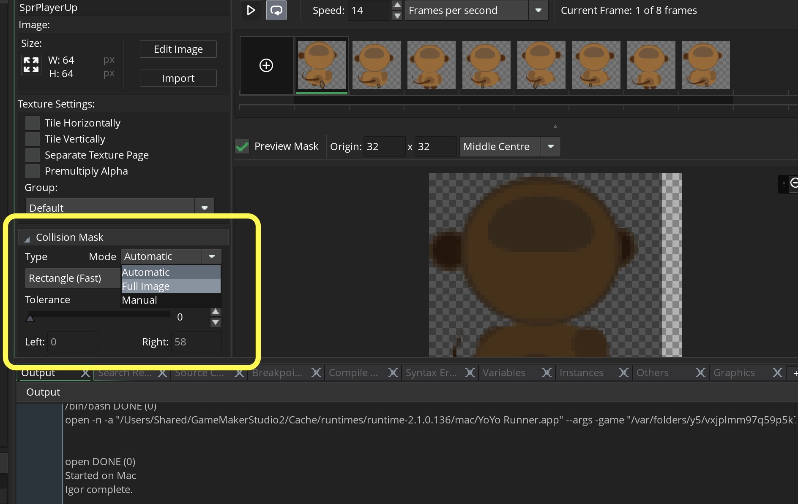
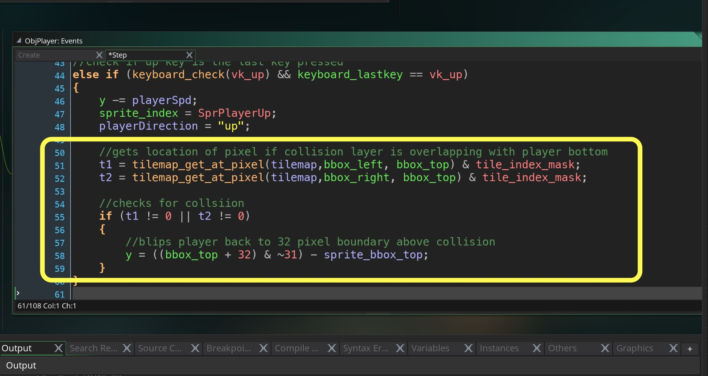
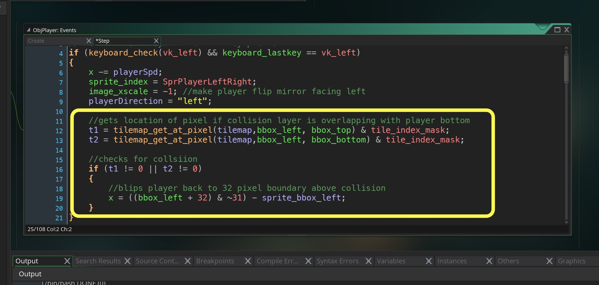
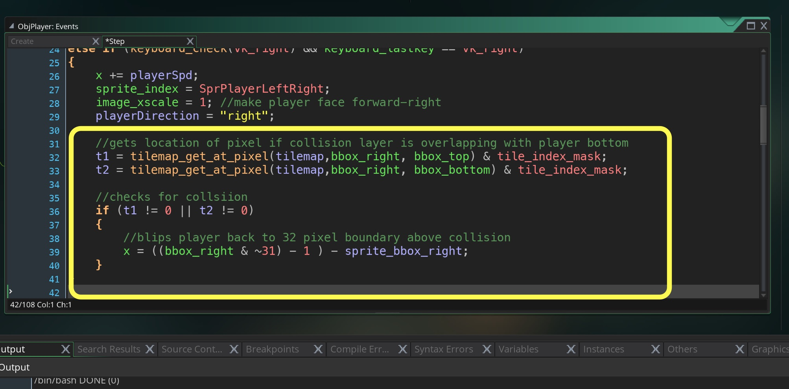
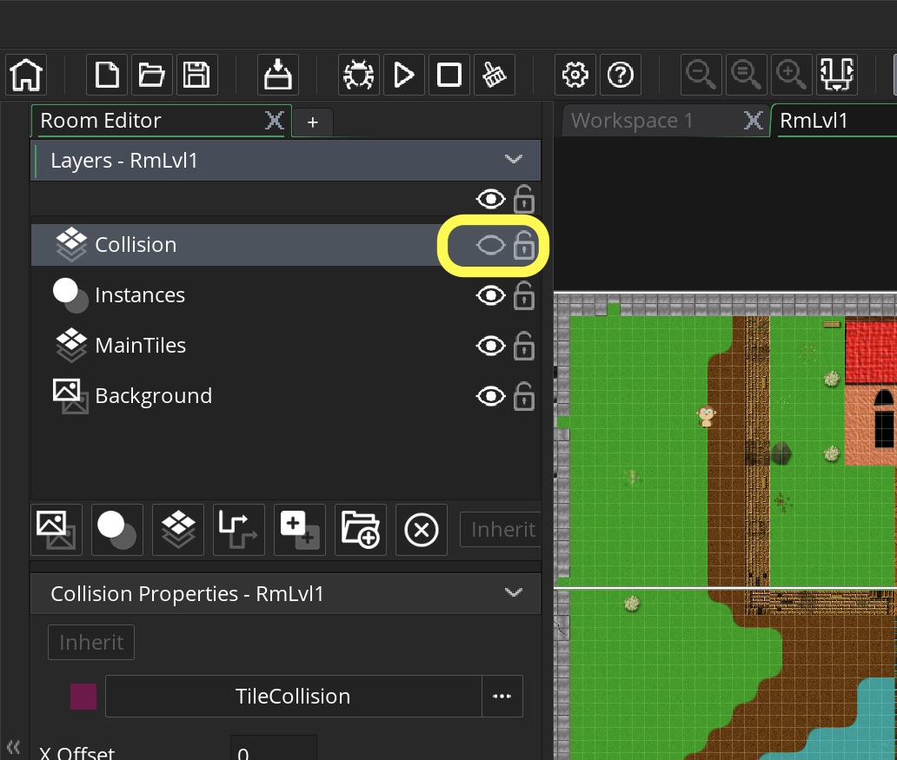

<div class = "row">
<div class="col-12 col-lg-4 align-self-center">
<div markdown = "1"> 

{:start="{{ num }}"}
{{ num }}. Now before we do different directions we need to make sure the collision volume is the same on all frames.  Open each `ObjPlayer` **Sprite** and open the **Collision Mast** and and change the **Mode** from **Automatic** to **Full Image**.  Repeat this for all sprites for your player animation:
</div>
</div>
<div class = "col-lg-8">

</div>
</div>

___ 
<div class = "row">
<div class="col-12 col-lg-4 align-self-center">
<div markdown = "1"> 

{:start="{{ num }}"}
{{ num }}. Lets add the collision detection and warping for moving upwards.  We need to add a collision box height otherwise it snaps to the top of the collision volume as opposed to the bottom:
</div>
</div>
<div class = "col-lg-8">
<div markdown = "1"> 
```c
//gets location of pixel if collision layer is overlapping with player bottom
    t1 = tilemap_get_at_pixel(tilemap,bbox_left, bbox_top) & tile_index_mask;
    t2 = tilemap_get_at_pixel(tilemap,bbox_right, bbox_top) & tile_index_mask;
    
    //checks for collsiion 
    if (t1 != 0 || t2 != 0)
    {
        //blips player back to 32 pixel boundary above collision
        y = ((bbox_top + 32) & ~31) - sprite_bbox_top;
    }
```
</div>
</div>
</div>
<div class = "row">
<div class="col-12">

</div>
</div>

___ 
<div class = "row">
<div class="col-12 col-lg-4 align-self-center">
<div markdown = "1"> 

{:start="{{ num }}"}
{{ num }}. Lets add the collision detection and warping for moving upwards.  We need to add a collision box height otherwise it snaps to the top of the collision volume as opposed to the bottom.  Add to the controller selection were we are checking for `keyboard_check(vk_up)`:
</div>
</div>
<div class = "col-lg-8">
<div markdown = "1"> 
```c
//gets location of pixel if collision layer is overlapping with player bottom
    t1 = tilemap_get_at_pixel(tilemap,bbox_left, bbox_top) & tile_index_mask;
    t2 = tilemap_get_at_pixel(tilemap,bbox_right, bbox_top) & tile_index_mask;
    
    //checks for collsiion 
    if (t1 != 0 || t2 != 0)
    {
        //blips player back to 32 pixel boundary above collision
        y = ((bbox_top + 32) & ~31) - sprite_bbox_top;
    }
```
</div>
</div>
</div>
<div class = "row">
<div class="col-12">

</div>
</div>

___ 
<div class = "row">
<div class="col-12 col-lg-4 align-self-center">
<div markdown = "1"> 

{:start="{{ num }}"}
{{ num }}. Run the game and test it to make sure it works.  Lets add the collision detection and moving left.   Add to the controller selection were we are checking for `keyboard_check(vk_left)`:
</div>
</div>
<div class = "col-lg-8">
<div markdown = "1"> 
```c
    //gets location of pixel if collision layer is overlapping with player bottom
    t1 = tilemap_get_at_pixel(tilemap,bbox_left, bbox_top) & tile_index_mask;
    t2 = tilemap_get_at_pixel(tilemap,bbox_left, bbox_bottom) & tile_index_mask;
    
    //checks for collsiion 
    if (t1 != 0 || t2 != 0)
    {
        //blips player back to 32 pixel boundary above collision
        x = ((bbox_left + 32) & ~31) - sprite_bbox_left;
    }
```
</div>
</div>
</div>
<div class = "row">
<div class="col-12">

</div>
</div>

___ 
<div class = "row">
<div class="col-12 col-lg-4 align-self-center">
<div markdown = "1"> 

{:start="{{ num }}"}
{{ num }}. Run the game and test it to make sure it works.  Lets add the collision detection and moving right.   Add to the controller selection were we are checking for `keyboard_check(vk_right)`:
</div>
</div>
<div class = "col-lg-8">
<div markdown = "1"> 
```c
    //gets location of pixel if collision layer is overlapping with player bottom
    t1 = tilemap_get_at_pixel(tilemap,bbox_right, bbox_top) & tile_index_mask;
    t2 = tilemap_get_at_pixel(tilemap,bbox_right, bbox_bottom) & tile_index_mask;
    
    //checks for collsiion 
    if (t1 != 0 || t2 != 0)
    {
        //blips player back to 32 pixel boundary above collision
        x = ((bbox_right & ~31) - 1 ) - sprite_bbox_right;
```
</div>
</div>
</div>
<div class = "row">
<div class="col-12">

</div>
</div>

___ 
<div class = "row">
<div class="col-12 col-lg-4 align-self-center">
<div markdown = "1"> 

{:start="{{ num }}"}
{{ num }}. Double click the room and turn off the visibility on the collision layer so you don't see it in the game.  This is done by clicking on the visibility icon on the `Collision` layer:
</div>
</div>
<div class = "col-lg-8">
  
</div>
</div>

___ 
<div class = "row">
<div class="col-12 col-lg-4 align-self-center">
<div markdown = "1"> 

{:start="{{ num }}"}
{{ num }}. Run the game and you should stop before each wall in all directions:
</div>
</div>
<div class="col-12 col-lg-8">
<div class="embed-responsive embed-responsive-16by9">
<iframe class="embed-responsive-item" src="https://www.youtube.com/embed/RKSg-xZbCqY?autoplay=1&rel=0&controls=0&amp&showinfo=0&version=3&loop=1&playlist=RKSg-xZbCqY" frameborder="0" allowfullscreen></iframe>
</div>
</div>
</div>


[<- Previous](AdventureGame_1.html)&nbsp;&nbsp;&nbsp;[Home](../../index.html)&nbsp;&nbsp;&nbsp; [Continue ->](AdventureGame_3.html)
<br />  
<br />  
<br />  
<br />  