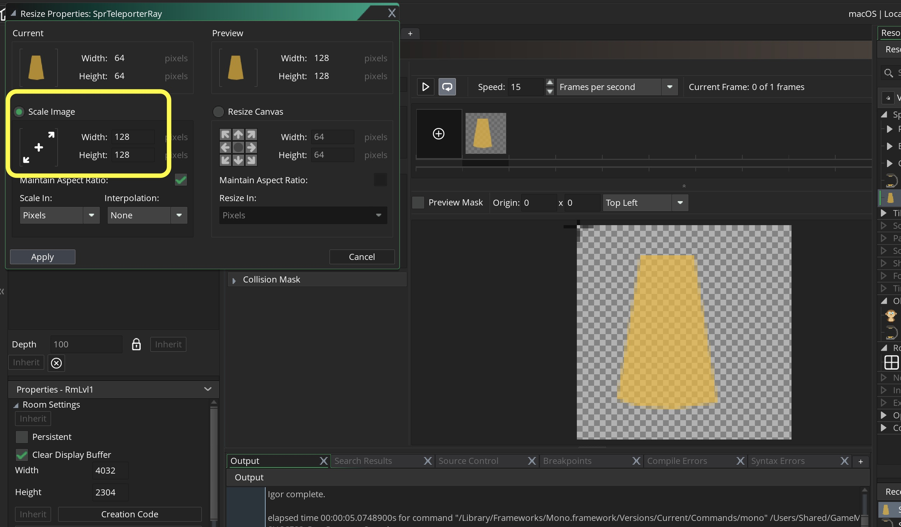
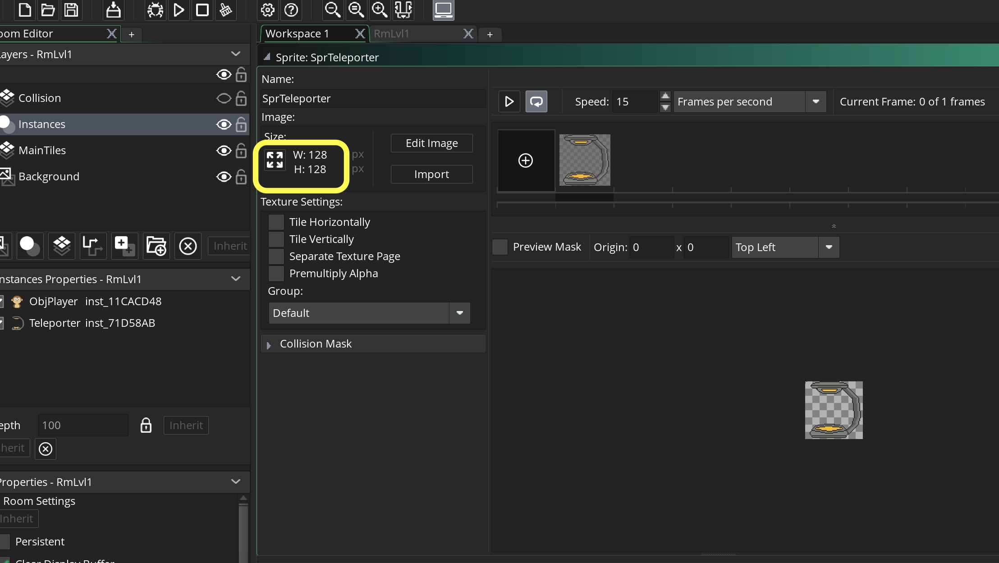
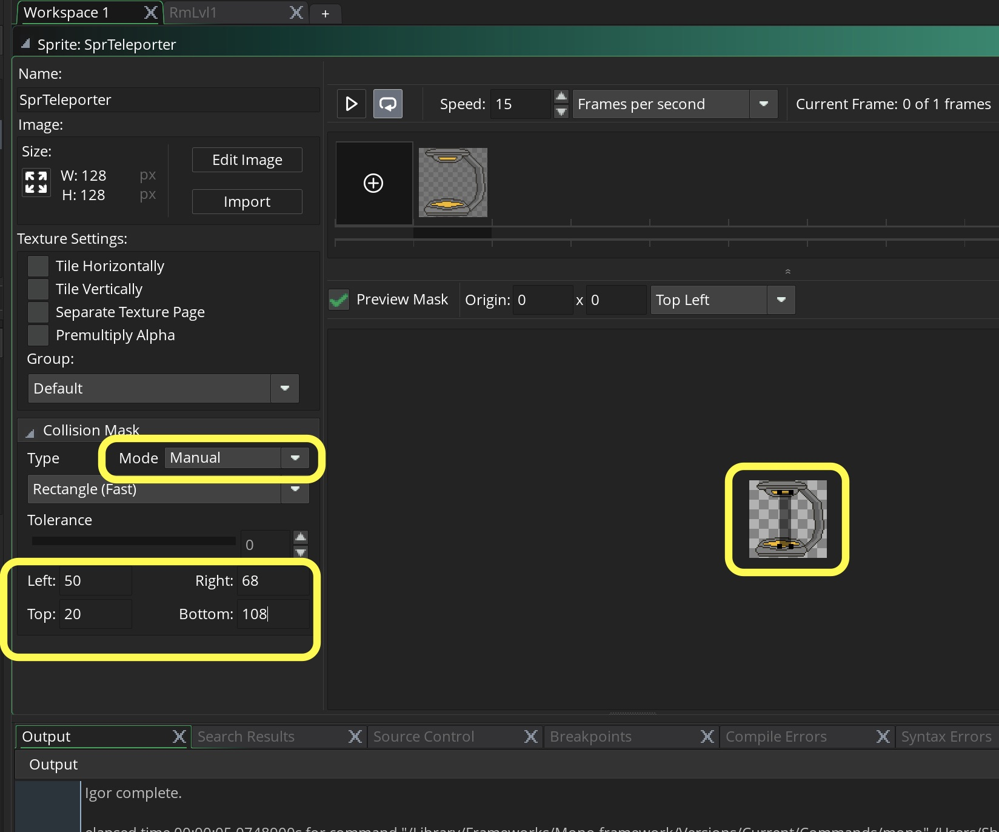
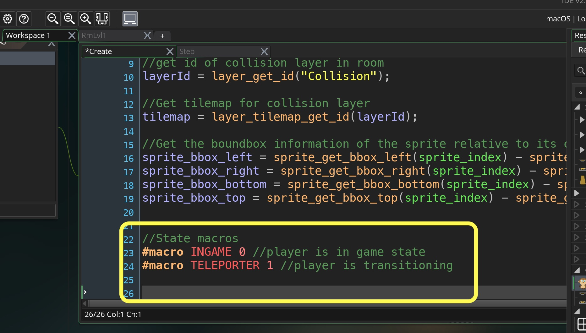
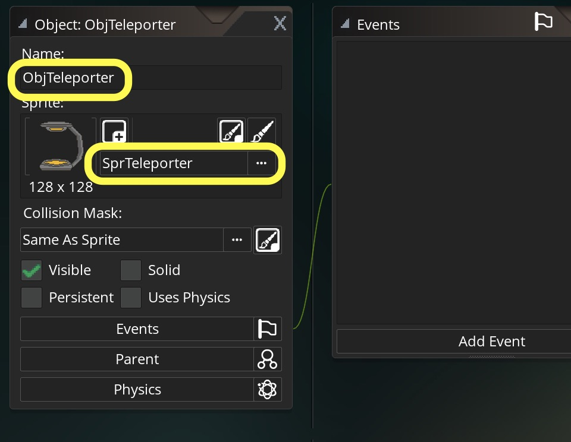
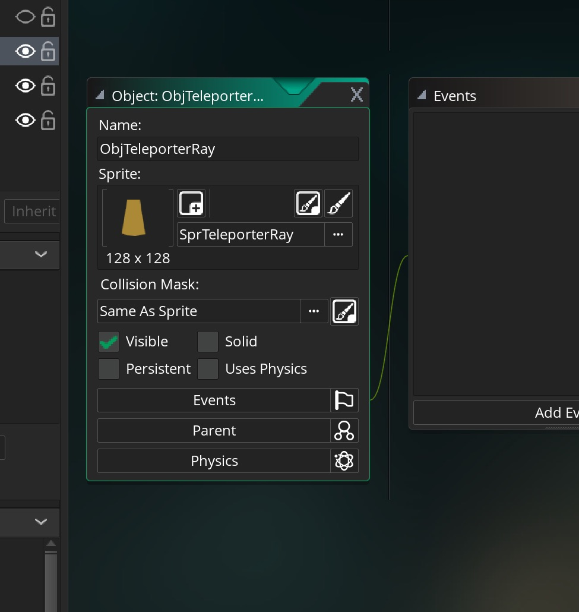
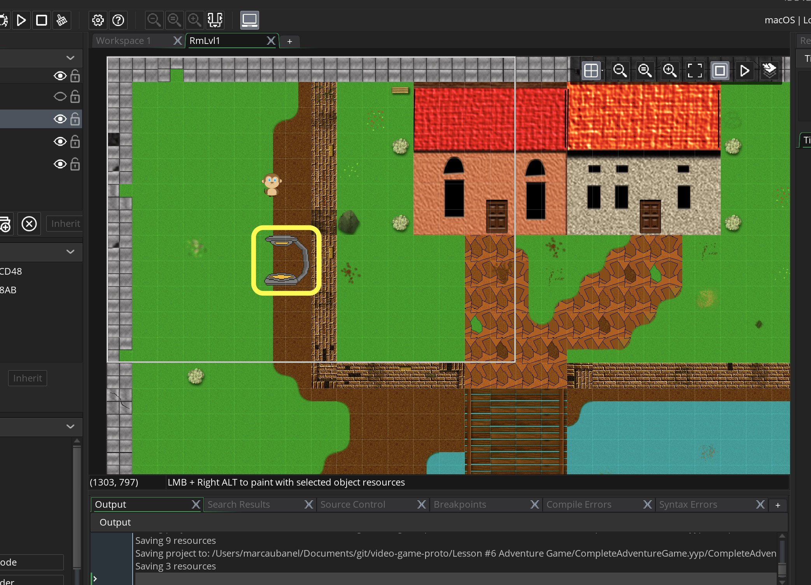
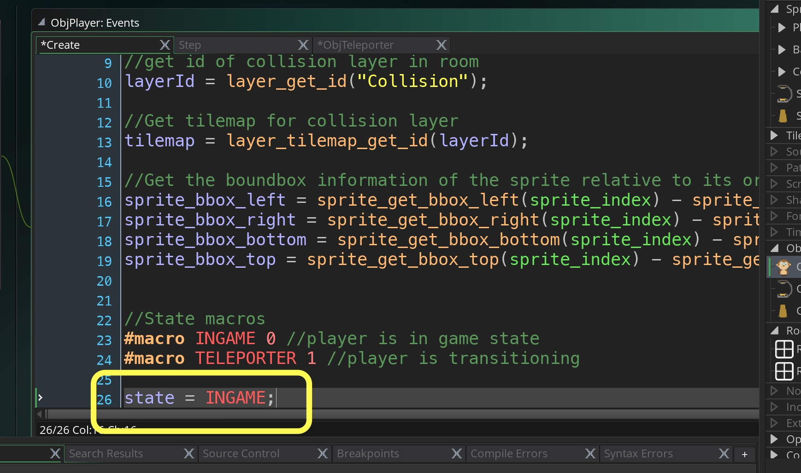
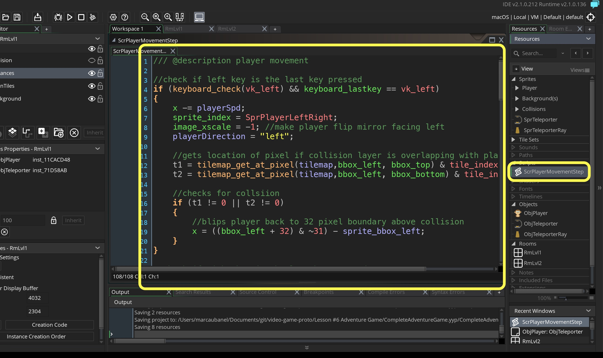
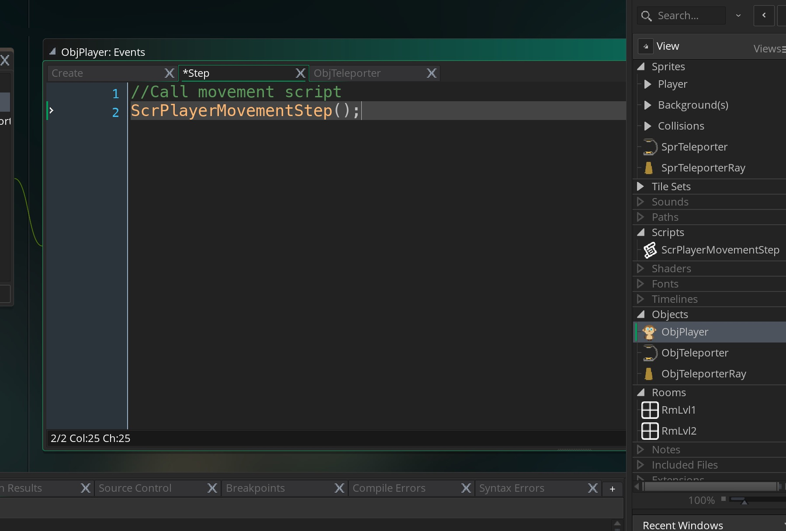

## Switching Rooms

<div class = "row">
<div class="col-12 col-lg-4 align-self-center">
<div markdown = "1"> 

{:start="{{ num }}"}
{{ num }}. Now we will add the ability to switch between two rooms.  First lets download the assets we need from the [website](AdventureGameSpritesAudio.zip).  Unzip the folder and create a new **Sprite**.  Press the **Import** button and go to the folder you downloaded and select **TeleporterRay.png** and call the sprite `SprTeleporterRay`.  CHange the size from 64 x 64 to `128` to `128`:
</div>
</div>
<div class="col-12 col-lg-8">

</div>
</div>

___ 
<div class = "row">
<div class="col-12 col-lg-4 align-self-center">
<div markdown = "1"> 

{:start="{{ num }}"}
{{ num }}. Now do the exact same thing and create a new sprite and load **Teleporter.png** and call it `SprTeleporter` and change the size to `128` by `128`:  
</div>
</div>
<div class="col-12 col-lg-8">

</div>
</div>

___ 
<div class = "row">
<div class="col-12 col-lg-4 align-self-center">
<div markdown = "1"> 

{:start="{{ num }}"}
{{ num }}. Now we want the teleporter only to trigger when you are in it, so we will make the collision volume very small.  Open the **Collision Mask** and change the **Mode** from **Automatic** to **Manual**.  Then change **_Left_** to `50`, **_Right_** to `68`, **_Top_** to `20` and **_Bottom_** to `108`.  Now we have a collision volume that is triggered inside the teleporter.
</div>
</div>
<div class="col-12 col-lg-8">

</div>
</div>

___ 
<div class = "row">
<div class="col-12">
<div markdown = "1"> 

{:start="{{ num }}"}
{{ num }}.  We have to watch for a few things:
    1. If the player collides with the teleporter go to the second room
    2. Change state of player to out of game.
    3. When in new room start in TELEPORTER state, walk off teleporter 
    4. Change state back to ingame.
</div>
</div>
</div>

___ 
<div class = "row">
<div class="col-12 col-lg-4 align-self-center">
<div markdown = "1"> 

{:start="{{ num }}"}
{{ num }}.  Open up `ObjPlayer` and open the **Create Event**.  Add to the bottom of the script two states for the player.   
</div>
</div>
<div class="col-12 col-lg-8">
<div markdown = "1"> 
```c
//State macros
#macro INGAME 0 //player is in game state
#macro TELEPORTER 1 //player is transitioning
```
</div>
</div>
</div>
<div class = "row">
<div class="col-12">

</div>
</div>

___ 
<div class = "row">
<div class="col-12 col-lg-4 align-self-center">
<div markdown = "1"> 

{:start="{{ num }}"}
{{ num }}. Remember that INGAME is `0` and TELEPORTER is `1`.  Create a new **Game Object** and bind the `SprTeleporter` sprite to it and call it `ObjTeleporter`.  
</div>
</div>
<div class="col-12 col-lg-8">

</div>
</div>

___ 
<div class = "row">
<div class="col-12 col-lg-4 align-self-center">
<div markdown = "1"> 

{:start="{{ num }}"}
{{ num }}. Create a new **Game Object** and bind the `SprTeleporterRay` sprite to it and call it `ObjTeleporterRay`.
</div>
</div>
<div class="col-12 col-lg-8">

</div>
</div>

___ 
<div class = "row">
<div class="col-12 col-lg-4 align-self-center">
<div markdown = "1"> 

{:start="{{ num }}"}
{{ num }}. Add a single **_ObjTeleporter_** to each room.
</div>
</div>
<div class="col-12 col-lg-8">
  
</div>
</div>


___ 
<div class = "row">
<div class="col-12 col-lg-4 align-self-center">
<div markdown = "1"> 

{:start="{{ num }}"}
{{ num }}. Now lets change the player state when the player collides with the teleporter while in **INGAME** state.  Lets open the `ObjPlayer` **Create Event** script and add to the bottom:
</div>
</div>
<div class="col-12 col-lg-8">
<div markdown = "1"> 
```c
//Player state
state = INGAME;
```
</div>
</div>
</div>
<div class = "row">
<div class="col-12">

</div>
</div>

___ 
<div class = "row">
<div class="col-12 col-lg-4 align-self-center">
<div markdown = "1"> 

{:start="{{ num }}"}
{{ num }}. Lets separate the scripts to make it a bit neater.  Open `ObjPlayer` and copy and paste the script into a new **Script** called:  `ScrPlayerMovementStep`. 
</div>
</div>
<div class="col-12 col-lg-8">
  
</div>
</div>

___ 
<div class = "row">
<div class="col-12 col-lg-4 align-self-center">
<div markdown = "1"> 

{:start="{{ num }}"}
{{ num }}. Now the player won't move.  To reactivate it we will call the script by adding to the `ObjPlayer` **Step Events** script:
</div>
</div>
<div class="col-12 col-lg-8">
  
</div>
</div>


<br />  
[<- Previous](AdventureGame_2.html)&nbsp;&nbsp;&nbsp;[Home](../../index.html)&nbsp;&nbsp;&nbsp; [Continue ->](AdventureGame_4.html)
<br />  
<br />  
<br />  
<br />  