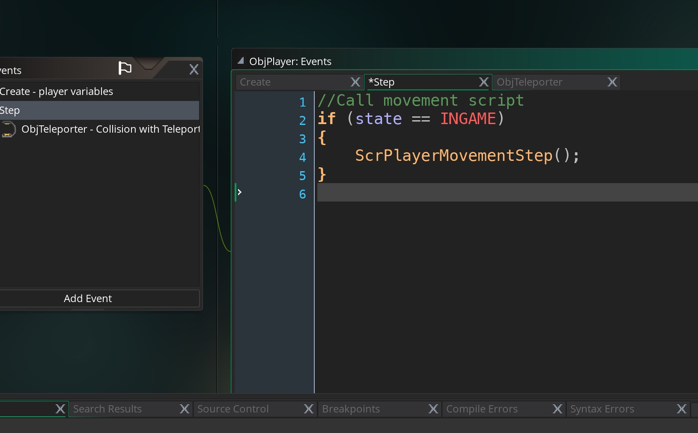
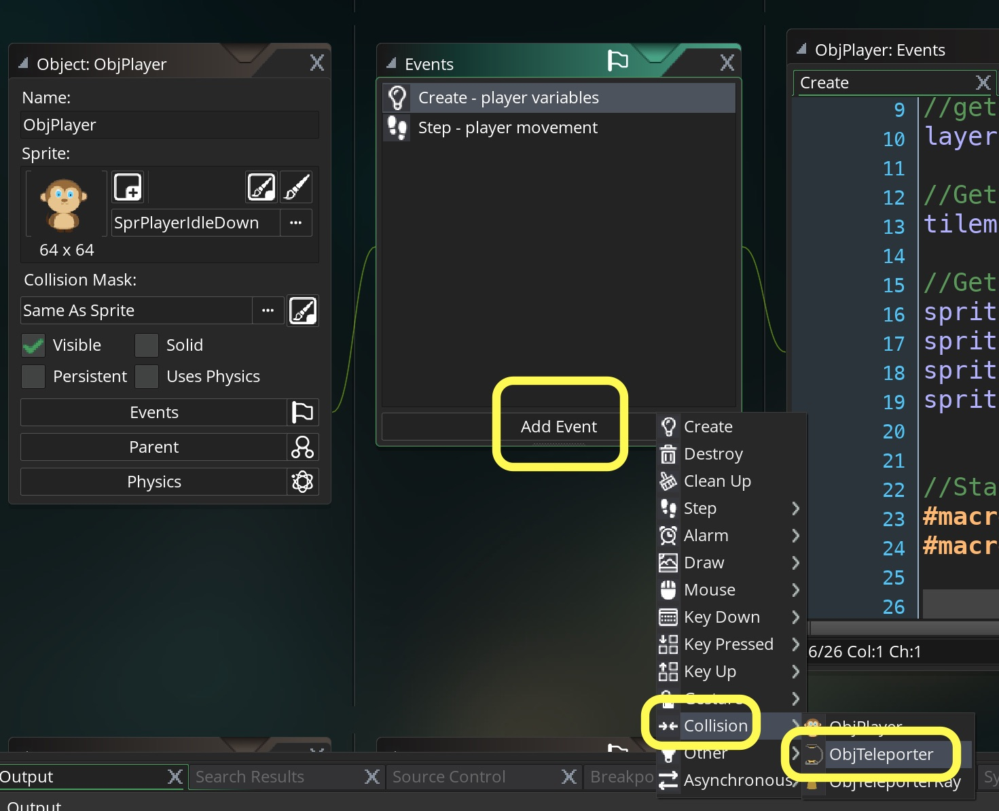
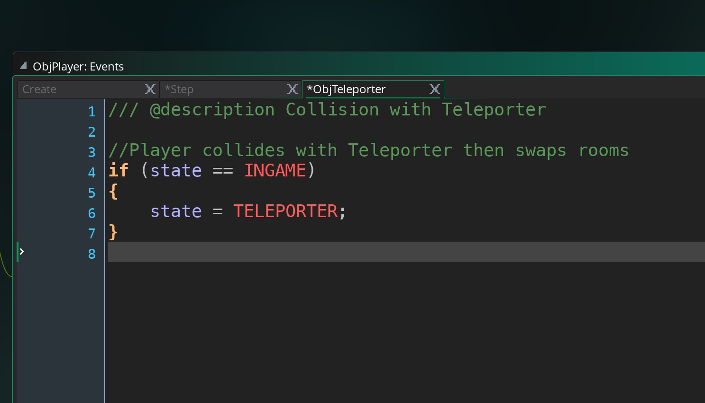
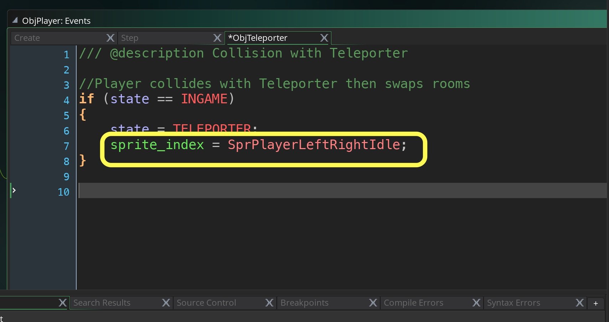
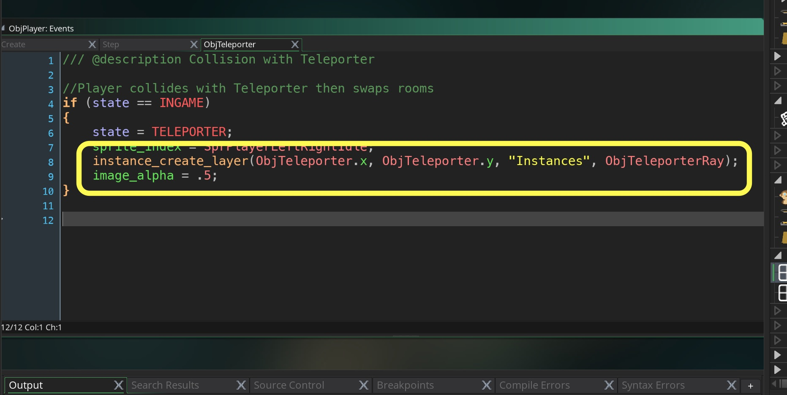
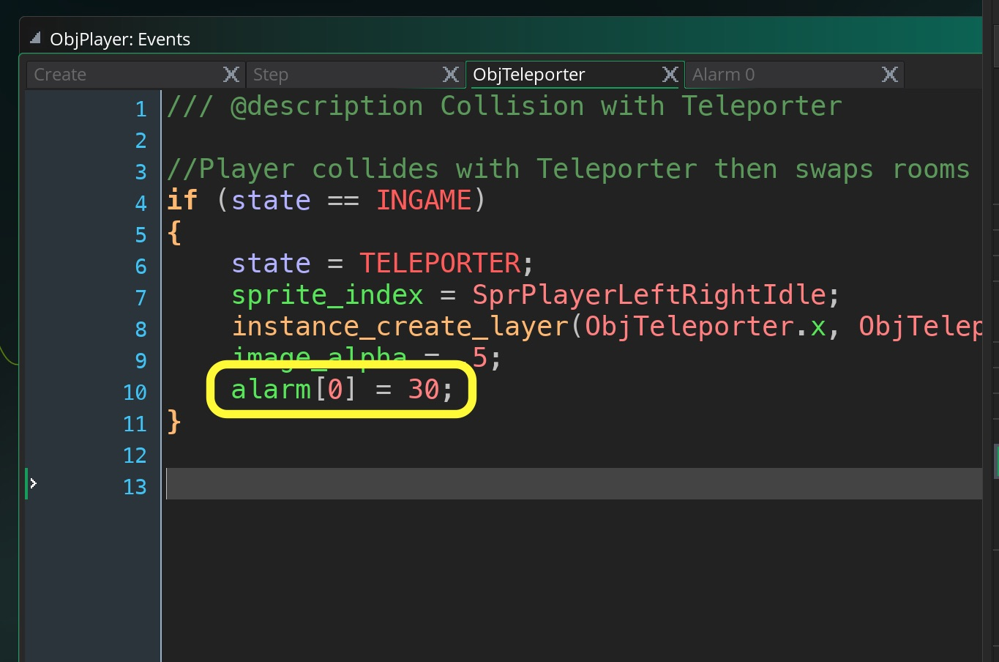
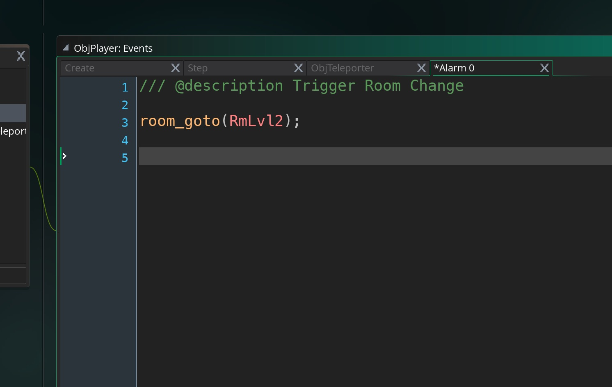

___ 
<div class = "row">
<div class="col-12 col-lg-4 align-self-center">
<div markdown = "1"> 

{:start="{{ num }}"}
{{ num }}. Run the game and you should be back to where you started.  Now we want to restrict player movement to when the player is in INGAME state.  So we will add a check to the `ObjPlayer` **Step Event**:
</div>
</div>
<div class = "col-lg-8">
<div markdown = "1"> 
```c
//Call movement script
if (state == INGAME)
{
    ScrPlayerMovementStep();
}
```
</div>
</div>
</div>
<div class = "row">
<div class="col-12">

</div>
</div>

___ 
<div class = "row">
<div class="col-12 col-lg-4 align-self-center">
<div markdown = "1"> 

{:start="{{ num }}"}
{{ num }}. Open `ObjPlayer` and create a new **Collision Event** with `ObjTeleporter`:
</div>
</div>
<div class="col-12 col-lg-8">
  
</div>
</div>

___ 
<div class = "row">
<div class="col-12 col-lg-4 align-self-center">
<div markdown = "1"> 

{:start="{{ num }}"}
{{ num }}. Now on this collision script lets change states to TELEPORTER.  But first check to see that the player is in the INGAME state:
</div>
</div>
<div class = "col-lg-8">
<div markdown = "1"> 
```c
/// @description Collision with Teleporter

//Player collides with Teleporter then swaps rooms
if (state == INGAME)
{
    state = TELEPORTER;
}
```
</div>
</div>
</div>
<div class = "row">
<div class="col-12">

</div>
</div>

___ 
<div class = "row">
<div class="col-12 col-lg-4 align-self-center">
<div markdown = "1"> 

{:start="{{ num }}"}
{{ num }}. Run the game and run into the teleporter.  You will notice that the player stops but still keeps walking stuck in the last animation state.
</div>
</div>
<div class="col-12 col-lg-8">
<div class="embed-responsive embed-responsive-16by9">
<iframe class="embed-responsive-item" src="https://www.youtube.com/embed/HK2Y2vPI5fQ?autoplay=1&rel=0&controls=0&amp&showinfo=0&version=3&loop=1&playlist=HK2Y2vPI5fQ" frameborder="0" allowfullscreen></iframe>
</div>
</div>
</div>

___ 
<div class = "row">
<div class="col-12 col-lg-4 align-self-center">
<div markdown = "1"> 

{:start="{{ num }}"}
{{ num }}. Now lets test the game.  When you collide with the Teleporter the player gets stuck in its last animation state and does nothing.  So our state is changing succesfully.  Now we need to do a few things.  Add to the last script:
</div>
</div>
<div class = "col-lg-8">
<div markdown = "1"> 
```c
/// @description Collision with Teleporter

//Player collides with Teleporter then swaps rooms
if (state == INGAME)
{
    state = TELEPORTER;
    sprite_index = SprPlayerLeftRightIdle;
}
```
</div>
</div>
</div>
<div class = "row">
<div class="col-12">

</div>
</div>

___ 
<div class = "row">
<div class="col-12 col-lg-4 align-self-center">
<div markdown = "1"> 

{:start="{{ num }}"}
{{ num }}. Now we want to create the Teleporter and make the player **alpha** lower so user knows that they are no longer in control.  Add to right after the state change these two lines:  
</div>
</div>
<div class = "col-lg-8">
<div markdown = "1"> 
```c
instance_create_layer(ObjTeleporter.x, ObjTeleporter.y, "Instances", ObjTeleporterRay);
image_alpha = .5;
```
</div>
</div>
</div>
<div class = "row">
<div class="col-12">

</div>
</div>

<div class = "row">
<div class="col-12">
<div markdown = "1"> 

{:start="{{ num }}"}
{{ num }}. Test it in game and we should now see the player get translucent as well as the telporter will appear.  Now we need to trigger a timer in the future.  We could use an **Alarm** but there are only a limited number and in an adventure game we need to have more.  So we are going to use another variable to trigger a timer on our own.  It is called **_current\_time_**.

> **current_time**<br><br>Holds: Real <br><br>**Description**: This read only variable will return the number of milliseconds that have passed since the OS was started. 

___ 
<div class = "row">
<div class="col-12 col-lg-4 align-self-center">
<div markdown = "1"> 

{:start="{{ num }}"}
{{ num }}. When triggering the state change lets create an alarm that triggers in 1 second to it.  Open **_ScrPlayerTeleportCollision_** and add the variable **_timer_**. 
</div>
</div>
<div class = "col-lg-8">
<div markdown = "1"> 
```c
alarm[0] = 30;
```
</div>
</div>
</div>
<div class = "row">
<div class="col-12">

</div>
</div>

___ 
<div class = "row">
<div class="col-12 col-lg-4 align-self-center">
<div markdown = "1"> 

{:start="{{ num }}"}
{{ num }}. Now create a new **Event** on `ObjPlayer` and select **Alarm -> Alarm0** and add to the script:
</div>
</div>
<div class = "col-lg-8">
<div markdown = "1"> 

```c
    room_goto(RmLvlTwo);
```
</div>
</div>
</div>
<div class = "row">
<div class="col-12">

</div>
</div>

___ 
<div class = "row">
<div class="col-12">
<div markdown = "1"> 

{:start="{{ num }}"}
{{ num }}. We are using a new function here called **_room_goto(numb)_**:  

> **room_goto(numb)**<br><br>**Description**: This function will end the current room and go to the room specified by the input index. The room must exist or else an error will be given, and if you use the same room as the current room it will have the same effect as room_restart. Note that the room will not change until the end of the event where the function was called, so any code after this has been called will still run. - GameMaker Manual 
</div>
</div>
</div>

 ___ 
<div class = "row">
<div class="col-12">
<div markdown = "1"> 

{:start="{{ num }}"}
{{ num }}. Test the game and you should now wait a second and move to the new room.  Next up get the player to appear in the right spot then walk off the teleporter.
</div>
</div>
</div>


<br />  
[<- Previous](AdventureGame_3.html)&nbsp;&nbsp;&nbsp;[Home](../../index.html)&nbsp;&nbsp;&nbsp; [Continue ->](AdventureGame_5.html)
<br />  
<br />  
<br />  
<br /> 