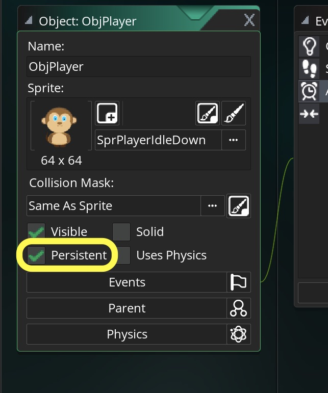
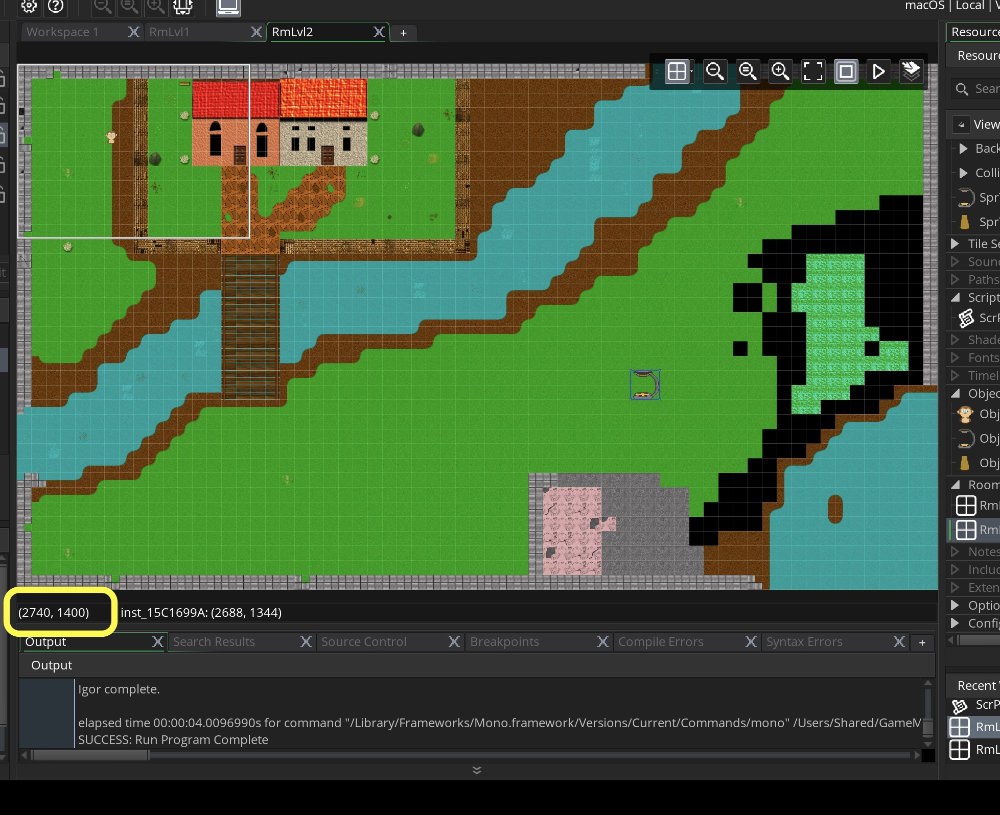
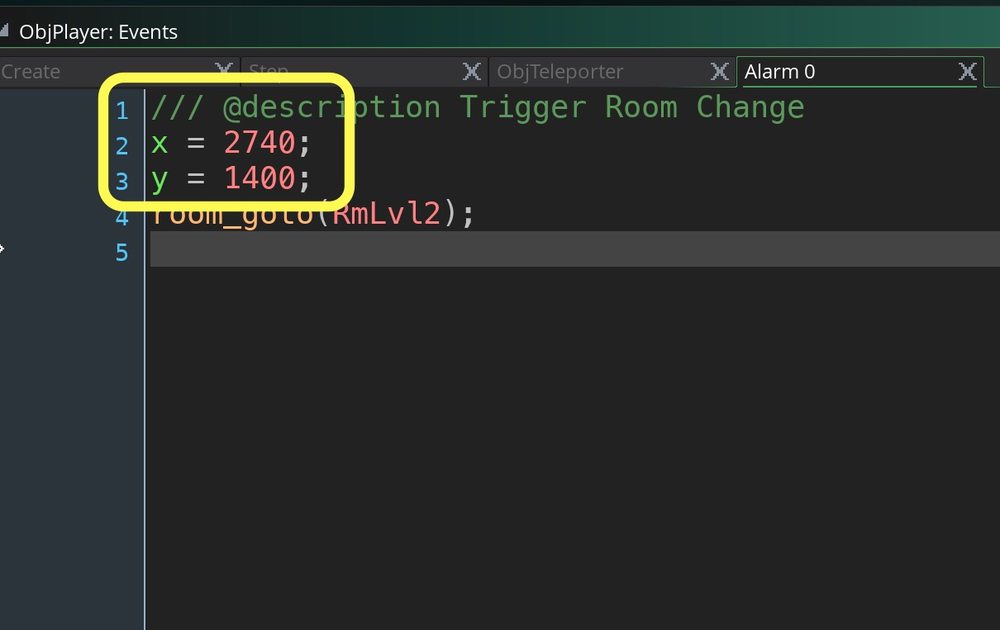
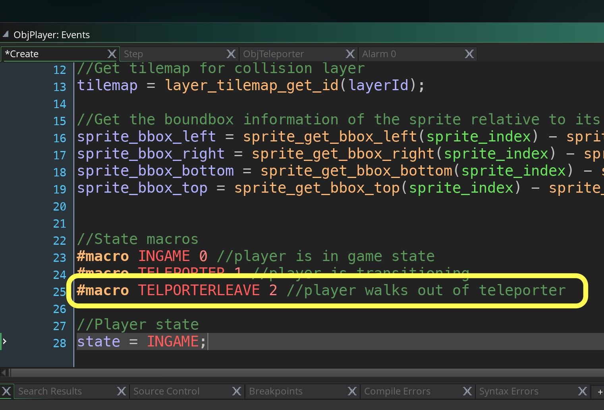
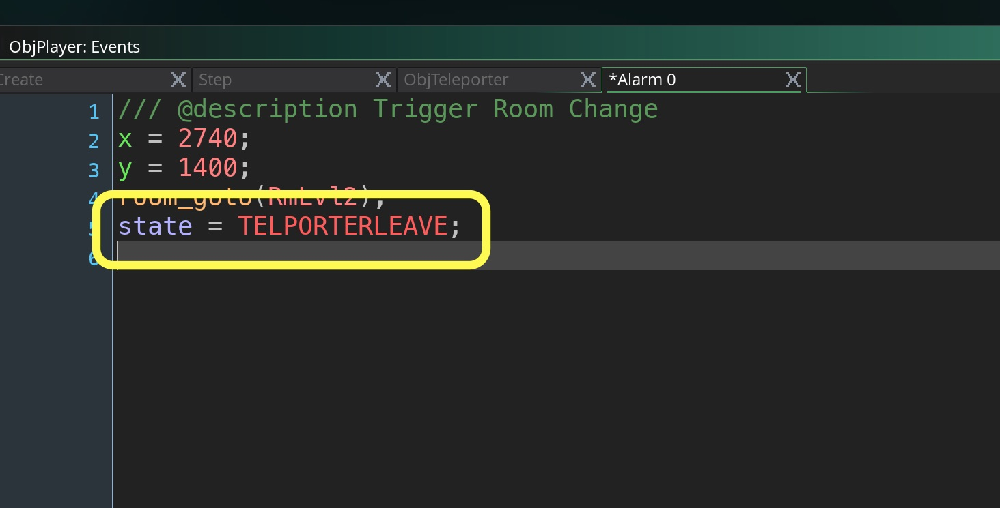
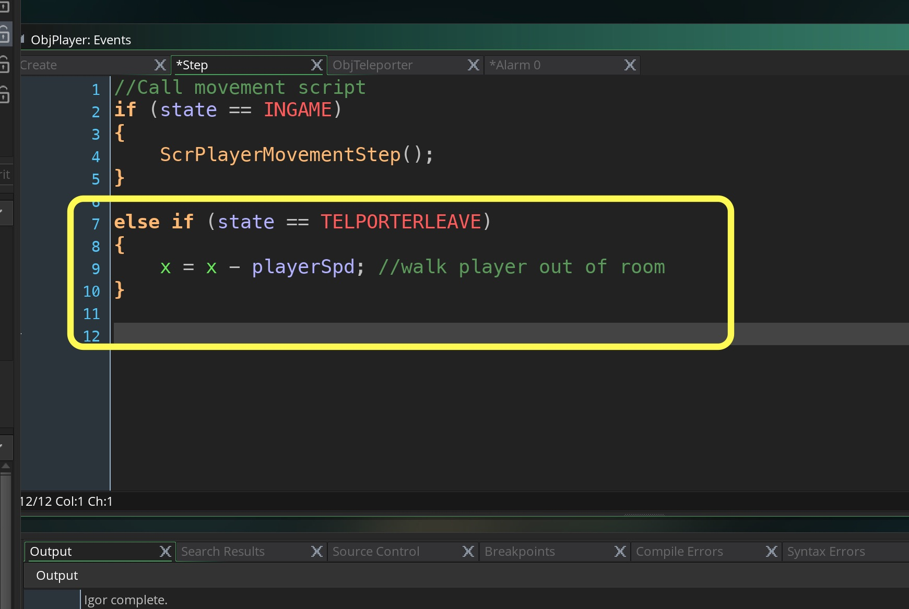
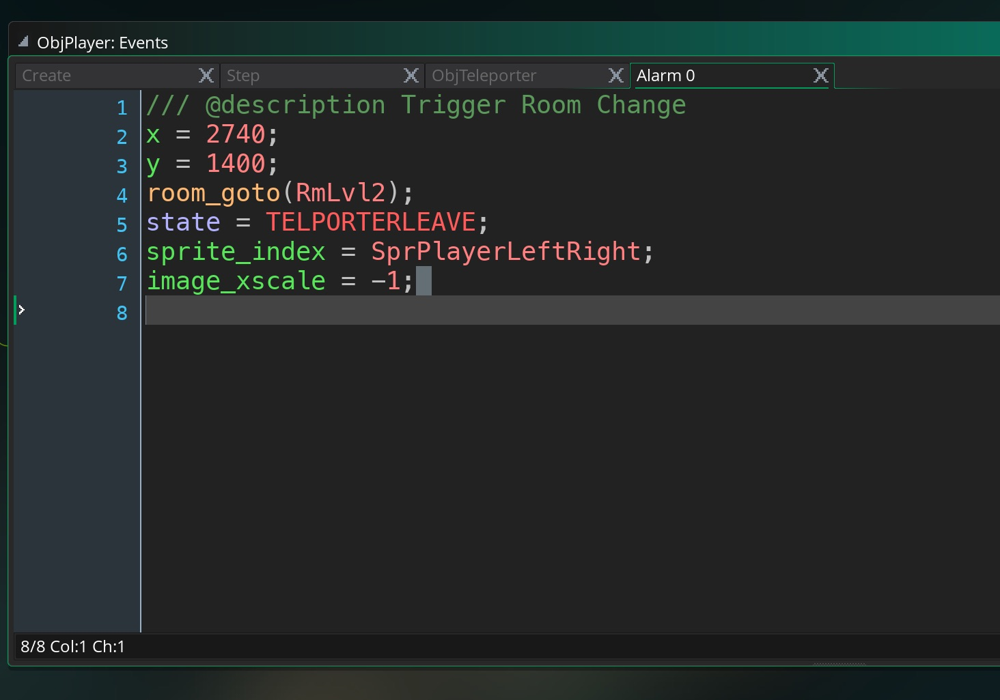

<div class = "row">
<div class="col-12">
<div markdown = "1"> 

{:start="{{ num }}"}
{{ num }}. Now we could have a player in the second room under the teleporter all ready to go.  But the problem is that his health and stats will be reset and we will have to handle transering them.  It is easier to make the player **_persistent_**.  There is a variable in each object that is set.
> **persistent**<br><br>**Stores**: Boolean <br><br>**Description**: This variable can be read to find out if the instance is flagged as persistent or not, or it can used to set persistence to true (persistent) or false (not persistent) for the instance. A persistent instance is one that will be "carried over" from room to room, meaning (for example) that it only has to be created once at the start of the game and it will be present in all further rooms. Care should be taken with persistence as it is easy to lose track of persistent instances which can lead to problems later in the development of the game. <br><br>A persistent object will still have its Game Start, Game End, Room Start and Room End events triggered, however if you restart the game (with, for example, the game_restart() function) all persistent objects will be removed and only exist when created again by the game. Also note that if you deactivate a persistent object, it will no longer pass from one room to another unless re-activated before the Room End event is triggered. - GameMaker Manual
</div>
</div>
</div>

 ___ 
<div class = "row">
<div class="col-12 col-lg-4 align-self-center">
<div markdown = "1"> 

{:start="{{ num }}"}
{{ num }}. Open `ObjPlayer` and select the **Persistent** radial selector:  
</div>
</div>
<div class="col-12 col-lg-8">
 
</div>
</div>

 ___ 
<div class = "row">
<div class="col-12 col-lg-4 align-self-center">
<div markdown = "1"> 

{:start="{{ num }}"}
{{ num }}. Play the game, and you switch rooms but to the wrong spot.  Open the second room and put a cursor on where the teleporter is and read the coordinates.  In my case it was **(2740, 1400)**:  
</div>
</div>
<div class="col-12 col-lg-8">
 
</div>
</div>

 ___ 
<div class = "row">
<div class="col-12 col-lg-4 align-self-center">
<div markdown = "1"> 

{:start="{{ num }}"}
{{ num }}. Open the `ObjPlayer` **Alarm0** event script and change the `x` and `y` coordinates:
</div>
</div>
<div class = "col-lg-8">
<div markdown = "1"> 
```c
/// @description Trigger Room Change
x = 2740;
y = 1400;
room_goto(RmLvl2);
```
</div>
</div>
</div>
<div class = "row">
<div class="col-12">

</div>
</div>

 ___ 
<div class = "row">
<div class="col-12 col-lg-4 align-self-center">
<div markdown = "1"> 

{:start="{{ num }}"}
{{ num }}. Run the game and now the player should change rooms and appear in the right spot:
</div>
</div>
<div class="col-12 col-lg-8">
<div class="embed-responsive embed-responsive-16by9">
<iframe class="embed-responsive-item" src="https://www.youtube.com/embed/GbzJ3BsrZ8A?autoplay=1&rel=0&controls=0&amp&showinfo=0&version=3&loop=1&playlist=GbzJ3BsrZ8A" frameborder="0" allowfullscreen></iframe>
</div>
</div>
</div>

 ___ 
<div class = "row">
<div class="col-12 col-lg-4 align-self-center">
<div markdown = "1"> 

{:start="{{ num }}"}
{{ num }}. Now we need to switch states as we change rooms.  Open script the **Create Event** script on `ObjPlayer` and add another Macro player state:
</div>
</div>
<div class = "col-lg-8">
<div markdown = "1"> 
```c
#macro TELPORTERLEAVE 2 //player walks out of teleporter\
```
</div>
</div>
</div>
<div class = "row">
<div class="col-12">

</div>
</div>

___ 
<div class = "row">
<div class="col-12 col-lg-4 align-self-center">
<div markdown = "1"> 

{:start="{{ num }}"}
{{ num }}. Open `ObjPlayer` **Alarm0** event and change the player state.
</div>
</div>
<div class = "col-lg-8">
<div markdown = "1"> 
```c
state = TELPORTERLEAVE;
```
</div>
</div>
</div>
<div class = "row">
<div class="col-12">

</div>
</div>

 ___ 
<div class = "row">
<div class="col-12 col-lg-4 align-self-center">
<div markdown = "1"> 

{:start="{{ num }}"}
{{ num }}. Add a state check and have the player move to the left.
</div>
</div>
<div class = "col-lg-8">
<div markdown = "1"> 
```c
else if (state == TELPORTERLEAVE)
{
    x = x - playerSpd; //walk player out of room
}
```
</div>
</div>
</div>
<div class = "row">
<div class="col-12">

</div>
</div>

 ___ 
<div class = "row">
<div class="col-12 col-lg-4 align-self-center">
<div markdown = "1"> 

{:start="{{ num }}"}
{{ num }}. Now we need to move the player to the left to leave the teleporting chamber.
</div>
</div>
<div class = "col-lg-8">
<div markdown = "1"> 
```c
else if (state == TELPORTERLEAVE)
{
    x = x - playerSpd; //walk player out of room
}
```
</div>
</div>
</div>
<div class = "row">
<div class="col-12">

</div>
</div>

 ___ 
<div class = "row">
<div class="col-12 col-lg-4 align-self-center">
<div markdown = "1"> 

{:start="{{ num }}"}
{{ num }}. Run the game and test it. Notice how the player just moves and doesn't animate properly.  Open up the **Alarm0** in `ObjPlayer` and add to the bottom of the script:
</div>
</div>
<div class = "col-lg-8">
<div markdown = "1"> 
```c
sprite_index = SprPlayerLeftRight;
image_xscale = -1;
```
</div>
</div>
</div>
<div class = "row">
<div class="col-12">

</div>
</div>


<br />  
[<- Previous](AdventureGame_4.html)&nbsp;&nbsp;&nbsp;[Home](../../index.html)&nbsp;&nbsp;&nbsp; [Continue ->](AdventureGame_6.html)
<br />  
<br />  
<br />  
<br /> 