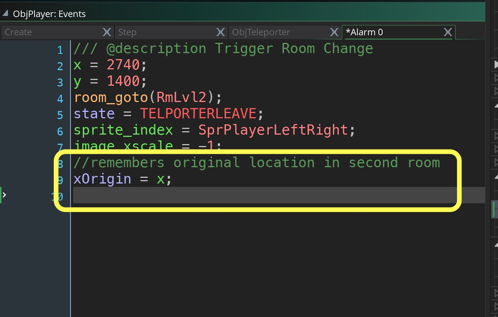
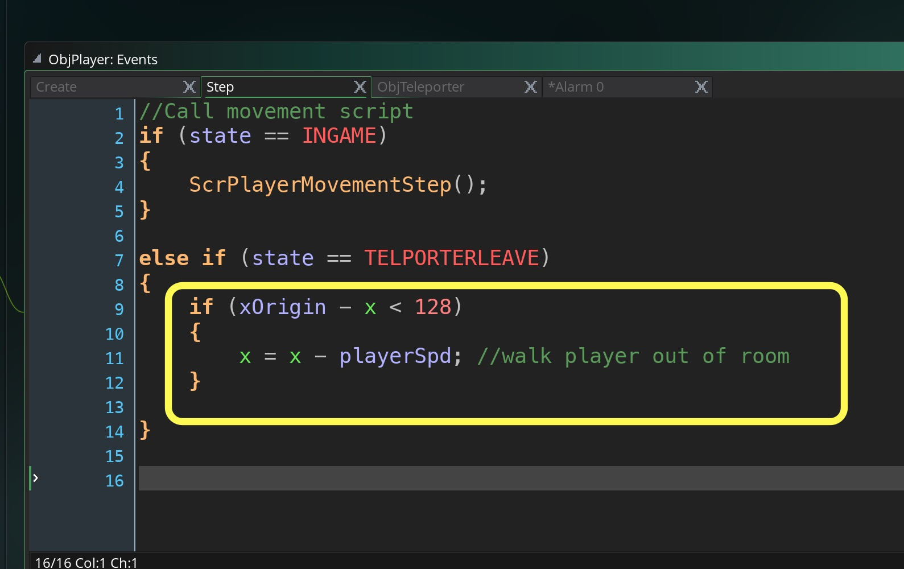
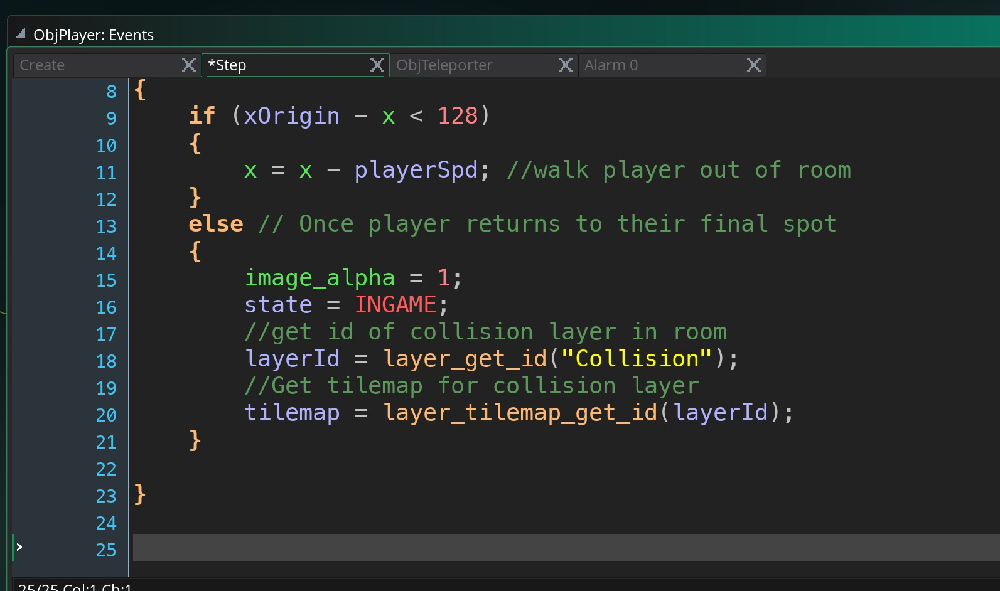
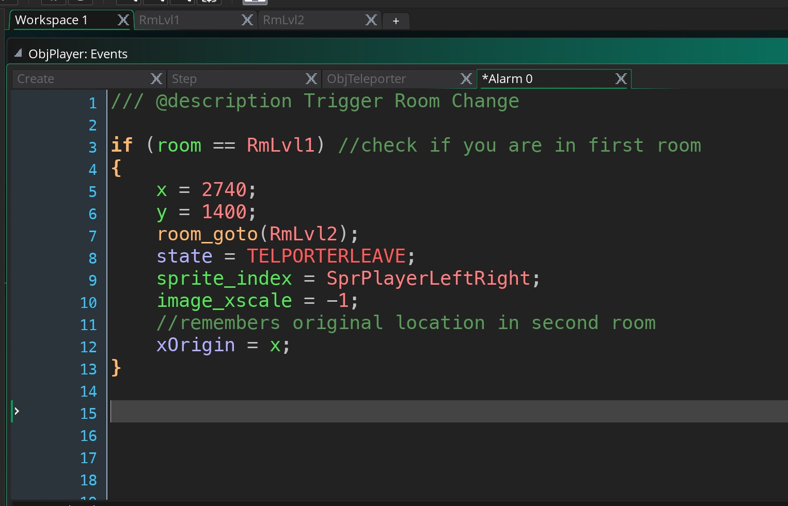
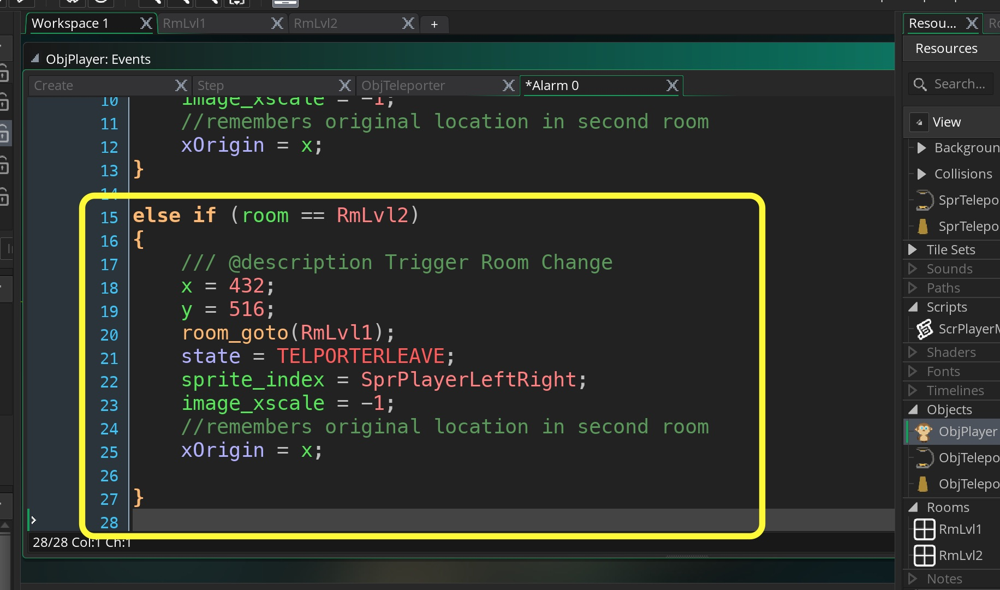

 ___ 
<div class = "row">
<div class="col-12 col-lg-4 align-self-center">
<div markdown = "1"> 

{:start="{{ num }}"}
{{ num }}. We want the character to stop walking once they have left the telporter as they just walk off the screen now.  Lets add a variable called `xOrigin` to `ObjPlayer` **Alarm0 Event** script and set it to the intial x value in the room:
</div>
</div>
<div class = "col-lg-8">
<div markdown = "1"> 
```c
//remembers original location in second room
xOrigin = x;
```
</div>
</div>
</div>
<div class = "row">
<div class="col-12">

</div>
</div>

___ 
<div class = "row">
<div class="col-12 col-lg-4 align-self-center">
<div markdown = "1"> 

{:start="{{ num }}"}
{{ num }}. Now only move the character if they have not moved 128 pixels away from their original x position by altering the **Step Event** on `ObjPlayer1:
</div>
</div>
<div class = "col-lg-8">
<div markdown = "1"> 
```c
else if (state == TELPORTERLEAVE)
{
    if (xOrigin - x < 128)
    {
        x = x - playerSpd; //walk player out of room
    }
    
}

```
</div>
</div>
</div>
<div class = "row">
<div class="col-12">

</div>
</div>

 ___ 
<div class = "row">
<div class="col-12 col-lg-4 align-self-center">
<div markdown = "1"> 

{:start="{{ num }}"}
{{ num }}. Run the game and now the player should change rooms, walk to the left and stop like so:
</div>
</div>
<div class="col-12 col-lg-8">
<div class="embed-responsive embed-responsive-16by9">
<iframe class="embed-responsive-item" src="https://www.youtube.com/embed/8COxJQctreY?autoplay=1&rel=0&controls=0&amp&showinfo=0&version=3&loop=1&playlist=8COxJQctreY" frameborder="0" allowfullscreen></iframe>
</div>
</div>
</div>

___ 
<div class = "row">
<div class="col-12 col-lg-4 align-self-center">
<div markdown = "1"> 

{:start="{{ num }}"}
{{ num }}. Now that the character moves back, lets put the alpha back to 100% and return th state back to `INGAME` state.  We also are in a different room and need to repoint the player to the correct collision layer.  So we will get a new `layerId` and new `tilemap`:
</div>
</div>
<div class = "col-lg-8">
<div markdown = "1"> 
```c
    else // Once player returns to their final spot
    {
        image_alpha = 1;
        state = INGAME;
        //get id of collision layer in room
        layerId = layer_get_id("Collision");
        //Get tilemap for collision layer
        tilemap = layer_tilemap_get_id(layerId);
    }
```
</div>
</div>
</div>
<div class = "row">
<div class="col-12">

</div>
</div>

 ___ 
<div class = "row">
<div class="col-12 col-lg-4 align-self-center">
<div markdown = "1"> 

{:start="{{ num }}"}
{{ num }}. Run the game and change rooms.  You should now have control.  Check that the second room collision volume is working.  Also walk into the teleporter in room 2 to see what happens?
</div>
</div>
<div class="col-12 col-lg-8">
<div class="embed-responsive embed-responsive-16by9">
<iframe class="embed-responsive-item" src="https://www.youtube.com/embed/ltNHKMyLyEI?autoplay=1&rel=0&controls=0&amp&showinfo=0&version=3&loop=1&playlist=ltNHKMyLyEI" frameborder="0" allowfullscreen></iframe>
</div>
</div>
</div>

 ___ 
<div class = "row">
<div class="col-12 col-lg-4 align-self-center">
<div markdown = "1"> 

{:start="{{ num }}"}
{{ num }}. The room reloads as we are going to room 2 no matter what.  What we need to do is only make this tranformation if you are in room 1.  So we will add a `if (room==RmLvl1) {...old code here...}` around all the code to the **Alarm0** event in `ObjPlayer`:
</div>
</div>
<div class = "col-lg-8">
<div markdown = "1"> 
```c
/// @description Trigger Room Change
if (room == RmLvl1) //check if you are in first room
{
    x = 2740;
    y = 1400;
    room_goto(RmLvl2);
    state = TELPORTERLEAVE;
    sprite_index = SprPlayerLeftRight;
    image_xscale = -1;
    //remembers original location in second room
    xOrigin = x;
}
```
</div>
</div>
</div>
<div class = "row">
<div class="col-12">

</div>
</div>

 ___ 
<div class = "row">
<div class="col-12 col-lg-4 align-self-center">
<div markdown = "1"> 

{:start="{{ num }}"}
{{ num }}. Run the game and change rooms.  Now the player gets stuck in TELEPORTER state in room 2.  We need to do an `else if` and go back to `RmLvl1`.  Open the room and find out the x & y coordinate for the player to teleport to.  Customize those values to your version:

</div>
</div>
<div class = "col-lg-8">
<div markdown = "1"> 
```c
else if (room == RmLvl2)
{
    /// @description Trigger Room Change
    x = 432;
    y = 516;
    room_goto(RmLvl1);
    state = TELPORTERLEAVE;
    sprite_index = SprPlayerLeftRight;
    image_xscale = -1;
    //remembers original location in second room
    xOrigin = x;
}
```
</div>
</div>
</div>
<div class = "row">
<div class="col-12">

</div>
</div>

___ 
<div class = "row">
<div class="col-12">
<div markdown = "1"> 

{:start="{{ num }}"}
{{ num }}. Run the game and change rooms.  Now you should be able to move back and forth between the two rooms.  Next up player dialogue!
</div>
</div>
</div>

<br />  
[<- Previous](AdventureGame_5.html)&nbsp;&nbsp;&nbsp;[Home](../../index.html)&nbsp;&nbsp;&nbsp;[Continue ->](AdventureGame_7.html)
<br />  
<br />  
<br />  
<br /> 