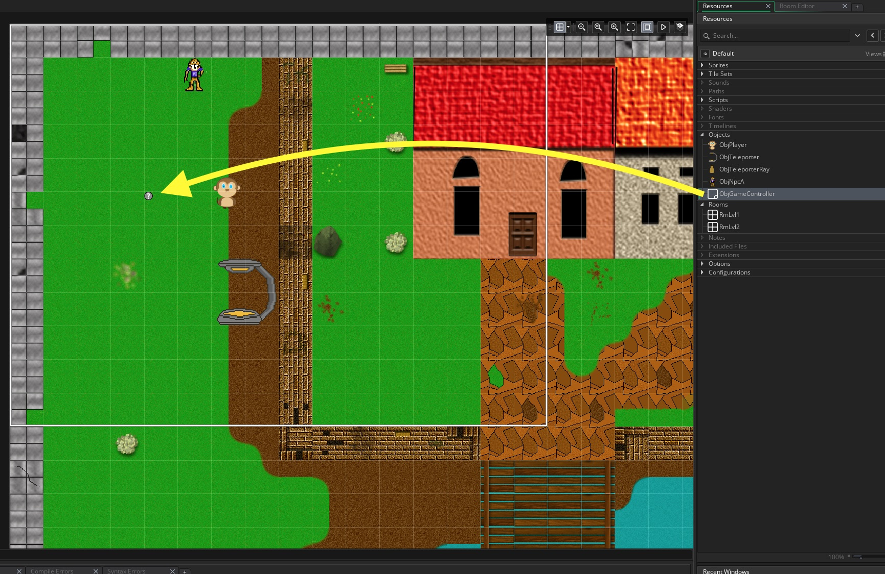

## Dialogue Boxes

___ 
<div class = "row">
<div class="col-12 col-lg-4 align-self-center">
<div markdown = "1"> 

{:start="{{ num }}"}
{{ num }}. Lets add one of the most important elements of an adventure game, dialogue boxes so the NPC's can communicate to the player.  Lets add the tiger NPC.  Go to the folder with the downloaded assets, create a new **sprite** and **Edit Image**, load  and select the **Image ->  Import Strip Image** menu:
</div>
</div>
<div class="col-12 col-lg-8">
 
</div>
</div>

___ 
<div class = "row">
<div class="col-12 col-lg-4 align-self-center">
<div markdown = "1"> 

{:start="{{ num }}"}
{{ num }}. Now select the **_NPC1.png_** file and leave the default settings.  Press the convert button and it should look like this:  
</div>
</div>
<div class="col-12 col-lg-8">
 
</div>
</div>

___ 
<div class = "row">
<div class="col-12 col-lg-4 align-self-center">
<div markdown = "1"> 

{:start="{{ num }}"}
{{ num }}. This should load up the first NPC which is the Tiger.  Lets call the sprite `SprNpcA` and change the sprite size to `64` by `64`:
</div>
</div>
<div class="col-12 col-lg-8">
 
</div>
</div>

___ 
<div class = "row">
<div class="col-12 col-lg-4 align-self-center">
<div markdown = "1"> 

{:start="{{ num }}"}
{{ num }}.  Create a new **_object_** and call it **_ObjNpcA_** and bind the **_SprNpcA_** sprite to it:  
</div>
</div>
<div class="col-12 col-lg-8">
 
</div>
</div>

___ 
<div class = "row">
<div class="col-12">
<div markdown = "1"> 

{:start="{{ num }}"}
{{ num }}. Now the proper way of implmenting dialogue boxes in GameMaker is using callbacks.  This is a bit tricky and there is a faster way to implement them on the PC platform which we will use here.  We will use a "debug" function in GameMaker called **_show_message()_**:
 
> **show_message(str)**<br><br> **Returns**: N/A (void) <br><br>**Description**: This function creates a pop-up message box which displays the string defined in the code and a button marked "Ok" to close it. <br><br>NOTE: THIS FUNCTION IS FOR DEBUG USE ONLY. - GameMaker Manual
</div>
</div>
</div>

___ 
<div class = "row">
<div class="col-12 col-lg-4 align-self-center">
<div markdown = "1"> 

{:start="{{ num }}"}
{{ num }}. Place **_ObjNpcA_** in **_LvlOne_** with its back facing the wall like so:   
</div>
</div>
<div class="col-12 col-lg-8">
 
</div>
</div>

___ 
<div class = "row">
<div class="col-12 col-lg-4 align-self-center">
<div markdown = "1"> 

{:start="{{ num }}"}
{{ num }}. Create a new **Create Event** script on `ObjNpcA` and add a string that will pop up that reads:  
</div>
</div>
<div class="col-12 col-lg-8">
<div markdown = "1"> 
```c
/// @description Npc A dialogue
message = "There is something weird going on in this level";
```
</div>
</div>
</div>

___ 
<div class = "row">
<div class="col-12 col-lg-4 align-self-center">
<div markdown = "1"> 

{:start="{{ num }}"}
{{ num }}. Now if the player is in front of the NPC then we will automatically trigger the dialogue box.  So add a new **Step Event** script to `ObjNpcA` and add:
</div>
</div>
<div class="col-12 col-lg-8">
<div markdown = "1"> 
```c
if (place_meeting (x, y + 3, ObjPlayer))
{
    show_message(message);
}
```
</div>
</div>
</div>

___ 
<div class = "row">
<div class="col-12 col-lg-4 align-self-center">
<div markdown = "1"> 

{:start="{{ num }}"}
{{ num }}. Run the game and walk under the NPC.  Hey, what happens.  When you press **OK** it pops the message up again and you are stuck in an infinite loop.  Now there is a way of quitting the game gracefully.  We call this a hang as the game is still running and has not crashed, but you are stuck and can't continue.  Press the stop on the menu as shown below:  
</div>
</div>
<div class="col-12 col-lg-8">
 
</div>
</div>

___ 
<div class = "row">
<div class="col-12 col-lg-4 align-self-center">
<div markdown = "1"> 

{:start="{{ num }}"}
{{ num }}. OK, so we need to add a timer, that delays the triggering of the text pop-up a second time.  So lets add a switch anb an alarm.  Add to the **Create Event** script on `ObjNpcA` at the bottom:
</div>
</div>
<div class="col-12 col-lg-8">
<div markdown = "1">  
```c
//boolean switch to delay message
canShow = true;
```
</div>
</div>
</div>


___ 
<div class = "row">
<div class="col-12 col-lg-4 align-self-center">
<div markdown = "1"> 

{:start="{{ num }}"}
{{ num }}.  In the **Step Event** for `ObjNpcA` change inside the `place_meeting()` condition this switch:
</div>
</div>
<div class="col-12 col-lg-8">
<div markdown = "1">  
```c
if (place_meeting (x, y + 3, ObjPlayer))
{
    if (canShow == true)
    {
        show_message(message);
        canShow = false;
        alarm[0] = 90;
    }
}
```
</div>
</div>
</div>

___ 
<div class = "row">
<div class="col-12 col-lg-4 align-self-center">
<div markdown = "1"> 

{:start="{{ num }}"}
{{ num }}. Now test it. Doesn't that work much better. Yours should look like:
</div>
</div>
<div class="col-12 col-lg-8">
<div class="embed-responsive embed-responsive-16by9">
<iframe class="embed-responsive-item" src="https://www.youtube.com/embed/6jIggYKBmmk?autoplay=1&rel=0&controls=0&amp&showinfo=0&version=3&loop=1&playlist=6jIggYKBmmk" frameborder="0" allowfullscreen></iframe>
</div>
</div>
</div>

 ___ 
<div class = "row">
<div class="col-12">
<div markdown = "1"> 

{:start="{{ num }}"}
{{ num }}. We can also have multiple sentences we could change the **_message_** variable and use a new GameMaker function.  Please note that if we don't call `randomize ()` then we will always get the same random sequence:  

> **choose(val0, val1, val2... val15)**<br><br>**Returns**: One of the given arguments.<br><br>**Description**: Sometimes you want to specify something other than numbers for a random selection, or the numbers you want are not in any real order or within any set range. In these cases you would use choose() to generate a random result. For example, say you want to create an object with a random sprite at the start, then you could use this function to set the sprite index to one of up to 16 sprites. <br><br>NOTE: This function will return the same value every time the game is run afresh due to the fact that GameMaker: Studio generates the same initial random seed every time to make debugging code a far easier task. To avoid this behaviour use randomize at the start of your game. - GameMaker Manual <br><br>Please note that it WILL NOT BE RANDOM if we don't run randomize() function:

> **randomize()**<br><br>**Returns**: Real (unsigned 32 bit value) <br><br>**Description**: This function sets the seed to a random value. Should you need to keep a consistent value over a number of runs of a game, you should be using random_set_seed(). Please note, that when using the random number functions in GameMaker: Studio the initial seed is always the same, as this makes tracing errors and debugging far easier. Should you wish to test with true random, you should call this function at the start of your game. 
</div>
</div>
</div>

 ___ 
<div class = "row">
<div class="col-12 col-lg-4 align-self-center">
<div markdown = "1"> 

{:start="{{ num }}"}
{{ num }}. Ok lets start by setting the randomize function.  Lets create a new **_object_** and call it `ObjGameController`.  Create a new **Create Event** script.
</div>
</div>
<div class="col-12 col-lg-8">
<div markdown = "1">  
```c
/// @description Set up Game Variables
//run randomize to set a random seed for all future random functions
randomize();
```
</div>
</div>
</div>
<div class = "row">
<div class="col-12">
 
</div>
</div>

 ___ 
<div class = "row">
<div class="col-12 col-lg-4 align-self-center">
<div markdown = "1"> 

{:start="{{ num }}"}
{{ num }}. Place the newly created `ObjGameController` in room **_LvlOne_**.  Remember since there is no sprite attached to it, we will see a blue circle with a question mark in it.  Don't worry this won't show up in game:  
</div>
</div>
<div class="col-12 col-lg-8">
 
</div>
</div>

 ___ 
<div class = "row">
<div class="col-12 col-lg-4 align-self-center">
<div markdown = "1"> 

{:start="{{ num }}"}
{{ num }}. Lets remove the **Create Event** script from `ObjNpcA` and add a selection to its **Step Event** by adding the line before `show_message()`: 
</div>
</div>
<div class="col-12 col-lg-8">
<div markdown = "1">  
```c
message = choose("There is something weird going on in this level.", 
                 "I hear a sound around the bridge.",
                 "I have friends by the bridge, go and talk to them.");
    }
```
</div>
</div>
</div>
<div class = "row">
<div class="col-12">
 
</div>
</div>

 ___ 
<div class = "row">
<div class="col-12">
<div markdown = "1"> 

{:start="{{ num }}"}
{{ num }}. OK, test it and we have a wonderful randomized NPC that can give you messages and hints.  On the next page we will get to NPC B and have it ask questions!
</div>
</div>
</div>

<br />  
[<- Previous](AdventureGame_6.html)&nbsp;&nbsp;&nbsp;[Home](../../index.html)&nbsp;&nbsp;&nbsp; [Continue ->](AdventureGame_8.html)
<br />  
<br />  
<br />  
<br /> 