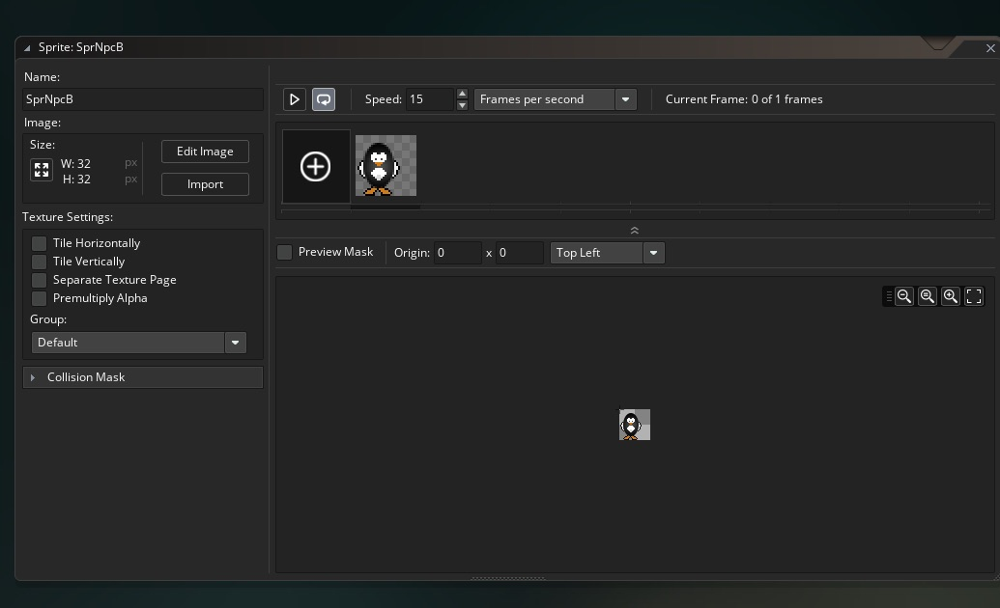
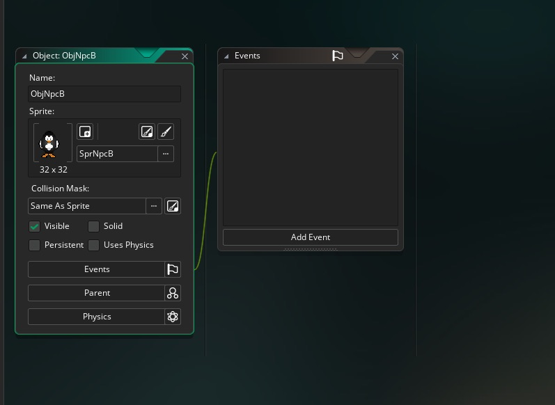
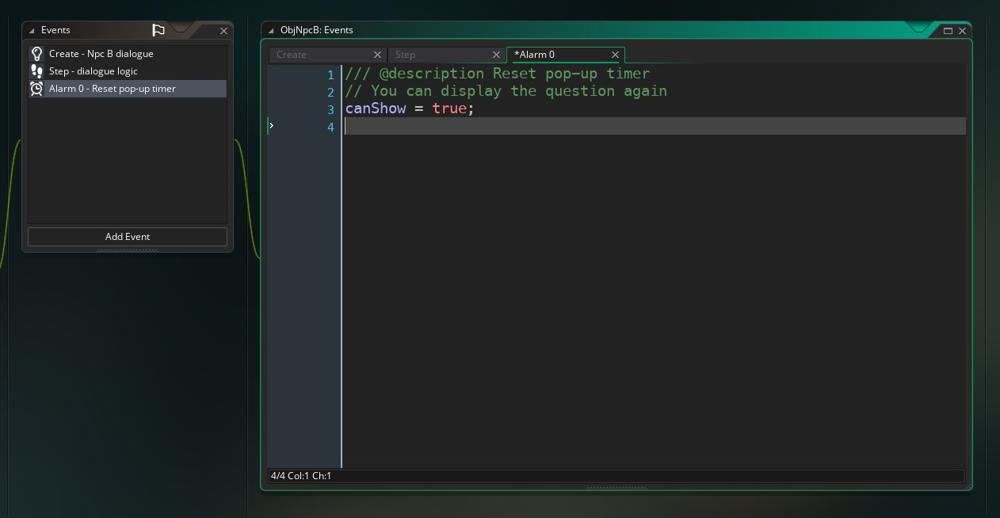
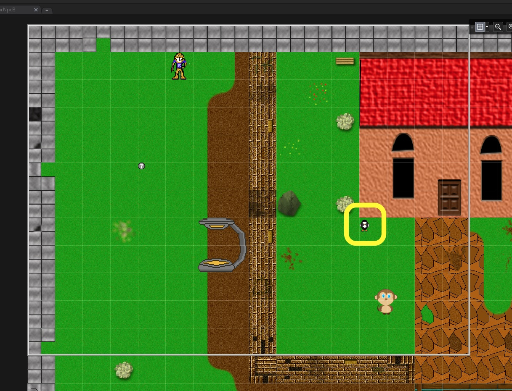
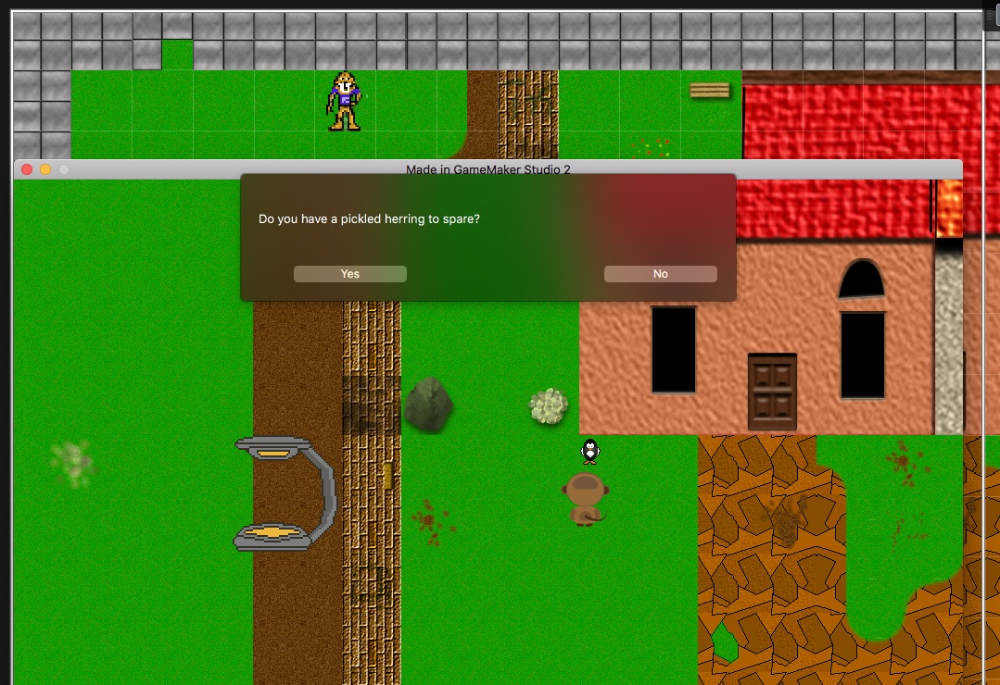
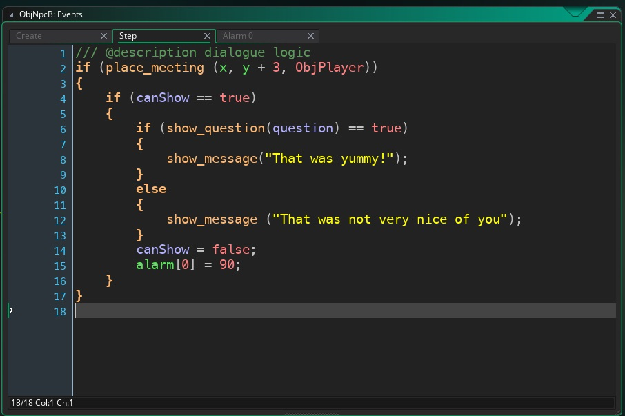
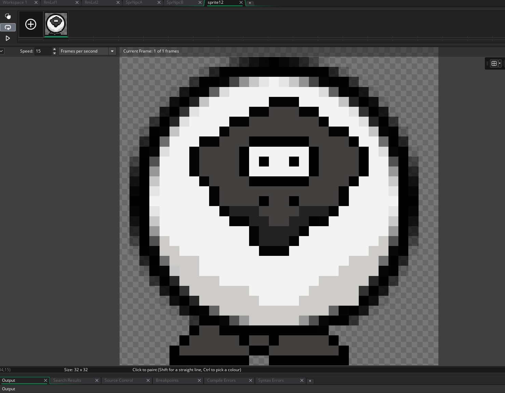
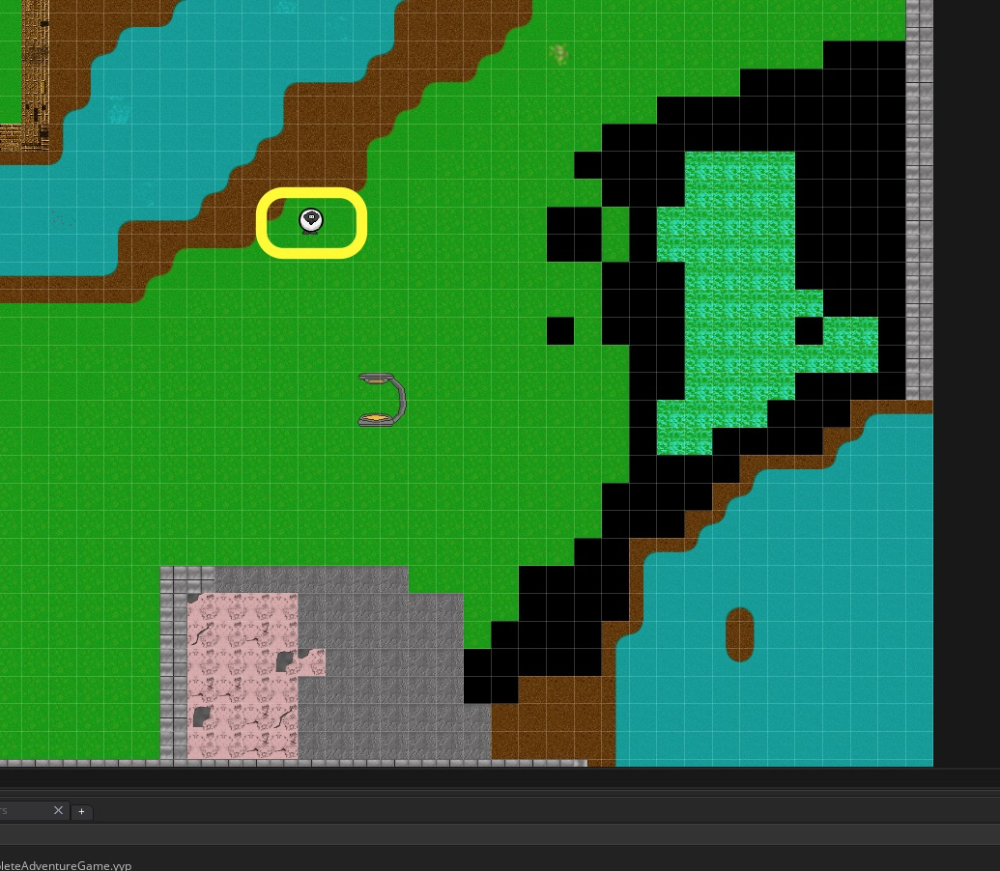
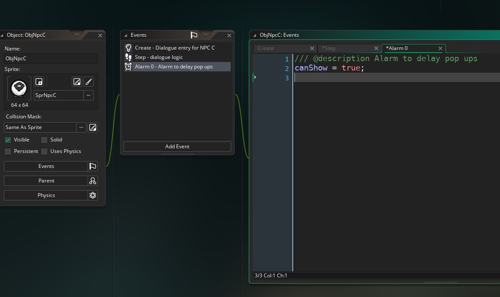

## NPC B

 ___ 
<div class = "row">
<div class="col-12 col-lg-4 align-self-center">
<div markdown = "1"> 

{:start="{{ num }}"}
{{ num }}. Lets look at a second type of NPC with options in the dialogue menu.  Create a new **Sprite** called `SprNpcB` and press the **Edit Image** button.  Click on **Image => Import Strip Image** and select **NPC1.png**.  We want the second characer on the first line we we shift the **_horizontal cell offset_** by `1`.  Call the sprite `SprNpcB`.  Once you import it you should see a Penguin.
</div>
</div>
<div class="col-12 col-lg-8">

</div>
</div>

 ___ 
<div class = "row">
<div class="col-12 col-lg-4 align-self-center">
<div markdown = "1"> 

{:start="{{ num }}"}
{{ num }}. Create a new **_object_** and assign the **SprNpcB** to it and call it `ObjNpcB1`.  
</div>
</div>
<div class="col-12 col-lg-8">

</div>
</div>


___ 
<div class = "row">
<div class="col-12">
<div markdown = "1"> 

{:start="{{ num }}"}
{{ num }}.  We will be using another GameMaker debug function.  This is done for quick prototyping for a proper game you would need to use their "proper callback method".  For testing purposes we will use `show_question(string)`:

> **show_question(str)**<br><br>**Returns**: Boolean<br><br>**Description**: This function creates a pop-up message box with two buttons for "Yes" and "No". It returns true or false depending on which one of the two buttons the user presses.<br><br>NOTE: THIS FUNCTION IS FOR DEBUG USE ONLY. - GameMaker Manual
</div>
</div>
</div>


 ___ 
<div class = "row">
<div class="col-12 col-lg-4 align-self-center">
<div markdown = "1"> 

{:start="{{ num }}"}
{{ num }}. Create a new **Create Event** script called  and add:
</div>
</div>
<div class="col-12 col-lg-8">
<div markdown = "1">  
```c
/// @description Npc B dialogue
question = "Do you have a pickled herring to spare?";
//boolean switch to delay message
canShow = true;
```
</div>
</div>
</div>

 ___ 
<div class = "row">
<div class="col-12 col-lg-4 align-self-center">
<div markdown = "1"> 

{:start="{{ num }}"}
{{ num }}. Only do this if you are on a PC.  `show_message()` is not functional on the mac.  Now create a new **Step Event** script on `ObjNpcB` and add:
</div>
</div>
<div class="col-12 col-lg-8">
<div markdown = "1"> 
```c
/// @description dialogue logic
if (place_meeting (x, y + 3, ObjPlayer))
{
    if (canShow == true)
    {
        show_question(question);
        canShow = false;
        alarm[0] = 90;
    }
}

```
</div>
</div>
</div>

 ___ 
<div class = "row">
<div class="col-12 col-lg-4 align-self-center">
<div markdown = "1"> 

{:start="{{ num }}"}
{{ num }}. Create an **Alarm0** event script and add `canShow = true;`.
</div>
</div>
<div class="col-12 col-lg-8">

</div>
</div>

 ___ 
<div class = "row">
<div class="col-12 col-lg-4 align-self-center">
<div markdown = "1"> 

{:start="{{ num }}"}
{{ num }}. Now lets add `ObjNpcB` to the first **RmLvlOne** with its back to a wall such as:  
</div>
</div>
<div class="col-12 col-lg-8">

</div>
</div>

 ___ 
<div class = "row">
<div class="col-12 col-lg-4 align-self-center">
<div markdown = "1"> 

{:start="{{ num }}"}
{{ num }}. Now run the game and walk up to the second NPC.  See how instead of just making a statement it is asking a question:  
</div>
</div>
<div class="col-12 col-lg-8">

</div>
</div>

 ___ 
<div class = "row">
<div class="col-12 col-lg-4 align-self-center">
<div markdown = "1"> 

{:start="{{ num }}"}
{{ num }}. Now what can we do with that?  We can take that boolean return (yes or no) and have the character then respond to your selection.  So since `show_question()` returns a boolean value, we can use this in an if statement.  Then we can use `show_message(str)` with an answer for pressing yes or no.  Change `ObjNpcB` ** Step Event** script to:  
</div>
</div>
<div class="col-12 col-lg-8">
<div markdown = "1"> 
```c
        if (show_question(question) == true)
        {
            show_message("That was yummy!");
        }
        else 
        {
            show_message ("That was not very nice of you");
        }
    }
```
</div>
</div>
</div>
<div class = "row">
<div class="col-12">
 
</div>
</div>

 ___ 

## NPC C
This does not work on the mac version.

<div class = "row">
<div class="col-12 col-lg-4 align-self-center">
<div markdown = "1"> 

{:start="{{ num }}"}
{{ num }}. Now for our final NPC we will have the player ask the user to enter text.  We will store this to a variable that we can use later.  Create a new **Sprite** called `SprNpcC` and press the **Edit Image** button.  Click on **Image => Import Strip Image** and select **NPC1.png**.  We want the first characer on the second line we we shift the **vertical cell offset** by `1` (and reset the **horizontal offset** back to `0`).  
</div>
</div>
<div class="col-12 col-lg-8">

</div>
</div>

___ 
<div class = "row">
<div class="col-12 col-lg-4 align-self-center">
<div markdown = "1"> 

{:start="{{ num }}"}
{{ num }}. Double the size of the sprite to `64` by `64`.  Create a new **Game Object** and call it `ObjNpcC` and bind the **SprNpcC** sprite to it.  Place it with its back to a wall in the second level 'RmLvl2':
</div>
</div>
<div class="col-12 col-lg-8">

</div>
</div>

___ 
<div class = "row">
<div class="col-12 col-lg-4 align-self-center">
<div markdown = "1"> 

{:start="{{ num }}"}
{{ num }}. Create a new **Create Event** script for `ObjNpcC` and add:  
</div>
</div>
<div class="col-12 col-lg-8">   
<div markdown = "1">     
```c
/// @description Dialogue entry for NPC C
// You can write your code in this editor//timer for delay between reactivating message

questionOne = "What is your first name?";
questionTwo = "What is your favorite color?";

answerOne = "";
answerTwo = ""; 
```
</div>
</div>
</div>

___ 
<div class = "row">
<div class="col-12">
<div markdown = "1"> 

{:start="{{ num }}"}
{{ num }}. Now why are we storing answers with nothing in them? We use this so that we only ask the question if the answer is empty.  If the user doesn't answer the NPC will just ask it again.  For the step event we will need to use a new function called `get_string(str, def)`. 

> **get_string(str, def)**<br><br>**Returns**: String<br><br>**Description**: This creates a pop-up window showing a standard message, with a button labeled "Ok", that prompts the user to input a string. The function will return the input string, or the default value if nothing has been entered. <br><br>NOTE: THIS FUNCTION IS FOR DEBUG USE ONLY. Should you require this functionality in your final game, please use get_string_async. 
</div>
</div>
</div>

___ 
<div class = "row">
<div class="col-12 col-lg-4 align-self-center">
<div markdown = "1"> 

{:start="{{ num }}"}
{{ num }}. Create a new **Step Event** in `ObjNpcC` and add:  
</div>
</div>
<div class="col-12 col-lg-8">   
<div markdown = "1">  
```c
/// @description dialogue logic
if (place_meeting (x, y + 3, ObjPlayer))
{
    if (canShow == true)
    {
        if (answerOne == "")
        {
            answerOne = get_string(questionOne, "Marc");
        }
        else if (answerTwo = "") 
        {
            answerTwo = get_string(questionTwo, 5);
        }
        else
        {
            show_message("Hi " + answerOne + ", your favorite color is " + answerTwo + "!");
        }
        canShow = false;
        alarm[0] = 90;
    }
}
```
</div>
</div>
</div>

___ 
<div class = "row">
<div class="col-12 col-lg-4 align-self-center">
<div markdown = "1"> 

{:start="{{ num }}"}
{{ num }}. Create an **Alarm0** event script and add `canShow = true;`.
</div>
</div>
<div class="col-12 col-lg-8">

</div>
</div>

___ 
<div class = "row">
<div class="col-12 col-lg-4 align-self-center">
<div markdown = "1"> 

{:start="{{ num }}"}
{{ num }}. Now play the game.  OK we ask two questions but we do nothing with this information.  Lets add a last else for that when we asked both questions we repeat them back in a sentence.  To do this we need to use concatonation.  Normally is we set a variable ```x = 5 + 5;```, then ```x``` would be equal to ```10```.  Now GameMaker does something different when we add strings.  If we add ```x = "Hello" + " Bob!";``` then ```x``` would be equal to ```Hello Bob!```.  When you add strings it stitches them together.  Remember that it stores spaces so if you want a space between the words you need add them (look at the space before Bob!).  So lets add a final else condition:
</div>
</div>
<div class="col-12 col-lg-8">   
<div markdown = "1"> 
```c
else
{
    show_message("Hi " + answerOne + ", your favorite color is " + answerTwo + "!");
}
```
</div>
</div>
</div>
<div class = "row">
<div class="col-12">
 
</div>
</div>

[<- Previous](AdventureGame_7.html)&nbsp;&nbsp;&nbsp;[Home](../../index.html)&nbsp;&nbsp;&nbsp;[Continue ->](AdventureGame_9.html)
<br />  
<br />  
<br />  
<br /> 
