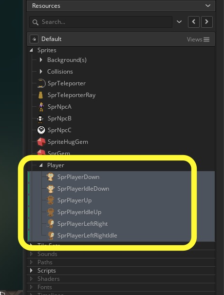

___ 

## Collectibles

<div class = "row">
<div class="col-12 col-lg-4 align-self-center">
<div markdown = "1"> 

{:start="{{ num }}"} We will need both a full size sprite and a HUD sprite that is smaller.  Create two new **Sprites** and Import sprites **game_gem.png**  and call it `SprGem` and load sprites **hud_gem.png** and call it `SprHudGem`.
</div>
</div>
<div class="col-12 col-lg-8">

</div>
</div>

 ___ 
<div class = "row">
<div class="col-12 col-lg-4 align-self-center">
<div markdown = "1"> 

{:start="{{ num }}"}
{{ num }}. Now we have a lot of sprites in our sprites folder, lets clean them up.  Right click on the sprites folder on the left hand side menu and select **Add Group**:
</div>
</div>
<div class="col-12 col-lg-8">

</div>
</div>

 ___ 
<div class = "row">
<div class="col-12 col-lg-4 align-self-center">
<div markdown = "1"> 

{:start="{{ num }}"}
{{ num }}. Call it `Player`.  Drag the 5 player animations onto the folder.
</div>
</div>
<div class="col-12 col-lg-8">

</div>
</div>

___ 
<div class = "row">
<div class="col-12 col-lg-4 align-self-center">
<div markdown = "1"> 

{:start="{{ num }}"}
{{ num }}. Create a new **group** in the sprites menu and call it `NPC`.  Drag the NPC's to thiws folder.
</div>
</div>
<div class="col-12 col-lg-8">

</div>
</div>

___ 
<div class = "row">
<div class="col-12 col-lg-4 align-self-center">
<div markdown = "1"> 

{:start="{{ num }}"}
{{ num }}. OK, that is a bit cleaner.  Finish organizing your sprites and objects into groups as you like.  Now lets create a new **Game Object** and bind the **SprGem** to it and call it `ObjGem`.
</div>
</div>
<div class="col-12 col-lg-8">

</div>
</div>

___ 
<div class = "row">
<div class="col-12 col-lg-4 align-self-center">
<div markdown = "1"> 

{:start="{{ num }}"}
{{ num }}.  Now lets add 5 gems in **_LvlOne_** and 5 gems in **_LvlTwo_**.  
</div>
</div>
<div class="col-12 col-lg-8">

</div>
</div>

___ 
<div class = "row">
<div class="col-12 col-lg-4 align-self-center">
<div markdown = "1"> 

{:start="{{ num }}"}
{{ num }}. Now the player will be picking up these gems, so they will disapear when the player collects them.  We don't want to have a variable saved on the gem.  Lets keep track of it in the game manager.  Open **Create Event** on `ObjGameController` and add to the end:
</div>
</div>
<div class="col-12 col-lg-8">
<div markdown = "1"> 
```c
//keep track of gem collectibles (1 per gem)
gemScore = 0;
```
</div>
</div>
</div>

___ 
<div class = "row">
<div class="col-12 col-lg-4 align-self-center">
<div markdown = "1"> 

{:start="{{ num }}"}
{{ num }}. Now when the gem collides with the player we want the ```gemScore``` count to go up by ```1``` and the gem to dissapear.  Create a new **Collision => ObjPlayer** event script on `ObjGem` and add:
</div>
</div>
<div class="col-12 col-lg-8">
<div markdown = "1"> 
```c
/// @description Add score for gem
ObjGameController.gemScore++; 
instance_destroy();
```
</div>
</div>
</div>
<div class = "row">
<div class="col-12">

</div>
</div>

___ 
<div class = "row">
<div class="col-12 col-lg-4 align-self-center">
<div markdown = "1"> 

{:start="{{ num }}"}
{{ num }}. Run the game, the gem should disappear when you collide with it.  Now we are going to draw a small version of the gem on the Heads Up Display (HUD) on the top of the screen.  We will use our `ObjGameController` for this and add a **DrawGUI** event type.  First lets draw a transparent rectangle to higlight the HUD.  Please add:
</div>
</div>
<div class="col-12 col-lg-8">
<div markdown = "1"> 
```c
/// @description Hud Drawing
//draw a blue background for the HUD
draw_set_color(c_blue);

//Draw a rectangle that is 320 x 75 pixles from the top left corner
draw_rectangle (0, 0, 320, 75, false);
```
</div>
</div>
</div>

___ 
<div class = "row">
<div class="col-12">
<div markdown = "1"> 

{:start="{{ num }}"}
{{ num }}. We used two new functions we have not seen before:

> **draw_set_colour(col)**<br><br>**Returns**: N/A (void) <br><br>Description: With this function you can set the base draw colour for the game. This value will affect all further drawing where appropriate, including fonts, forms, primitives and 3D. If any of those assets are drawn with their own colour value changed, this value will be ignored. - GameMaker Manual

> **draw_rectangle(x1, y1, x2, y2, outline)**<br><br>**Returns**: N/A (void) <br><br>**Description**: With this function you can draw either an outline of a rectangle or a filled rectangle where the (x1,y1) position is the top left corner and the (x2,y2) position is the bottom right corner. - GameMaker Manual
</div>
</div>
</div>

___ 
<div class = "row">
<div class="col-12 col-lg-4 align-self-center">
<div markdown = "1"> 

{:start="{{ num }}"}
{{ num }}. I don't like fact that the blue obscures the game screen.  Lets make it transluscent.  Add before `draw_rectangle()`:
</div>
</div>
<div class="col-12 col-lg-8">
<div markdown = "1"> 
```c
//Set alpha to 25%
draw_set_alpha(.25);

//Draw a rectangle that is 320 x 75 pixles from the top left corner
draw_rectangle (0, 0, 320, 75, false);

//Set alpha back to 100%
draw_set_alpha(1);
```
</div>
</div>
</div>
<div class = "row">
<div class="col-12">

</div>
</div>

___ 
<div class = "row">
<div class="col-12">
<div markdown = "1"> 

{:start="{{ num }}"}
{{ num }}. Run the game, oh that is much better, but wait everything is now at a reduced Alpha. Lets look at the manual for **_draw\_set\_alpha():  

> **draw_set_alpha(alpha)**<br><br>**Returns**: N/A (void) <br><br>**Description**: With this function you can set the base draw alpha for the game. This value can be set from 0 to 1 with 0 being fully transparent and 1 being fully opaque (the default value), and will affect all further drawing, including backgrounds, sprites, fonts, primitives and 3D. If any of those assets are drawn with their own alpha value changed, this will be added to the base alpha value set by this function, so a base alpha of 0.5 and a sprite being drawn with an alpha of 0.5 will actually draw the sprite with an alpha of 0.25. 

* Notice in the description that the alpha will affect everything?  Run the game, and see that now more than just the triangle are at 25% of alpha. But we just want it to affect the rectangle.  So lets set the alpha back to 1 so open **_ScrGameControllerDrawGUI_** and add to the end:

___ 
<div class = "row">
<div class="col-12">
<div markdown = "1"> 

{:start="{{ num }}"}
{{ num }}. Now the tricky thing is that if you don't reset the alpha back to 1 it will affect every other sprite that it gets to after it draws the hud.  The draw event carries over to all draw events that come after it.  So be careful, if you reduce the alpha always set it back to 100.  This is only true for Gamemaker Draw events.
</div>
</div>
</div>

[<- Previous](AdventureGame_8.html)&nbsp;&nbsp;&nbsp;[Home](../../index.html)&nbsp;&nbsp;&nbsp;[Continue ->](AdventureGame_10.html)
<br />  
<br />  
<br />  
<br /> 
