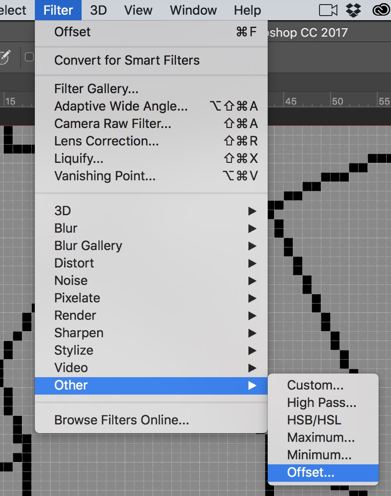
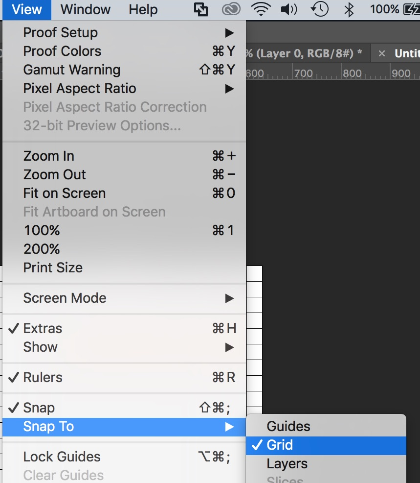

## Raster versus Vector

 

{:start="{{ num }}"}
{{ num }}. There are some payoffs between using raster and vector artwork.  GameMaker supports SWF animations as well as bitmaps.  Their vector pipeline is limited and the engine was most likely built for bitmap artwork.

___ 

 

{:start="{{ num }}"}
{{ num }}. Vector graphics unlike bitmap graphics can scale endlessly without pixilating.  Here is the plane from the game in bitmap scaled up 500% and in vectors scaled up 500%

___ 

 

{:start="{{ num }}"}
{{ num }}. Vector artwork is a bit more CPU intensive to render but takes up less space so there are trade offs to make there.  To get more information go to:  [GameMaker Help Files on Importing SWF](https://docs2.yoyogames.com/source/_build/1_overview/3_additional_information/importing_non_bitmap_sprites.html)

___ 

 

{:start="{{ num }}"}
{{ num }}. GameMaker also support Skeletal animations with [Spine](https://docs2.yoyogames.com/source/_build/1_overview/3_additional_information/importing_non_bitmap_sprites.html).

___ 
## Tile in GameMaker

 

{:start="{{ num }}"}
{{ num }}. Textures take a lot of space so we want to not have an entire game use discrete pixels.  As tempting as it is to have a 6000 x 1000 pixel level with a single matte painting in the background, there are limitations to what a video card can store and render.  We usually break our artwork down into reusable "lego" pieces.  We will Pick a resolution and make all of our tiles a multiple of this size (usually the sames size as our character).  The background we used above would not be commonly found in games.  Common sizes include:
	1. 16 x 16
	2. 32 x 32
	3. 64 x 64
	4. 96 x 96
	5. 128 x 128

___ 

 

{:start="{{ num }}"}
{{ num }}. Lets create a tile in GameMaker.  Create a new **Sprite** and call it `BkgGrayTile`.  Click on **Edit Image** to go the editor.  We should have a 64 x 64 sprite by default.  We want to create a grey tile with cracks in it.  Fill the cell with a light shade of gray:  

___ 

 

{:start="{{ num }}"}
{{ num }}. Just draw random cracks with a black color and the line tool.  

<iframe class="embed-responsive-item" src="https://www.youtube.com/embed/nlp_RmQTqrE?rel=0&amp;controls=0&amp&showinfo=0&autoplay=1&version=3&loop=1&playlist=nlp_RmQTqrE" frameborder="0" allowfullscreen></iframe>

___ 

 

{:start="{{ num }}"}
{{ num }}. Create a new **Room** and call it `LvlTest2`.  Drag it to the top room so it loads first:

___ 

 

{:start="{{ num }}"}
{{ num }}. Go to the **Background Layer** and select the background tile you just created

___ 

  

{:start="{{ num }}"}
{{ num }}. To make the tile repeat and fill the entire screen select **Horizontal Tile** and **Vertical Tile**.  See how it now repeats and fills the room:

___ 

 

{:start="{{ num }}"}
{{ num }}. Now you can either run the game to see it:

 

___ 

 

{:start="{{ num }}"}
{{ num }}. Or turn the grid off to how the tile looks: 

___ 

 

{:start="{{ num }}"}
{{ num }}. Now our repeat might look bad because we did not think about making sure our horizontal and vertical pixels lined up.  To fix this we need to export this to photoshop. Double click the newly created sprite and we can export the tile by selecting **Image -> Export to PNG**:

___ 

 

{:start="{{ num }}"}
{{ num }}. Save the file and load it up in **Photoshop**.  Zoom in and you should see:

___ 

 

{:start="{{ num }}"}
{{ num }}. Now we want to shift the image and have it wrap half way through the sprite.  Select **Filter -> Other -> Offset**:

 

___ 

 

{:start="{{ num }}"}
{{ num }}. Select `32` by `32` which is half a sprite width and height and make sure **Wrap Around** is selected:

___ 

 

{:start="{{ num }}"}
{{ num }}. With a 1 pixel pencil/brush, fill in the gaps and fix the lines that are broken.

___ 

 

{:start="{{ num }}"}
{{ num }}.  Now **Save** and **Export -> Quick Export as PNG** and save it.  Import it back over the old sprite by pressing **Import** in GameMaker:

___ 

 

{:start="{{ num }}"}
{{ num }}. Look at the result in the game:

___ 

 

{:start="{{ num }}"}
{{ num }}. Now double click the sprite and use the fill bucket to fill-in two or three similar non-contrasting colors:  

___ 

 

{:start="{{ num }}"}
{{ num }}. In the room it looks like:  

___ 

 

{:start="{{ num }}"}
{{ num }}. We want to keep working on these textures until you cannot see the grid when they are tiled:

___ 

## Tileset in Photoshop

 

{:start="{{ num }}"}
{{ num }}. Creating a tile one at a time would be tedious.  There is a method in GameMaker to import tile sheets and add them as brushes in the room deitor. Lets create a large tileset we can use in Photoshop. Pick a theme and an art style that works for you.  In Photoshop start a new **file** under **file -> new** in the top menu and make it 1280 x 1280.  Select a white background:

___ 

 

{:start="{{ num }}"}
{{ num }}. Now select **Preference -> Guides, Grids & Slices**:  

___ 

 

{:start="{{ num }}"}
{{ num }}. Change the  **Grid -> Gridlines Every** to `64`.  I changed the **Grid Color:** to `#000` (or black).:  

___ 

 

{:start="{{ num }}"}
{{ num }}. Now you are left with a white 1280 by 1280 photoshop page.  To turn on the **grid** you need to go to the top menu and select **View -> Show -> Grid**:  

___ 

 

{:start="{{ num }}"}
{{ num }}. Now you can see the black gridlines.  Don't worry when you save the file for the game these will no longer be there.  These lines are only useful if we snap to them when moving and arringing our tiles. To turn on the snapping to grid you need to go to the top menu and select **View -> Snap To -> Grid**:  

___ 

  

[<- Previous](ArtOverview_1.html)&nbsp;&nbsp;&nbsp;[Home](../../index.html)&nbsp;&nbsp;&nbsp; [Continue ->](ArtOverview_3.html)
   
   
   
   