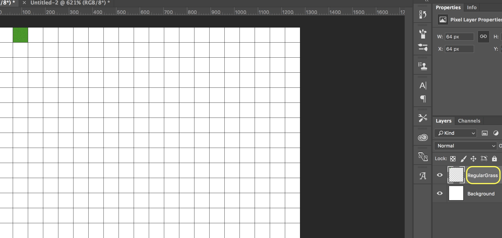

 

{:start="{{ num }}"}
{{ num }}. Create a new 64 x 64 image with a white background.  Select a light green color:  

___ 

 

{:start="{{ num }}"}
{{ num }}. Use the **Paint Bucket Tool** and fill in the whole sprite with that green color:  

  

___ 

 

{:start="{{ num }}"}
{{ num }}. Select **Filter -> Noise -> Add Noise** to bring up the **Add Noise** menu:      

___ 

 

{:start="{{ num }}"}
{{ num }}. Set **Amount** to `3` (or something close to this).  We will keep **Distribution** at **Gaussian** and **Monochromatic** checked as we want it to all stay green:      

___ 

 

{:start="{{ num }}"}
{{ num }}. Now your tile should look something like:  

___ 

 

{:start="{{ num }}"}
{{ num }}. Select **Filter -> Other -> Offset** to bring up the **Offset** menu and play with the vertical and horizontal shift.  In my case I don't see a line so I don't have anything to clean up on the inside of the sprite.  Remember to ensure that this tiles correctly we should not touch any of the pixels along the edge:  

___ 

 

{:start="{{ num }}"}
{{ num }}. We **Select All** and **Copy Merged** then move back to our Tilesheet.  We paste our newly made grass texture there. Use your **Move Tool** to position it in a grid area like:  

___ 

 

{:start="{{ num }}"}
{{ num }}. This is very important so that the tile lines up on a 64 x 64 pixel boundary.  Otherwise it will not be placed correctly in the room in GameMaker.  It is always critical that you leave the top left tile empty as this is a new requirement of [GameMaker Studio 2](https://docs2.yoyogames.com/source/_build/2_interface/1_editors/tilesets.html).  Always name your layers in photoshop to keep them neat, so name this **Regular Grass**:  

___ 

 

{:start="{{ num }}"}
{{ num }}. Before We can bring in the tile layer we created in GameMaker we need to export it.  Export the file as a PNG to the desktop (or any folder you want) and call it `BkgSpriteSheet`.  Your PNG should look like:  

___ 

 

{:start="{{ num }}"}
{{ num }}. Not too interesting but lets see how we integrate it with GameMaker.  Lets go back to the GameMaker project and right click on Tileset and call it `TlsBkg`:

 

___ 

 

{:start="{{ num }}"}
{{ num }}.  We also need to import the tileset as a sprite before we can use it.  Create a new **Sprite** and press **Import** and select the file you just exported from Photoshop.

 

___ 

 

{:start="{{ num }}"}
{{ num }}. Call it `SprBkgSprite`:

 

___ 

 

{:start="{{ num }}"}
{{ num }}. Double click on `TlsBkg` and assign the newly imported sprite. 

 

___ 

 

{:start="{{ num }}"}
{{ num }}. Change **_Tile Width_** and **_Tile Height_** to `64` by `64`:    

 

___ 

 

{:start="{{ num }}"}
{{ num }}. Now create a new **Room** and move it to the top and call it `LvlTest3`.  Move it to the top of the room list.  Add a new **Tile Layer** and call it `MainTiles`:  

 

___ 

 

{:start="{{ num }}"}
{{ num }}. Select the one tile you created and paint it over the room layer by left clicking in room.

 

___ 

  
[<- Previous](ArtOverview_2.html)&nbsp;&nbsp;&nbsp;[Home](../../index.html)&nbsp;&nbsp;&nbsp; [Continue ->](ArtOverview_4.html)
   
   
   
   