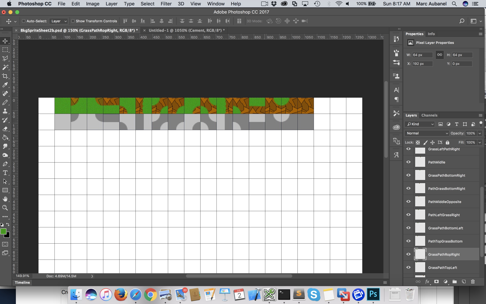
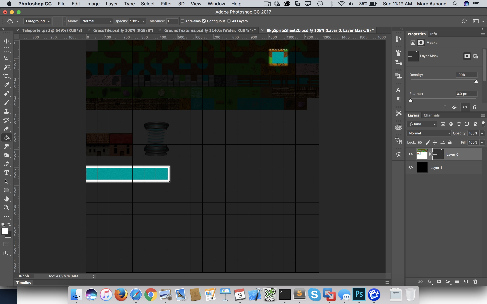
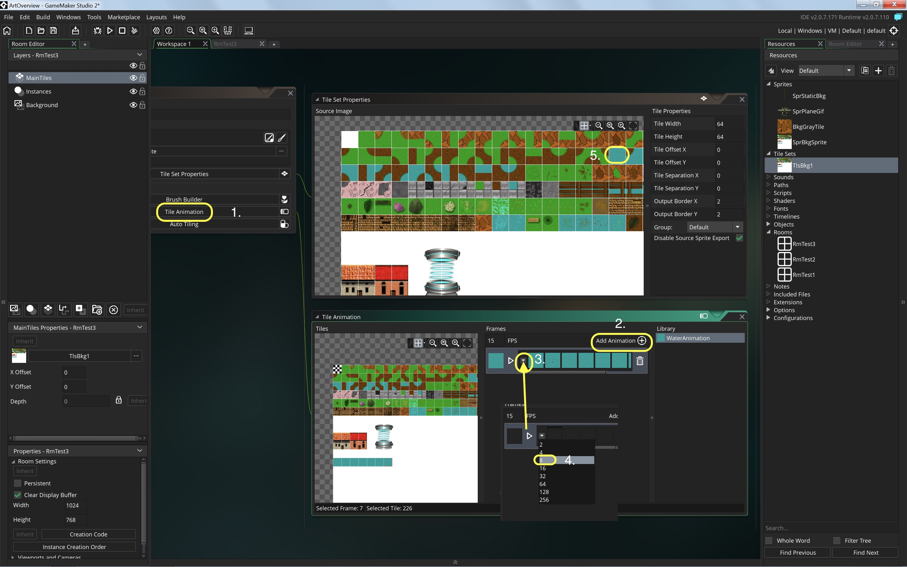

## Transitioning Between Tiles

 

{:start="{{ num }}"}
{{ num }}.  Now that we have to tiles of grass and concrete pathways.  How do we create interesting transitions between them.  Here is a common 16 tile configuration of going between one tile type to another:

 

___ 

 

{:start="{{ num }}"}
{{ num }}.  Export your colorized floor tile called `BkgGrayTile` by clicking **Edit Image** then **Image -> Export as PNG**.  Pick a good name then load it up next to you tile sheet in Photoshop.:

 

___ 

 

{:start="{{ num }}"}
{{ num }}.  I have included a file called 16TileTemplate.psd which has a layer with the template diagram.  Cut and paste your grass texture on top of the light gray on the left and the colored walkway texture on the darker gray on the right.  So it should look like:

 

___ 

 

{:start="{{ num }}"}
{{ num }}.  Now I want to create the next transition which is a primary grass with a connector to the colorized floor at the top left per the diagram:

 

___ 

 

{:start="{{ num }}"}
{{ num }}. To do this I create a new 64 x 64 photoshop file with a grass layer on top and the colorized floor on the bottom:

 

___ 

 

{:start="{{ num }}"}
{{ num }}. Since I want to make a round transition from half way through the top and bottom, I select the **Eraser** tool with a round 64 pixel brush with a hardness setting to your liking.  Now carefully line it up with the ruler (turn it on if you need to) to clip at 32 on the x and 32 on the y:

___ 

 

{:start="{{ num }}"}
{{ num }}. Select the whole image (cmd a or cntrl a) and **Edit -> Copy Merged**, paste it into your tilesheet in the right spot like so:

___ 

 

{:start="{{ num }}"}
{{ num }}. Repeat for all other shapes.  Your photoshop file should look close to:

___ 

 

{:start="{{ num }}"}
{{ num }}.  Remove the hint layer and export the updated tilesheet it as a PNG file and go back to GameMaker and replace your old tilesheet by importing the new one:

___ 

 

{:start="{{ num }}"}
{{ num }}. Your Tilesheet should look like:

___ 

 

{:start="{{ num }}"}
{{ num }}. We can go into the level and manually apply these tiles.  But there is a new feature in GameMaker studio 2 that makes it easier and quicker to implement.  You can 
paint grass through the paths using autotiling:

___ 

 

{:start="{{ num }}"}
{{ num }}. This allows us to paint on set of tiles into the exterior of another.  Press the **Autotiling** button and press the **+** button nexzt to the **16** tile option to match the tiles we just created.  Notice it puts a default name in a tile library on the right and a blank template.

___ 

 

{:start="{{ num }}"}
{{ num }}. Now match each template item by clicking on it then click on the appropriate tile.  Remember that it is grass that is light gray.  Do this for all of the tiles:

___ 

 

{:start="{{ num }}"}
{{ num }}. Create a new **Room** and call it `RmTest3` and bring it to the top. Create a new tile layer and name it to your liking.  With that layer selected, pick your tileset (in this case `TlsBkg1`). Select the library tab and select the Auto Tile Library item you just created.  Start painting with grass inside of tiles in the room:

<iframe class="embed-responsive-item" src="https://www.youtube.com/embed/oR9E6qqm-LU?rel=0&amp;controls=0&amp&showinfo=0&autoplay=1&version=3&loop=1&playlist=oR9E6qqm-LU" frameborder="0" allowfullscreen></iframe>

___ 

 

{:start="{{ num }}"}
{{ num }}. You can also paint with individual tiles and can build custom brushes. 

___ 

 

{:start="{{ num }}"}
{{ num }}. Now we can also reverse it and have the tiles paint within the grass.  We just need to add the two grass in the middle diagonal tiles.  Go into Photoshop and add these tiles; re-export them and re-import the background sprite.  

___ 

 

{:start="{{ num }}"}
{{ num }}. With that you should be able to build another auto tile library. Open **TlsBkg1** and press the **+ 16** _button_ and reverse the tiles where the light color is _path_ and the dark color is _grass_.  Name both tile libraries something meaningful:

___ 

 

{:start="{{ num }}"}
{{ num }}.  Open **RmTest3** and select in the top menu bar the **Auto Tile** _button_.  Then press the **Libraries** tab on the right hand menus to see your auto tile libraries you created.  Select the second one you just made.  Now you can see that tiles will be inserted inside the grass with grass borders:

<iframe class="embed-responsive-item" src="https://www.youtube.com/embed/FtjVTH4_4Pc?rel=0&amp;controls=0&amp&showinfo=0&autoplay=1&version=3&loop=1&playlist=FtjVTH4_4Pc" frameborder="0" allowfullscreen></iframe>

___ 

 

{:start="{{ num }}"}
{{ num }}. Now, having a tiles with a repeating pattern and lots of memory on our computers is a mistake.  In old adventure/RPG video games there was a space and memory limitation that forced the use of limited texture sets.  On a modern PC we have ample memory to create lots of variant textures that mix up the repetitiveness and adds some variety, realism and breaks up the pattern.  We will also demonstrate another powerful feature of custom brushes in GameMaker Studio 2.  For this open Photoshop and draw a hedge assymetrically (not in the middle) sort of like:

___ 

 

{:start="{{ num }}"}
{{ num }}.  Now re-export and import the sprite and go into **RmTest3** and make sure the basic pencil tool is selected (should default to this).  Select the hedge tile you created and place it in the room: 

___ 

 

{:start="{{ num }}"}
{{ num }}.  Now rather than in photoshop rotating this hedge to different positions, we can rotate the brush and save a custom brush without adding any artwork or overhead to our game in terms of added tiles. Double click on **TlsBkg1** and press the **Brush Builder** button:

___ 

 

{:start="{{ num }}"}
{{ num }}.  This will take you to the brush builder screen.  Now rather than having separate brushes that you create and name (like in Photoshop), there is a single blank page where you can create as many brushes as you wi9ll need.  A brush is defined by having no blank spaces, so it can be larger than one square but if there are no consecutive squares they will be considered separate brushes:

___ 

 

{:start="{{ num }}"}
{{ num }}.  Select the tile you want to turn into a brush and press the **Rotate Tile** button then place it in the top left corner.  Repeat and make sure there is a blank tile between your brushes.  It should look like:

___ 

 

{:start="{{ num }}"}
{{ num }}.  Now open **RmTest3** and click on the **Brushes** _tab_ on the right.  Select each new brush and place it in the room.  It should look like:

___ 

 

{:start="{{ num }}"}
{{ num }}. There are many more features with tiles, but one more I would like to demonstrate.  We can have tiles with animations so that they are not static.  I created a water tile with a similar method to how I created the grass.  I then offset the texture 7 times by 8 pixels vertically.

___ 

 

{:start="{{ num }}"}
{{ num }}. I added these 8 tiles to the tilesheet.  I exported and re-imported them into the GameMaker project:

___ 

  

{:start="{{ num }}"}
{{ num }}. 
	1. Open **TlsBkg1** and double click on the **Tile Animation** _button_.  
	2. Add a new animation by pressing the **+** next to **Add Animation**.  
	3. Select the Numberr of Frames (note the animations have to be a power of 2). 
	4. I made an 8 frame animation so I select `8`.  
	5. Click on each frame of the animation and pick the correlating frame from the **Tile Set Properties**.

___ 

 

{:start="{{ num }}"}
{{ num }}. Open **RmTest3** and press the **Libraries** tab on the right.  Select the animation on the bottom right panel and place it in the room like so:

___ 

 

{:start="{{ num }}"}
{{ num }}.  This is what my room looks like when I run the game:

<iframe class="embed-responsive-item" src="https://www.youtube.com/embed/2fXlyDCGFDg?rel=0&amp;controls=0&amp&showinfo=0&autoplay=1&version=3&loop=1&playlist=2fXlyDCGFDg" frameborder="0" allowfullscreen></iframe>

___ 

 

{:start="{{ num }}"}
{{ num }}.  Note that for brushes, animations or autotiling that have transparencies, need to be on a separate layer.  If not you will not see a transparency and it would go to black:

 

___ 

 

{:start="{{ num }}"}
{{ num }}. If you do want a tile to go ontop of a solid one, you need a separate layer.  Just add another tile layer ontop of the "Main Tiles" layer.

 

___ 

 

{:start="{{ num }}"}
{{ num }}.  Create some more surfaces like dirt,  and create more autotiles, brushes and animation to create a variety in tiles. Some ideas are:

**Bridge over water:**
	
 
 	

**Trees over grass:**

 
 	

**Dirt on grass:**

 
 	

**Water lillies on water:**

 
 	

___ 

 

{:start="{{ num }}"}
{{ num }}. Now have some fun and fill up the 1280 by 1280 tilesheet. 

___ 

  

[<- Previous](ArtOverview_3.html)&nbsp;&nbsp;&nbsp;[Home](../../index.html)&nbsp;&nbsp;&nbsp;
   
   
   
   