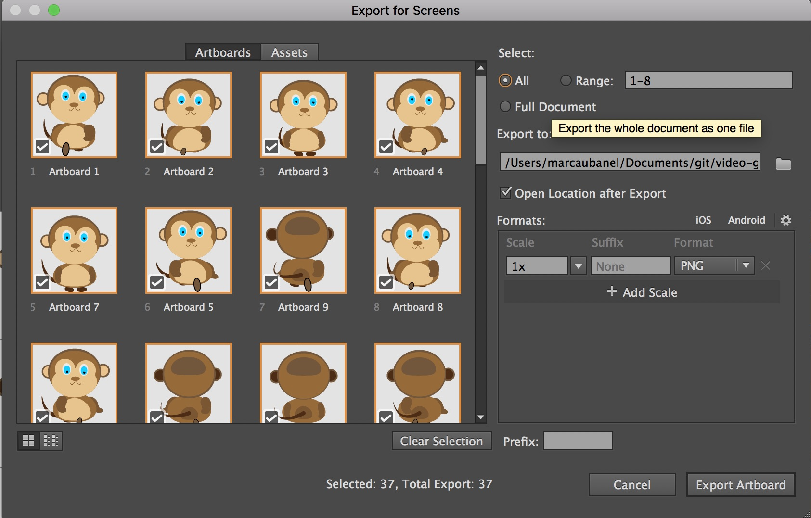

## Animations

 

{:start="{{ num }}"}
{{ num }}. Now lets look at character animations. Animations from games are very different than ones for movies or cartoons.  They are atomic (each animation represents an individual action), mostly loopable and connect to each other in a logical manner.  Let's look at Mario: 

 

___ 

 

{:start="{{ num }}"}
{{ num }}. What is this composed of?  This breaks a walk cycle into three frames:

___ 

 

{:start="{{ num }}"}
{{ num }}. The other element of animation that is not intuitive is that we translate movement within the physics of the game engine and it is usually not part of the animation.  So we animate our character to move on the spot and even jumping we do not move them through space, we animate the key frames without translation:

___ 

 

{:start="{{ num }}"}
{{ num }}. There are many tricks and techniques for animating characters.  One of them is to start very simple and build more detail slowly:

___ 

 

{:start="{{ num }}"}
{{ num }}.  You can also build it piece by piece:

  

___ 

 

{:start="{{ num }}"}
{{ num }}. For most animations some vertical translation helps a lot - make it bouncy ([Mercenary Kings - Boss](http://probertson.tumblr.com/post/82062175084/mercenary-kings-animations)):

___ 

 

{:start="{{ num }}"}
{{ num }}. Keep it simple and represent the animation in as few frames as possible.  Just as we want to get rid of the "grid" in the tiles; we want to lose a sense of where the animation is looping and the "repeatability".  Look at anothe rexample from [Mercenary Kings](http://probertson.tumblr.com/post/82062175084/mercenary-kings-animations).  Can you see the stitch? Can you guess how many animations there are?  

___ 

 

{:start="{{ num }}"}
{{ num }}. Look at the shading above in the feet of the robot.  The back legs are dark which clearly delinates the front and back legs.  In the old 8 bit games there were not enough colors in the pallette (or enough pixels in the character) to give detail and shadows. Look at how [Mario](http://greatmustachesinhistory.com) was shaded through the ages:

___ 

 

{:start="{{ num }}"}
{{ num }}. Always draw your camera in the perspective that your game is in. So the previous are all platformers, what would an isometric adventure game look like ([deviant art](https://www.deviantart.com/tag/charset?offset=0))?

___ 

 

{:start="{{ num }}"}
{{ num }}. And then finally go as big as you can ([Scott Pilgrim Vs. The World](http://scottpilgrim.wikia.com/wiki/File:Toddingram_freakout_a-1-.gif)):  

___ 

 

{:start="{{ num }}"}
{{ num }}. There are many views in 2-D games with different perspectives and techniques for drawing and stitching tiles.  Here are a few ([wikipedia](https://en.wikipedia.org/wiki/Graphical_projection)):

___ 

 

{:start="{{ num }}"}
{{ num }}. An isometric view is a "pseudo 3-D" view where the viewpoint is shifted to reveal other facets of the environment (typically top down or side to side).  Notice that it is not drawin in perspective the lines are paralell.  True perspective would make tiling very difficult ([image from wikipedia](https://en.wikipedia.org/wiki/Isometric_projection)): 

___ 

 

{:start="{{ num }}"}
{{ num }}. So an isometric tilesheet would look [like](https://s-media-cache-ak0.pinimg.com/736x/9d/0c/f1/9d0cf182aa9af61f8c4b3675c9cfdeea--pixel-art-tiles.jpg):

___ 

 

{:start="{{ num }}"}
{{ num }}.  Currently GameMaker Studio 2 does not support hexagonal tiles or different orientation of tiles in the room editor.

___ 

 

{:start="{{ num }}"}
{{ num }}. There are many tools that you can use to draw and animate sprite.  Photoshop can be used and movies can be loaded as layers to use as reference.  Film or find a good reference for the animation you want.  Press:

___ 

 

{:start="{{ num }}"}
{{ num }}. You can use a Wacom tablet and trace over key frames you select:

___ 

 

{:start="{{ num }}"}
{{ num }}. Make sure you can export them in a sprite sheet that can be easily imported into GameMaker.  This tilesheet was a 128 x 64 pixel sprite sheet:

 
 ___ 

 

{:start="{{ num }}"}
{{ num }}. If you are very ambitious you could export your photoshop file as layers with each animated limb to be animated in software like **[Brash Monkey's Spriter](https://brashmonkey.com)** (free download). 

___ 

 

{:start="{{ num }}"}
{{ num }}. If you want a clean vector look you can use Illustrator and use reference.  I suggest setting up your artboards right next to each other so you can easily export it as a png sprite sheet that can be easily absorbed into GameMaker. 

___ 

 

{:start="{{ num }}"}
{{ num }}. To export from Illustrator press **File -> Export -> Export For Screens**.  It defaults to exporting each artboard as a separate file.  You can press the **Full Document** radial button to get a tilesheet.  It also preserves the alpha (the white default artboard is not exported) but trims the image so it needs to be set back in a tool like photoshop.  Mine went from 512 to 502 pixels, which I then resized the canvas back to 512 so that it would import properly.

	

___ 

 

{:start="{{ num }}"}
{{ num }}. Have fun picking a character and attempt an animation.  We are going to animate our character in the next page.

[Home](../../index.html)&nbsp;&nbsp;&nbsp; [Continue ->](SpritesAndAnimation_2.html)
   
   
   
   
