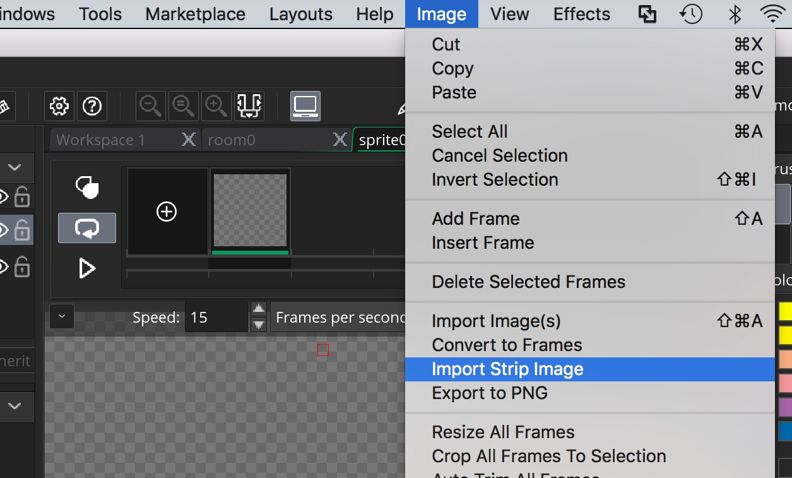

<div class = "row">
<div class="col-12">
<div markdown = "1"> 

{:start="{{ num }}"}
{{ num }}.  Take the sprite sheet you just made or you can also download the [sprites](Sprites.zip) I created. It should look like:
</div>
</div>
</div>

___ 
<div class = "row">
<div class="col-12 col-lg-4 align-self-center">
<div markdown = "1"> 

{:start="{{ num }}"}
{{ num }}. There are many sprite sheets that are not geometrically formed and are expecting the program to cut and adjust the sprites.  Unity has a more sophisticated tool for this than GameMaker.  We need to make sure we know what the dimensions of a single sprite is.  In this case it was done by me so I know they are 64 x 64.  Each row is a separate animation and contains 8 frames.  I have animated upwards, downwards and left/right motion.  I did not do a separate left as we can just mirror the sprite in code and save some memory to have both left and right.  
</div>
</div>
<div class="col-12 col-lg-8">

</div>
</div>

___ 
<div class = "row">
<div class="col-12 col-lg-4 align-self-center">
<div markdown = "1"> 

{:start="{{ num }}"}
{{ num }}. We can import the entire sheet as one animation but it will be easier if each movement gets its own animation file.  So we create a new **Sprite** by right clicking on the **Sprite** in the **Resource** _menu_ and press **Create**: 
</div>
</div>
<div class="col-12 col-lg-8">

</div>
</div>

___ 
<div class = "row">
<div class="col-12 col-lg-4 align-self-center">
<div markdown = "1"> 

{:start="{{ num }}"}
{{ num }}. Now press the **Edit Image** button so we can get access to the image menu.  
</div>
</div>
<div class="col-12 col-lg-8">

</div>
</div>

___ 
<div class = "row">
<div class="col-12 col-lg-4 align-self-center">
<div markdown = "1"> 

{:start="{{ num }}"}
{{ num }}. Go to the **Image** _menu_ item and select **Import Strip Image** and select the file you want.  If you are using mine, select: **MonkeyAnim.png**.  
</div>
</div>
<div class="col-12 col-lg-8">

</div>
</div>

___ 
<div class = "row">
<div class="col-12 col-lg-4 align-self-center">
<div markdown = "1"> 

{:start="{{ num }}"}
{{ num }}. Now a **Convert to Frames** window appears.  This is where we will select the number of framews and the size.  We fill in `8` for **Number of Frames** and **Numbers per Row** and `64` for **Frame Width** and **Frame Height**.
</div>
</div>
<div class="col-12 col-lg-8">

</div>
</div>

___ 
<div class = "row">
<div class="col-12 col-lg-4 align-self-center">
<div markdown = "1"> 

{:start="{{ num }}"}
{{ num }}. Press the **Convert** _button_ and select **yes** for the pop-up:
</div>
</div>
<div class="col-12 col-lg-8">


</div>
</div>

___ 
<div class = "row">
<div class="col-12 col-lg-4 align-self-center">
<div markdown = "1"> 

{:start="{{ num }}"}
{{ num }}. The animation is imported zoomed in so you press the **Reset Zoom** button to resize it:
</div>
</div>
<div class="col-12 col-lg-8">

</div>
</div>

___ 
<div class = "row">
<div class="col-12 col-lg-4 align-self-center">
<div markdown = "1"> 

{:start="{{ num }}"}
{{ num }}. You can now adjust the speed to your liking.  It should look like:
</div>
</div>
<div class="col-12 col-lg-8">
<div class="embed-responsive embed-responsive-16by9">
<iframe width="560" height="315" src="https://www.youtube.com/embed/ezNdG33W550?rel=0&amp;controls=0&amp&showinfo=0&autoplay=1&version=3&loop=1&playlist=ezNdG33W550" frameborder="0" allowfullscreen></iframe>
</div>
</div>
</div>

___ 
<div class = "row">
<div class="col-12 col-lg-4 align-self-center">
<div markdown = "1"> 

{:start="{{ num }}"}
{{ num }}. Name the **Sprite** `SprPlayerDown`.
</div>
</div>
<div class="col-12 col-lg-8">

</div>
</div>

___ 
<div class = "row">
<div class="col-12 col-lg-4 align-self-center">
<div markdown = "1"> 

{:start="{{ num }}"}
{{ num }}. We will pick an animation frame for the idle animation. I like the third frame with its neutral pose 
</div>
</div>
<div class="col-12 col-lg-8">

</div>
</div>
___ 
<div class = "row">
<div class="col-12 col-lg-4 align-self-center">
<div markdown = "1"> 

{:start="{{ num }}"}
{{ num }}. Create a new **Sprite**, call it `SprPlayerIdleDown` and press **Edit Image**.
</div>
</div>
<div class="col-12 col-lg-8">

</div>
</div>

___ 
<div class = "row">
<div class="col-12 col-lg-4 align-self-center">
<div markdown = "1"> 

{:start="{{ num }}"}
{{ num }}. Go to the **Image** _menu_ item and select **Import Strip Image**. Now a **Convert to Frames** window appears.  This is where we will select the number of framews and the size.  We fill in `64` for **Frame Width** and **Frame Height** and `2` for **Horizontal Cell Offset**.
</div>
</div>
<div class="col-12 col-lg-8">

</div>
</div>

___ 
<div class = "row">
<div class="col-12 col-lg-4 align-self-center">
<div markdown = "1"> 

{:start="{{ num }}"}
{{ num }}. The image should look like:
</div>
</div>
<div class="col-12 col-lg-8">

</div>
</div>

___ 
<div class = "row">
<div class="col-12 col-lg-4 align-self-center">
<div markdown = "1"> 

{:start="{{ num }}"}
{{ num }}. Repeat this process and create for `SprPlayerUp`, `SprPlayerIdleUp`, `SprPlayerLeftRight` and `SprPlayerIdleLeftRight`.  Here are the settings:
</div>
</div>
<div class="col-12 col-lg-8">

<br />
</div>
</div>
<div class="row">
	<div class="col">

</div>
<div class="col">

</div>
<div class="col">

</div>
<div class="col">

</div>
<div class="col">

</div>
<div class="row">

</div>
<div class="row">

</div>
</div>

## Player Movement

<div class = "row">
<div class="col-12 col-lg-4 align-self-center">
<div markdown = "1"> 

{:start="{{ num }}"}
{{ num }}.  Lets create a new **Game Object**, call it `ObjPlayer` and attach the `SprPlayerIdleDown` as its default sprite.
</div>
</div>
<div class="col-12 col-lg-8">

</div>
</div>

___ 
<div class = "row">
<div class="col-12">
<div markdown = "1"> 

{:start="{{ num }}"}
{{ num }}. We want our player to only move in 4 directions and not in diagonals.  So we want to know if two or more buttons are pressed which the last button is.  We will use the most recent (last button) button press to determine up, down, left or right.  There is a Gamemaker variable that will do the trick:

> keyboard_lastkey;

> **Stores**: Real (refers to last key pressed)

> **Description**: This variable refers to the value that keyboard_key was in the previous frame, returning the keycode of that key (all standard keycode constants are returned). This variable is not read only and you can change it, for example to set it to -1 if you handled it already. [GameMaker Manual](https://docs2.yoyogames.com/source/_build/3_scripting/4_gml_reference/controls/keyboard%20input/keyboard_lastkey.html)
</div>
</div>
</div>
___ 
<div class = "row">
<div class="col-12 col-lg-4 align-self-center">
<div markdown = "1"> 

{:start="{{ num }}"}
{{ num }}. Now, double click `ObjPlayer` and press **Add Event -> Create** add to **_ScrPlayerInGameMovementStep_**:  
</div>
</div>
<div class="col-12 col-lg-8">

<br />
</div>
</div>
___ 
<div class = "row">
<div class="col-12 col-lg-4 align-self-center">
<div markdown = "1"> 

{:start="{{ num }}"}
{{ num }}. Open the script and add:
</div>
</div>
<div class="col-12 col-lg-8">
<div markdown = "1"> 
``` c
/// @description player variables

//speed of player in pixels per second
playerSpd = 5;
````
</div>
</div>
</div>
___ 
<div class = "row">
<div class="col-12 col-lg-4 align-self-center">
<div markdown = "1"> 

{:start="{{ num }}"}
{{ num }}.  Now add another event with **Add Event -> Step -> Step** and add:
</div>
</div>
<div class="col-12 col-lg-8">
<div markdown = "1"> 
```c
/// @description player movement

//check if left key is the last key pressed
if (keyboard_check(vk_left) && keyboard_lastkey == vk_left)
{
    x -= playerSpd;
}
```
</div>
</div>
</div>

<div class="col-12">

</div>

___ 
<div class = "row">
<div class="col-12 col-lg-4 align-self-center">
<div markdown = "1"> 

{:start="{{ num }}"}
{{ num }}. Open the **Room** and change the name to `RmLvl1` and place `ObjPlayer` in the middle of the rooom by dragging and dropping it from the **Resources** _menu_ in the room:
</div>
</div>
<div class="col-12 col-lg-8">

</div>
</div>

___ 
<div class = "row">
<div class="col-12">
<div markdown = "1"> 

{:start="{{ num }}"}
{{ num }}. Run the game and make sure that you only move left when the left button is pressed.  Go to the next page to pick the left animation.

<- [Previous](SpritesAndAnimation_1.html)&nbsp;&nbsp;&nbsp;[Home](../../index.html)&nbsp;&nbsp;&nbsp; [Continue ->](SpritesAndAnimation_3.html)
<br />  
<br />  
<br />  
<br />  