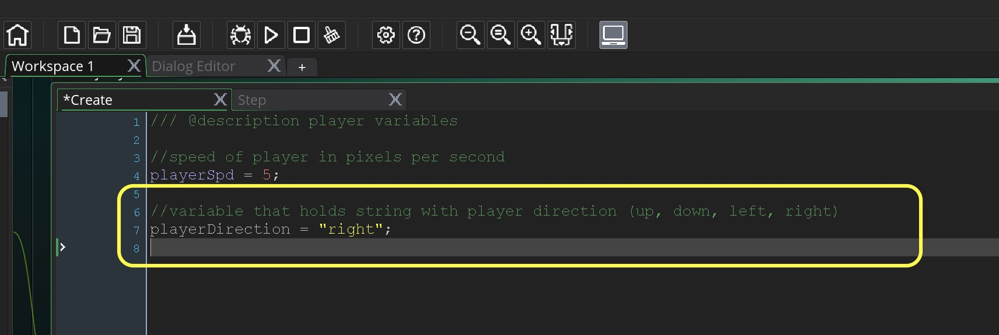

___ 
<div class = "row">
<div class="col-12">
<div markdown = "1"> 

{:start="{{ num }}"}
{{ num }}. Test it by running the game.  Fix up any errors you see.  Now lets add the animation that we want to select.  We will use the ```sprite_index``` variable for this:

> **sprite_index**

> **Stores**: Real representing sprite (can use the Sprite name)

> **Description**: This variable returns the index of the current sprite for the instance, or -1 if the instance has no sprite associated with it. You can change it to give the instance a different sprite by giving it the name of a sprite from the resource tree or by using a variable that has an externally loaded sprite indexed in it. Changing the sprite does not change the index of the currently visible frame, so if you change the sprite on frame number 3, the new sprite will be drawn with that frame visible (assuming it has the same number of frames). - [GameMaker Manual](https://docs2.yoyogames.com/source/_build/3_scripting/4_gml_reference/instances/instance_variables/sprite_index.html)
</div>
</div>
</div>

___ 
<div class = "row">
<div class="col-12 col-lg-4 align-self-center">
<div markdown = "1"> 

{:start="{{ num }}"}
{{ num }}. Now add to `ObjPlayer` **Step Event Script**:  
</div>
</div>
<div class="col-12 col-lg-8">
<div markdown = "1"> 
```c
if (keyboard_check(vk_left) && keyboard_lastkey == vk_left)
{
    x -= playerSpeed;
    sprite_index = SprPlayerLeftRight;
}
```
</div>
</div>
</div>


___ 
<div class = "row">
<div class="col-12 col-lg-4 align-self-center">
<div markdown = "1"> 

{:start="{{ num }}"}
{{ num }}. Run the game and test it.  Woops we have the player moving right as we want to share this animation:
</div>
</div>
<div class="col-12 col-lg-8">

</div>
</div>

___ 
<div class = "row">
<div class="col-12">
<div markdown = "1"> 

{:start="{{ num }}"}
{{ num }}. We will need to flip the sprite in the opposive direction.  This means we need to flip the scale on the x axis.  GameMaker provides a variable to do this with:

> **image_xscale**

> This value sets the horizontal scaling applied to the sprite that has been assigned to the current instance. A scale of 1 indicates no scaling (1:1), smaller values will scale down (0.5, for example, will half the width of the sprite), larger values will scale up and negative values will flip the sprite and scale it unless the value used is exactly -1 (in which case the sprite is just flipped about **its origin** with no scaling). - [GameMaker Manual](https://docs2.yoyogames.com/source/_build/3_scripting/4_gml_reference/instances/instance_variables/image_xscale.html)
</div>
</div>
</div>
___ 
<div class = "row">
<div class="col-12 col-lg-4 align-self-center">
<div markdown = "1"> 

{:start="{{ num }}"}
{{ num }}. Add `image_xscale = -1;` after the `sprite_index` to mirror the sprite:
</div>
</div>
<div class="col-12 col-lg-8">

</div>
</div>
 
 ___ 
<div class = "row">
<div class="col-12 col-lg-4 align-self-center">
<div markdown = "1"> 

{:start="{{ num }}"}
{{ num }}. Play the game and test it out.  OK, now there is an issue.  The sprite jumps from the right to left.
</div>
</div>
<div class="col-12 col-lg-8">

</div>
</div>

___ 
<div class = "row">
<div class="col-12 col-lg-4 align-self-center">
<div markdown = "1"> 

{:start="{{ num }}"}
{{ num }}. To fix this lets center the origin on **all** player sprites.  For example:
</div>
</div>
<div class="col-12 col-lg-8">

</div>
</div>

___ 
<div class = "row">
<div class="col-12 col-lg-4 align-self-center">
<div markdown = "1"> 

{:start="{{ num }}"}
{{ num }}. Repeat this for all other player sprites.  Now test the game again to make sure it flips directions more naturally? That's much better.  Now lets add the other three directions to `ObjPlayer` **Step Event** script: 
</div>
</div>
<div class="col-12 col-lg-8">
<div markdown = "1"> 
```c
/// @description player movement

//check if left key is the last key pressed
if (keyboard_check(vk_left) && keyboard_lastkey == vk_left)
{
    x -= playerSpd;
	sprite_index = SprPlayerLeftRight;
	image_xscale = -1;
}

//check if right key is the last key pressed
if (keyboard_check(vk_right) && keyboard_lastkey == vk_right)
{
	x += playerSpd;
	sprite_index = SprPlayerLeftRight;
}

//check if up key is the last key pressed
if (keyboard_check(vk_up) && keyboard_lastkey == vk_up)
{
	y -= playerSpd;
	sprite_index = SprPlayerUp;
}

//check if down key is the last key pressed
if (keyboard_check(vk_down) && keyboard_lastkey == vk_down)
{
	y += playerSpd;
	sprite_index = SprPlayerDown;
}
```
</div>
</div>
</div>

<br />

___ 
<div class = "row">
<div class="col-12 col-lg-4 align-self-center">
<div markdown = "1"> 

{:start="{{ num }}"}
{{ num }}. Now run the game.  The player is moving in four directions and not on diagonals.  But there are two bugs.  The player does not go back to an idle animation when it stops. It looks like our little monkey is moon walking to the right.  Also, the player does not switch to its idle animation when no button is pressed.
</div>
</div>
<div class="col-12 col-lg-8">
<div class="embed-responsive embed-responsive-16by9">
<iframe width="560" height="315" src="https://www.youtube.com/embed/qMhipZeS__k?rel=0&amp;controls=0&amp&showinfo=0&autoplay=1&version=3&loop=1&playlist=qMhipZeS__k" frameborder="0" allowfullscreen></iframe>
</div>
</div>
</div>

___ 
<div class = "row">
<div class="col-12 col-lg-4 align-self-center">
<div markdown = "1"> 

{:start="{{ num }}"}
{{ num }}. What to do?  Lets fix the second bug by adding `image_xscale = 1;` to the **right button** press in the **Step Event** on `ObjPlayer` 
</div>
</div>
<div class="col-12 col-lg-8">

</div>
</div>

___ 
<div class = "row">
<div class="col-12 col-lg-4 align-self-center">
<div markdown = "1"> 

{:start="{{ num }}"}
{{ num }}. We need to first check to see what direction the player is in.  Lets create a new variable.  We will call it `playerDirection` and we will set its default to `"right"`.  Open the **Create Event** script on `ObjPlayer` and add to the end:
</div>
</div>
<div class="col-12 col-lg-8">
<div markdown = "1"> 
``` c
//variable that holds string with player direction (up, down, left, right)
playerDirection = "right";
```
</div>
</div>
</div>



___ 
<div class = "row">
<div class="col-12 col-lg-4 align-self-center">
<div markdown = "1"> 

{:start="{{ num }}"}
{{ num }}.  For idle rather than checking to see if none of the buttons are pressed why don't we change the `if` to `else if` then the final `else` will be when no buttons are the last button pressed?  We will also set the direction of each `playerDirection`: 
</div>
</div>
<div class="col-12 col-lg-8">
<div markdown = "1"> 
``` c
/// @description player movement

//check if left key is the last key pressed
if (keyboard_check(vk_left) && keyboard_lastkey == vk_left)
{
    x -= playerSpd;
	sprite_index = SprPlayerLeftRight;
	image_xscale = -1; //make player flip mirror facing left
	playerDirection = "left";
}

//check if right key is the last key pressed
else if (keyboard_check(vk_right) && keyboard_lastkey == vk_right)
{
	x += playerSpd;
	sprite_index = SprPlayerLeftRight;
	image_xscale = 1; //make player face forward-right
	playerDirection = "right";
}

//check if up key is the last key pressed
else if (keyboard_check(vk_up) && keyboard_lastkey == vk_up)
{
	y -= playerSpd;
	sprite_index = SprPlayerUp;
	playerDirection = "up";
}

//check if down key is the last key pressed
else if (keyboard_check(vk_down) && keyboard_lastkey == vk_down)
{
	y += playerSpd;
	sprite_index = SprPlayerDown;
	playerDirection = "down";
}
```
</div>
</div>
</div>


___ 
<div class = "row">
<div class="col-12 col-lg-4 align-self-center">
<div markdown = "1"> 

{:start="{{ num }}"}
{{ num }}. Now test it and nothing of note should happen if you did it properly except we are ready for our final else where we can check which direction you are facing and select the apprpriate idle sprite as well as its xscale component.  Open `ObjPlayer` **Step Event** and add to the bottom as the final else:
</div>
</div>
<div class="col-12 col-lg-8">
<div markdown="1">
```c
else //select the correct idle animation as current button is not the last pressed
{
	if (playerDirection == "right")
	{
		sprite_index = SprPlayerLeftRightIdle;
		image_xscale = 1;
	}
	else if (playerDirection == "left")
	{
				sprite_index = SprPlayerLeftRightIdle;
		image_xscale = -1;
	}
	
	else if (playerDirection == "up")
	{
		sprite_index = SprPlayerIdleUp;
	}
	else
	{
		sprite_index = SprPlayerIdleDown;
	}
} 

```
</div>
</div>
</div>

___ 
<div class = "row">
<div class="col-12 col-lg-4 align-self-center">
<div markdown = "1"> 

{:start="{{ num }}"}
{{ num }}. Play the game and now the player's idle should work correctly.  The game should look like:
</div>
</div>
<div class="col-12 col-lg-8">
<div class="embed-responsive embed-responsive-16by9">
<iframe width="560" height="315" src="https://www.youtube.com/embed/-Icmnnbc21k?rel=0&amp;controls=0&amp&showinfo=0&autoplay=1&version=3&loop=1&playlist=-Icmnnbc21k" frameborder="0" allowfullscreen></iframe>
</div>
</div>
</div>

___ 
<div class = "row">
<div class="col-12">
<div markdown = "1"> 

{:start="{{ num }}"}
{{ num }}. That's all for this lesson.  Next project we will put together the room backbround tiling and the player animation.
</div>
</div>
</div>
[<<- Previous](SpritesAndAnimation_2.html)&nbsp;&nbsp;&nbsp;[Home](../../index.html)&nbsp;&nbsp;&nbsp;
<br />  
<br />  
<br />  
<br />  