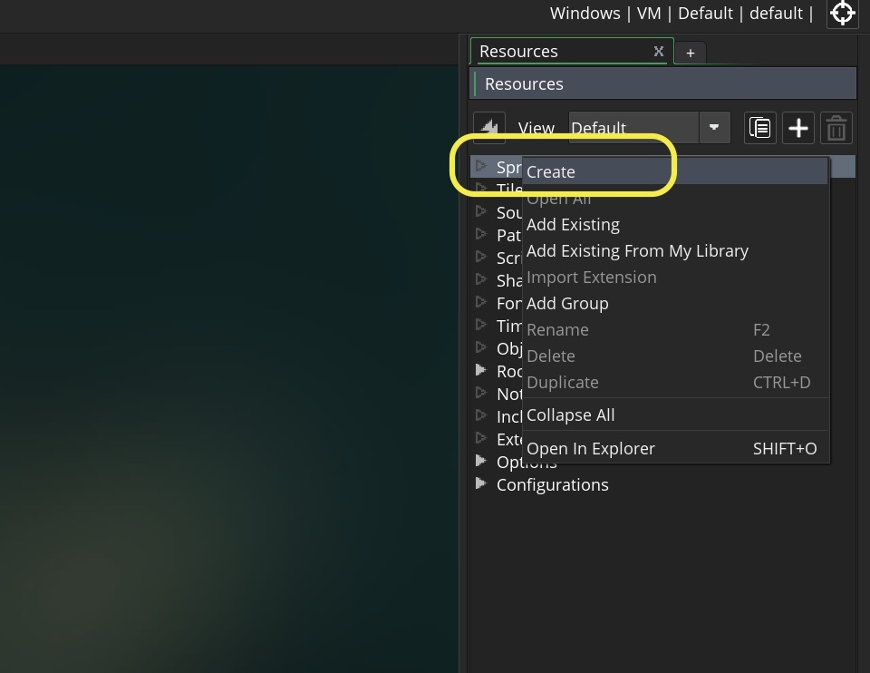

1.  To create a new **Sprite**, right click on the **Sprite** heading on the **Resources** menu on the right of the screen:

   

2.  Think about where you want the origin to be?  Are you rotating the object?  Are there specific areas of the sprite that are more relevant to the game and need to be checked.  For example the end of the barrel of a gun, the foot of a side scroller character or the enter of a character in a top down role playing game.  You want to put the origin that simplifies your scripting tasks moving forward.

