---

layout: default
title:  "Top Down Shooter Part I"
---



# Top Down Shooter
## Index
1. [Introduction](#introduction)
2. [Ship](#ship)
3. [Background Scrolling](Week-3c.md#background-scrolling)
	1.  [Constants](Week-3c.md#constant)
4. [Enemies](ScrollingShooter_7.html#enemies)


___ 

## Introduction  
{{ num }}. We will be making a version of the original **1942 Arcade Game**.  If you are not familiar with the game take a look at this playthrough of the original [1942](https://www.youtube.com/watch?v=WB67Zu421Pk). We will be bulding a We will be building a vertical slice of the game and simplifying it as there are a lot of elements to the entire game.  We will take a look at how to get part of the way there.  Here is my initial task lisk for the algorithms we need for the game:

&#9633; Load plane sprite & object and place in room <br />
&#9633; Move plane around bottom third of screen <br />
&#9633; Decide on methodology for scrolling background <br />
&#9633; Implement tiled water background scrolling <br />
&#9633; Add three islands to background and develop conveyor belt technique <br />
&#9633; Load 3 enemy plane types: Flying, Shooting Straight, Aimed Shot <br />
&#9633; Program their common behavior <br />

___ 

## Ship

&#9633; Load plane sprite & object and place in room <br />

{{ num }}. Download and unzip the game assets from our [website](WW2Assets.zip).

___ 
<div class = "row">
<div class="col-12 col-lg-4 col align-self-center">
<div markdown = "1"> 
{:start="{{ num }}"}
{{ num }}. Start a new project by firing up GameMaker and remember to set GameMakerLanguage for the project that you can call it: `WW2Shooter` 
</div>
</div>
<div class="col-12 col-lg-4">
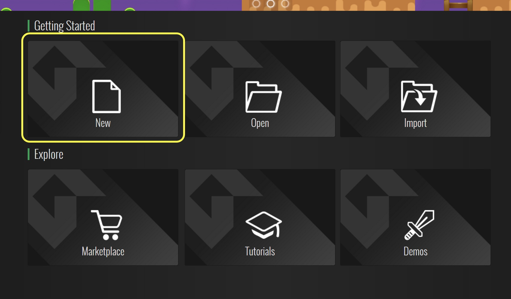
</div>
<div class="col-12 col-lg-4">
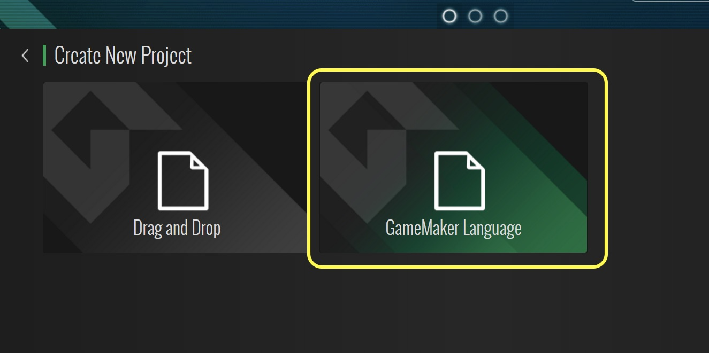
</div>
</div>


___ 
<div class = "row">
<div class="col-12 col-lg-4 col align-self-center">
<div markdown = "1"> 
{:start="{{ num }}"}
{{ num }}. I have provided two plane sprites for hou to use.  Lets create a new **[Sprite](../GameMakerActions/Sprites.html)**.  Press **Edit Image** _button_ then a menu appears on the top menu called **Images**.  Select **Images -> Import Images**.
</div>
</div>
<div class="col-12 col-lg-4">
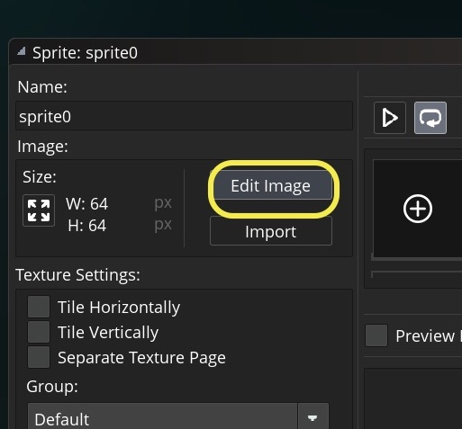
</div>
<div class="col-12 col-lg-4">
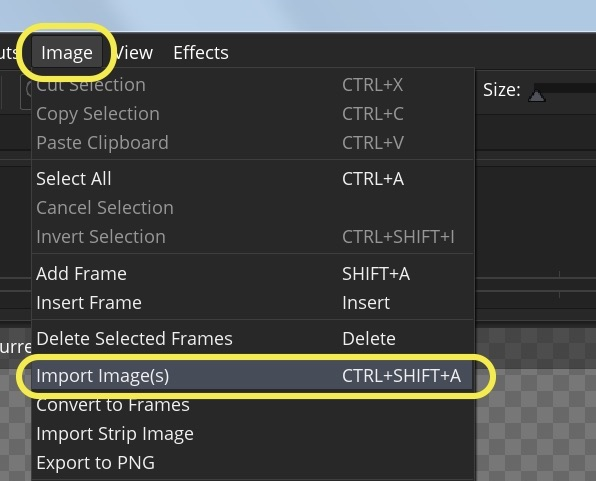
</div>
</div> 


___ 
<div class = "row">
<div class="col-12 col-lg-4 col align-self-center">
<div markdown = "1"> 
{:start="{{ num }}"}
{{ num }}. Select the two sprites in the folder you just downloaded called **PlayerPlaneM38WW2_1** & **PlayerPlaneM38WW2_2**.  It should look like:  
</div>
</div>
<div class="col-12 col-lg-8">
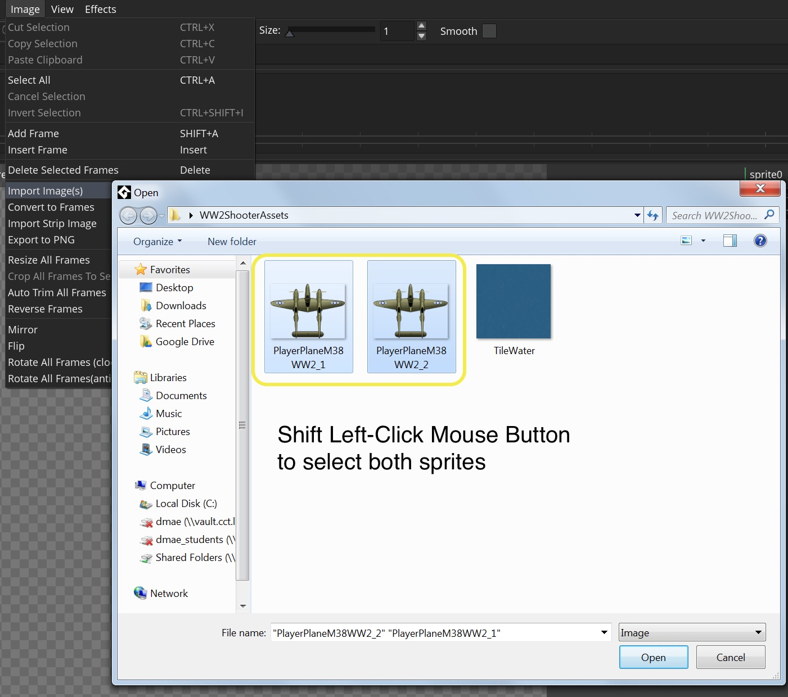
</div>
</div>


___ 
<div class = "row">
<div class="col-12 col-lg-4 col align-self-center">
<div markdown = "1"> 
{:start="{{ num }}"}
{{ num }}.  Since you don't know the size of the Sprite I provided , you need to select **Resize canvas to imported image size (174 x 128)** radio button so that the canvas can fit the entire new sprite.
</div>
</div>
<div class="col-12 col-lg-8">
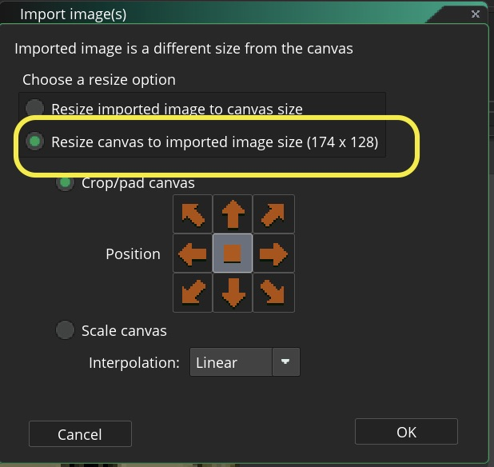
</div>
</div>


___ 
<div class = "row">
<div class="col-12 col-lg-4 col align-self-center">
<div markdown = "1"> 
{:start="{{ num }}"}
{{ num }}.  Now when importing the sprite GameMaker leaves a blank first frame. This would be bad because if you played back this sprite (try hitting the **Play Image** button that blank frame would flash.  At the top corner of the frame click the red **x** to delete that frame.
</div>
</div>
<div class="col-12 col-lg-8">
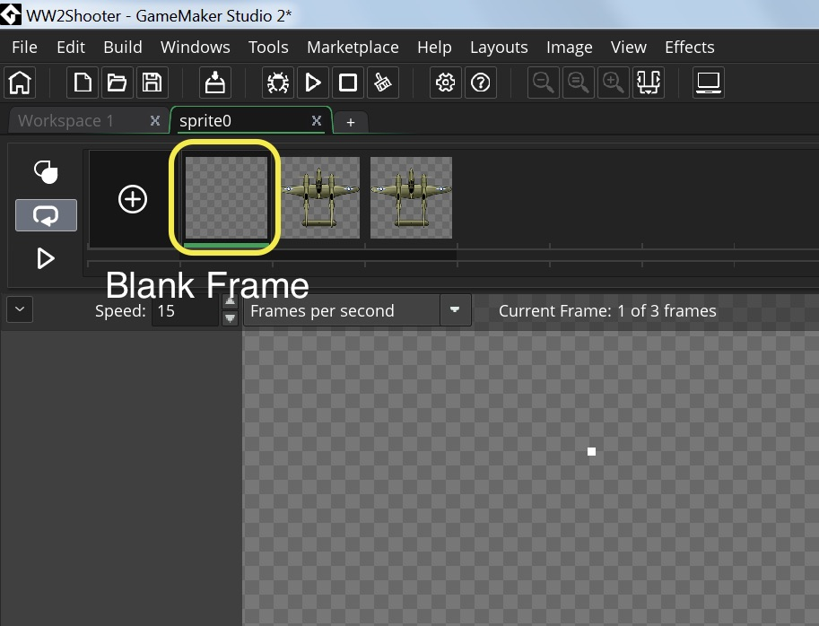
</div>
</div>
<div class = "row">
<div class="col-12 col-lg-6">
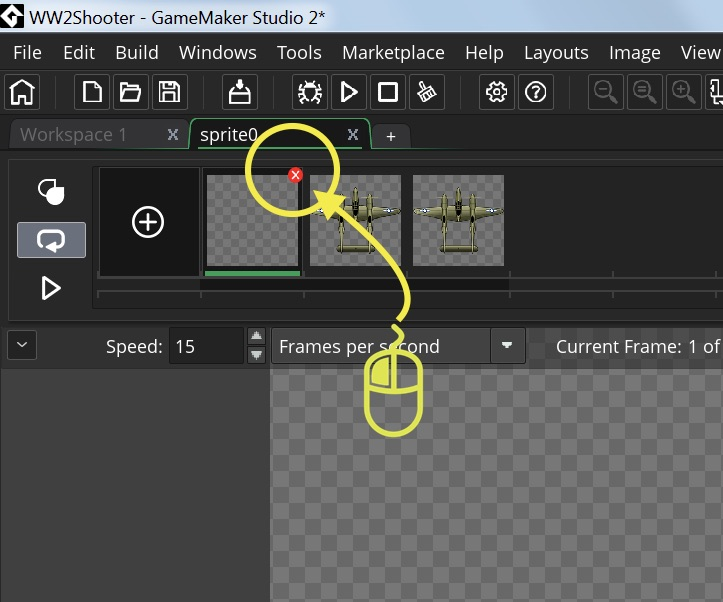
</div>
<div class="col-12 col-lg-6">
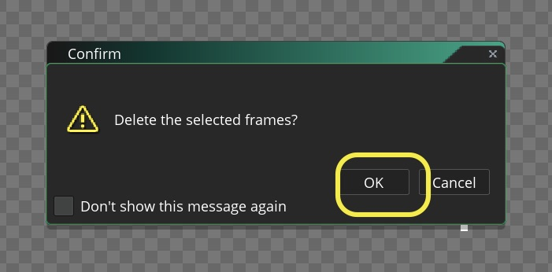
</div>
</div>


___ 
<div class = "row">
<div class="col-12 col-lg-4 col align-self-center">
<div markdown = "1"> 
{:start="{{ num }}"}
{{ num }}.  Press play and you should see the blades animate on the plane:
</div>
</div>
<div class="col-12 col-lg-8">
<div class="embed-responsive embed-responsive-16by9">
<iframe class="embed-responsive-item"  src="https://www.youtube.com/embed/nMO0Y4UETcE?rel=0&amp;controls=0&amp&showinfo=0&autoplay=1&version=3&loop=1&playlist=nMO0Y4UETcE" frameborder="0" allowfullscreen></iframe>
</div>
</div>
</div>


___ 
<div class = "row">
<div class="col-12 col-lg-4 col align-self-center">
<div markdown = "1"> 
{:start="{{ num }}"}
{{ num }}.  Call the **Sprite** `SprPlayer`. 
</div>
</div>
<div class="col-12 col-lg-8">
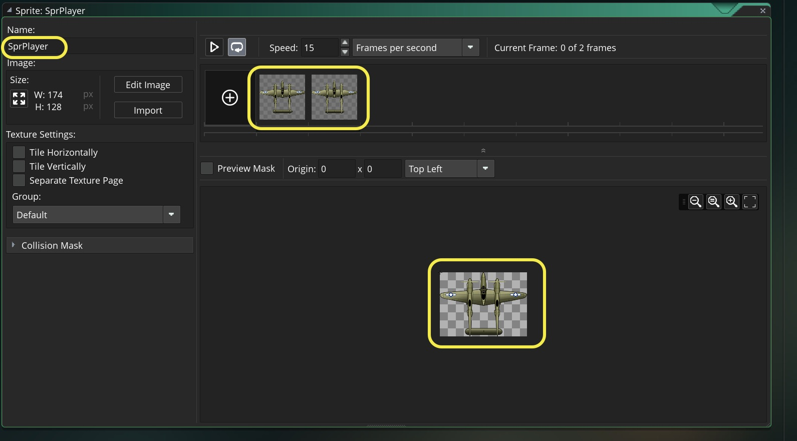
</div>
</div>


___ 
<div class = "row">
<div class="col-12 col-lg-4 col align-self-center">
<div markdown = "1"> 
{:start="{{ num }}"}
{{ num }}. Create a new **Game Object** called `ObjPlayer` and bind the **SprPlayer** you created above.
</div>
</div>
<div class="col-12 col-lg-8">
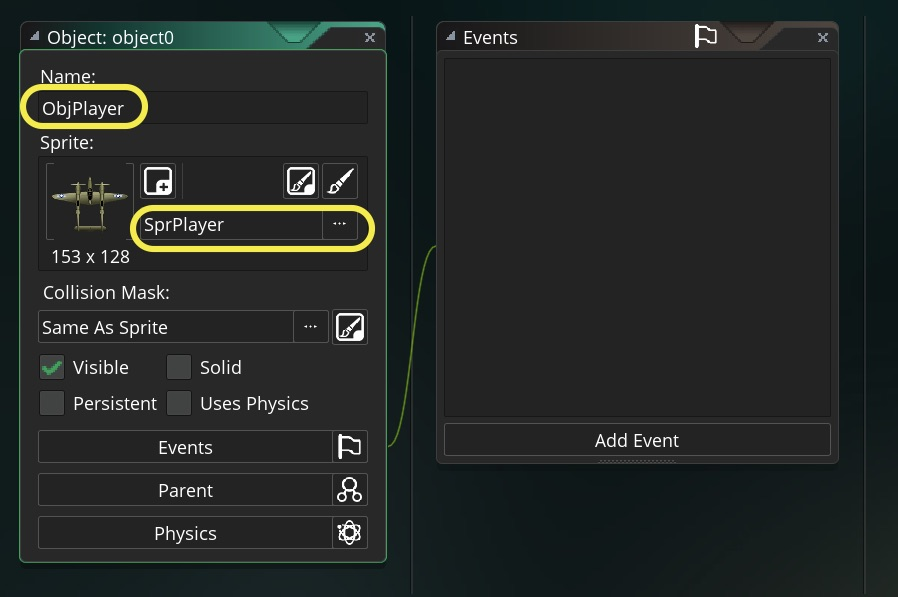
</div>
</div>  


___ 
<div class = "row">
<div class="col-12 col-lg-4 col align-self-center">
<div markdown = "1"> 
{:start="{{ num }}"}
{{ num }}. Edit the existing **_room_** and rename it to `Lvl_1`.  Now if you look at the video the game is in portrait mode.  Lets set the room dimensions to:  1000 x 1536.  Drage and drop the `ObjPlayer` into to the room from the **Resources** menu.  
</div>
</div>
<div class="col-12 col-lg-8">
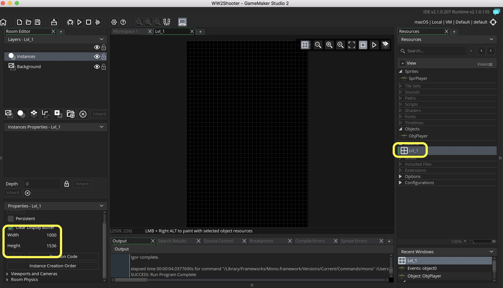
</div>
</div>


___ 
<div class = "row">
<div class="col-12 col-lg-4 col align-self-center">
<div markdown = "1"> 
{:start="{{ num }}"}
{{ num }}. Run the game and make sure that you see the plane in a dark background layer that should look like this:
</div>
</div>
<div class="col-12 col-lg-8">
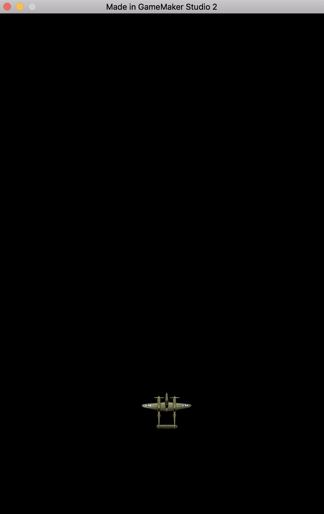
</div>
</div>


___ 
<div class = "row">
<div class="col-12 col-lg-4 col align-self-center">
<div markdown = "1"> 
{:start="{{ num }}"}
{{ num }}. OK, now we don't want to place the player plane in the room.  Since the player will die and have to reappear, we want to control the plane being added in script.

	We need to have a **Game Object** that handles the common game issues from level to level.  Create a new EMPTY **Game Object** called `ObjGameController`.  Add it to the room:  
</div>
</div>
<div class="col-12 col-lg-8">
 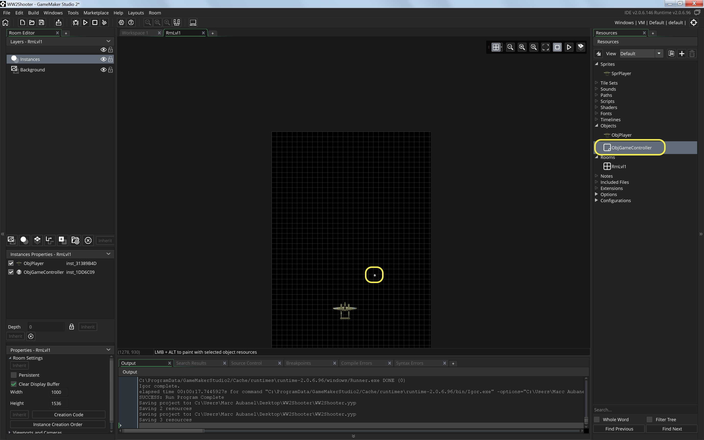
</div>
</div>


___ 
<div class = "row">
<div class="col-12 col-lg-4 col align-self-center">
<div markdown = "1"> 
{:start="{{ num }}"}
{{ num }}. Delete `ObjPlayer` from the room by clicking on it and press the **Delete** _button_ on your keyboard.  Also, rename the layer `Instances` to `Player`
</div>
</div>
<div class="col-12 col-lg-8">
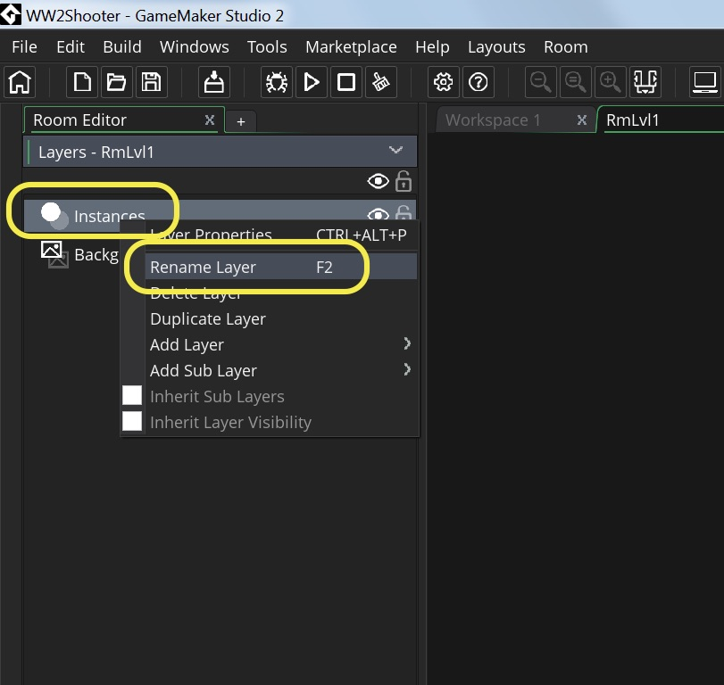
</div>
</div>


___ 
<div class = "row">
<div markdown = "1"> 
{:start="{{ num }}"}
{{ num }}. Now create a new **Create Event Script* on `ObjGameController` and add:  
</div>
<div markdown = "1"> 
```c
/// @description assign game wide variables

//Spawn player in bottom middle of room
instance_create_layer(room_width / 2 - sprite_get_width(SprPlayer) / 2, room_height - sprite_get_height(SprPlayer) * 2, "Player", ObjPlayer); 
```
</div>
</div>

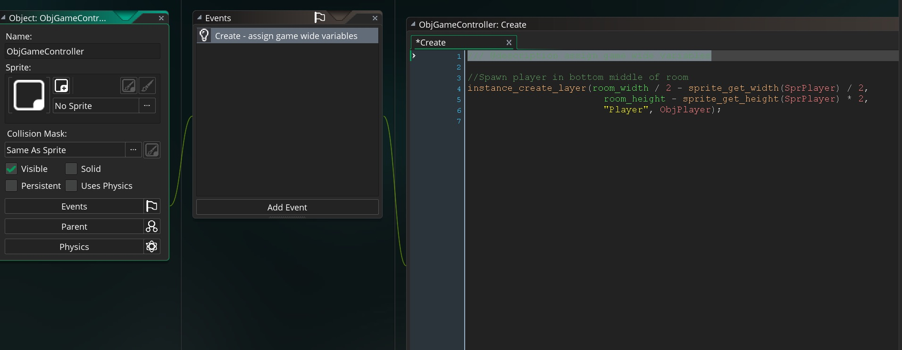
<br />

___ 
<div class = "row">
<div class="col-12 col-lg-4 col align-self-center">
<div markdown = "1"> 

{:start="{{ num }}"}
{{ num }}. Run the game and you should see a ship at the bottom of the screen that does nothing at the moment.
</div>
</div>
<div class="col-12 col-lg-8">

</div>
</div>

___ 
&#9635; ~~Load plane sprite & object and place in room~~ <br />
&#9633; Move plane around bottom third of screen <br />

<div class = "row">
<div class="col-12 col-lg-4 col align-self-center">
<div markdown = "1"> 

{:start="{{ num }}"}
{{ num }}. That's all we need to do with the game controller for now.  Lets now deal with the player plane.  Create a new **Create Event Script** on `ObjPlayer` and add:
</div>
</div>
<div class="col-12 col-lg-8">
<div markdown = "1"> 
```c
/// @description Set up variables for player WW2 ship

//speed of player
playerSpeed = 5;
```
</div>
</div>
</div>

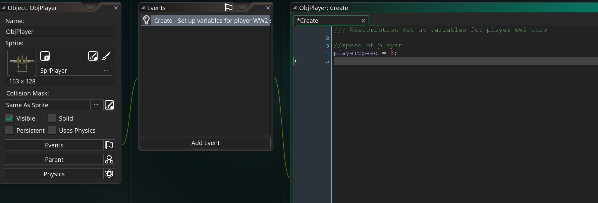
<br />

___ 
<div class = "row">
<div class="col-12 col-lg-4 col align-self-center">
<div markdown = "1"> 

{:start="{{ num }}"}
{{ num }}. Create a new **Step Event Script** on `ObjPlayer`.  We will be using `foo += 1` as an abbreviation for `foo = foo + 1`.  We will be doing this for now on as  it is quicker to type and common in many other languages.  Add to the step script:
</div>
</div>
<div class="col-12 col-lg-8">
<div markdown = "1"> 
```c
/// @description player controls for plane

//Player Controls

//move player left, right, down and up
if (keyboard_check(vk_left))
{
	x -= playerSpeed; //same as x = x - playerspeed
}
```
</div>
</div>
</div>
<div class = "row">
<div class="col-12 col-lg-6">
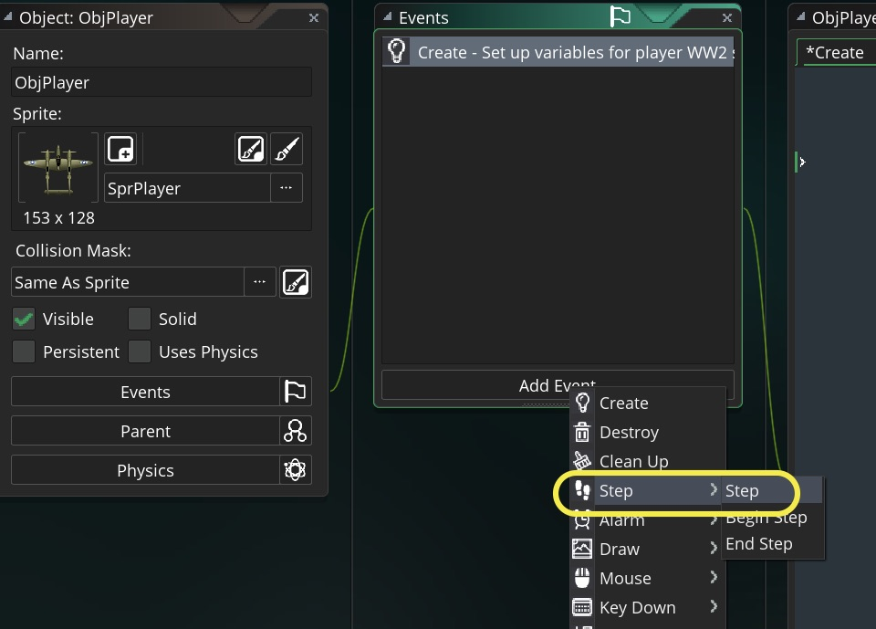
</div>
<div class="col-12 col-lg-6">
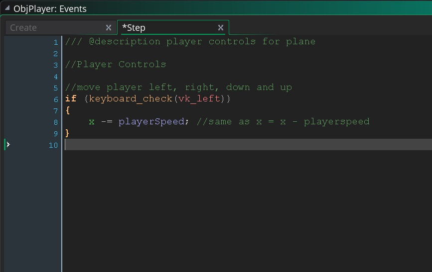
</div>
</div>

___ 
<div class = "row">
<div class="col-12 col-lg-4 col align-self-center">
<div markdown = "1"> 

{:start="{{ num }}"}
{{ num }}. Run the game, and the player should now move left (albeit they can go off screen).  Lets add to the end right, up and down:
</div>
</div>
<div class="col-12 col-lg-8">
<div markdown = "1"> 
```c
if (keyboard_check(vk_right))
{
    x += playerSpeed; //same as x = x + playerspeed
}

if (keyboard_check(vk_up))
{
    y -= playerSpeed; //same as y = y - playerspeed
}

if (keyboard_check(vk_down))
{
    y += playerSpeed; //same as y = y + playerspeed
}
```
</div>
</div>
</div>

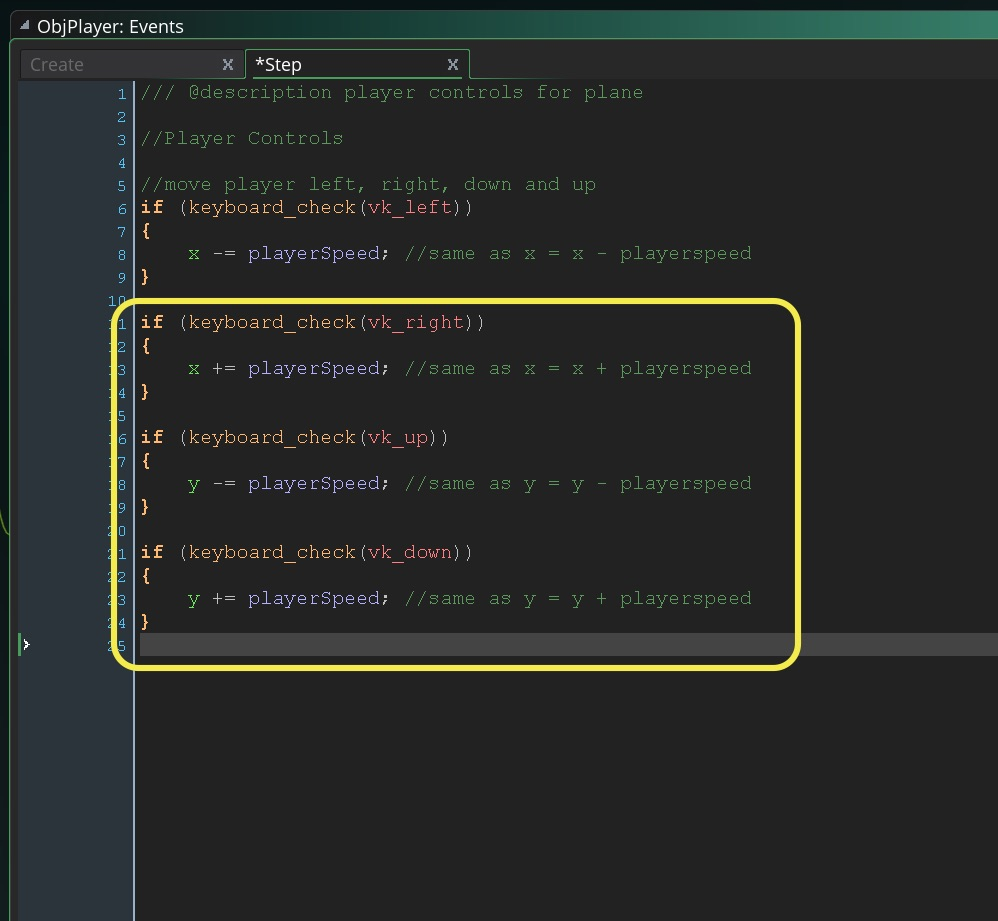

___ 
<div class = "row">
<div markdown = "1"> 

{:start="{{ num }}"}
{{ num }}.  Run the game and the player should now move in all 4 directions.  Next we will look at diagonals and its issues. 
</div>
</div>
<hr>
<br><br>
<div markdown = "1"> 
[Home](../../index.html)&nbsp;&nbsp;&nbsp; [Continue ->](ScrollingShooter_2.html)
</div>
<br />  
<br />  
<br />  
<br />  