## Damage to Player
<div class = "row">
<div class="col-12 col-lg-4 align-self-center">
<div markdown = "1"> 

{:start="{{ num }}"}
{{ num }}. Lets add the animation for the player getting hit by bullet and subtract points.  We will reuse the animation for the enemy. Open `ObjEnemyBullet` and press **Add Event -> Collision -> ObjPlayer** 
</div>
</div>
<div class="col-12 col-lg-8">
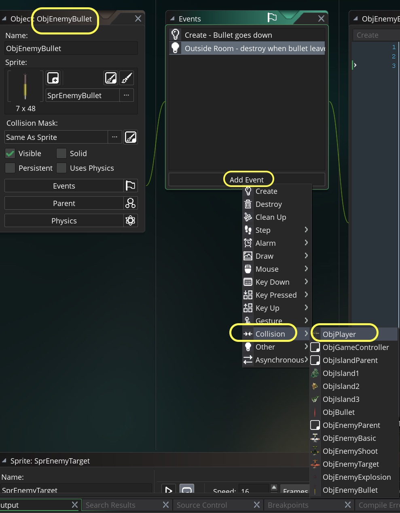
</div>
</div>

___ 
<div class = "row">
<div class="col-12 col-lg-4 align-self-center">
<div markdown = "1"> 

{:start="{{ num }}"}
{{ num }}.  Add to the script: 
</div>
</div>
<div class="col-12 col-lg-8">
<div markdown = "1"> 
```c
/// @description player getting hit by enemy bullet behavior

//attach to bullet object
instance_create_layer(other.x, other.y, "Player", ObjEnemyExplosion);

//deduct from health
ObjGameController.playerHealth -= 10;

//bullet is destroyed
instance_destroy();
```
</div>
</div>
</div>
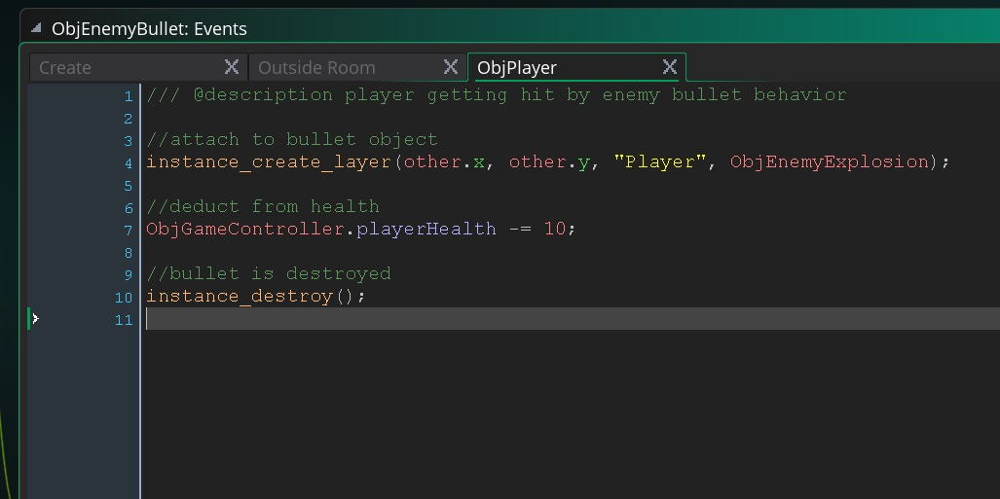

___ 
<div class="col-12 col-lg-4 align-self-center">
<div markdown = "1"> 

{:start="{{ num }}"}
{{ num }}. Test the game.  You should see:
</div>
</div>
<div class="col-12 col-lg-8">
<div class="embed-responsive embed-responsive-16by9">
<iframe class="embed-responsive-item" src="https://www.youtube.com/embed/Ani5KKVoA5c?rel=0&amp;controls=0&amp&showinfo=0&autoplay=1&version=3&loop=1&playlist=Ani5KKVoA5c" frameborder="0" allowfullscreen></iframe>
</div>
</div>
</div>

___ 
<div class = "row">
<div class="col-12 col-lg-4 align-self-center">
<div markdown = "1"> 

{:start="{{ num }}"}
{{ num }}. There are a few problems.  The animation is not big enough, it is not centered for the player plane which is larger and the explosion is not over the plane.  Lets fix the last problem first.  The enemies were one hit kills so we used the same layer as the plane.  For this explosion lets create a new **Explosion** layer on top of the **Player** layer in our room:
</div>
</div>
<div class="col-12 col-lg-8">
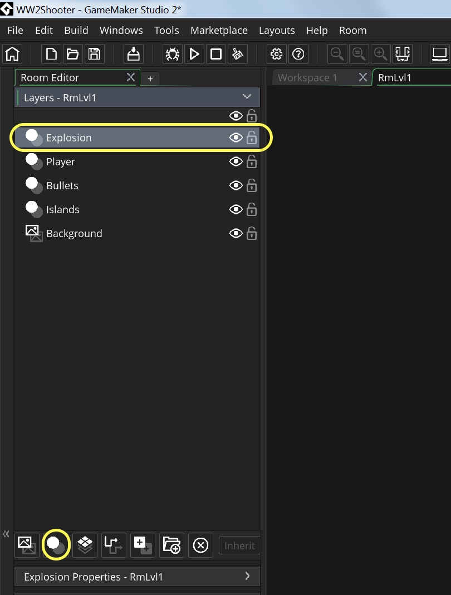
</div>
</div>

___ 
<div class = "row">
<div class="col-12 col-lg-4 align-self-center">
<div markdown = "1"> 

{:start="{{ num }}"}
{{ num }}. In `ObjEnemyBullet` **Collision Obj Player Script** change the layer from **Player** to **Explosion**:
</div>
</div>
<div class="col-12 col-lg-8">
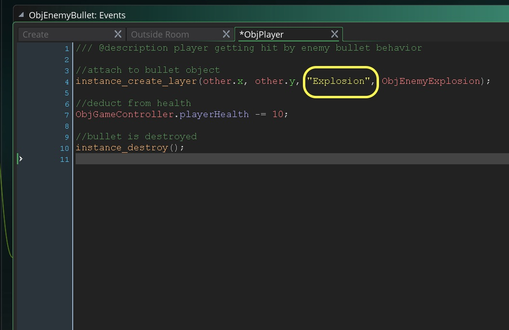
</div>
</div>

___ 
<div class = "row">
<div class="col-12 col-lg-4 align-self-center">
<div markdown = "1"> 

{:start="{{ num }}"}
{{ num }}. Run the game, you should see the explosion on top of the plane:  
</div>
</div>
<div class="col-12 col-lg-8">
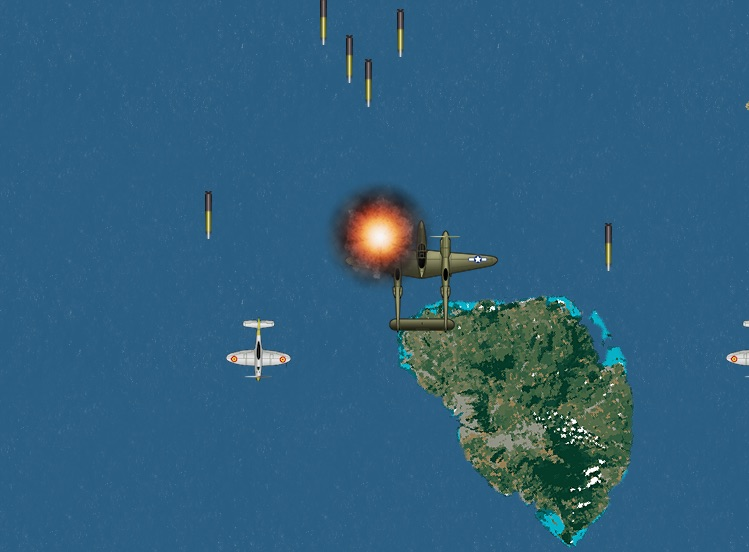
</div>
</div>

___ 
<div class="col-12">
<div markdown = "1"> 

{:start="{{ num }}"}
{{ num }}.  Now that trying to use the enemy explosion failed.  Lets import a new animation.  Here are the steps to follow:

	1. Create a new **Sprite** called `SprPlayerExplosion`
	2. Press **Edit** _button_ then select the menu **Image -> Import Strip Image** of a 4 frame 192 x 192 strip of an explosion
	3. Select **Player Explosion** and adjust the Numbers of Frames to `4` and **Frames per Row** to `4` with **Frame Width** and **Frame Height** of `192`.
	4. Play the animation and adjust the frame rate to your liking
	5. Create a new **Game Object** and call it `ObjPlayerExplosion` and link the `SprPlayerExplosion`.
	6. **Add Event -> Other -> Animation End** and add `instance_destroy();` to it
	7. Double click `ObjEnemyBullet` and in its **Collision Event** with `ObjPlayer` change `instance_create_layer(other.x, other.y, "Explosion", ObjEnemyExplosion)` to `instance_create_layer(other.x, other.y, "Explosion", ObjPlayerExplosion);`
</div>
<div class="col-12">
<div class="embed-responsive embed-responsive-16by9">
<iframe class="embed-responsive-item"  src="https://www.youtube.com/embed/UIJKsb-j0BA?rel=0&amp;controls=0&amp&showinfo=0&autoplay=1&version=3&loop=1&playlist=UIJKsb-j0BA" frameborder="0" allowfullscreen></iframe>
</div>
</div>
</div>

___ 
<div class = "row">
<div class="col-12 col-lg-4 align-self-center">
<div markdown = "1"> 

{:start="{{ num }}"}
{{ num }}. OK that's much better.  There is a small problem that we should fix before looking at planes running into players and lives.  The explosion is not centered very well on the player.  
</div>
</div>
<div class="col-12 col-lg-8">
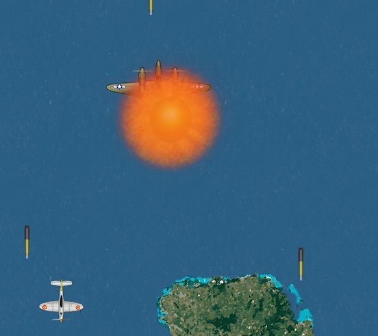
</div>
</div>

___ 
<div class = "row">
<div class="col-12 col-lg-4 align-self-center">
<div markdown = "1"> 

{:start="{{ num }}"}
{{ num }}.  Open `ObjPlayerExplosion` and add a **Create Event Script** then:
</div>
</div>
<div class="col-12 col-lg-8">
<div markdown = "1"> 
``` c
/// @description adjust centering

x -= 16;
y -= 32;
```
</div>
</div>
</div>

___ 
<div class="col-12">
<div markdown = "1"> 

{:start="{{ num }}"}
{{ num }}. OK, play test the game and double check the centering.  Tune the health damage to your liking.  Now what should happen when a plane runs into the player?  Should the damage be greater?  
</div>
</div>

___ 
<div class = "row">
<div class="col-12 col-lg-4 align-self-center">
<div markdown = "1"> 
{:start="11"}
11. Double click on `ObjEnemyParent` and create a new **Collision Event Script** by pressing **Add Event -> Collision -> ObjPlayer** and add:
</div>
</div>
<div class="col-12 col-lg-8">
<div markdown = "1"> 
```
/// @description logic for collising with player

ObjGameController.playerHealth -= 50;

instance_create_layer(x, y, "Player", ObjEnemyExplosion);
instance_create_layer(other.x, other.y, "Explosion", ObjPlayerExplosion);

instance_destroy();
```
</div>
</div>
</div>
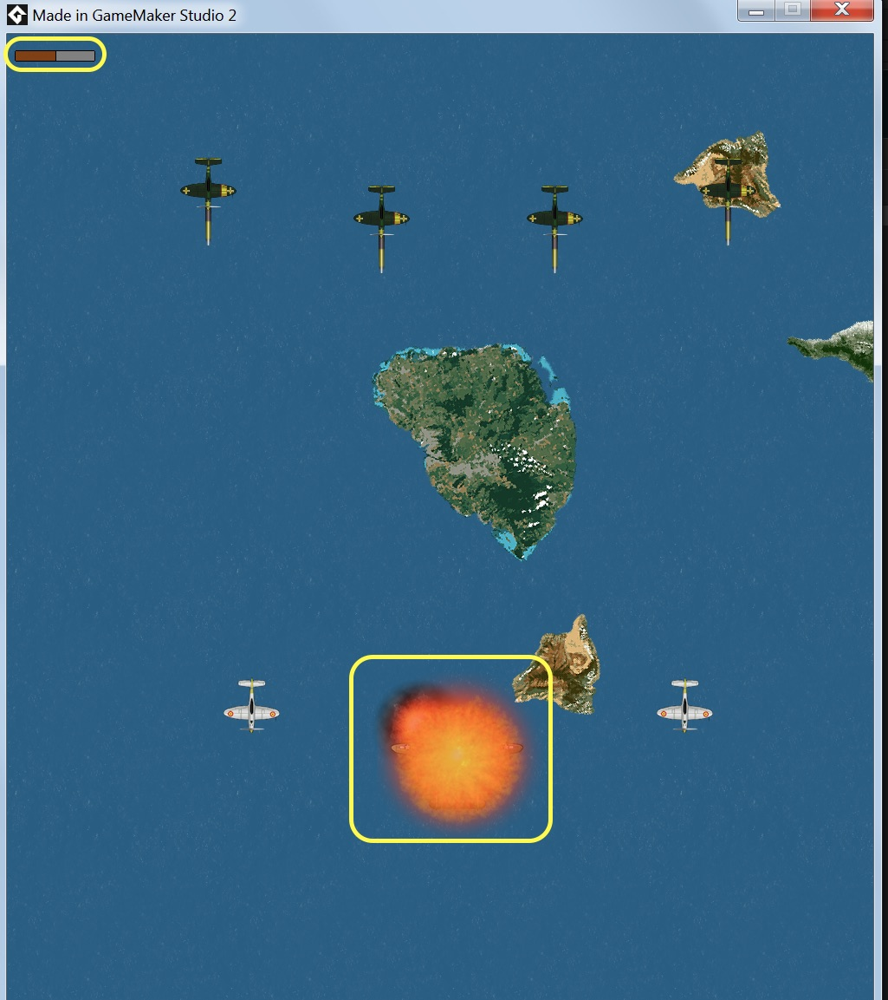

___ 
<div class="col-12">
<div markdown = "1"> 

{:start="{{ num }}"}
{{ num }}. Now run the game and test it. I still don't like something about the enemy behavior.  The shooters all shoot at the same time making it either easy to predict or difficult to avoid large waves like the targeting enemy.  Lets randomize their timer starts.  I also don't like how the targeting enemies shoot backwards so we are going to make sure the `y` of the `ObjEnemy` is less than the `y` of the `ObjPlayer` when firing.
</div>
</div>

___ 
<div class = "row">
<div class="col-12 col-lg-4 align-self-center">
<div markdown = "1"> 

{:start="{{ num }}"}
{{ num }}. Now every plane's timer starts at 0.  What we can do is randomly start anywhere between 0 and the rate of fire set.  Let's look at the random timer on the targeting plane.  Remember that you have to initialize `rateOfFire` before setting the `timer`.  Open up `ObjEnemyTarget` and `ObjEnemyShoot` **Create Event Scripts** and alter the line `timer = 0` to: 
</div>
</div>
<div class="col-12 col-lg-8">
<div markdown = "1"> 
```c
timer = random(rateOfFire);
```
</div>
</div>
</div>
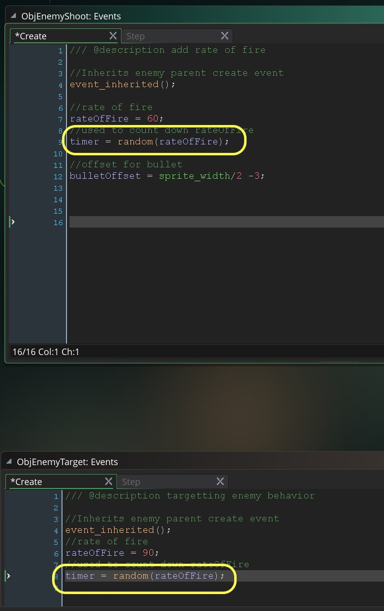

___ 
<div class = "row">
<div class="col-12 col-lg-4 align-self-center">
<div markdown = "1"> 

{:start="{{ num }}"}
{{ num }} Try running the game.  What happens? Hmmm, the plane doesn't fire anymore.  Lets change to the add a `show_debug_message(timer);` to the bottom of the script on `ObjEnemyShoot`.  Run the game and look at the debug message:
</div>
</div>
<div class="col-12 col-lg-8">
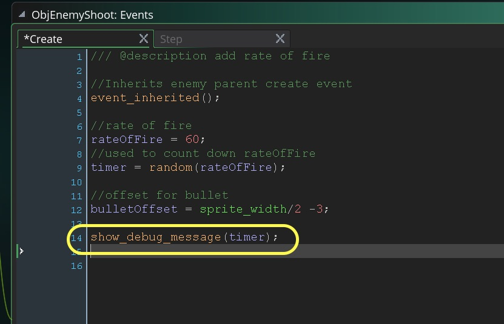
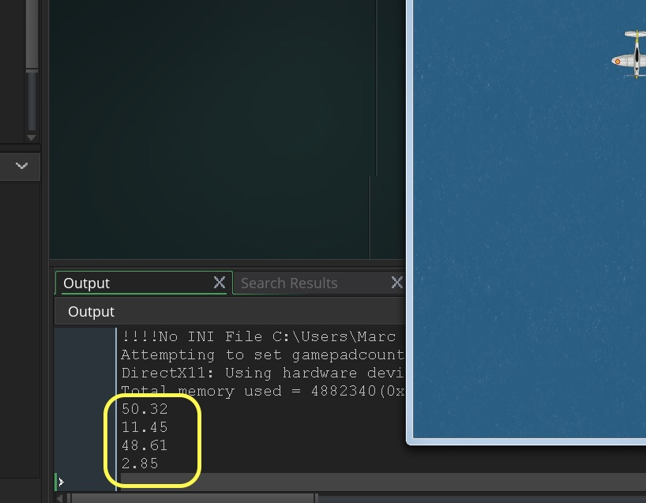
</div>
</div>

___ 
<div class="col-12">
<div markdown = "1"> 

{:start="{{ num }}"}
{{ num }}. Can you see what is happening here?  The `random (int)` is creating a fractional number.  In our algorithm we have: `if (timer == rateOfFire)`.  Now rateOfFire is a whole number and timer is fractional.  Unless the fractional rnadom rumber hits a `.0` this will never be true and the plane won't fire. Here comes the GameMaker provided function **_floor(n)_**:  

> **floor (n)**<br><br>**Returns**: Real<br><br>**Description**: "Returns the floor of n, that is, n rounded down to an integer. This is similar to the round() function, but it only rounds down, no matter what the decimal value, so floor(5.99999) will return 5, as will floor(5.2), floor(5.6457) etc..." - [GameMaker Manual](https://docs2.yoyogames.com/source/_build/3_scripting/4_gml_reference/maths/real%20valued%20functions/floor.html)
</div>
</div>

___ 
<div class = "row">
<div class="col-12 col-lg-4 align-self-center">
<div markdown = "1"> 

{:start="{{ num }}"}
{{ num }} Lets remove `show_debug_message` and change the lines in `ObjEnemyShoot` and `ObjEnemyTarget`.  Open up their **Create Event Script** and alter the line ``` timer = random(rateOfFire); ``` to:  
</div>
</div>
<div class="col-12 col-lg-8">
<div markdown = "1"> 
```c
timer = floor (random(rateOfFire));
```
</div>
</div>
</div>
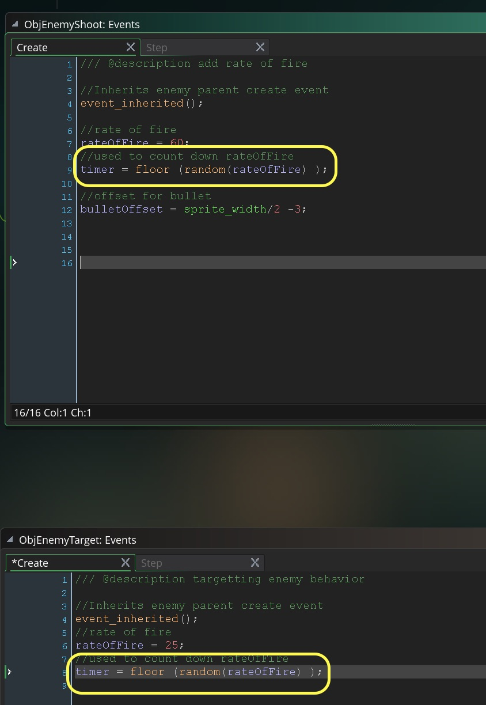

___ 
<div class = "row">
<div class="col-12 col-lg-4 align-self-center">
<div markdown = "1"> 

{:start="{{ num }}"}
{{ num }}. Now run the game and it should look something like:
</div>
</div>
<div class="col-12 col-lg-8">
<div class="embed-responsive embed-responsive-16by9">
<iframe  class="embed-responsive-item"  src="https://www.youtube.com/embed/mAoN0QwjRBg?rel=0&amp;controls=0&amp&showinfo=0&autoplay=1&version=3&loop=1&playlist=mAoN0QwjRBg" frameborder="0" allowfullscreen></iframe>
</div>
</div>
</div>

___ 
<div class = "row">
<div class="col-12 col-lg-4 align-self-center">
<div markdown = "1"> 

{:start="{{ num }}"}
{{ num }}. OK, now lets stop the targeting plane from shooting backwards.  All we need to do is make sure that before firing that the enemy is above the player.  We can just look to see if it's `y` is less than `ObjPlayer.y`.  Edit `ObjEnemyTarget` and `ObjEnemyShoot` **Step Event Script** and replace `if (timer == rateOfFire)` with `if (timer == rateOfFire && y < ObjPlayer.y)`
</div>
</div>
<div class="col-12 col-lg-8">
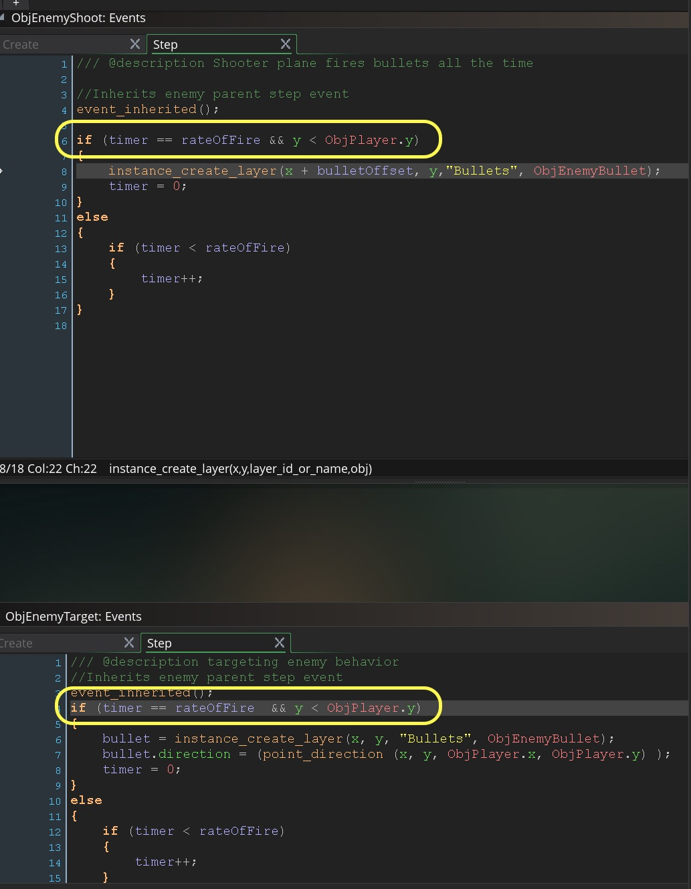
</div>
</div>

___ 
<div class="col-12">
<div markdown = "1"> 

{:start="{{ num }}"}
{{ num }} Next up we will deal with the player dying when its health runs out. 
</div>
</div>

___ 

<br><br>
[<- Previous](ScrollingShooter_9.html)&nbsp;&nbsp;&nbsp;[Home](../../index.html)&nbsp;&nbsp;&nbsp; [Continue ->](ScrollingShooter_11.html)
<br />  
<br />  
<br />  
<br />  