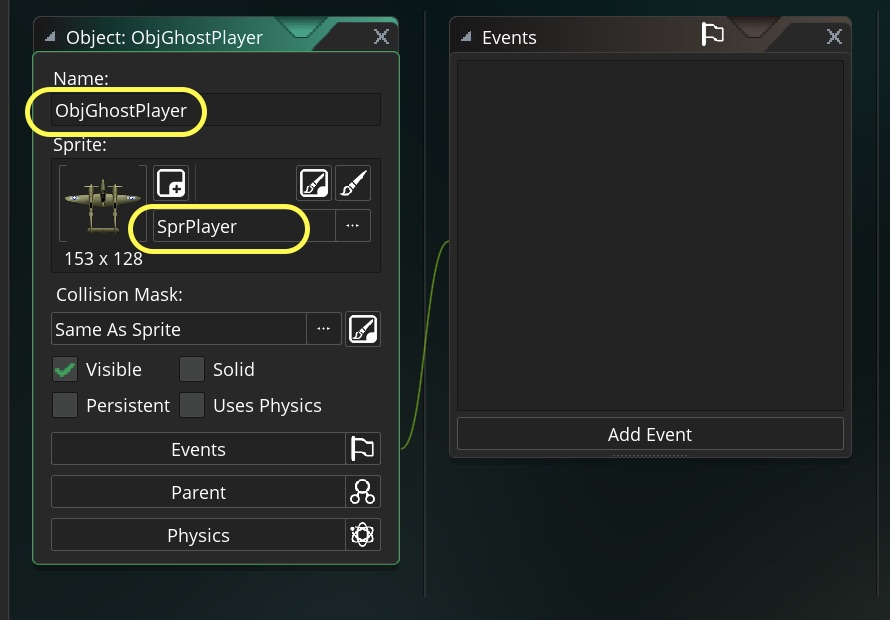
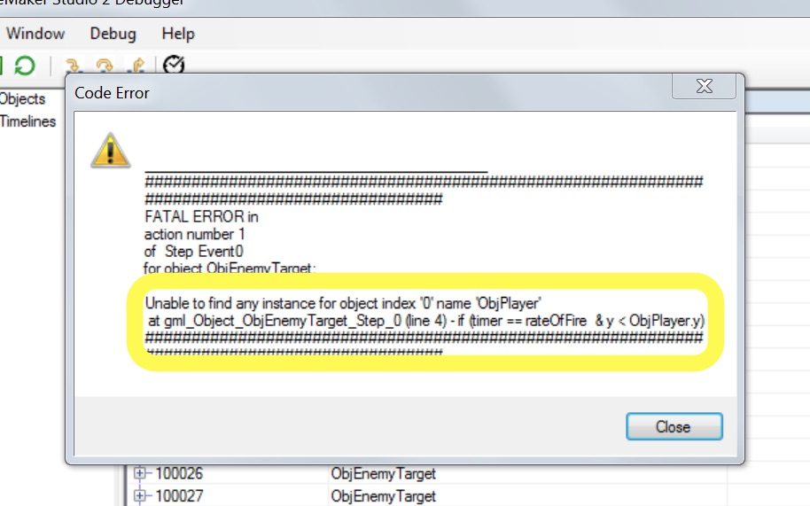
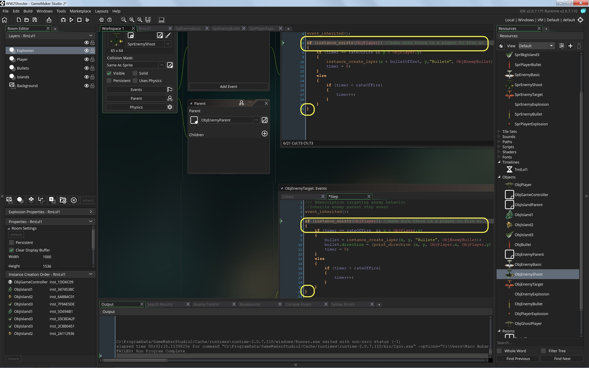
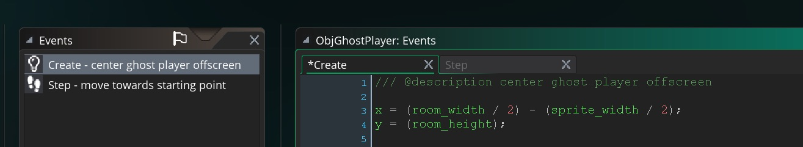
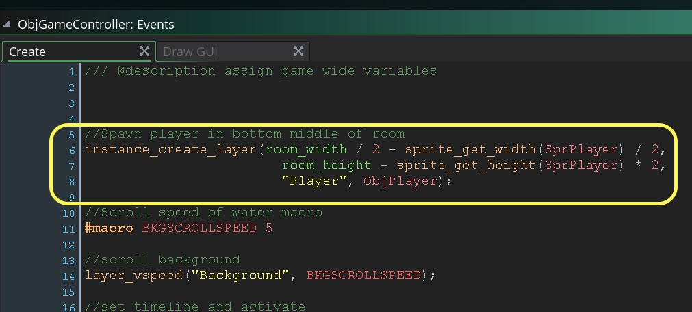
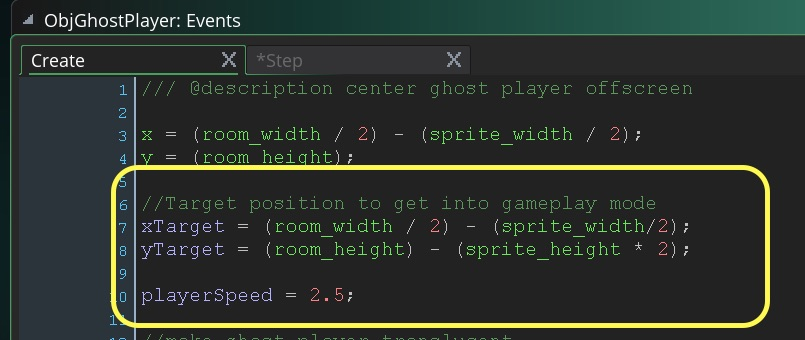
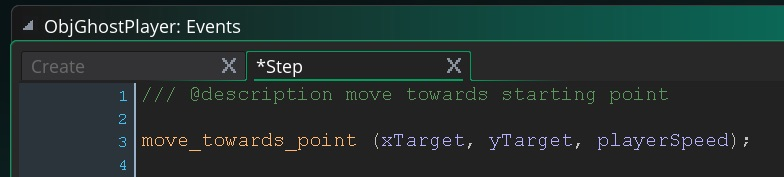
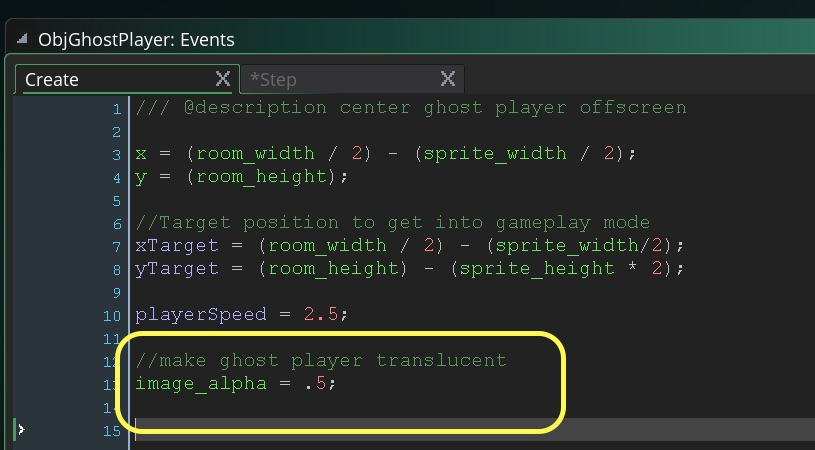

## Ghost Mode

<div class="col-12">
<div markdown = "1"> 

{:start="{{ num }}"}
{{ num }}. Now we want the plane when it runs out of health to:
	1. Destroy player plane
	2. Animate new transluscent ghost plane offscreen bottom center
	3. Move ghost plane upwards
	4. Do not take damage, do not take player control
	5. After returning to starting point make player solid and give control back to gameplayer and give the plane 100% health again.
</div>
</div>

___ 
<div class="col-12">
<div markdown = "1"> 

{:start="{{ num }}"}
{{ num }}. Now to do this we will need to create a finite state machine.  What is a finite state machine?  It is the logical state of any object.  So a door can have 4 states.  It can be closed, open (to more or less of a degree) or is opening or closing.  Our **_ObjPlayer_** will have two states: **Active In Game** and **Out of Life Ghost Mode**.
</div>
</div>

___ 
<div class = "row">
<div class="col-12 col-lg-4 align-self-center">
<div markdown = "1"> 

{:start="{{ num }}"}
{{ num }}. For a very simple state machine, Create a new object for each state.  We already have a `ObjPlayer` for the **Active In Game** state.  Create a new **Game Object**, bind `SprPlayer` to it and call it `ObjGhostPlayer`
</div>
</div>
<div class="col-12 col-lg-8">

</div>
</div>

___ 
<div class="col-12">
<div markdown = "1"> 

{:start="{{ num }}"}
{{ num }}.  We need to switch the `ObjPlayer` game object to `ObjGhostPlayer` when player health is less or equal to zero. GameMaker provides a function to do this for us:

> **Instance Change(obj, perf)**<br><br>You can use this function to change one instance of an object into another instance of a different object, and while doing so decide whether to perform the initial instances Destroy and Clean Up Events and the new instances Create Event. In this way, you can have (for example) a bomb change into an explosion - in which case the "perf" argument would probably be true as you would want the bomb to perform its Destroy Event and Clean Up Event, as well as the explosion to perform its Create Event - or you could have your player character change into a different one - in which case the "perf" argument would probably be false as you do not want the instances to perform their Create and Destroy/Clean Up events.<br><br>It is worth noting that changing the instance means that you should perform no further actions with that instance until the next step, in particular trying to access variables etc... as that will cause an error. Basically, you change the instance but it is not actually available until the end of the current step, so to access any of the variables it contains directly (for example, calling obj_Changed.x) will not work.
</div>
</div>

___ 
<div class = "row">
<div class="col-12 col-lg-4 align-self-center">
<div markdown = "1"> 

{:start="{{ num }}"}
{{ num }}. We need to add to the `ObjPlayer` **Step Event Script** logic to switch the game object to `ObjGhostPlayer`.  Add at the bottom:
</div>
</div>
<div class="col-12 col-lg-8">
<div markdown = "1"> 
``` c
//Go into Ghost Mode if player is out of health
if (ObjGameController.playerHealth < 0)
{
instance_change(ObjGhostPlayer, true);
}
```
</div>
</div>
</div>

___ 
<div class = "row">
<div class="col-12 col-lg-4 align-self-center">
<div markdown = "1"> 

{:start="{{ num }}"}
{{ num }}. Play the game and test it.  Woops, I see it crashes.  Let us look at the error message:
</div>
</div>
<div class="col-12 col-lg-8">

</div>
</div>

___ 
<div class="col-12">
<div markdown = "1"> 

{:start="{{ num }}"}
{{ num }}.  That last change caused an issue.  We are in both our `ObjEnemyTarget` and `ObjEnemyShoot` looking for whether `ObjPlayer.y` is lower.  When the player doesn't exist (we changed it to `ObjPlayerGhost`).<br><br>We need to add a check to make sure that the player still exists before performing this check.  What we need to do is look for instance_exists.<br>

> **instance_exists (obj)**<br><br>This function can be used in two ways depending on what you wish to check. You can give it an object_index to check for, in which case this function will return true if any active instances of the specified object exist in the current room, or you can also supply it with an instance id, in which case this function will return true if that specific instance exists and is active in the current room. [GameMaker Manual](https://docs2.yoyogames.com/source/_build/3_scripting/4_gml_reference/instances/instance_functions/instance_exists.html)
</div>
</div>

___ 
<div class = "row">
<div class="col-12 col-lg-4 align-self-center">
<div markdown = "1"> 

{:start="{{ num }}"}
{{ num }}. Open `ObjEnemyTarget` and `ObjEnemyShoot` and wrap the entire firing function in a check to see if there is even a player to fire at:
</div>
</div>
<div class="col-12 col-lg-8">
<div markdown = "1"> 
```c
event_inherited();

if (instance_exists(ObjPlayer)) //make sure player is not dead
{
	//....code goes here for firing
}
```
</div>
</div>
</div>



___ 
<div class = "row">
<div class="col-12 col-lg-4 align-self-center">
<div markdown = "1"> 
{:start="9"}
9. Now play the game.  OK, no more crashing but you lose control when the player turns into Ghost Mode.  That makes sense as we have no scripts attached to this Game Object.  To test that it works properly run in debug mode and look for the changed object:
</div>
</div>
<div class="col-12 col-lg-8">
<div class="embed-responsive embed-responsive-16by9">
<iframe class="embed-responsive-item" src="https://www.youtube.com/embed/LiA0bNL15K0?rel=0&amp;controls=0&amp&showinfo=0&autoplay=1&version=3&loop=1&playlist=LiA0bNL15K0" frameborder="0" allowfullscreen></iframe>
</div>
</div>
</div>

___ 
<div class = "row">
<div class="col-12 col-lg-4 align-self-center">
<div markdown = "1"> 

{:start="{{ num }}"}
{{ num }}. We need to move the start position for the `ObjGhostPlane` to be offscreen and then have it go back to its starting position. First lets move the player offscreen. Create a new **Create Event Script** for 'ObjGhostPlane' and add: 
</div>
</div>
<div class="col-12 col-lg-8">
<div markdown = "1"> 
``` c
/// @description center ghost player offscreen

x = (room_width / 2) - (sprite_width / 2);
y = (room_height); 
```
</div>
</div>
</div>


___ 
<div class = "row">
<div class="col-12 col-lg-4 align-self-center">
<div markdown = "1"> 

{:start="{{ num }}"}
{{ num }}. Don't test it yet as the player will not do anything.  We need to have the plane get back to its starting position that you set in `ObjGameController` when you spawned the player:
</div>
</div>
<div class="col-12 col-lg-8">

</div>
</div>

___ 
<div class = "row">
<div class="col-12 col-lg-4 align-self-center">
<div markdown = "1"> 

{:start="{{ num }}"}
{{ num }}. Set a target position for the plane to move towards and a speed for it to move at.  In `ObjGhostPlayer` **Create Event** add to the bottom: 
</div>
</div>
<div class="col-12 col-lg-8">
<div markdown = "1"> 
```c
//Target position to get into gameplay mode
xTarget = (room_width / 2) - (sprite_width/2);
yTarget = (room_height) - (sprite_height * 2); 

playerSpeed = 2.5;
```
</div>
</div>
</div>

  
___ 
<div class="col-12">
<div markdown = "1"> 

{:start="{{ num }}"}
{{ num }}. We are going to use a new GML function to move the Plane from offscreen to the starting target set:

> **move_towards_point( x, y, sp )**
<div class="table table-striped">
<div markdown = "1">
> | Argument | Description |
| -------- | -------- | 
| x | The x position of the point to move towards. | 
| y | The y position of the point to move towards. |
| sp | The speed to move at in pixels per second. |
</div>
</div>
> **Returns**: N/A (void)<br><br>**Description**: "This function simply tells the instance running the code to move towards a set point at a set speed. Bear in mind that it is up to you to tell it what to do once it gets there, as it won't just stop by itself. This means that you can get a "vibrating" instance as it moves (for example) 3 pixels forward, overshoots the x/y target position by 2, then moves 3 pixels back again, overshooting the target point by one and so on... There are a number of ways that this can be avoided, for example using distance_to_point to see how far from the specified location the instance is before moving. <br><br>Note: this function sets the speed of the instance, so even if you stop using this code, the instance will keep moving in the previous direction, so it is necessary to set the instance speed to 0 if you wish it to stop. See the code example below.<br><br>Example:<br><br>`if (point_distance(x, y, xTarget, yTarget) > 5)`<br>`{` &nbsp; &nbsp; &nbsp; &nbsp; <br>`move_towards_point(xTarget, yTarget, 5);`<br>`}`<BR>`else speed = 0;`<br><br>The above code will move the instance towards the position of the instance indexed in the variable "target" at a speed of 5 pixels per step. Once it reaches that position the speed is set to 0. " - [GameMaker Manual](https://docs2.yoyogames.com/source/_build/3_scripting/4_gml_reference/movement%20and%20collisions/movement/move_towards_point.html)
</div>
</div>

___ 
<div class = "row">
<div class="col-12 col-lg-4 align-self-center">
<div markdown = "1"> 

{:start="{{ num }}"}
{{ num }}. Create a new **Step -> Step Event Script** on `ObjGhostPlayer` and add:
</div>
</div>
<div class="col-12 col-lg-8">
<div markdown = "1"> 
```c 
/// @description move towards starting point

move_towards_point (xTarget, yTarget, playerSpeed);
```
</div>
</div>
</div>

  
___ 
<div class = "row">
<div class="col-12 col-lg-4 align-self-center">
<div markdown = "1"> 

{:start="{{ num }}"}
{{ num }}. Now we want to make the player translucent so that we know that the user is not in control.  We can adjust the [image_alpha](https://docs2.yoyogames.com/source/_build/3_scripting/4_gml_reference/instances/instance_variables/image_alpha.html).  Add to the bottom of the `ObjGhostPlayer` **Create Event Script**.  Now I played with the amount and I like 50%, which in the the way they normalize alpha between `0` and `1`, I set it to `.5`.
</div>
</div>
<div class="col-12 col-lg-8">
<div markdown = "1"> 
``` c
//make ghost player translucent
image_alpha = .5;
```
</div>
</div>
</div>

 
___ 
<div class = "row">
<div class="col-12 col-lg-4 align-self-center">
<div markdown = "1"> 

{:start="{{ num }}"}
{{ num }}. Now your game should look like this when you run it:
</div>
</div>
<div class="col-12 col-lg-8">
<div class="embed-responsive embed-responsive-16by9">
<iframe class="embed-responsive-item" src="https://www.youtube.com/embed/RpICpZBPNx4?rel=0&amp;controls=0&amp&showinfo=0&autoplay=1&version=3&loop=1&playlist=RpICpZBPNx4" frameborder="0" allowfullscreen></iframe>
</div>
</div>
</div>

___ 
<div class="col-12">
<div markdown = "1"> 

{:start="{{ num }}"}
{{ num }}. You notice that at the end the player vibrates trying to get back to its destination.  Now we need to change it back to a regular player mode on the next page.
</div>
</div>
___ 

<br><br>
[<- Previous](ScrollingShooter_10.html)&nbsp;&nbsp;&nbsp;[Home](../../index.html)&nbsp;&nbsp;&nbsp; [Continue ->](ScrollingShooter_12.html)
<br />  
<br />  
<br />  
<br />  