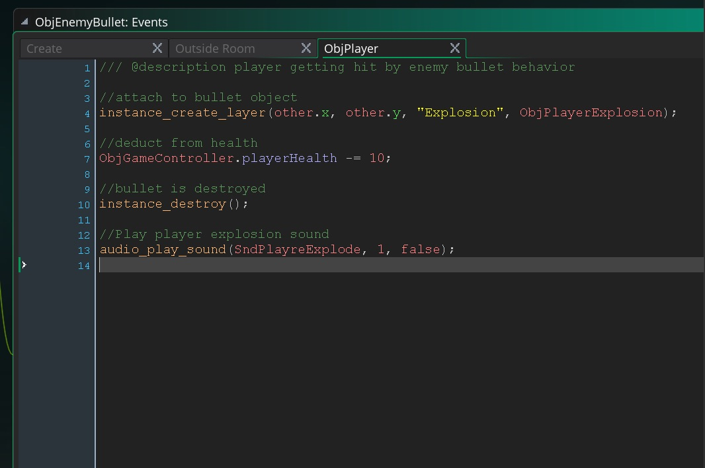

___ 
<div class = "row">
<div class="col-12 col-lg-4 align-self-center">
<div markdown = "1"> 

{:start="{{ num }}"}
{{ num }}. To switch back to player mode we call look to see if `(y == yTarget)` by adding to `ObjGhostPlayer` **Step Event Script**
</div>
</div>
<div class="col-12 col-lg-8">
<div markdown = "1"> 
``` c
//when player gets back to starting point change back to active player state
if (y == yTarget)
{
    instance_change(ObjPlayer, true);
}
```
</div>
</div>
</div>

___ 
<div class = "row">
<div class="col-12 col-lg-4 align-self-center">
<div markdown = "1"> 

{:start="{{ num }}"}
{{ num }}. Play the game and test it out.  This might be different based on your settings but for me, this does not work. Let's put in a test to see what is happening by adding:
</div>
</div>
<div class="col-12 col-lg-8">
<div markdown = "1"> 
``` c
show_debug_message("y is: " + string(y) + " - yTarget is: " + string(yTarget));
```
</div>
</div>
</div>

<div class="row">
<div class="col">

</div>
<div class="col">

</div>
</div>

___ 
<div class="col-12 ">
<div markdown = "1"> 

{:start="{{ num }}"}
{{ num }}. So the player is within his speed in distance to this point.  So we are going to have to look for the distance between these two points and see if it is less than the player speed we set (which is half the regular speed of the player).  Fortunately GameMaker provides a function for this:

> **distance_to_point(x, y)**<br><br>This function calculates the distance from the edge of the bounding box of the calling instance to the specified x/y position in the room, with the return value being in pixels. Note that if the calling object have no sprite or no mask defined, the results will be incorrect. [GameMaker Manual](https://docs2.yoyogames.com/source/_build/3_scripting/4_gml_reference/maths/vector%20functions/distance_to_point.html) 
</div>
</div>

___ 
<div class = "row">
<div class="col-12 col-lg-4 align-self-center">
<div markdown = "1"> 

{:start="{{ num }}"}
{{ num }}. So lets alter `if (y == yTarget)` to `if (distance_to_point(xTarget, yTarget) <= sprite_height/4)`
</div>
</div>
<div class="col-12 col-lg-8">

</div>
</div>

___ 
<div class = "row">
<div class="col-12 col-lg-4 align-self-center">
<div markdown = "1"> 

{:start="{{ num }}"}
{{ num }}. Play the game.  Oh my another problem arises.  It switches but immediately dies and goest back to ghost mode and should look like:
</div>
</div>
<div class="col-12 col-lg-8">
<div class="embed-responsive embed-responsive-16by9">
<iframe class="embed-responsive-item" src="https://www.youtube.com/embed/AuuGR9B443o?rel=0&amp;controls=0&amp&showinfo=0&autoplay=1&version=3&loop=1&playlist=AuuGR9B443o" frameborder="0" allowfullscreen></iframe>
</div>
</div>
</div>

___ 
<div class = "row">
<div class="col-12 col-lg-4 align-self-center">
<div markdown = "1"> 

{:start="{{ num }}"}
{{ num }}. What is causing this problem.  This is tricky and this takes a bit of thinking to figure out.  It is simple though.  I forgot to reset the player health back to 100%.  Add to the script `ObjGameController.playerHealth = 100;`:
</div>
</div>
<div class="col-12 col-lg-8">

</div>
</div>

___ 
<div class = "row">
<div class="col-12 col-lg-4 align-self-center">
<div markdown = "1"> 

{:start="{{ num }}"}
{{ num }}. Play the game and test the work.  When the player goes from Ghost Mode back to a regular player the `image_alpha` is not reset.  Lets add `image_alpha = 1` to `ObjPlayer` **Create Event Script** and force this reset.  We also notice that the player still has a `vspeed`, so we should also set the `vspeed = 0`:
</div>
</div>
<div class="col-12 col-lg-8">

</div>
</div>

___ 
<div class="col-12">
<div markdown = "1"> 

{:start="{{ num }}"}
{{ num }}.  Now run it and the Ghost Mode should succesfully get back to the Player mode.  As simple as a finite state machine is they are very tempermental and require some thought and time to write.  Edge conditions are always tricky and making sure states change when we want them to can be difficult.  I hope this gives you an idea of the thought process for a very simple one.

___ 

## Audio

<div class = "row">
<div class="col-12 col-lg-4 align-self-center">
<div markdown = "1"> 

{:start="{{ num }}"}
{{ num }}. Pick some free music that you think might be appropriate for the game.  I used [The Spririt of Russion Love](http://freemusicarchive.org/music/Zinaida_Trokai/) by **Zinaida Troikai** for mine.  Download a song that you have permission to use and right click on **Sounds -> Create** 
</div>
</div>
<div class="col-12 col-lg-8">

</div>
</div>

___ 
<div class = "row">
<div class="col-12 col-lg-4 align-self-center">
<div markdown = "1"> 

{:start="{{ num }}"}
{{ num }}.  Select the song you downloaded:
</div>
</div>
<div class="col-12 col-lg-8">

</div>
</div>

___ 
<div class = "row">
<div class="col-12 col-lg-4 align-self-center">
<div markdown = "1"> 

{:start="{{ num }}"}
{{ num }}.  Call the file `SndMusic`:
</div>
</div>
<div class="col-12 col-lg-8">

</div>
</div> 

___ 
<div class = "row">
<div class="col-12 col-lg-4 align-self-center">
<div markdown = "1"> 

{:start="{{ num }}"}
{{ num }}. Open `ObjGameController` and add to its **Create Event Script** at the bottom:
</div>
</div>
<div class="col-12 col-lg-8">
<div markdown = "1"> 
```c
//Check if music is playing and start playing it if it is not
if (!audio_is_playing(SndMusic))
{
    snd = audio_play_sound(SndMusic, 1, true);
}
```
</div>
</div> 
</div>


___ 
<div class = "row">
<div class="col-12 col-lg-4 align-self-center">
<div markdown = "1"> 

{:start="{{ num }}"}
{{ num }}. Play the game and you should hear the music you created.  Now lets add an enemy explosion.  Create a new **sound** file and load **EnemyExplosion** from the provided downloads and call it **_SndEnemyExplode_**.
</div>
</div>
<div class="col-12 col-lg-8">

</div> 
</div>
<div class="row">
<div class="col">

</div>
<div class="col">

</div>
</div>

___ 
<div class = "row">
<div class="col-12 col-lg-4 align-self-center">
<div markdown = "1"> 

{:start="{{ num }}"}
{{ num }}. Add the following explosion to both collision events where enemy gets hit with the player bullet.  It happens in `ObjPlayerBullet` and `ObjPlayerParent` in their collision events.
</div>
</div>
<div class="col-12 col-lg-8">
<div markdown = "1"> 
```c
//Play player explosion sound
audio_play_sound(SndEnemyExplode, 1, false);
```
</div>
</div>
</div>
  

___ 
<div class = "row">
<div class="col-12 col-lg-4 align-self-center">
<div markdown = "1"> 

{:start="{{ num }}"}
{{ num }}. Play the game and you should hear the enemy explode when hit.  Repeat the same process for the player exploding.
</div>
</div>
<div class="col-12 col-lg-8">


</div>
</div> 

___ 
<div class = "row">
<div class="col-12 col-lg-4 align-self-center">
<div markdown = "1"> 

{:start="{{ num }}"}
{{ num }}. Create a new **Sound** asset and load **PlayerShoot**.  The open `ObjPlayer` **Step Event Script** and add to the shooting section:
</div>
</div>
<div class="col-12 col-lg-8">
<div markdown = "1"> 
 ``` c
 ...
//Fire bullets with spacebar
if (keyboard_check(vk_space) and timer == rateOfFire)
{
    instance_create_layer(x + 76, y, "Bullets", ObjBullet);
    timer = 0;    
    
    //Player shooting sfx
    audio_play_sound(SndPlayerShoot, 1, false);
}
else
...
 ```
</div>
</div> 
</div>
<div class="row">
<div class="col">

</div>
<div class="col">

</div>
</div>

___ 
<div class = "row">
<div class="col-12 col-lg-4 align-self-center">
<div markdown = "1"> 

{:start="{{ num }}"}
{{ num }}. Repeat for Enemy Shooting on both shooting plane types. Play the game and it shoudl sound like:
</div>
</div>
<div class="col-12 col-lg-8">
<div class="embed-responsive embed-responsive-16by9">
<iframe class="embed-responsive-item" src="https://www.youtube.com/embed/0DG-BaKgMwY?rel=0&amp;controls=0&amp&showinfo=0&version=3" frameborder="0" allowfullscreen></iframe>
</div>
</div>
</div>

___ 
<div class="col-12">
<div markdown = "1"> 

{:start="{{ num }}"}
{{ num }}. Next up we will look at a front end
</div>
</div>
___ 

<br><br>
[<- Previous](ScrollingShooter_11.html)&nbsp;&nbsp;&nbsp;[Home](../../index.html)&nbsp;&nbsp;&nbsp; [Continue ->](ScrollingShooter_13.html)
<br />
<br />  
<br />  
<br />  
<br />  