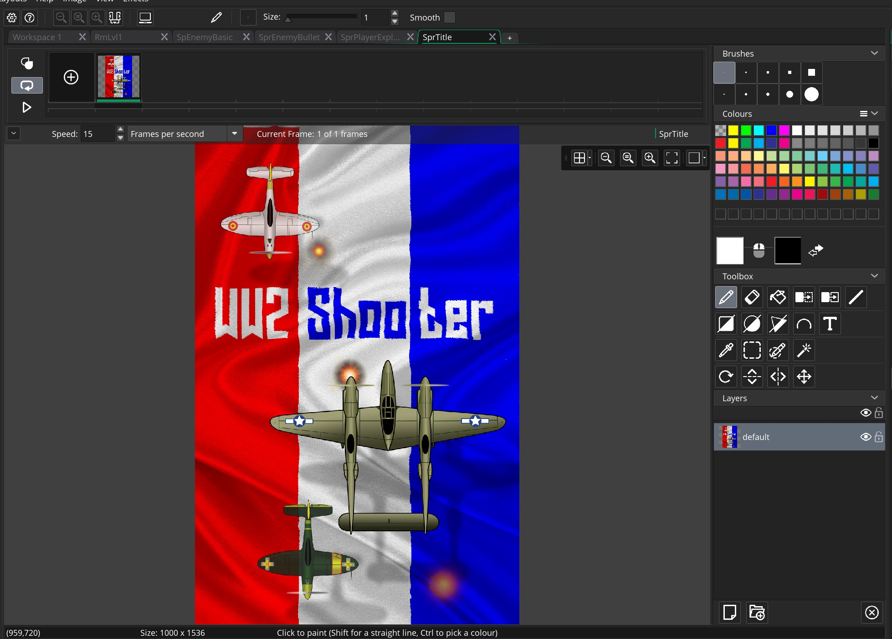
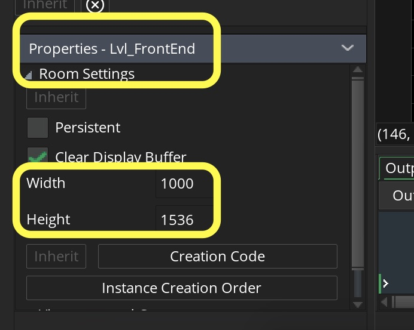
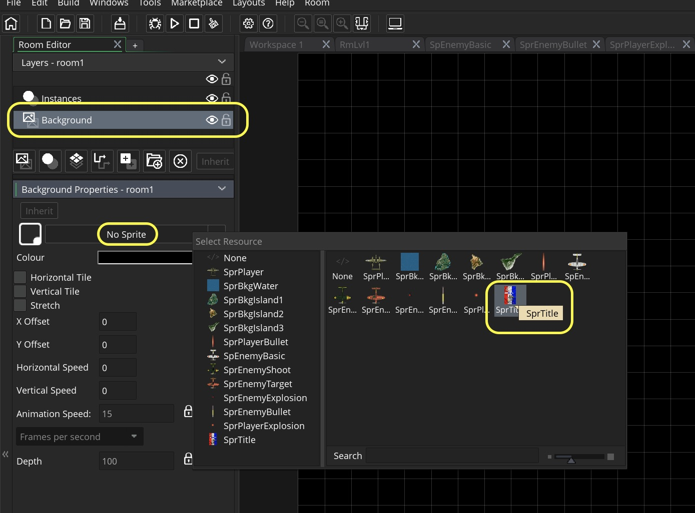
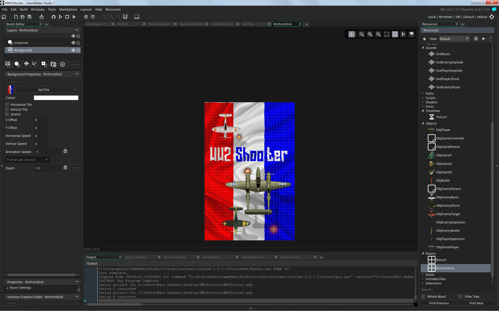
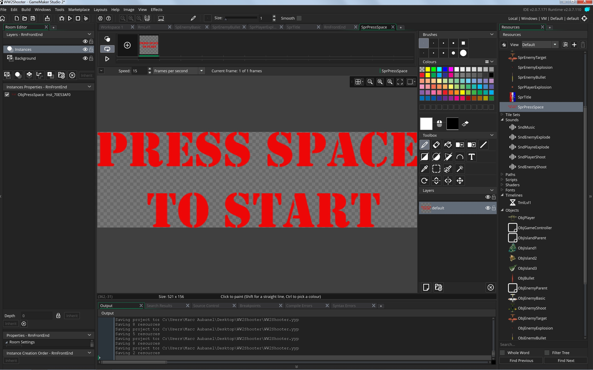
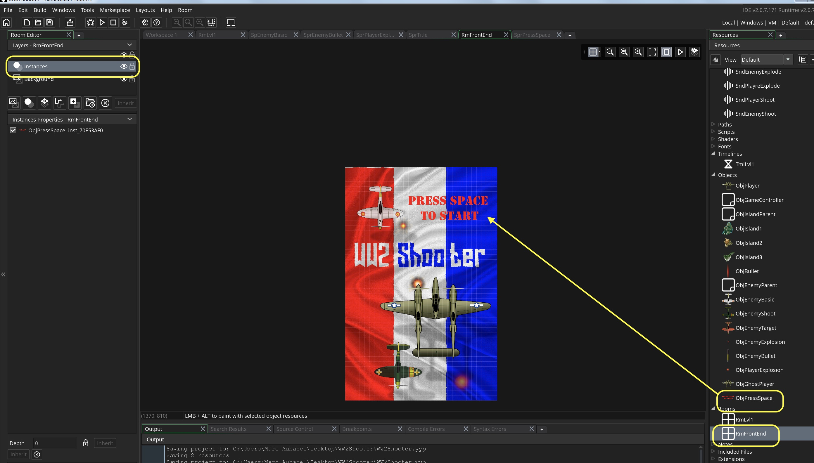
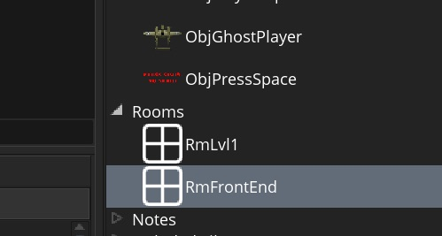
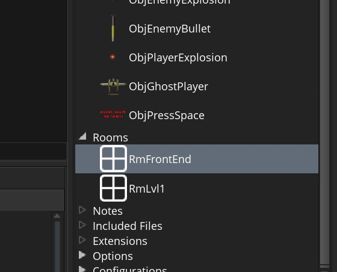
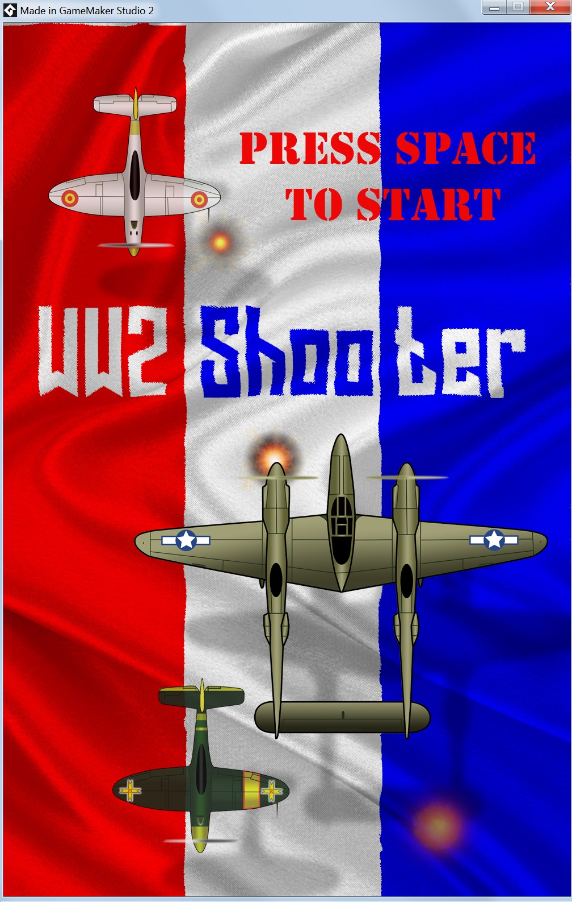
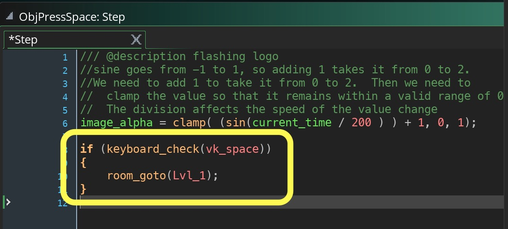

## Front End

<div class = "row">
<div class="col-12 col-lg-4 align-self-center">
<div markdown = "1"> 

{:start="{{ num }}"}
{{ num }}. Lets add the front end screens.  Create a new **Sprite** and import the file **TitlePage** `SprTitle`. 
</div>
</div>
<div class="col-12 col-lg-8">

<br />
</div>
</div>


___ 
<div class = "row">
<div class="col-12 col-lg-4 align-self-center">
<div markdown = "1"> 

{:start="{{ num }}"}
{{ num }}.  Create a new **Room** and call it `Lvl_FrontEnd`.  Change the **Width** and **Height** to `1000` by `1536`
</div>
</div>
<div class="col-12 col-lg-8">

</div>
</div>

___ 
<div class = "row">
<div class="col-12 col-lg-4 align-self-center">
<div markdown = "1"> 

{:start="{{ num }}"}
{{ num }}.  Now we are going to use the sprite as a background. Select the **Background Layer** and click on **Sprite**.  Load the newly imported background.
</div>
</div>
<div class="col-12 col-lg-8">

</div>
</div>

___ 
<div class = "row">
<div class="col-12 col-lg-4 align-self-center">
<div markdown = "1"> 

{:start="{{ num }}"}
{{ num }}. The room should now look like:
</div>
</div>
<div class="col-12 col-lg-8">

</div>
</div>

___ 
<div class = "row">
<div class="col-12 col-lg-4 align-self-center">
<div markdown = "1"> 

{:start="{{ num }}"}
{{ num }}. Create a new **Sprite** and import **SprPressSpace** and call it `SprPressSpace`.  Create a new **Game Object** and bind the above sprite to it calling it `ObjPressSpace`.  Place the newly created object in `Lvl_FrontEnd` on the **Instances** layer.  
</div>
</div>
<div class="col-12 col-lg-8">


</div>
</div>

___ 
<div class = "row">
<div class="col-12 col-lg-4 align-self-center">
<div markdown = "1"> 

{:start="{{ num }}"}
{{ num }}. Run the game.  Oh, the level just plays as before and no front end. Why is that?  GameMaker will run the first room in the list so look at out list:
</div>
</div>
<div class="col-12 col-lg-8">

</div>
</div>

___ 
<div class = "row">
<div class="col-12 col-lg-4 align-self-center">
<div markdown = "1"> 

{:start="{{ num }}"}
{{ num }}. Change the order so that `Lvl_FrontEnd` comes before `Lvl_1`:
</div>
</div>
<div class="col-12 col-lg-8">

</div>
</div>

___ 
<div class = "row">
<div class="col-12 col-lg-4 align-self-center">
<div markdown = "1"> 

{:start="{{ num }}"}
{{ num }}. Run the game and now you should see the front end that does nothing:
</div>
</div>
<div class="col-12 col-lg-8">

</div>
</div>

___ 
<div class = "row">
<div class="col-12 col-lg-4 align-self-center">
<div markdown = "1"> 

{:start="{{ num }}"}
{{ num }}. Lets make the press space logo flash to attract the users attention.  Create a new **Step Event Script** on `ObjPressSpace` called  and add:  
</div>
</div>
<div class="col-12 col-lg-8">
<div markdown = "1"> 
```c
/// @description flashing logo
//sine goes from -1 to 1, so adding 1 takes it from 0 to 2.
//We need to add 1 to take it from 0 to 2.  Then we need to 
//  clamp the value so that it remains within a valid range of 0 to 1.
//  The division affects the speed of the value change
image_alpha = clamp( (sin(current_time / 200 ) ) + 1, 0, 1);
```
</div>
</div>
</div>
___ 
<div class = "row">
<div class="col-12 col-lg-4 align-self-center">
<div markdown = "1"> 

{:start="{{ num }}"}
{{ num }}. It should look like:
</div>
</div>
<div class="col-12 col-lg-8">
<div class="embed-responsive embed-responsive-16by9">
<iframe class="embed-responsive-item" src="https://www.youtube.com/embed/TLJRjR_E4Z8?rel=0&amp;controls=0&amp&showinfo=0&autoplay=1&version=3&loop=1&playlist=TLJRjR_E4Z8" frameborder="0" allowfullscreen></iframe>
</div>
</div>
</div>

___ 
<div class="col-12">
<div markdown = "1"> 

{:start="{{ num }}"}
{{ num }}.  Please note that this is not the most framerate efficient way of doing it.  Normally we would save an array with these values and access it through an array as opposed to doing the math in real time.  Based on the fact that this is a quick re-creation and there really isn't much going on in this screen that we use this to save a bit of time.  Now lets add the ability to change rooms through the scripts which uses another GameMaker function:

> **_room_goto(numb)_**
<div class="table table-striped">
<div markdown = "1">
> | Argument | Description |
| -------- | -------- | 
| numb | The index of the room to go to. | 
</div>
</div>
> **Returns: N/A <br><br>** Note even though a Real number will work (first room is 0, second is 1), the name of each object is also a number so you can use the name you called room without quotation marks. If you called the room **Level1** you could go to Level1 with ``` room_goto(Level1) ```.<br><br>**Description**: "This function will end the current room and go to the room specified by the input index. The room must exist or else an error will be given, and if you use the same room as the current room it will have the same effect as room_restart. Note that the room will not change until the end of the event where the function was called, so any code after this has been called will still run." - [GameMaker Manual](https://docs2.yoyogames.com/source/_build/3_scripting/4_gml_reference/rooms/general/room_goto.html) 
</div>
</div>

___ 
<div class = "row">
<div class="col-12 col-lg-4 align-self-center">
<div markdown = "1"> 

{:start="{{ num }}"}
{{ num }}.  Now add to the bottom of the **Step Event Script** on `ObjPressSpace` :  
</div>
</div>
<div class="col-12 col-lg-8">
<div markdown = "1"> 
```c
if (keyboard_check(vk_space))
{
    room_goto(Lvl_1);
}
```
</div>
</div>
</div>


___ 
<div class="col-12">
<div markdown = "1"> 

{:start="{{ num }}"}
{{ num }}. Test the game and you should now be able to press space and you can go to the game screen.

___ 

<br><br>
[<- Previous](ScrollingShooter_12.html)&nbsp;&nbsp;&nbsp;[Home](../../index.html)&nbsp;&nbsp;&nbsp; [Continue ->](ScrollingShooter_14.html)
<br />
<br />  
<br />  
<br />  