## Lives

<div class = "row">
<div class="col-12 col-lg-4 align-self-center">
<div markdown = "1"> 

{:start="{{ num }}"}
{{ num }}. Open the **Create Event Script** in `ObjGameController` and add at the bottom:
</div>
</div>
<div class="col-12 col-lg-8">
<div markdown = "1"> 
```c
lives = 3;
```
</div>
</div>
</div>
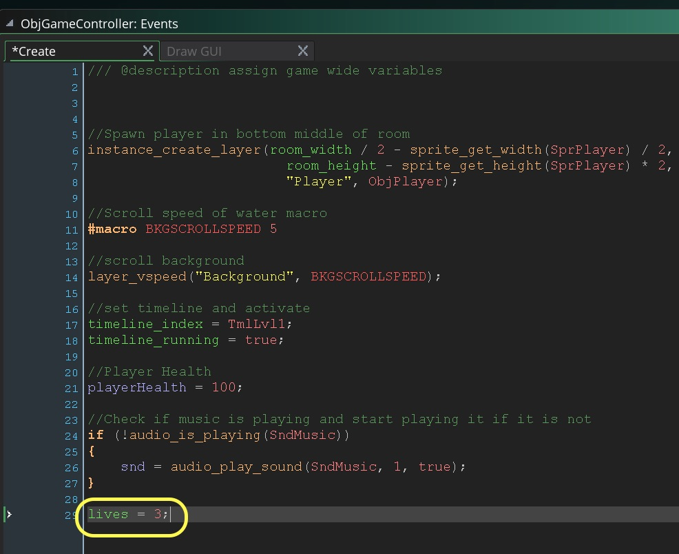

___ 
<div class = "row">
<div class="col-12 col-lg-4 align-self-center">
<div markdown = "1"> 

{:start="{{ num }}"}
{{ num }}. Add to the bottom of **Draw Gui Event Script** on `ObjGameController` to draw the lives to the screen:  
</div>
</div>
<div class="col-12 col-lg-8">
<div markdown = "1"> 
```c
//draw lives
space = 0;
repeat (lives)
{
    draw_sprite_ext(SprPlayer, 0, 120 + space, 10, .4, .4, true, c_white, 1);
    space += 64;
}
```
</div>
</div>
</div>
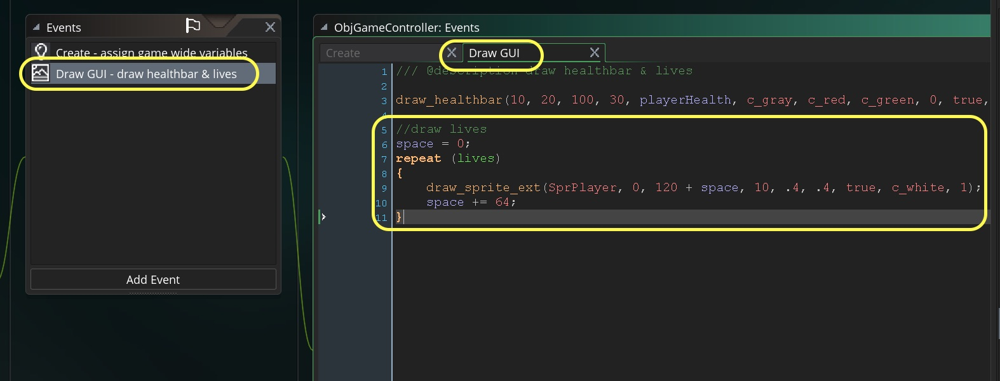

___ 
<div class = "row">
<div class="col-12 col-lg-4 align-self-center">
<div markdown = "1"> 

{:start="{{ num }}"}
{{ num }}. Now that we have added lives, the best place to track them is NOT in the `ObjPLayer` **Step Event Script**.  This will be reset every time we start a new life.  Comment out or delete from that script:
</div>
</div>
<div class="col-12 col-lg-8">
<div markdown = "1"> 
``` c
//if (ObjGameController.playerHealth < 0)
//{
//instance_change(ObjGhostPlayer, true);
//}
```
</div>
</div>
</div>`

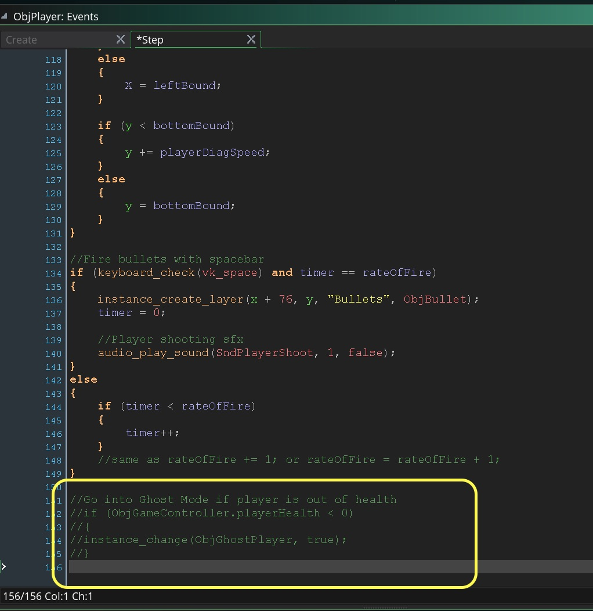

___ 
<div class = "row">
<div class="col-12 col-lg-4 align-self-center">
<div markdown = "1"> 

{:start="{{ num }}"}
{{ num }}. Create a new `ObjGameController` **Step Event Script** and this back to it with keeping track of lives.
</div>
</div>
<div class="col-12 col-lg-8">
<div markdown = "1"> 
```c
/// @description step event for handling players lives

//Go into Ghost Mode if player is out of health
if (playerHealth < 0)
{
    instance_change(ObjGhostPlayer, true);
    lives --;
}
```
</div>
</div>
</div>
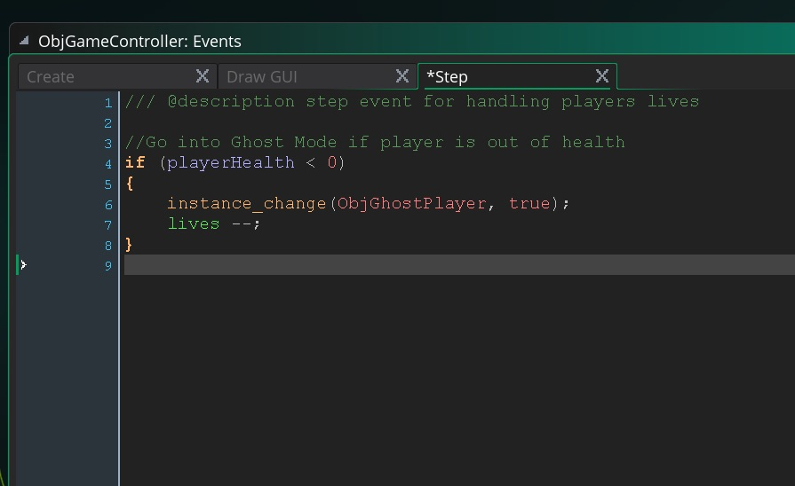

___ 
<div class = "row">
<div class="col-12 col-lg-4 align-self-center">
<div markdown = "1"> 

{:start="{{ num }}"}
{{ num }}. Play the game and run out of health. Woops an error message pops up:
</div>
</div>
<div class="col-12 col-lg-8">
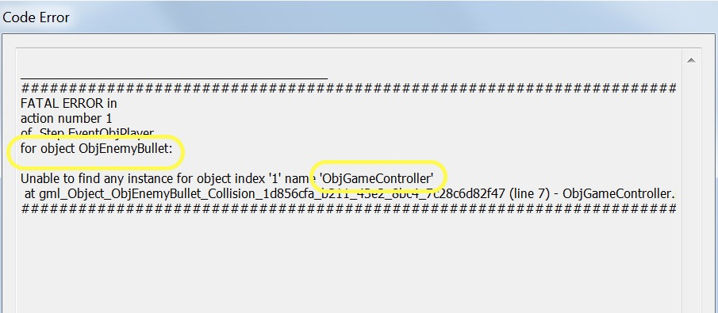
</div>
</div>

___ 
<div class = "row">
<div class="col-12 col-lg-4 align-self-center">
<div markdown = "1"> 

{:start="{{ num }}"}
{{ num }} That's a strange one.  Why is the `ObjEnemyBullet` complaining?  Woops I see my error now.  When we moved the `instance_change()` from player to game controller we are now changing the game controller to the ghost and not the player.  That's an easy fix.  We can enter the object space of the player by using `with (ObjPlayer)`.  Alter the last line to:
</div>
</div>
<div class="col-12 col-lg-8">
<div markdown = "1"> 
```c
/// @description step event for handling players lives

//Go into Ghost Mode if player is out of health
if (playerHealth < 0)
{
    with (ObjPlayer)
    {
        instance_change(ObjGhostPlayer, true);
    }
    lives --;
}
```
</div>
</div>
</div>

___ 
<div class = "row">
<div class="col-12 col-lg-4 align-self-center">
<div markdown = "1"> 

{:start="{{ num }}"}
{{ num }}. Now play and test the game again.  Try and kill yourself.  Oh oh, another problem it doesn't crash but the lives to go zero.  What is going on.  There is a hint in this screenshot:
</div>
</div>
<div class="col-12 col-lg-8">
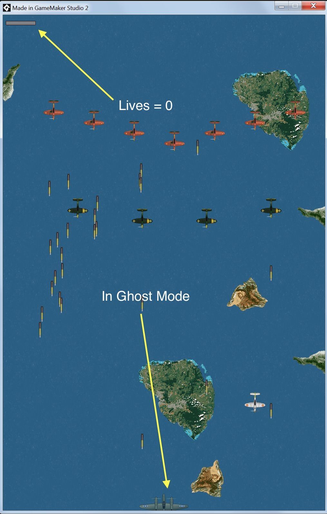
</div>
</div>

___ 
<div class = "row">
<div class="col-12 col-lg-4 align-self-center">
<div markdown = "1"> 

{:start="{{ num }}"}
{{ num }}. Wathching the health bar gives me a clue.  I am not resetting the `playerHealth` back to `100` right away only when the player spawns back.  So it is deleting lives every frame as `playerHealth` is still less than 0.  Now where do I reset the health?  How do I find scripts I wrote previously?  Go to **Edit -> Search & Replace** at the top menu:
</div>
</div>
<div class="col-12 col-lg-8">
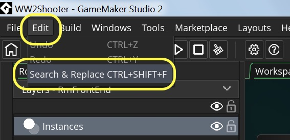
<br />
</div>
</div>

___ 
<div class = "row">
<div class="col-12 col-lg-4 align-self-center">
<div markdown = "1"> 

{:start="{{ num }}"}
{{ num }}. Enter `playerHealth` in the search bar:
</div>
</div>
<div class="col-12 col-lg-8">
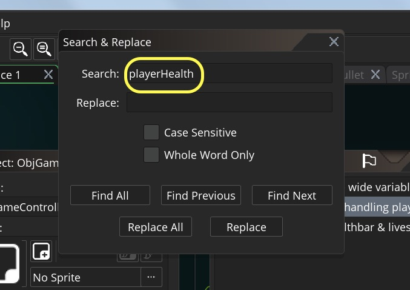
</div>
</div>

___ 
<div class = "row">
<div class="col-12 col-lg-4 align-self-center">
<div markdown = "1"> 

{:start="{{ num }}"}
{{ num }}. The results will be at the bottom menu.  We set it to 100 in the **Create Event** to initially set the health to a `100` and we also set it in the `ObjGhostPlayer` **Step Event Script**:
</div>
</div>
<div class="col-12 col-lg-8">
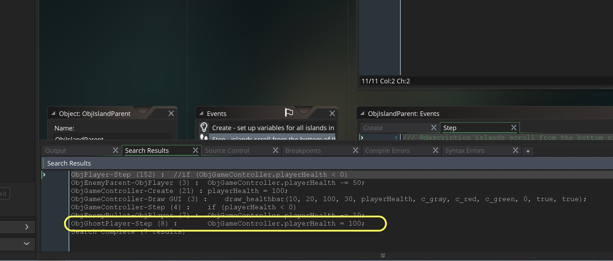
</div>
</div>
 
 ___ 
<div class = "row">
<div class="col-12 col-lg-4 align-self-center">
<div markdown = "1"> 

{:start="{{ num }}"}
{{ num }}. Look at the `ObjGhostPlayer` **Step Event Script** and we only reset the health **after** the object returns to its starting point.  Lets comment this out:
</div>
</div>
<div class="col-12 col-lg-8">
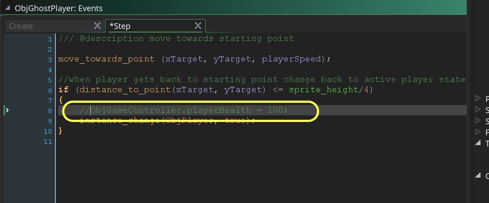
</div>
</div>

___ 
<div class = "row">
<div class="col-12 col-lg-4 align-self-center">
<div markdown = "1"> 

{:start="{{ num }}"}
{{ num }}. Lets add it to where we switch to ghost when we lose a life.   Open `ObjGameController` **Step Event Script** and add `PlayerHealth = 100;` after `lives --`:
</div>
</div>
<div class="col-12 col-lg-8">
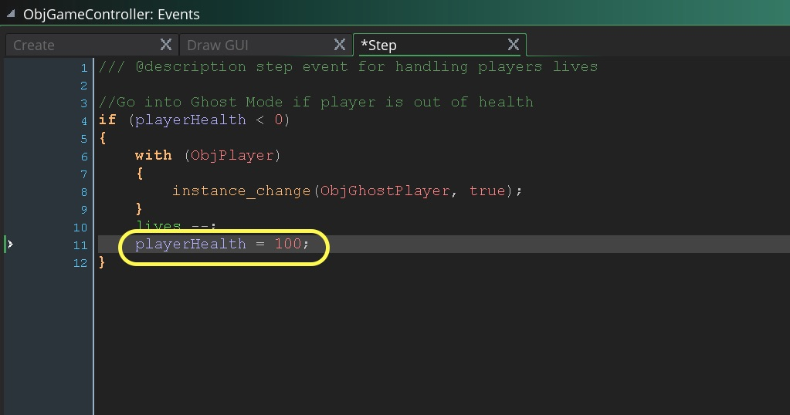
</div>
</div>

___ 
<div class = "row">
<div class="col-12 col-lg-4 align-self-center">
<div markdown = "1"> 

{:start="{{ num }}"}
{{ num }}. Test the game and try and kill yourself.  That works much better now, but we need to restart the entire game when you run out of lives.  Check to see that you still have lives left before you subtract a life and go into ghost mode then add to  `ObjGameController` **Step Event Script** after the `if` statement:
</div>
</div>
<div class="col-12 col-lg-8">
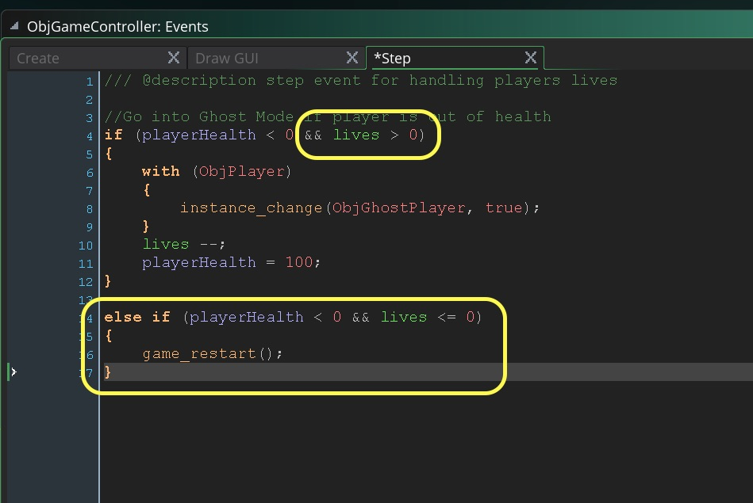
</div>
</div>

___ 
<div class="col-12">
<div markdown = "1"> 

{:start="{{ num }}"}
{{ num }}. Test it one last time and make sure it works properly. 
</div>
</div>

___ 

## One Last Thing

<div class="col-12">
<div markdown = "1"> 

{:start="{{ num }}"}
{{ num }}.  Since we are using space to go to the game and space to shoot, you start the game by shooting before you get a sense of what is going on.  There is a way to reset the state of the buttons when entering the game.

> **keyboard_clear(key)**<br><br>With this function you can clear the current keyboard state, which essentially means that if the key is being held down, it will no longer be recognised until it is released again (which won't generate a keyboard_key_release event either on this occasion) and pressed again. - [GameMaker Manual](https://docs2.yoyogames.com/source/_build/3_scripting/4_gml_reference/controls/keyboard%20input/keyboard_clear.html)
</div>
</div>
___ 
<div class = "row">
<div class="col-12 col-lg-4 align-self-center">
<div markdown = "1"> 

{:start="{{ num }}"}
{{ num }}  So in our `ObjGameController` **Create Event Script** we can add to the bottom:
</div>
</div>
<div class="col-12 col-lg-8">
<div markdown = "1"> 
``` c
//Ignore incoming space bar press
keyboard_clear(vk_space);
```
</div>
</div>
</div>
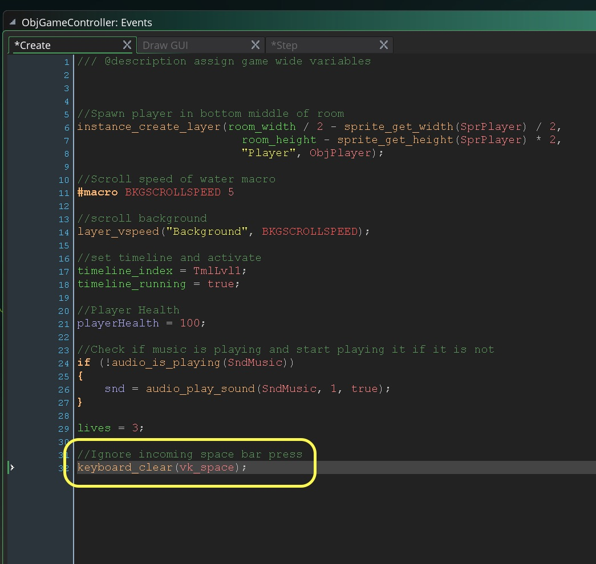

___ 
<div class = "row">
<div class="col-12 col-lg-4 align-self-center">
<div markdown = "1"> 

{:start="{{ num }}"}
{{ num }}. Now you can create more waves and make an exciting level that escalates in difficulty.  Your game should look and sound like:
</div>
</div>
<div class="col-12 col-lg-8">
<div class="embed-responsive embed-responsive-16by9">
<iframe class="embed-responsive-item" src="https://www.youtube.com/embed/0DG-BaKgMwY?rel=0&amp;controls=0&amp&showinfo=0&version=3" frameborder="0" allowfullscreen></iframe>
</div>
</div>
</div>

___ 
<div class="col-12">
<div markdown = "1"> 

{:start="{{ num }}"}
{{ num }}. That's all for this game, hope you had as much fun working on it as I did!
</div>
</div>

___ 

<br><br>
[<- Previous](ScrollingShooter_13.html)&nbsp;&nbsp;&nbsp;[Home](../../index.html)&nbsp;&nbsp;&nbsp;
<br />  
<br />  
<br />  
<br />  
