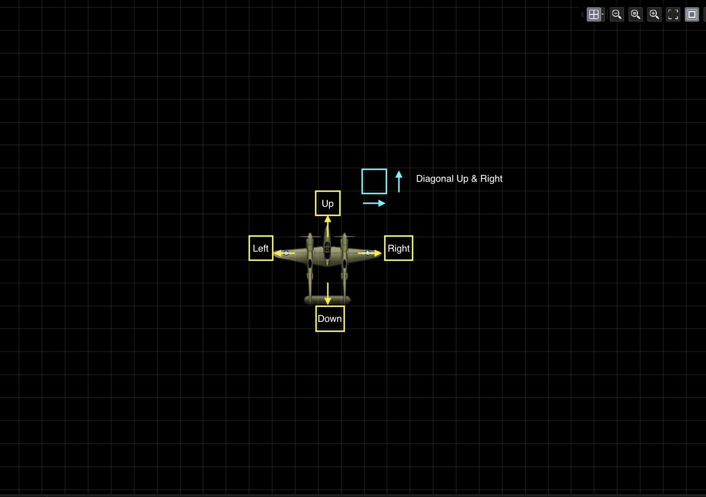
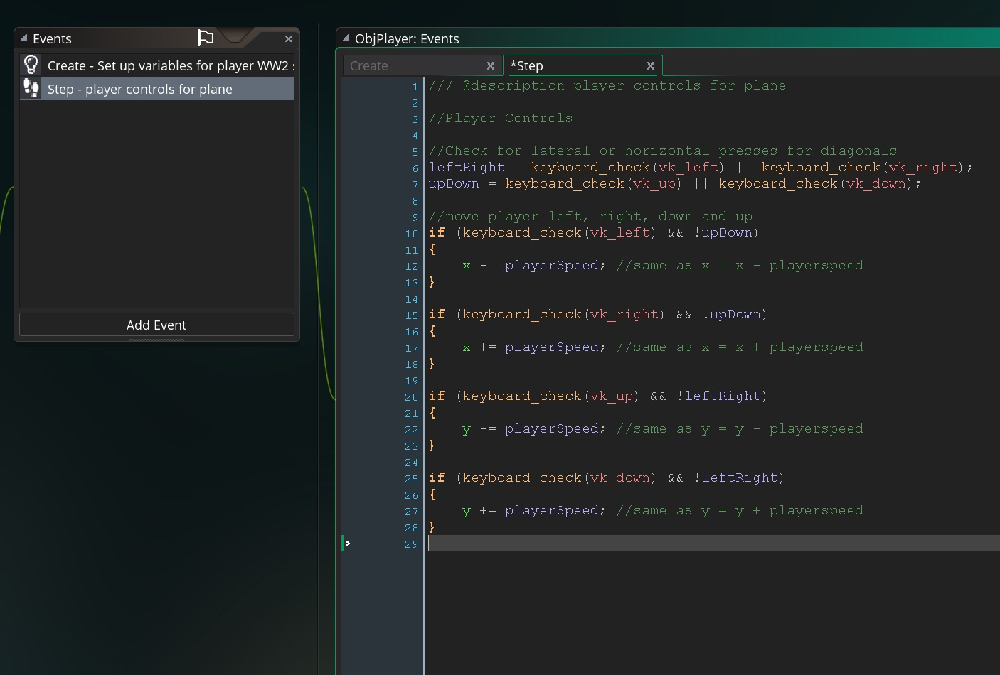
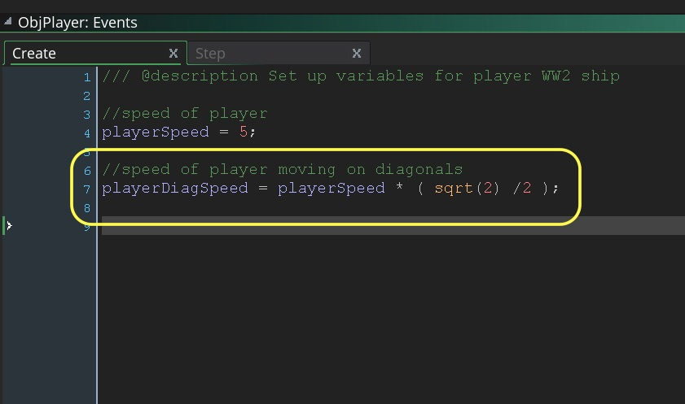
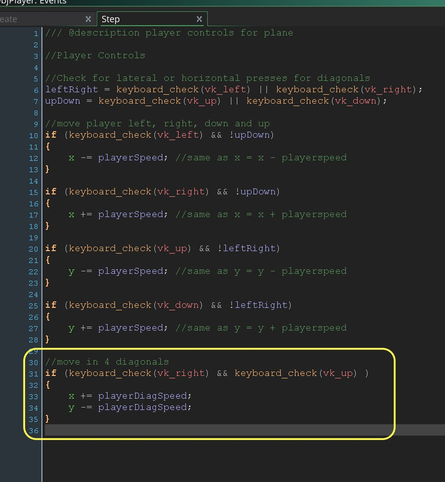
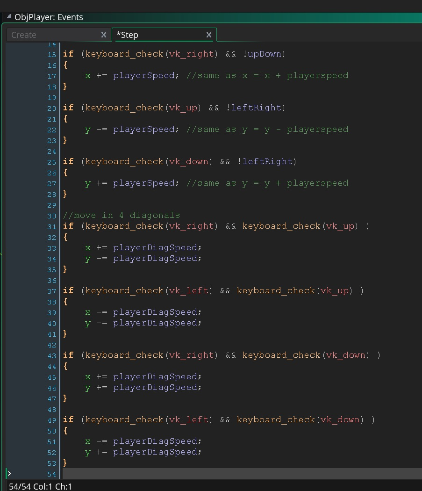
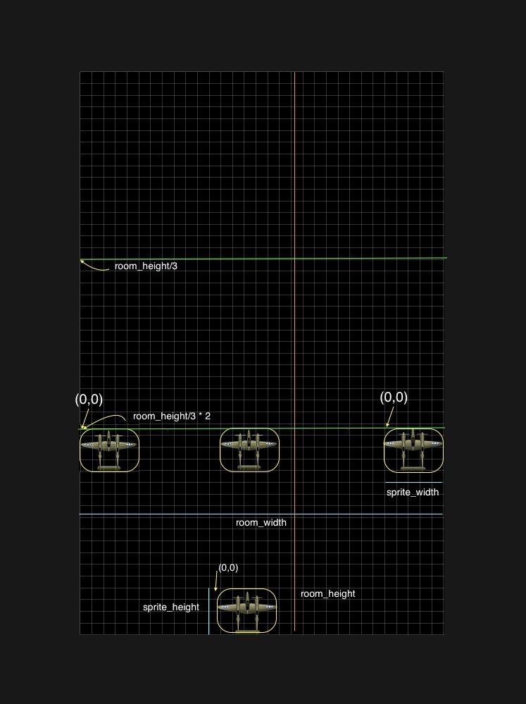
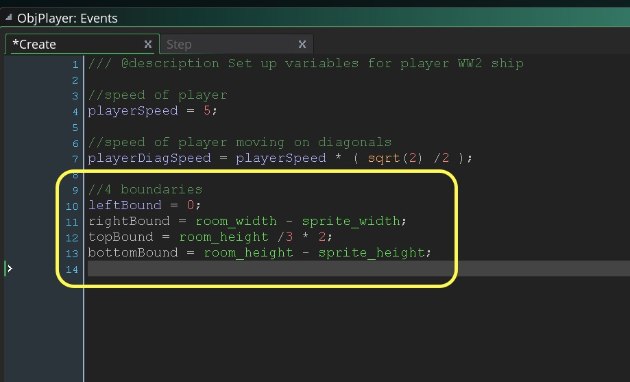

<div class = "row">
<div class="col-12 col-lg-4 col align-self-center">
<div markdown = "1"> 

{:start="{{ num }}"}
{{ num }}. Now lets play the game. Feel the speed on the diagonal versus up, down, left and right.  Does it feel faster or slower?  It should feel faster as we are doubling the speed by adding the same amount on the ``` x ``` and ``` y ``` axes of movement.  We should be moving at half that amount on each axis.  
</div>
</div>
<div class="col-12 col-lg-8">

</div>
</div>

___ 
<div class = "row">
<div class="col-12 col-lg-4 col align-self-center">
<div markdown = "1"> 

{:start="{{ num }}"}
{{ num }}.  So how are we going to do this.  If we are moving diagonally we should be altering our movement to a 45 degrees diagonal.  So we need to check if we are on diagonals or not.  So we need to ask "Are we pressing left & not pressing up or down" when checking for non-diagonal movement.  On the other axis we ask "Are we pressing up & not pressing left or right".  We can convert this into code.  Lets create a variable on the fly (there is no default value) within the `ObjPlayer` **Step Event Scripts** and add to the top:
</div>
</div>
<div class="col-12 col-lg-8">
<div markdown = "1"> 
```c
//Check for lateral or horizontal presses for diagonals
leftRight = keyboard_check(vk_left) || keyboard_check(vk_right); // || same as or
upDown = keyboard_check(vk_up) || keyboard_check(vk_down); // || same as or
```
</div>
</div>
</div>

___ 
<div class = "row">
<div markdown = "1"> 

{:start="{{ num }}"}
{{ num }}. Now the above uses an **or** operator so that if you are pressing `vk_left` or `vk_right` it will return `true` and store in `leftRight` variable.  The same thing holds true for `vk_up` or `vk_down` where `upDown` will be either `true` or `false`.
</div>
</div>

___ 
<div class = "row">
<div class="col-12 col-lg-4 col align-self-center">
<div markdown = "1"> 

{:start="{{ num }}"}
{{ num }}. This does nothing for the moment.  We need to add to the movement check to ensure we are not on diagonals.  We will adjust it to:
</div>
</div>
<div class="col-12 col-lg-8">
<div markdown = "1"> 
```c
//move player left, right, down and up
if (keyboard_check(vk_left) && !upDown)
{
    x -= playerSpeed; //same as x = x - playerspeed
}

if (keyboard_check(vk_right) && !upDown)
{
    x += playerSpeed; //same as x = x + playerspeed
}

if (keyboard_check(vk_up) && !leftRight)
{
    y -= playerSpeed; //same as y = y - playerspeed
}

if (keyboard_check(vk_down) && !leftRight)
{
    y += playerSpeed; //same as y = y + playerspeed
}
```
</div>
</div>
</div>


<br />

___ 
<div class = "row">
<div class="col-12 col-lg-6 col align-self-center">
<div markdown = "1"> 

{:start="{{ num }}"}
{{ num }}. This way we are not moving twice if two valid movement keys are pressed.  When moving left or right we are making sure we are **not** pressing up or down and the same holds true the other way around.  Run the game, and you should only be able to move laterally.  Now lets add diagonals. For diagonals we will be moving at the speed on both axis multiplied by the root of 2 divided by 2 (or the sin and cos of 45 degrees). It is beyond the scope of this tutorial but you can look [here](https://www.khanacademy.org/math/trigonometry/trigonometry-right-triangles/trig-ratios-special-triangles/a/trig-ratios-of-special-triangles) for a reference.  So lets open up `ObjPlayer` **Create Event Script** and add to the bottom (very important that it is after playerSpeed as it references that value):
</div>
</div>
<div class="col-12 col-lg-6">
<div markdown = "1"> 
```c
//speed of player moving on diagonals
playerDiagSpeed = playerSpeed * ( sqrt(2) /2 );
```
</div>
</div>
</div>

<br />

___ 
<div class = "row">
<div class="col-12 col-lg-6 col align-self-center">
<div markdown = "1"> 

{:start="{{ num }}"}
{{ num }}. Now if we added the diagonals to change the speed two if statements would be true. For diagonal top right, the diagonal would be true, the top would be true and the right would be true.  This way three statements would be true and the player would move very quickly with the top diagonal button.  Lets do one to start to demonstrate.  Add to the end of `ObjPlayer` **Step Event Script**:  
</div>
</div>
<div class="col-12 col-lg-6">
<div markdown = "1"> 
```c
//move in 4 diagonals
if (keyboard_check(vk_right) && keyboard_check(vk_up) )
{
    x += playerDiagSpeed;
    y -= playerDiagSpeed;
}
```
</div>
</div>
</div>

<br />

___ 
<div class = "row">
<div class="col-12 col-lg-6 col align-self-center">
<div markdown = "1"> 

{:start="{{ num }}"}
{{ num }}.  Run and test the game.  The only diagonal movement that should work is right and up and the speed should now feel consistent. Lets add the other diagonals under the last piece in `ObjPlayer` **Step Event Script**:
</div>
</div>
<div class="col-12 col-lg-6">
<div markdown = "1"> 
``` c
if (keyboard_check(vk_left) && keyboard_check(vk_up) )
{
    x -= playerDiagSpeed;
    y -= playerDiagSpeed;
}

if (keyboard_check(vk_right) && keyboard_check(vk_down) )
{
    x += playerDiagSpeed;
    y += playerDiagSpeed;
}

if (keyboard_check(vk_left) && keyboard_check(vk_down) )
{
    x -= playerDiagSpeed;
    y += playerDiagSpeed;
}
```
</div>
</div>
</div>

<br />

___ 
<div class = "row">
<div class="col-12 col-lg-4 col align-self-center">
<div markdown = "1"> 

{:start="{{ num }}"}
{{ num }}. Run the game it should move very smoothly between lateral and diagonal movement with no speed changes. 
</div>
</div>
<div class="col-12 col-lg-8">
<div class="embed-responsive embed-responsive-16by9">
<iframe class ="embed-responsive-item" src="https://www.youtube.com/embed/J7Fb3I7o3CA?rel=0&amp;controls=0&amp&showinfo=0&autoplay=1&version=3&loop=1&playlist=J7Fb3I7o3CA" frameborder="0" allowfullscreen></iframe>
</div>
</div>
</div>

___ 
<div class = "row">
<div class="col-12 col-lg-4 col align-self-center">
<div markdown = "1"> 

{:start="{{ num }}"}
{{ num }}. Now the player goes off screen in all directions and is not limited to the bottom third of the screen.  We do not want to screen_wrap() as we want the player to stop at the top, left, bottom and right.  How do we achieve this?  
</div>
</div>
<div class="col-12 col-lg-8">

</div>
</div>
___ 
<div class = "row">
<div class="col-12 col-lg-4 col align-self-center">
<div markdown = "1"> 

{:start="{{ num }}"}
{{ num }}. We can add another compound question with our 4 boundaries.  Lets add the boundaries to the `ObjPlayer` **Create Event Script**. The boundaries are based on the plane's **_orgin_** or (0,0) being at the top left corner of the sprite.:  
</div>
</div>
<div class="col-12 col-lg-8">
<div markdown = "1"> 
```c
//4 boundaries
leftBound = 0;
rightBound = room_width - sprite_width;
topBound = room_height /3 * 2;
bottomBound = room_height - sprite_height; 
```
</div>
</div>
</div>

<br />

___ 
<div class = "row">
<div markdown = "1"> 

{:start="{{ num }}"}
{{ num }}. Go to the next page to adjust the step script to bounds check the player.
</div>
</div>
___ 
<br><br>
[<- Previous](ScrollingShooter_1.html)&nbsp;&nbsp;&nbsp;[Home](../../index.html)&nbsp;&nbsp;&nbsp; [Continue ->](ScrollingShooter_3.html)
<br />  
<br />  
<br />  
<br />  