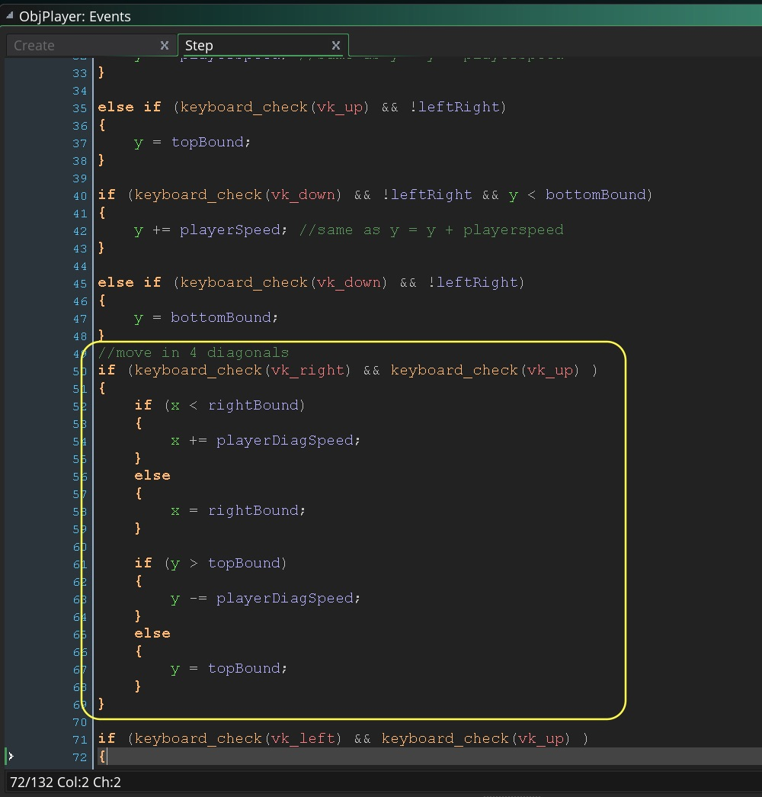

___ 
<div class = "row">
<div class="col-12 col-lg-4 col align-self-center">
<div markdown = "1"> 

{:start="{{ num }}"}
{{ num }}. Now open the `ObjPlayer` **Step Event Script**.  We are going to add a check to make sure the sprite is still on screen for the left direction.  We are only moving the player to the left if they are still on screen (greater than the left hand corner). Add to the left direction check (adding the && condition to the `if (keyboard_check(vk_left))` statement):  
</div>
</div>
<div class="col-12 col-lg-8">
<div markdown = "1"> 
```c
if (keyboard_check(vk_left) && !upDown  && x > leftBound ) // && same as and
{
	x -= playerSpeed; //same as x = x - playerspeed
}
```
</div>
</div>
</div>


___ 
<div class = "row">
<div class="col-12 col-lg-6 col align-self-center">
<div markdown = "1"> 

{:start="{{ num }}"}
{{ num }}. Run the game and make sure you can no longer fly off the left side of the screen.

	So the `x > leftBound` makes sure that it doesn't move left unless the player is still to the left hand side of the room.  The problem is what if the `ObjPlayer` is at the first pixel so it can still move left, then it will move off_screen based on its current speed.  

	So we need to make sure that if the player is moving **only** left that it is pinned to the left hand side.  Add after the previous **if** statement another **else if** and if the player is still pushing left and not up or down then put them to the very left hand side of the screen.
</div>
</div>
<div class="col-12 col-lg-6">

<div markdown = "1"> 
``` c
else if (keyboard_check(vk_left) && !upDown) //pins player to the left
{
	x = 0;
}
```
</div>
</div>
</div>

<br />

___ 
<div class = "row">
<div class="col-12 col-lg-4 col align-self-center">
<div markdown = "1"> 

{:start="{{ num }}"}
{{ num }}. Lets add the check for right movement.  Alter `ObjPlayer` **Step Event Script** by changing the right hand movement and adding `&& x < rightBound`.
</div>
</div>
<div class="col-12 col-lg-8">
<div markdown = "1"> 
```c
if (keyboard_check(vk_right) && !upDown && x < rightBound)
```
</div>
</div>
</div>

___ 
<div class = "row">
<div class="col-12 col-lg-4 col align-self-center">
<div markdown = "1"> 
{:start="32"}
32. Now lets pin the player to the very right of the level by adding after that last **if** statement:
</div>
</div>
<div class="col-12 col-lg-8">
<div markdown = "1"> 
``` c
else if (keyboard_check(vk_right) && !upDown)
{
	x = rightBound;
}
```
</div>
</div>
</div>


<br />

___ 
<div class="row">
<div markdown = "1"> 

{:start="{{ num }}"}
{{ num }}. Run the game and test left and right.  You should not be able to exit the screen on either the left or right (unless pressing diagonals which we haven't dealt with yet).  Don't worry though, we will add these shortly.
</div>
</div>

___ 
<div class = "row">
<div class="col-12 col-lg-4 col align-self-center">
<div markdown = "1"> 

{:start="{{ num }}"}
{{ num }}. Add the checks for top and bottom on the y axis:  
</div>
</div>
<div class="col-12 col-lg-8">

</div>
</div>

___ 
<div class = "row">
<div class="col-12 col-lg-4 col align-self-center">
<div markdown = "1"> 

{:start="{{ num }}"}
{{ num }}. Now what about diagonals, how do we check these as they move on two axes?  The same methodology applies we just need to to check and pin each axis seperately. So in moving top right we need to check both the right and the top before we move the player. 

We should check them separately that way we can still move up even if we are at the far right of the screen.  Change the top right diagonal **if** statement in the `ObjPlayer` **Step Event Script** to read:  
</div>
</div>
<div class="col-12 col-lg-8">
<div markdown = "1"> 
```c
if (keyboard_check(vk_right) && keyboard_check(vk_up) )
{
	if (x < rightBound)
	{
		x += playerDiagSpeed;
	}
	else 
	{
		x = rightBound;
	}
	
	if (y > topBound)
	{
		y -= playerDiagSpeed;
	}
	else
	{
		y = topBound;
	}
}
```
</div>
</div>
</div>

<br />

___ 
<div class = "row">
<div class="col-12">
<div markdown = "1"> 

{:start="{{ num }}"}
{{ num }}.  Test up right diagonal and see if you like it?  If you do, alter the rest of the diagonals:
</div>
</div>
<div class="col-12">
<div markdown = "1"> 
``` c
if (keyboard_check(vk_left) && keyboard_check(vk_up) )
{
	if (x > leftBound)
	{
		x -= playerDiagSpeed;
	}
	else 
	{
		x = leftBound
	}
	
	if (y > topBound)
	{
		y -= playerDiagSpeed;
	}
	else
	{
		y = topBound;
	}
}

if (keyboard_check(vk_right) && keyboard_check(vk_down) )
{
	if (x < rightBound)
	{
		x += playerDiagSpeed;
	}
	else
	{
		x = rightBound;
	}
	if (y < bottomBound)
	{
		y += playerDiagSpeed;
	}
	else
	{
		y = bottomBound;
	}
}

if (keyboard_check(vk_left) && keyboard_check(vk_down) )
{
	if (x > leftBound)
	{
		x -= playerDiagSpeed;
    }
	else
	{
		X = leftBound;
	}
	
	if (y < bottomBound)
	{
		y += playerDiagSpeed;
	}
	else
	{
		y = bottomBound;
	}
}
```
</div>
</div>
</div>


___ 
<div class = "row">
<div class="col-12 col-lg-4 col align-self-center">
<div markdown = "1"> 

{:start="{{ num }}"}
{{ num }}.  Test all diagonals and see if it works.  You should **not** be able to make it out of the playing space with any key presses at all!<br><br>Now I want to make one small change before moving on.  I find the bottom third too confining and lets limit it to the top half.  Since we have not hard coded our variables we can easily change the `ObjPlayer` **Create Event Script** `topBound` to `room_height / 2`.  This will allow the plane to navigate the entire bottom half of the play area.

</div>
</div>
<div class="col-12 col-lg-8">

</div>
</div>

___ 
## Background Scrolling

&#9635; ~~Move plane around bottom third of screen~~ <br />
&#9633; Decide on methodology for scrolling background <br />

<div class = "row">
<div class="col-12">
<div markdown = "1"> 

{:start="{{ num }}"}
{{ num }}. There are two ways I can think of to deal with the room (level).  We could just make a very tall room and put all of our graphics and enemies in the room.  We can move the plane up each frame so it scrolls through it.  Sort of like:
</div>

</div>
</div>
___ 
<div class = "row">
<div class="col-12">
<div markdown = "1"> 

{:start="{{ num }}"}
{{ num }}. The other option would be to have the room where the plane doesn't move but the background scrolls like on a conveyor belt.
</div>

</div>
</div>

___ 
<div class = "row">
<div class="col-12 col-lg-4 col align-self-center">
<div markdown = "1"> 

{:start="{{ num }}"}
{{ num }}. I think that it would be better to go with the latter as it will be more efficient with memory and we can make levels longer or shorter without having to change the room size.<br><br>  We will have a base background level that will be tiled and animated.  Why tile? the background  It is more efficient with memory so we can have one texture that is repeated and it will wrap when animated.  A non tiling texture would have edges when it wraps.  Take a look using the **offset** filter in **Photoshop**:
</div>
</div>
<div class="col-12 col-lg-8">


</div>
</div>

___ 

&#9635; ~~Decide on methodology for scrolling background~~ <br />
&#9633; Implement tiled water background scrolling <br />

___ 
<div class = "row">
<div class="col-12 col-lg-4 col align-self-center">
<div markdown = "1"> 

{:start="{{ num }}"}
{{ num }}. So we are going to load a 256 x 256 background tile that is provided, add it to the room and repeat it horizontally and vertically.  Create a new **[Sprite](../GameMakerActions/Sprites.html)**.  <br><br> There is another way of importing images that doesn't have the blank first frame.  We can press the **Import** _button_ on the newly created Spite:  
</div>
</div>
<div class="col-12 col-lg-8">

</div>
</div>

___ 
<div class = "row">
<div class="col-12 col-lg-4 col align-self-center">
<div markdown = "1"> 

{:start="{{ num }}"}
{{ num }}.  Select the **png** file called TileWater.png and press **Yes** to the undoable action warning.
</div>
</div>
<div class="col-12 col-lg-8">


</div>
</div>

___ 
<div class = "row">
<div class="col-12 col-lg-4 col align-self-center">
<div markdown = "1"> 

{:start="{{ num }}"}
{{ num }}. Call the sprite `SprBkgWater`.
</div>
</div>
<div class="col-12 col-lg-8">

</div>
</div>

___ 
<div class = "row">
<div class="col-12 col-lg-4 col align-self-center">
<div markdown = "1"> 

{:start="{{ num }}"}
{{ num }}.  Open room `RmLvl1` and click on the **Background** layer. <br><br>Please note that on instance layers that you can only drag **Game Objects** onto it.  On **Background** layers you can only drag **Sprites**.<br><br>This brings up a **Background Properties** menu below with the colour and selection box with **No Sprite**.  Click on this and select `SprBkgWater`:  
</div>
</div>
<div class="col-12 col-lg-8">

</div>
</div>

___ 
<div class = "row">
<div class="col-12 col-lg-4 col align-self-center">
<div markdown = "1"> 

{:start="{{ num }}"}
{{ num }}. Run the game and look at what we have?<br><br>If you only see one tile that means we are not setting tiling on the background.
</div>
</div>
<div class="col-12 col-lg-8">

</div>
</div>

___ 
<div class = "row">
<div class="col-12 col-lg-4 col align-self-center">
<div markdown = "1"> 

{:start="{{ num }}"}
{{ num }}. Open the **Room** up again and check the **Vertical Tile** and **Horizontal Tile** _boxes_.  Look at what happens to the level:
</div>
</div>
<div class="col-12 col-lg-8">

</div>
</div>

___ 
## Constant

<div class = "row">
<div class="col-12">
<div markdown = "1"> 

{:start="{{ num }}"}
{{ num }}. Now we have a background image you should see it in the room.  We want the background to scroll but we also want the islands placed on the water to scroll.  So we want a variable that holds the scroll speed that is global in nature (accessible from all objects) but constant (canonnot be changed at runtime with a script).  GameMaker gives us this ability through Macros: 

> **Macros**
> While not exactly variables, macros are similar to them in how they are used, ie: they are named values that you can use throughout your code to replace hard values. Basically, a macro (also called a constant when used like this) is a named variable that holds a constant single value (or string). You can define your own constants using the Script Editor and then use them in your code and DnD as if they were regular variables, with the one difference being that they can't be changed in the game. For example say you define the following macro as a constant (note the preceding "#", lack of "=" and the lack of a colon ";" at the end): <br><br>`#macro total_weapons 10`<br><br>You would then call this in your code like this:<br><br>`if ++pos == TOTAL_WEAPONS`<br>`{`<br>&nbsp; &nbsp; &nbsp; &nbsp; `pos = 0;`<br>`}`<br><br>Note that you would not be able to change the constant value, so code like this will cause the game to crash: `total_weapons = 11;`<br><br> You can define a macro anywhere in your code or scripts and it will be pre-compiled and included in your game as if it was there from the start, but we recommend that you create a dedicated script resource and define all your macros in there. It will be easier to organise and debug later! (note the preceding "#" and the lack of a colon ";" at the end).<br><br>**Example:**<br>  `#macro total_weapons 10` <br><br> [GameMaker Manual](http://docs2.yoyogames.com/source/_build/3_scripting/3_gml_overview/6_scope.html)
</div>
</div>
</div>

___ 
<div class = "row">
<div class="col-12 col-lg-4 col align-self-center">
<div markdown = "1"> 

{:start="{{ num }}"}
{{ num }}. It is convention to name your constant with all caps and a logical space to put a variable that is global in scope is in our `ObjGameController` **Create Event Script**.  Add to the bottom:
</div>
</div>
<div class="col-12 col-lg-8">
<div markdown = "1"> 
 ``` c
//Scroll speed of water macro
#macro BKGSCROLLSPEED 5
 ```  
</div>
</div>
</div>


___ 
<div class = "row">
<div class="col-12 col-lg-4 col align-self-center">
<div markdown = "1"> 

{:start="{{ num }}"}
{{ num }}. Don't forget that Macro definitions have no semi-colons at the end so be careful as this will create strange looking error messages.   Why use a Macro instead of a variable?  I know this is a constant so I don't want anyone to change it.  This makes it a constant and it is now unmutable.  If I try and set it after, the compiler will give us an error:
</div>
</div>
<div class="col-12 col-lg-8">

</div>
</div>

___ 
<div class = "row">
<div class="col-12">
<div markdown = "1"> 

{:start="{{ num }}"}
{{ num }}. Now lets add this to our ScrGameManagerCreate script to set the background scrolling.  We will use a new variable called `layer_vspeed()`:  

> **layer_vspeed(layer_id, vspd)**<br><br>**Holds**: Real <br><br>**Description**: "You can use this function to set the vertical speed (in pixels per game frame) of the layer within the currently scoped room. You supply the layer ID (which you get when you create the layer using layer_create()) or the layer name (as a string - this will have a performance impact) and the speed value to set, where a positive value is downwards and a negative value upwards." - [GameMaker Manual](http://docs2.yoyogames.com/source/_build/3_scripting/4_gml_reference/rooms/layers/layer_vspeed.html)
</div>
</div>
</div>

___ 
<div class = "row">
<div class="col-12 col-lg-4">
<div markdown = "1"> 

{:start="{{ num }}"}
{{ num }}.  Since it is using a similar terminology to `vspeed` for **Game Objects**, I am guessing we will just need to set this once in a **Create Event**.  Open `ObjGameController` **Create Event Script** and add to the bottom:
</div>
</div>
<div class="col-12 col-lg-8">
<div markdown = "1"> 
```c
//scroll background
layer_vspeed("Background", BKGSCROLLSPEED);
```
</div>
</div>
</div>


___ 
<div class = "row">
<div class="col-12 col-lg-4">
<div markdown = "1"> 

{:start="{{ num }}"}
{{ num }}.  Run the game and it should look like:
</div>
</div>
<div class="col-12 col-lg-8">
<div class="embed-responsive embed-responsive-16by9">
<iframe class="embed-responsive-item" src="https://www.youtube.com/embed/CpjHdXGw7BI?rel=0&amp;controls=0&amp&showinfo=0&autoplay=1&version=3&loop=1&playlist=CpjHdXGw7BI" frameborder="0" allowfullscreen></iframe>
</div>
</div>
</div>


___ 

<br><br>
[<- Previous](ScrollingShooter_2.html)&nbsp;&nbsp;&nbsp;[Home](../../index.html)&nbsp;&nbsp;&nbsp; [Continue ->](ScrollingShooter_4.html)
<br />  
<br />  
<br />  
<br />  

