<div class = "row">
<div class="col-12 ">
<div markdown = "1"> 
&#9635; ~~Implement tiled water background scrolling~~ <br />
&#9633; Add three islands to background and develop conveyor belt technique <br />


{:start="{{ num }}"}
{{ num }}. The water is a bit boring on its own so lets add some islands. Let's break it down:

	* Import Island1, Island2 and Island3 sprites and center them <br />
	* Create an ObjIslandParent script:
		* Scroll the islands at the same speed as the water
		* When the island scrolls off the bottom place it randomly on the X axes at a random rotation in an EMPTY spot.
	* Create an ObjIsland1, ObjIsland2, and ObjIsland3 objects inherinting from the parent
*	Place three islands on map

</div>
</div>
</div>

___ 
<div class = "row">
<div class="col-12 col-lg-4 align-self-center">
<div markdown = "1"> 

{:start="{{ num }}"}
{{ num }}. Lets start by importing the 3 island sprites **Island1**, **Island2** and **Island3** by pressing the **Import** _button_. From the files you downloaded. Call the three sprites `SprIsland1`, `SprIsland2` and `SprIsland3`.
</div>
</div>
<div class="col-12 col-lg-8">
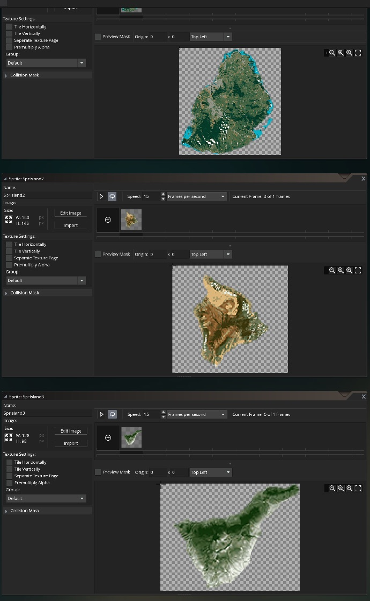
</div>
</div>

___ 
<div class = "row">
<div class="col-12 col-lg-4 align-self-center">
<div markdown = "1"> 

{:start="{{ num }}"}
{{ num }}.  Since we want the islands to all share the same behavior, we will create a **Parent Game Object** that all the children will inherit from.  This allows us to write the Island logic once and be able to debug and tune it but all Islands will inherit the behavior.<br><br> Create a blank **Game Object** called `ObjIslandParent` that we will write all our scripts for and the three islands will inherit from. **DO NOT** assign a sprite to it. 
</div>
</div>
<div class="col-12 col-lg-8">
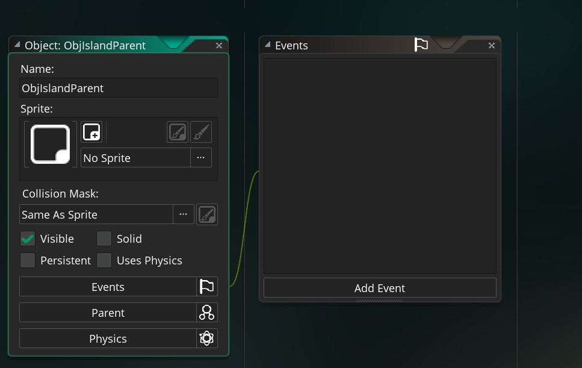
</div>
</div> 

___ 
<div class = "row">
<div class="col-12 col-lg-4 align-self-center">
<div markdown = "1"> 

{:start="{{ num }}"}
{{ num }}. Now create three new **_objects_** and assign the appropriate sprite and attach the `ObjIslandParent` to the `Parent` selector.  Call them `ObjIsland1`, `ObjIsland2` and `ObjIsland3`:  
</div>
</div>

<div class="col-12 col-lg-8">
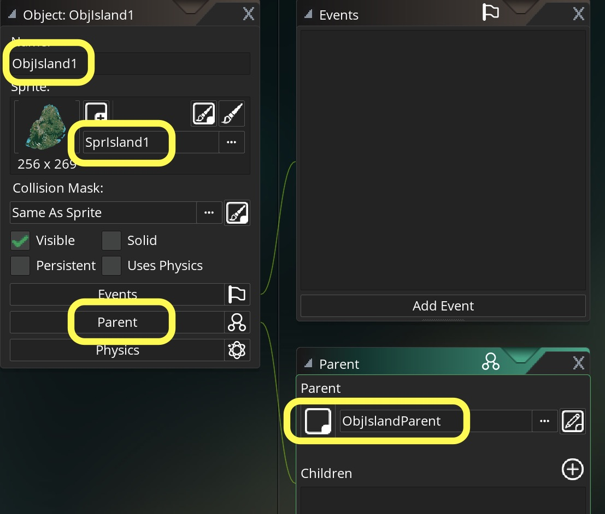
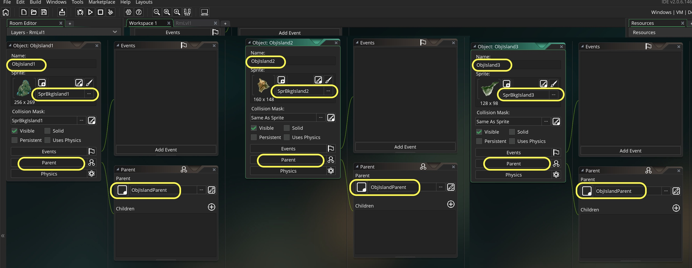
</div>
</div>

___ 
<div class = "row">
<div class="col-12 col-lg-4 align-self-center">
<div markdown = "1"> 

{:start="{{ num }}"}
{{ num }}. Open `RmLvl1` and create a new **Instance Layer** and call is `Islands` and put it between the `Player` and the `Background` layer.  We want the plane to be above the islands, and the islands to be in front of the water.  The layers in GameMaker are like those in Photoshop.
</div>
</div>
<div class="col-12 col-lg-8">
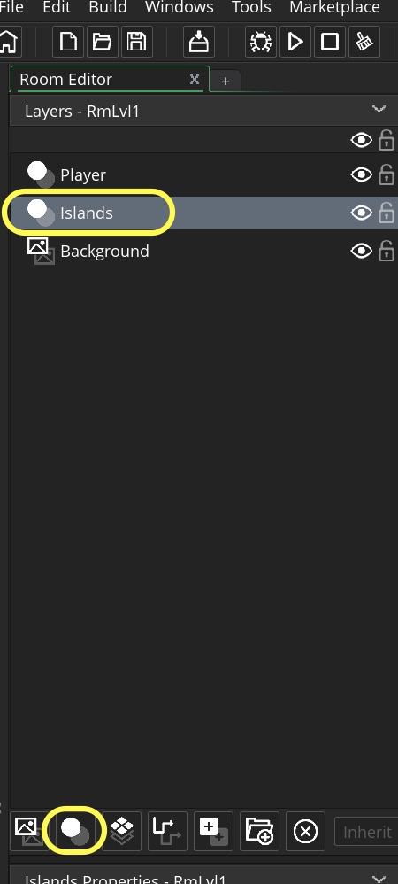
</div>
</div>

___ 
<div class = "row">
<div class="col-12 col-lg-4 align-self-center">
<div markdown = "1"> 

{:start="{{ num }}"}
{{ num }}. Creatively drag and drop 6-8 islands and place them on the **Islands** layer in the room.  You can select an island with the left mouse click then when the circular arrow appears you can rotate the sprite so they are not all in the same orientation.  Here is how I filled in my room:
</div>
</div>
<div class="col-12 col-lg-8">
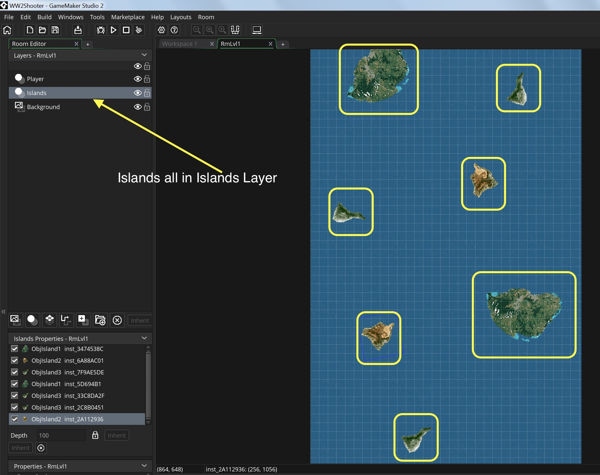
</div>
</div>

___ 
<div class = "row">
<div class="col-12 col-lg-4 align-self-center">
<div markdown = "1"> 

{:start="{{ num }}"}
{{ num }}. Run the game and the background scrolls and islands stay put.  Lets scroll the islands in the same diretion as the water (which is why we created a constant macro!).  We created a parent so that we just need to add scripts to it and all the children will inherit from it.  Double click `ObjIslandParent` and add a **Create Event Script** and place:
</div>
</div>
<div class="col-12 col-lg-8">
<div markdown = "1"> 
```c
/// @description set up variables for all islands in game

//scroll with water
vspeed = BKGSCROLLSPEED;

```
</div>
</div>
</div>
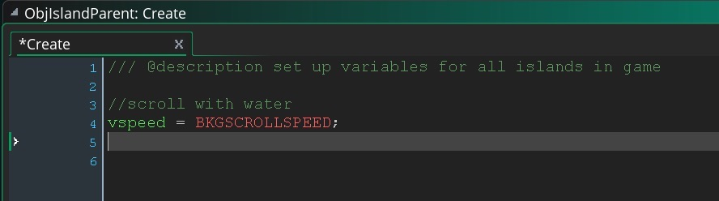
<br />

<div class="embed-responsive embed-responsive-16by9">
<iframe class="embed-responsive-item"  src="https://www.youtube.com/embed/2CzLqBWsumY?rel=0&amp;controls=0&amp&showinfo=0&autoplay=1&version=3&loop=1&playlist=2CzLqBWsumY" frameborder="0" allowfullscreen></iframe>
</div>

___ 
<div class = "row">
<div class="col-12 col-lg-4 align-self-center">
<div markdown = "1"> 

{:start="{{ num }}"}
{{ num }}. Run the game.  You should see all islands leave the bottom of the screen. Double click `ObjIslandParent` and create a new **Step Event Script** and add a script that moves the player from the bottom to the top of the screen when it goes off screen at the bottom of the screen:
</div>
</div>
<div class="col-12 col-lg-8">
<div markdown = "1"> 
```c
/// @description islands scroll from the bottom of the screen back to the top

//Check to see if off screen
if (y > room_height + sprite_height / 2)
{
    y = -sprite_height;
    image_angle = random(360); //rotate the island randomly
}
```
</div>
</div>
</div>
<div class="row">
<div class="col-12 col-lg-6">
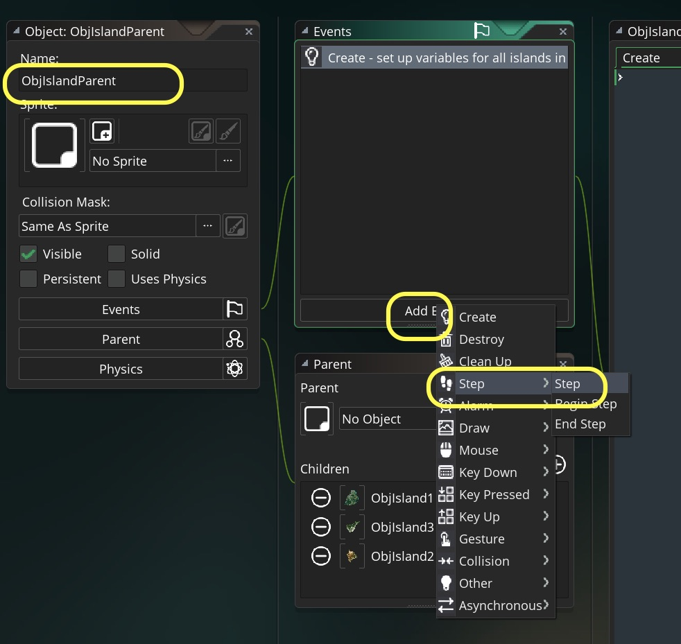
</div>
<div class="col-12 col-lg-6">
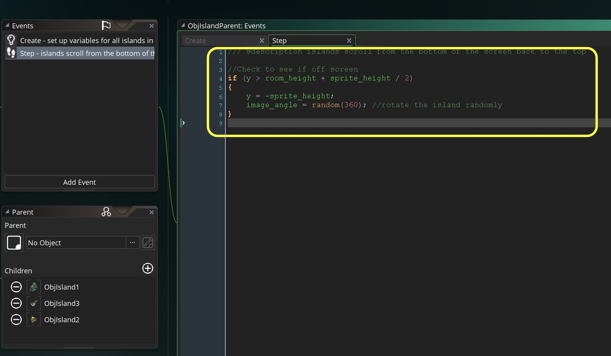
</div>
</div>
___ 
<div class = "row">
<div class="col-12 col-lg-4 align-self-center">
<div markdown = "1"> 

{:start="{{ num }}"}
{{ num }}. Run the game.  We have the Islands leaving the bottom of the screen and appearing at the top. 
</div>
</div>
<div class="col-12 col-lg-8">
<div class="embed-responsive embed-responsive-16by9">
<iframe class="embed-responsive-item"  src="https://www.youtube.com/embed/F-1d9foLebo?rel=0&amp;controls=0&amp&showinfo=0&autoplay=1&version=3&loop=1&playlist=F-1d9foLebo" frameborder="0" allowfullscreen></iframe>
</div>
</div>
</div>

___ 
<div class = "row">
<div class="col-12 col-lg-4 align-self-center">
<div markdown = "1"> 

{:start="{{ num }}"}
{{ num }}. Now lets randomize along the X axis so that it changes it up. Edit the `ObjIslandParent` **Step Event Script** and add a single line within the if statement `x = random(room_width);  //randomize the position on the x axis`
</div>
</div>
<div class="col-12 col-lg-8">
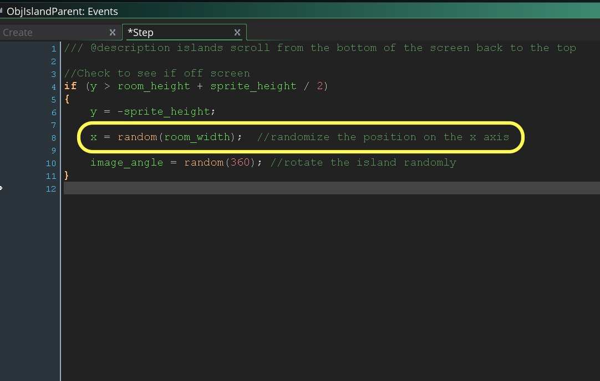
</div>
</div>

___ 
<div class = "row">
<div class="col-12 col-lg-4 align-self-center">
<div markdown = "1"> 

{:start="{{ num }}"}
{{ num }}. Run the game and what do you think.  Rather than looking different to me it looks quite bad.  The islands seem bunched or on top of each other and they are not spread out to nicely.  
</div>
</div>
<div class="col-12 col-lg-8">
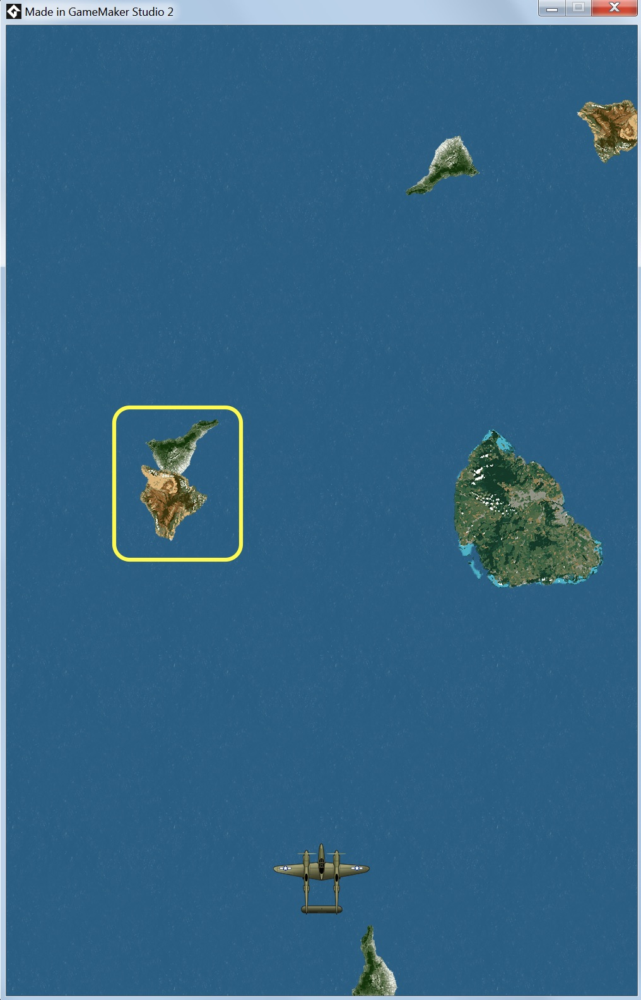
</div>
</div>

___ 
<div class="col-12">
<div markdown = "1"> 

{:start="{{ num }}"}
{{ num }}. Before we place the island we will need to check that the area it will be in is empty.  We will have to do some collision detection in script to check for free space.  We will get to that on the next page.
</div>
</div>
___ 

<br><br>
[<- Previous](ScrollingShooter_3.html)&nbsp;&nbsp;&nbsp;[Home](../../index.html)&nbsp;&nbsp;&nbsp; [Continue ->](ScrollingShooter_5.html)
<br />  
<br />  
<br />  
<br />  