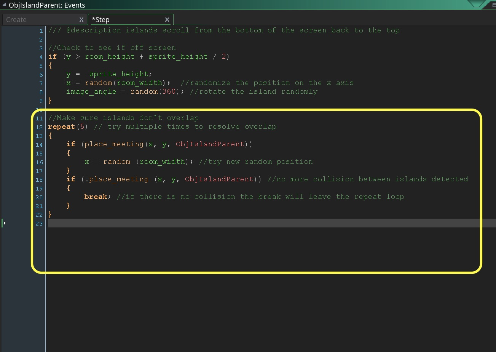

## Collision Detection
<div class="col-12 ">
<div markdown = "1"> 

{:start="{{ num }}"}
{{ num }}. For some simple collision detection we will look at a new function called `place_meeting()`. 

> **place_meeting(x, y, obj)**

<div class="table table-striped">
<div markdown = "1">
> | Argument | Description |
| -------- | -------- | 
| x | The x position to check. | 
| y | The y position to check. | 
| obj | The instance or object to check for. | 
</div>
</div>
> **Returns**: Boolean <br><br>**Description**: "With this function you can check a position for a collision with another instance or all instances of an object using the collision mask of the instance that runs the code for the check. When you use this you are effectively asking GameMaker: Studio to move the instance to the new position, check for a collision, move back and tell you if a collision was found or not. This function also accepts the special keywords all and other. Please note that should you need to get the unique instance id of the object being collided with, you should use instance_place." - [GameMaker Manual](https://docs2.yoyogames.com/source/_build/3_scripting/4_gml_reference/movement%20and%20collisions/collisions/place_meeting.html)

</div>
</div>

<div class="col-12 ">
<div markdown = "1"> 

___ 
<div class="col-12">
<div markdown = "1"> 

{:start="{{ num }}"}
{{ num }}. So if we attach this to our **_ObjIslandParent_** and look for collisions with ourselves we can find out if an island is overlapping an island.  If this function returns `true`, we have a problem.  Also what happens if it does collide, we re-randomize and it collides again?  We could put this in a **_while ()_** loop but if we have poor layout it may never resolve and we could be caught in an infinite loop, or more likely notice a slowdown in gameplay on any frame it struggles to re-randomize islands.  We will use repeat() to limit this problem.  After (n) attempts the game will stick with the overlapping islands:

> **Repeat Statement**<br><br>`Repeat (Real Number) { do something .... }`<br><br>"The statement is repeated the number of times indicated by the rounded value of the expression." - [GameMaker Manual](https://docs2.yoyogames.com/source/_build/3_scripting/3_gml_overview/14_language_features.html)
</div>
</div>

___ 
<div class = "row">
<div class="col-12 col-lg-4 align-self-center">
<div markdown = "1"> 

{:start="{{ num }}"}
{{ num }}. We are also introducing `break`.  This will leave the `repeat()` loop when triggered.  So we will stop trying to find an open spot until there is no lnoger a collision.  Edit the `ObjIslandParent` **Step Event Script** and add to the bottom: 
</div>
</div>
<div class="col-12 col-lg-8"> 
<div markdown = "1"> 
```c
//Make sure islands don't overlap
repeat(5) // try multiple times to resolve overlap
{
    if (place_meeting(x, y, ObjIslandParent))
    {
        x = random (room_width); //try new random position
    }
    if (!place_meeting (x, y, ObjIslandParent)) //no more collision between islands detected
    {
        break; //if there is no collision the break will leave the repeat loop
    }
}
```
</div>
</div>
</div>

 

___ 
<div class = "row">
<div class="col-12 col-lg-4 align-self-center">
<div markdown = "1"> 

{:start="{{ num }}"}
{{ num }}. Lets go through this line by line before we run it.  `repeat (5)` will limit us to 5 attempts of randomizing the `x` value without a collision. If it is more then it will stop trying and we will have to live with a visual glitch.  
</div>
</div>
<div class="col-12 col-lg-8">
<div markdown = "1"> 
```c 
repeat (5)
{
```  
</div>
</div>
</div>

___ 
<div class = "row">
<div class="col-12 col-lg-4 align-self-center">
<div markdown = "1"> 

{:start="{{ num }}"}
{{ num }}. This checks to see if there is a collision with another **_objectx_** of the same type.  If it returns `true ` then it re-randomizes the `x` value a.  
</div>
</div>
<div class="col-12 col-lg-8">
<div markdown = "1"> 
```c 
if (place_meeting(x, y, ObjIslandParent))
    {
        x = random (room_width);
    } 
```  
</div>
</div>
</div>

___ 
<div class = "row">
<div class="col-12 col-lg-4 align-self-center">
<div markdown = "1"> 

{:start="{{ num }}"}
{{ num }}. Now we have to recheck it, or catch the case if it is false.  In both cases we are hoping that the collision is resolved.  This time we check for the opposite, to see if the newly randomized position is in collision free:
</div>
</div>
<div class="col-12 col-lg-8">
<div markdown = "1"> 
```c
  if (!place_meeting (x, y, ObjIslandParent))
    {
        show_debug_message("no more collision")
        break;
    }
```
</div>
</div>
</div>

> **Logical Operators**
> Logical negation (NOT) using the ! reverses a boolean.  ! true == false and ! false == true.  We use the NOT ! operator in cases where we want to check for the opposite for the function allowing us to have one function to test both the positive and negative return.


{:start="{{ num }}"}
{{ num }}. So in the above we are now checking to see if there is NOT a collision.  If there is NO COLLISION (this statement resolves to true) we will break;.

> **The "Break" Statement**<br><br>"The **_break_** is used to end prematurely a for, repeat, while, do... until loop of some kind." - [GameMaker Manual](https://docs2.yoyogames.com/source/_build/3_scripting/3_gml_overview/14_language_features.html)

___ 
<div class="col-12">
<div markdown = "1"> 

{:start="{{ num }}"}
{{ num }}. So if there is no collision we break out of the loop and it no longer repeats. Run the game and now if you don't have too many islands it should never have a conflict.  

___ 

<br><br>

[<- Previous](ScrollingShooter_4.html)&nbsp;&nbsp;&nbsp;[Home](../../index.html)&nbsp;&nbsp;&nbsp; [Continue ->](ScrollingShooter_6.html)
<br />  
<br />  
<br />  
<br />  