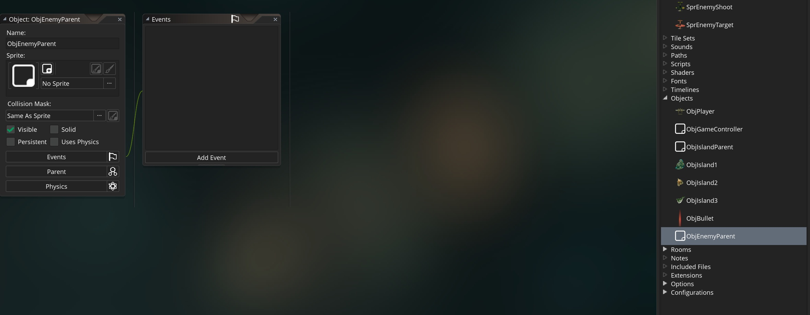

## Enemies
<div class = "row">
<div class="col-12 col-lg-4 align-self-center">
<div markdown = "1"> 

{:start="{{ num }}"}
{{ num }}. We will do this by importing strips.  We use this method when all frames are tiled on one sheet.  <br><br>The enemy sprites have 2 frames and they are 130 x 128 pixels.  We will import them as a sprite sheet (or strip).  Create a new **Sprite** by clickng on **Create** after right clicking on the **Sprite** menu in the **Resources** folder on the right hand side.  The press the **Edit Image** button.  Click the **Image** menu item on the top and select **Import strip image**:
</div>
</div>
<div class="col-12 col-lg-8">

</div>
</div>

___ 
<div class = "row">
<div class="col-12 col-lg-4 align-self-center">
<div markdown = "1"> 

{:start="{{ num }}"}
{{ num }}.  Select the **SprEnemyBasic** file and a **Convert to Frames** menu pops up.  Here we need to select how many frames and what size.  We do this with the following settings: So we have `2` frames, `2` frames per row, the width is `65` and the height is `64`.  Press the **Convert Button** and then confirm that you want to replace the existing sprite if you get a pop-up like below.  
</div>
</div>
<div class="col-12 col-lg-8">


</div>
</div>

___ 
<div class = "row">
<div class="col-12 col-lg-4 align-self-center">
<div markdown = "1"> 

{:start="{{ num }}"}
{{ num }}. Name the **Sprite** `SprEnemyBasic`.
</div>
</div>
<div class="col-12 col-lg-8">

</div>
</div>

___ 
<div class = "row">
<div class="col-12 col-lg-4 align-self-center">
<div markdown = "1"> 

{:start="{{ num }}"}
{{ num }}. Repeat the process for **SprEnemyShoot** and **SprEnemyTarget** and you should have:
</div>
</div>
<div class="col-12 col-lg-8">

</div>
</div> 

___ 
<div class = "row">
<div class="col-12 col-lg-4 align-self-center">
<div markdown = "1"> 

{:start="{{ num }}"}
{{ num }}. Now we will use an ObjEnemyParent to hold our common behavior as well as act as our collision object that we will be checking when firing bullets.  Create a new **Game Object** and call it `ObjEnemyParent`.  
</div>
</div>
<div class="col-12 col-lg-8">

</div>
</div> 

___ 
<div class = "row">
<div class="col-12 col-lg-4 align-self-center">
<div markdown = "1"> 

{:start="{{ num }}"}
{{ num }} Now create three new **Game Objects**:  `ObjEnemyBasic`, `ObjEnemyShoot` and `ObjEnemyTarget` with the correct sprites and inherit the parent `ObjEnemyParent`:
</div>
</div>
<div class="col-12 col-lg-8">

</div>
</div> 

___ 
<div class = "row">
<div class="col-12 col-lg-4 align-self-center">
<div markdown = "1"> 

{:start="{{ num }}"}
{{ num }}. All three planes fly downwards at the same speed.  One shoots straight down and the other shoots with targeting.  So the script we can share between all three planes is flying down at a constant speed.  Make sure this speed isn't the same as the water or it will look like the planes are floating on the water like a boat.  Create a new **Create Event Script** on `ObjEnemyParent` and add:
</div>
</div> 
<div class="col-12 col-lg-8">
<div markdown = "1"> 
```c
/// @description common enemy behaviors

//Move downwards at a different speed than water
direction = 270;
speed = 3;
```
</div>
</div>
</div>
<div class = "row">
<div class="col-6">

</div>
<div class="col-6">

</div>
</div>

___ 
<div class = "row">
<div class="col-12 col-lg-4 align-self-center">
<div markdown = "1"> 

{:start="{{ num }}"}
{{ num }}. Now we need to create a [timeline](../../GMS2Beginner/ExtendingFirstGame/SpaceRocksExtended_2.html#timelines) to launch our enemy waves. Create a new **Timeline** can call it `TmlLvl1
`:
</div>
</div>
<div class="col-12 col-lg-8">


</div>
</div>

___ 
<div class = "row">
<div class="col-12 col-lg-4 align-self-center">
<div markdown = "1"> 

{:start="{{ num }}"}
{{ num }}. Press the **Add** _button_ to add a moment, set it to `30` and put in the code box: 
</div>
</div>
<div class="col-12 col-lg-8">
<div markdown = "1"> 
```c
//straight line formation
spacing = room_width / 4;
height = 32;
instance_create_layer(spacing, -height, "Player", ObjEnemyBasic);
instance_create_layer(spacing * 2, -height, "Player", ObjEnemyBasic);
instance_create_layer(spacing * 3, -height, "Player", ObjEnemyBasic);
``` 
</div>
</div>
</div> 
  

___ 
<div class = "row">
<div class="col-12 col-lg-4 align-self-center">
<div markdown = "1"> 

{:start="{{ num }}"}
{{ num }}. Run the game and test it. <br><br> Hmmm, there are no ships.  What went wrong?  Woops, we forgot to initialinze the **timeline_index** and start the **timeline_running**.  Open up **Create Event Script** in `ObjGameController` and add to the bottom:  
</div>
</div>
<div class="col-12 col-lg-8">
<div markdown = "1"> 
```c
//set timeline and activate
timeline_index = TmlLvl1;
timeline_running = true;
``` 
</div>
</div>
</div>

___ 
<div class = "row">
<div class="col-12 col-lg-4 align-self-center">
<div markdown = "1"> 

{:start="{{ num }}"}
{{ num }}. Run the game again and after a second the first wave arrives!  
</div>
</div>
<div class="col-12 col-lg-8">

</div>
</div> 

___ 
<div class="col-12">
<div markdown = "1"> 

{:start="{{ num }}"}
{{ num }} We have a small problem with the enemies.  It is small now, but if we spawn many more it will become an even bigger issue later.  Can you figure it out? Go to the next page to find out what it is.
</div>
</div>
___ 

<br><br>
[<- Previous](ScrollingShooter_5.html)&nbsp;&nbsp;&nbsp;[Home](../../index.html)&nbsp;&nbsp;&nbsp; [Continue ->](ScrollingShooter_7.html)
<br />  
<br />  
<br />  
<br />  