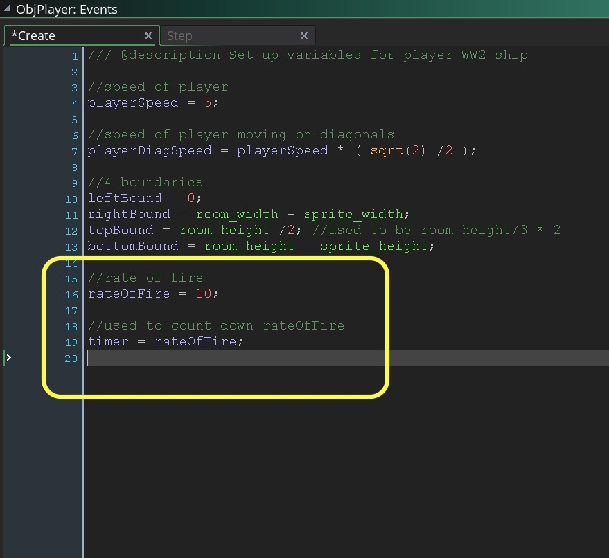
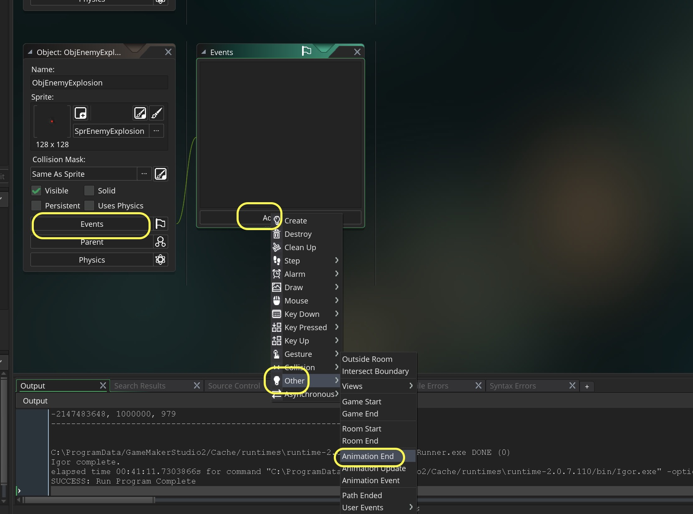

## Enemy Issue

<div class = "row">
<div class="col-12 col-lg-3 align-self-center">
<div markdown = "1"> 

{:start="{{ num }}"}
{{ num }}. So what is the problem with the enemies as we have them currently.  Try running the game in debug mode, let the enemies go off the screen, pause the game and look at your instances.  Make sure you press **Update real time instances** and have the **All Instances** window open:
</div>
</div>
<div class="col-12 col-lg-9">


</div>
</div>

___ 
<div class = "row">
<div class="col-12 col-lg-4 align-self-center">
<div markdown = "1"> 

{:start="{{ num }}"}
{{ num }}. The enemy planes have not been dealt with and we need to do some housecleaning. Create a new **Script** by pressing the **Add Event** button and adding a **Step Event Script** for `ObjEnemyParent`
</div>
</div>
<div class="col-12 col-lg-8">
<div markdown = "1"> 
```c
/// @description step event for all enemy planes

//destroy enemy plane if off screen
if (y > room_height + sprite_height)
{
    instance_destroy();
}
```
</div>
</div>
</div>

<div class="row">
<div class="col-6">

</div>
<div class="col-6">

</div>
</div>

___ 
<div class = "row">
<div class="col-12 col-lg-4 align-self-center">
<div markdown = "1"> 

{:start="{{ num }}"}
{{ num }}. Run the game in debug mode again and let the enemy run off the bottom of the screen.  Check your instances and make sure they are destroyed:  
</div>
</div>
<div class="col-12 col-lg-8">

</div>
</div>

## Shooting
<div class = "row">
<div class="col-12 col-lg-4 align-self-center">
<div markdown = "1"> 

{:start="{{ num }}"}
{{ num }}. Now we should add shooting and collision between bullets and enemies.  Create a new **Sprite**, press the **Import** _button_ and load from the folder you downloaded **SprPlayerBullet** and call it `SprPlayerBullet`.    
</div>
</div>
<div class="col-12 col-lg-8">

</div>
</div>

___ 
<div class = "row">
<div class="col-12 col-lg-4 align-self-center">
<div markdown = "1"> 

{:start="{{ num }}"}
{{ num }}. Create a new **Game Object** and call it `ObjPlayerBullet`.  Assign `SprPlayerBullet` to the sprite:  
</div>
</div>
<div class="col-12 col-lg-8">

</div>
</div>

___ 
<div class = "row">
<div class="col-12 col-lg-4 align-self-center">
<div markdown = "1"> 

{:start="{{ num }}"}
{{ num }}. Create a new **Create Event Script** on the newly created `ObjPlayerBullet` and add:  
</div>
</div>
<div class="col-12 col-lg-8">
<div markdown = "1"> 
```c
/// @description set up player bullet variables

//bullets for player go up screen
vspeed = -16;
```
</div>
</div>
</div>


___ 
<div class = "row">
<div class="col-12 col-lg-4 align-self-center">
<div markdown = "1"> 

{:start="{{ num }}"}
{{ num }}. We will use the same rate of fire algorithm we used in the [Rock Shooter game](../../GMS2Beginner/FirstGame/RockShooter_3.html#bullets).  Open the **Create Event Script** for `ObjPlayer` and add to bottom:  
</div>
</div>
<div class="col-12 col-lg-8">
<div markdown = "1"> 
```c
//rate of fire
rateOfFire = 10;

//used to count down rateOfFire
timer = rateOfFire;
```
</div>
</div>
</div>


___ 
<div class = "row">
<div class="col-12 col-lg-4 align-self-center">
<div markdown = "1"> 

{:start="{{ num }}"}
{{ num }}. Open `RmLvl1` and add a new **Instance Layer** to the room and call it `Bullets` and place it between `Player` and `Islands`:
</div>
</div>
<div class="col-12 col-lg-8">

</div>
</div>

___ 
<div class = "row">
<div class="col-12 col-lg-4 align-self-center">
<div markdown = "1"> 

{:start="{{ num }}"}
{{ num }}. Open the **Step Event Script** for `ObjPlayer` and add to the end:  
</div>
</div>
<div class="col-12 col-lg-8">
<div markdown = "1"> 
```c
//Fire bullets with spacebar
if (keyboard_check(vk_space) and timer == rateOfFire)
{
    instance_create_layer(x, y, "Bullets", ObjPlayerBullet);
    timer = 0;    
}
else
{
    if (timer < rateOfFire)
    {
        timer++;
    }
    //same as rateOfFire += 1; or rateOfFire = rateOfFire + 1;
}
```
</div>
</div>
</div>

___ 
<div class = "row">
<div class="col-12 col-lg-4 align-self-center">
<div markdown = "1"> 

{:start="{{ num }}"}
{{ num }}. Run the game and test your work.  Notice that bullet is being launched from the origin of the player object (makes sense).   We want to launch it from the center.  Adjust the spawning on the `x` to be in the center (**don't** adjust the origin of the sprite).  When firing it should look like:
</div>
</div>
<div class="col-12 col-lg-8">

</div>
</div>

___ 
<div class = "row">
<div class="col-12 col-lg-4 align-self-center">
<div markdown = "1"> 

{:start="{{ num }}"}
{{ num }}.  Now lets destroy the bullet if it leaves the room.  We don't want the game to run out of memory because we have too many bullets.  We will use the **Other -> Outside Room** event type on the bullet.  Create a new one on `ObjBullet` and add  
</div>
</div>
<div class="col-12 col-lg-8">
<div markdown = "1"> 
```c
instance_destroy();
```
</div>
</div>
</div>

___ 
<div class = "row">
<div class="col-12 col-lg-4 align-self-center">
<div markdown = "1"> 

{:start="{{ num }}"}
{{ num }}.  Open `ObjPlayerBullet` and add a new **Event -> Other -> Outside Room**:
</div>
</div>
<div class="col-12 col-lg-8">
<div markdown = "1"> 
```c
/// @description destroy bullet

instance_destroy();
```
</div>
</div>
</div>
<div class="row">
<div class="col">

</div>
<div class="col">

</div>
</div>

___ 
<div class = "row">
<div class="col-12 col-lg-4 align-self-center">
<div markdown = "1"> 

{:start="{{ num }}"}
{{ num }}. Test the game in debug mode and make sure the bullet dissapear:
</div>
</div>
<div class="col-12 col-lg-8">
<div class="embed-responsive embed-responsive-16by9">
<iframe class="embed-responsive-item" src="https://www.youtube.com/embed/Z1d2YAH9AM4?rel=0&amp;controls=0&amp&showinfo=0&autoplay=1&version=3&loop=1&playlist=Z1d2YAH9AM4" frameborder="0" allowfullscreen></iframe>
</div>
</div>
</div>

___ 
<div class = "row">
<div class="col-12 col-lg-4 align-self-center">
<div markdown = "1"> 

{:start="{{ num }}"}
{{ num }}. Now lets deal with the bullet enemy collision.  Create a new **Collision Event Script** in `ObjBullet` with a **Collision -> ObjEnemyParent**:
</div>
</div>
<div class="col-12 col-lg-8">

</div>
</div>

___ 
<div class = "row">
<div class="col-12 col-lg-4 align-self-center">
<div markdown = "1"> 

{:start="{{ num }}"}
{{ num }}. Now add to the script: 
</div>
</div>
<div class="col-12 col-lg-8">
<div markdown = "1"> 
```c
/// @description bullet ship collision

//kill the enemy object
with (other)
{
instance_destroy();
}

//kill the bullet
instance_destroy();
```
</div>
</div>
</div>


___ 
<div class = "row">
<div class="col-12 col-lg-4 align-self-center">
<div markdown = "1"> 

{:start="{{ num }}"}
{{ num }}. Play the game and make sure that when a bullet hits an enemy plane that it destroys both the bullet and the plane.<br><br>Lets add some visual fluff and add an explosion animation.  Create a new **Sprite** and and call it `SprEnemyExplosion`.  Click on the **Edit Image** button:  
</div>
</div>
<div class="col-12 col-lg-8">

</div>
</div>

___ 
<div class = "row">
<div class="col-12 col-lg-4 align-self-center">
<div markdown = "1"> 

{:start="{{ num }}"}
{{ num }}. Since this is 5 frames long, I didn't provide separate files.  I provided them in a single animation sheet or strip.  This means you can import a longer sequence from one file.  In this case each frame is 128 x 128 pixels and they are on a single row.  To import this we need to clock on the **Image** menu item at the top and select **Import Strip Image**.
</div>
</div>
<div class="col-12 col-lg-8">

</div>
</div>

___ 
<div class = "row">
<div class="col-12 col-lg-4 align-self-center">
<div markdown = "1"> 

{:start="{{ num }}"}
{{ num }}. Select the file **EnemyExplosionStrip** and load it.
</div>
</div>
<div class="col-12 col-lg-8">

</div>
</div>

___ 
<div class = "row">
<div class="col-12 col-lg-4 align-self-center">
<div markdown = "1"> 

{:start="{{ num }}"}
{{ num }}. This brings up the **Convert to Frames** menu.  In this menu we select the size of each individual frame, how many there are and whether there are any offsets or margins.
</div>
</div>
<div class="col-12 col-lg-8">

</div>
</div>

___ 
<div class = "row">
<div class="col-12 col-lg-4 align-self-center">
<div markdown = "1"> 

{:start="{{ num }}"}
{{ num }}. Now I know there are 5 frames and they are in a single row.  So I select `5` **Number of Frames** and `5` **Frames per Row**.  Now you can see the default size is `32` x `32` and they show where the five frames line up in the artwork with white boxes:
</div>
</div>
<div class="col-12 col-lg-8">

</div>
</div>

___ 
<div class = "row">
<div class="col-12 col-lg-4 align-self-center">
<div markdown = "1"> 

{:start="{{ num }}"}
{{ num }}. Now I made the sprites each `128` x `128`.  So this is the size I will select for **Frame Width** and **Frame Height**.  See now how the 5 boxes fit perfectly with my strip.
</div>
</div>
<div class="col-12 col-lg-8">


</div>
</div>

___ 
<div class = "row">
<div class="col-12 col-lg-4 align-self-center">
<div markdown = "1"> 

{:start="{{ num }}"}
{{ num }}. Press the **Convert** _button_ then select **yes** to confirm that you will be replacing the frames:
</div>
</div>
<div class="col-12 col-lg-8">


</div>
</div>

___ 
<div class = "row">
<div class="col-12 col-lg-4 align-self-center">
<div markdown = "1"> 

{:start="{{ num }}"}
{{ num }}. Now hit the **play** button and you should see:
</div>
</div>
<div class="col-12 col-lg-8">
<div class="embed-responsive embed-responsive-16by9">
<iframe class="embed-responsive-item" src="https://www.youtube.com/embed/8bu6U_MU0u0?rel=0&amp;controls=0&amp&showinfo=0&autoplay=1&version=3&loop=1&playlist=8bu6U_MU0u0" frameborder="0" allowfullscreen></iframe>
</div>
</div>
</div>

___ 
<div class = "row">
<div class="col-12 col-lg-4 align-self-center">
<div markdown = "1"> 

{:start="{{ num }}"}
{{ num }}. Create a new **Game Object** called `ObjEnemyExplosion` and bind the explosion animation you just imported to it:
</div>
</div>
<div class="col-12 col-lg-8">

</div>
</div>

___ 
<div class = "row">
<div class="col-12 col-lg-4 align-self-center">
<div markdown = "1"> 

{:start="{{ num }}"}
{{ num }}. Now we will trigger the explosion animation in a collision event between the `ObjBullet` and the `ObjEnemyParent`.  Why the parent?  This way any enemy that inherits from `ObjEnemyParent` will trigger this event, which is exactly what we want with three types of planes.  Open the `ObjBullet` **Collision Event Script** and add at the end:
</div>
</div>
<div class="col-12 col-lg-8">
<div markdown = "1"> 
```c
//put explosion animation at same position as enemy on Player layer
instance_create_layer(other.x, other.y, "Player", ObjEnemyExplosion);
```
</div>
</div>
</div>


___ 
<div class = "row">
<div class="col-12 col-lg-4 align-self-center">
<div markdown = "1"> 

{:start="{{ num }}"}
{{ num }} Now run the game and adjust the speed on the **Sprite** `SprEnemyExplosion`.  One of the ince things about the new version of GameMaker is that the framerate is global to the game and that you can adjust the animation speed within the sprite.  You no longer have to set it with `image_speed` (which you can still do if you would like).  Explore different speeds and play the game to see what happens. Once you get the speed you like you can stop adjusting it and move on.  It should look like:
</div>
</div>
<div class="col-12 col-lg-8">
<div class="embed-responsive embed-responsive-16by9">
<iframe class="embed-responsive-item" src="https://www.youtube.com/embed/OzeJXQ8eBEwif (y > room_height + sprite_height)?rel=0&amp;controls=0&amp&showinfo=0&autoplay=1&version=3&loop=1&playlist=OzeJXQ8eBEw" frameborder="0" allowfullscreen></iframe>
</div>
</div>
</div>

___ 
<div class = "row">
<div class="col-12">
<div markdown = "1"> 

{:start="{{ num }}"}
{{ num }}. It creates the explosion but it keeps going and going.  We need it to stop playing after once.  Conveniently there is an **Event Type** that triggers when an animation finishes:

> **Animation End**<br><br>In GameMaker Studio 2 sprites are not static things as they can have sub-images and be animated at different speeds. Each frame of an animation (called a sub-image) has its own number, starting at 0, which can be checked in code or even through actions, but sometimes all you really need to know is when the animation has ended. That's when this event is triggered, right at the end of the animation when the sub image index shows that the last frame has been reached. This event is really useful for many things, for example an explosion object where you can set the instance to destroy itself when the last frame of the animation is reached. [GameMaker Manual](https://docs2.yoyogames.com/source/_build/2_interface/1_editors/events/index.html)
</div>
</div>
</div>

___ 
<div class = "row">
<div class="col-12 col-lg-4 align-self-center">
<div markdown = "1"> 

{:start="{{ num }}"}
{{ num }}. Open up `ObjEnemyExplosion` and press **Events -> Add Event -> Other -> Animation End**
</div>
</div>
<div class="col-12 col-lg-8">

</div>
</div>

___ 
<div class = "row">
<div class="col-12 col-lg-4 align-self-center">
<div markdown = "1"> 

{:start="{{ num }}"}
{{ num }}. Add to the script:
</div>
</div>
<div class="col-12 col-lg-8">
<div markdown = "1"> 
```c
/// @description destroy when completed

instance_destroy();
```
</div>
</div>
</div>

___ 
<div class = "row">
<div class="col-12 col-lg-4 align-self-center">
<div markdown = "1"> 

{:start="{{ num }}"}
{{ num }} Thine other thing I don't like is that the explosion is not centered on the player sprite.  The explosion is larger and since the origin is the top left for both it looks like it is blowing up a to the right and bottom.  Open `ObjEnemyExplosion`, add a new **Create Event Script** and add:
</div>
</div>
<div class="col-12 col-lg-8">
<div markdown = "1"> 
``` c
/// @description adjust centering

x -= 32;
y -= 32;
```
</div>
</div>
</div>

___ 
<div class = "row">
<div class="col-12 col-lg-4 align-self-center">
<div markdown = "1"> 

{:start="{{ num }}"}
{{ num }}. Now play the game and you will see that it is destroyed after a single animation play through as expected:
</div>
</div>
<div class="col-12 col-lg-8">
<div class="embed-responsive embed-responsive-16by9">
<iframe class= "embed-responsive-item" src="https://www.youtube.com/embed/meI8h9T56EM?rel=0&amp;controls=0&amp&showinfo=0&autoplay=1&version=3&loop=1&playlist=meI8h9T56EM" frameborder="0" allowfullscreen></iframe>
</div>
</div>
</div>

___ 
<div class="col-12">
<div markdown = "1"> 

{:start="{{ num }}"}
{{ num }}.  Next we will create a shooting enemy.
</div>
</div>
___ 

<br><br>
[<- Previous](ScrollingShooter_6.html)&nbsp;&nbsp;&nbsp;[Home](../../index.html)&nbsp;&nbsp;&nbsp; [Continue ->](ScrollingShooter_8.html)
<br />  
<br />  
<br />  
<br />  