## Shooting Enemy Plane
<div class = "row">
<div class="col-12 col-lg-4 align-self-center">
<div markdown = "1"> 

{:start="{{ num }}"}
{{ num }}. Create a wave of the new planes.  Open **TmlLvl1** and **Add** another **Moment** at `220` (or 4 seconds in) with a V wave of four enemy shooters. Add to the script:
</div>
</div>
<div class="col-12 col-lg-8">
<div markdown = "1"> 
``` c
//straight line formation with flanking shooters in V formation

spacing = room_width / 5;
height = 32;

instance_create_layer(spacing, -height * 2, "Player", ObjEnemyShoot);
instance_create_layer(spacing * 2, -height, "Player", ObjEnemyShoot);
instance_create_layer(spacing * 3, -height, "Player", ObjEnemyShoot);
instance_create_layer(spacing * 4, -height * 2,"Player", ObjEnemyShoot);
```
</div>
</div>
</div>
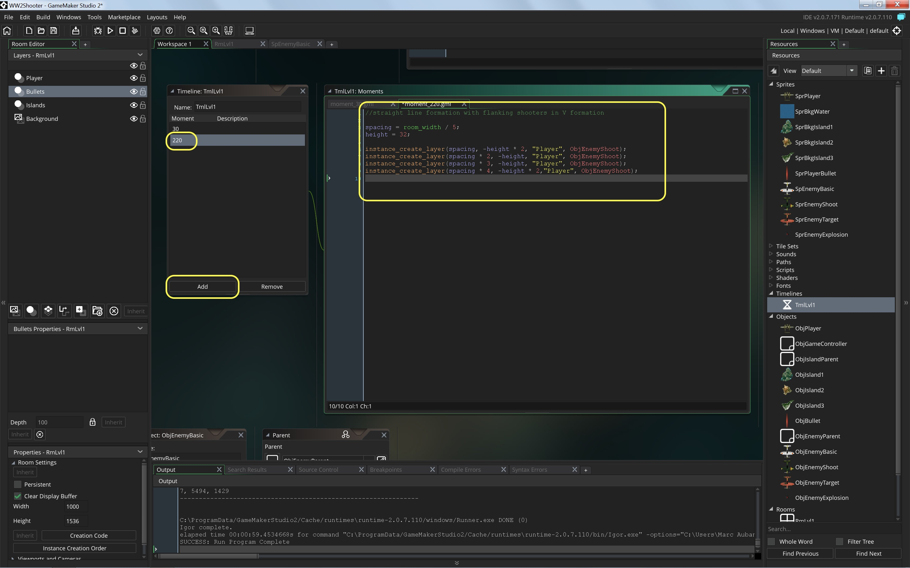  

___ 
<div class = "row">
<div class="col-12 col-lg-4 align-self-center">
<div markdown = "1"> 

{:start="{{ num }}"}
{{ num }}. Play game and we should see the shooters follow the first set of planes.  Now we need to make the shooters, shoot.
</div>
</div>
<div class="col-12 col-lg-8">
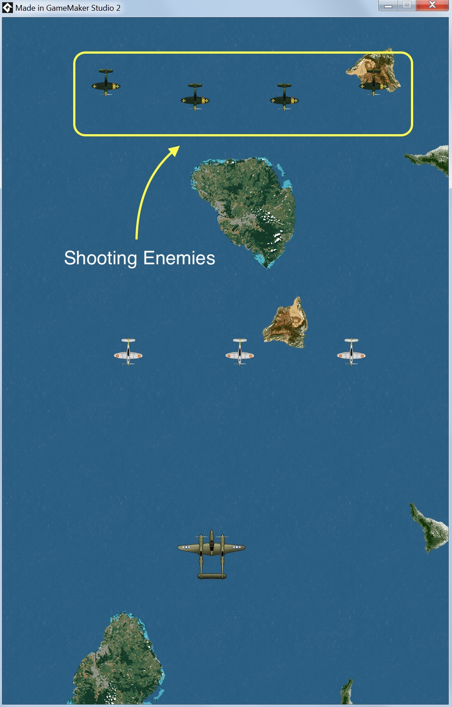
</div>
</div>

___ 
<div class = "row">
<div class="col-12 col-lg-4 align-self-center">
<div markdown = "1"> 

{:start="{{ num }}"}
{{ num }} Create a new **Sprite** and call it `SprEnemyBullet`.   Load **SprEnemyBullet** by pressing the **Import** _button_:
</div>
</div>
<div class="col-12 col-lg-8">
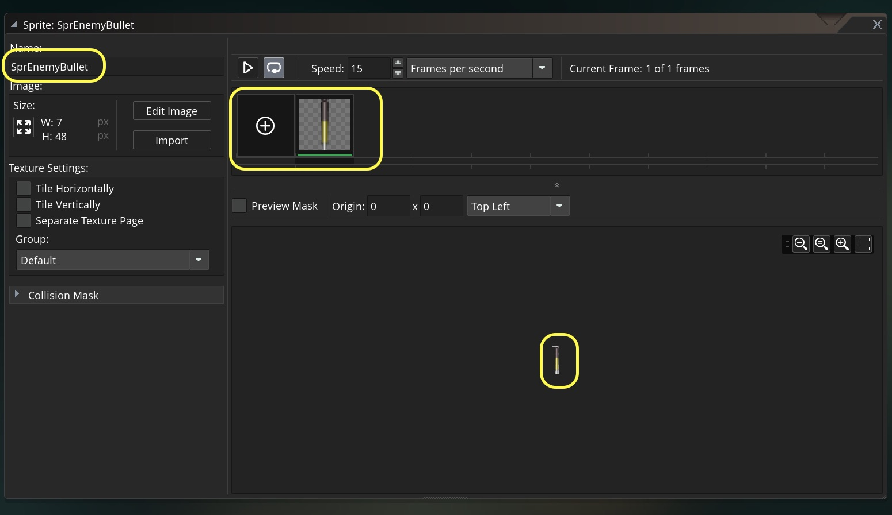
</div>
</div>

___ 
<div class = "row">
<div class="col-12 col-lg-4 align-self-center">
<div markdown = "1"> 

{:start="{{ num }}"}
{{ num }}. Create a new **Game Object** and call it `ObjEnemyBullet` and bind the above sprite to it:  
</div>
</div>
<div class="col-12 col-lg-8">
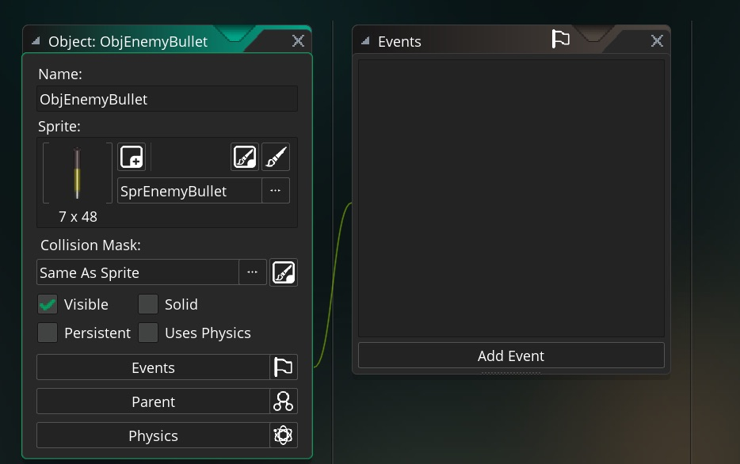
</div>
</div> 

___ 
<div class = "row">
<div class="col-12 col-lg-4 align-self-center">
<div markdown = "1"> 

{:start="{{ num }}"}
{{ num }} Create a new **Create Event Script_** and add:
</div>
</div>
<div class="col-12 col-lg-8">
<div markdown = "1"> 
```c
/// @description Bullet goes down

vspeed = 7;
```
</div>
</div>
</div>

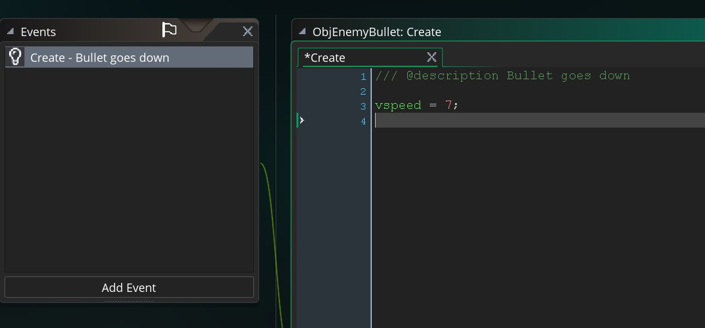
<br />  

___ 
<div class = "row">
<div class="col-12 col-lg-4 align-self-center">
<div markdown = "1"> 

{:start="{{ num }}"}
{{ num }}. Our bullet is now set up.  We will fire the bullet from the enemy plane that fires and we need to add a rate of fire.  Lets create a new **Create Event Script** on `ObjEnemyShoot` and add:
</div>
</div>
<div class="col-12 col-lg-8">
<div markdown = "1"> 
```c
/// @description add rate of fire

//rate of fire
rateOfFire = 15;
//used to count down rateOfFire
timer = 0;
```
</div>
</div>
</div>

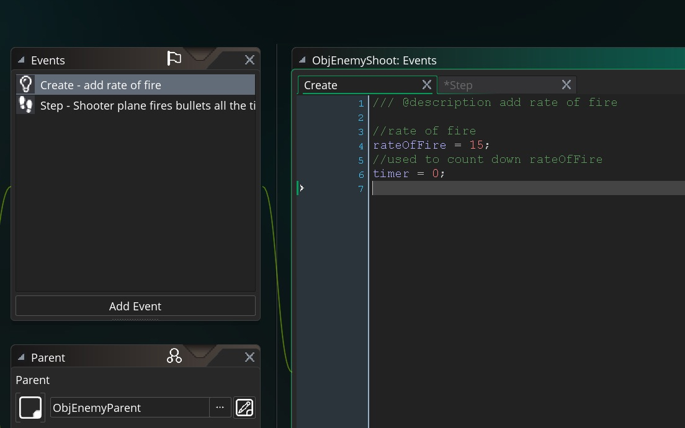

___ 
<div class = "row">
<div class="col-12 col-lg-4 align-self-center">
<div markdown = "1"> 

{:start="{{ num }}"}
{{ num }}  The create a new **Step -> Step Event Script** on `ObjEnemyShoot` and add:
</div>
</div>
<div class="col-12 col-lg-8">
<div markdown = "1"> 
``` c
/// @description Shooter plane fires bullets all the time
if (timer == rateOfFire)
{
    instance_create_layer(x, y,"Bullets", ObjEnemyBullet);
    timer = 0;    
}
else
{
    if (timer < rateOfFire)
    {
        timer++;
    }
}
```
</div>
</div>
</div>
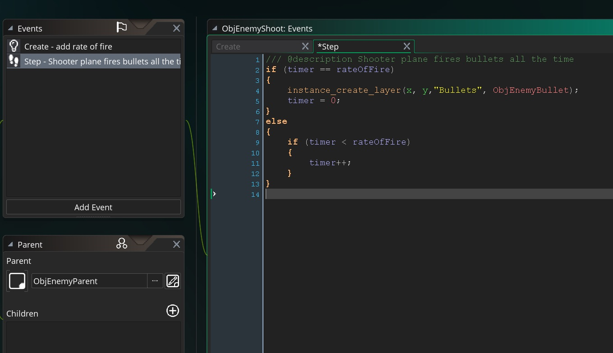

___ 
<div class = "row">
<div class="col-12 col-lg-4 align-self-center">
<div markdown = "1"> 

{:start="{{ num }}"}
{{ num }}. Play the game and you should see something like:
</div>
</div>
<div class="col-12 col-lg-8">
<div class="embed-responsive embed-responsive-16by9">
<iframe class="embed-responsive-item" src="https://www.youtube.com/embed/R8Crj8C6VfU?rel=0&amp;controls=0&amp&showinfo=0&autoplay=1&version=3&loop=1&playlist=R8Crj8C6VfU" frameborder="0" allowfullscreen></iframe>
</div>
</div>
</div>

___ 
<div class = "row">
<div class="col-12 col-lg-4 align-self-center">
<div markdown = "1"> 

{:start="{{ num }}"}
{{ num }}.  Run the game and look at what you see.  We have a problem.  The enemy planes are not moving downward at any speed.  What script is supposed to drive this?  Take a look at the script on `ObjEnemyParent` **Create Event Script**.  Why is it not running?
</div>
</div>
<div class="col-12 col-lg-8">
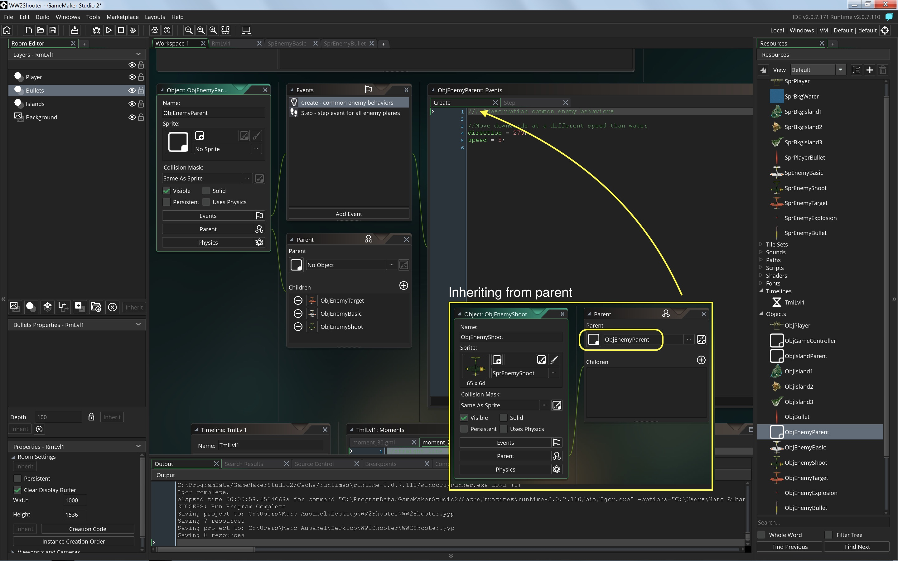
</div>
</div>

___ 
<div class = "row">
<div class="col-12 col-lg-4 align-self-center">
<div markdown = "1"> 

{:start="{{ num }}"}
{{ num }}. It is inheriting a **Create Event** from its parent but we are overriding it with the newly written **Create** event on `ObjEnemyBullet`:
</div>
</div>
<div class="col-12 col-lg-8">
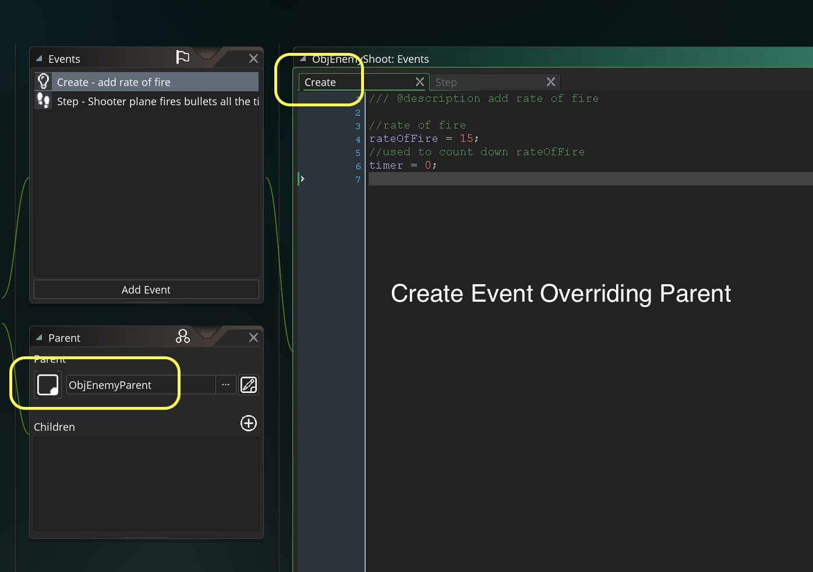
</div>
</div>

___ 
<div class="col-12">
<div markdown = "1"> 

{:start="{{ num }}"}
{{ num }}. We now have a problem as we have our `ObjEnemyShooter` which inherits a create and step event from the parent.  If I add another Create and Step event it will override the parent, but we want to use both!  We need to look at:

> **event_inherited()**<br><br>**Returns**: N/A(void)<br><br>**Description**: "This function will call the current event of the parent object of the instance. Normally, when an instance has a parent object, it automatically inherits all the same events as the parent, but if (for example) your parent object has a create event and you add one to your child object, all instances of the child object will run the new create event that you have added and not that which is in the parent object. Should you need to use both the parent object event and the child object event of the same type, you should use this function as it will run the parent object event before continuing with the rest of the code or actions that the child event contains" - GameMaker Manual


___ 
<div class = "row">
<div class="col-12 col-lg-4 align-self-center">
<div markdown = "1"> 

{:start="{{ num }}"}
{{ num }}. Add the **_event_inheritted_** script.  Add to both **Create Event Script** and **Step Event Script** as the first line executed on `ObjEnemyShooter`:  
</div>
</div>
<div class="col-12 col-lg-8">
<div markdown = "1"> 
```c
//Inherits enemy parent create event
event_inherited();
```
</div>
</div>
</div>
<div class="row">
<div class="col">
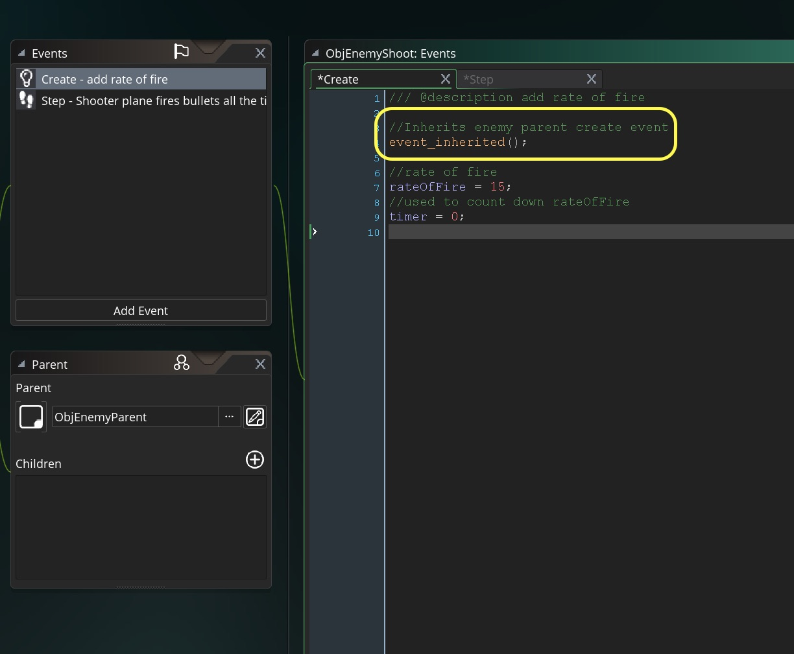
</div>
<div class="col">
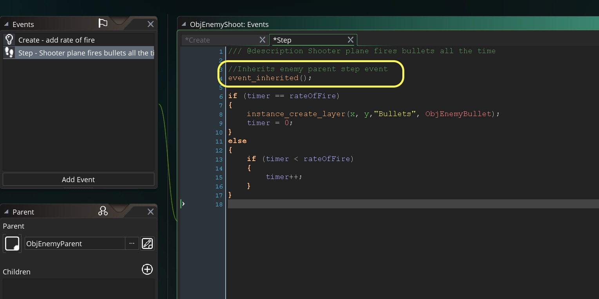
</div>
</div>

___ 
<div class = "row">
<div class="col-12 col-lg-4 align-self-center">
<div markdown = "1"> 

{:start="{{ num }}"}
{{ num }}. Run the game and you should see the enemies running the parent scripts and their own.  It should look like:
</div>
</div>
<div class="col-12 col-lg-8">
<div class="embed-responsive embed-responsive-16by9">
<iframe class="embed-responsive-item" src="https://www.youtube.com/embed/P5BHFCdHC_o?rel=0&amp;controls=0&amp&showinfo=0&autoplay=1&version=3&loop=1&playlist=P5BHFCdHC_o" frameborder="0" allowfullscreen></iframe>
</div>
</div>
</div>

___ 
<div class = "row">
<div class="col-12 col-lg-4 align-self-center">
<div markdown = "1"> 

{:start="{{ num }}"}
{{ num }}.  Adjust the rate of fire and the positioning of the bullet so that it is in the middle of the plane and that the bullets are not right on top of each other.  I also adjusted the speed of the enemy bullets. I will let you figure out on your own.    Mine now looks like:
</div>
</div>
<div class="col-12 col-lg-8">
<div class="embed-responsive embed-responsive-16by9">
<iframe class="embed-responsive-item" src="https://www.youtube.com/embed/RItBel1PEeg?rel=0&amp;controls=0&amp&showinfo=0&autoplay=1&version=3&loop=1&playlist=RItBel1PEeg" frameborder="0" allowfullscreen></iframe>
</div>
</div>
</div>

___ 
<div class = "row">
<div class="col-12 col-lg-4 align-self-center">
<div markdown = "1"> 

{:start="{{ num }}"}
{{ num }}. Looks better, but still one big issue.  The bullets are not destroying themselves when leaving the screen:
</div>
</div>
<div class="col-12 col-lg-8">
<div class="embed-responsive embed-responsive-16by9">
<iframe class="embed-responsive-item" src="https://www.youtube.com/embed/EUX77_ESDz0?rel=0&amp;controls=0&amp&showinfo=0&autoplay=1&version=3&loop=1&playlist=EUX77_ESDz0" frameborder="0" allowfullscreen></iframe>
</div>
</div>
</div>

___ 
<div class = "row">
<div class="col-12 col-lg-4 align-self-center">
<div markdown = "1"> 

{:start="{{ num }}"}
{{ num }}.  Open `ObjEnemyBullet`.  Create a new **Add Event -> Other -> Outside Room Script** and add:
</div>
</div>
<div class="col-12 col-lg-8">
<div markdown = "1"> 
```c
/// @description destroy when bullet leaves room

instance_destroy();
```
</div>
</div>
</div>

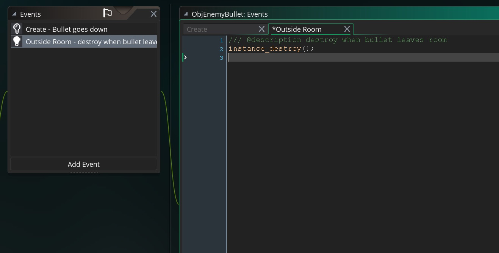

___ 
<div class = "row">
<div class="col-12 col-lg-4 align-self-center">
<div markdown = "1"> 

{:start="{{ num }}"}
{{ num }}. So it should now look like:
</div>
</div>
<div class="col-12 col-lg-8">
<div class="embed-responsive embed-responsive-16by9">
<iframe class="embed-responsive-item" src="https://www.youtube.com/embed/7sKFJUEfC2M?rel=0&amp;controls=0&amp&showinfo=0&autoplay=1&version=3&loop=1&playlist=7sKFJUEfC2M" frameborder="0" allowfullscreen></iframe>
</div>
</div>
</div>

___ 
<div class="col-12">
<div markdown = "1"> 

{:start="{{ num }}"}
{{ num }}.  Next up, planes that shoot at player instead of straight ahead.
</div>
</div>
___ 

<br><br>
[<- Previous](ScrollingShooter_7.html)&nbsp;&nbsp;&nbsp;[Home](../../index.html)&nbsp;&nbsp;&nbsp; [Continue ->](ScrollingShooter_9.html)
<br />  
<br />  
<br />  
<br />  