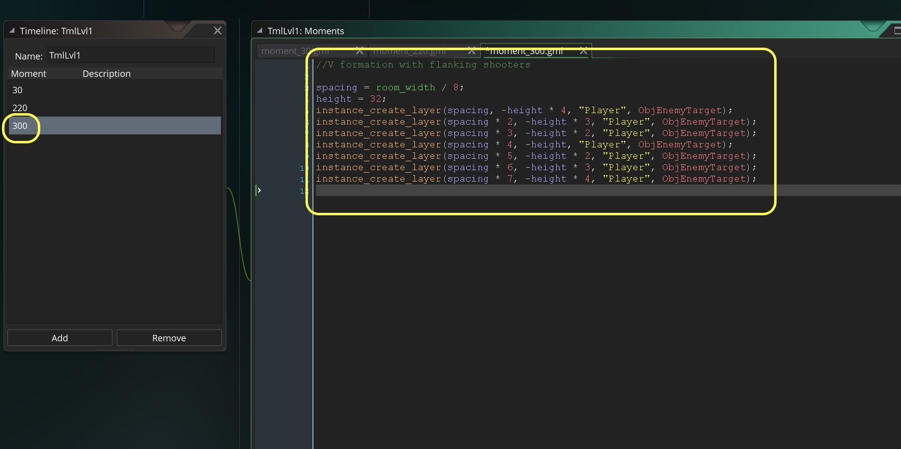

## Enemy Target Plane
<div class = "row">
<div class="col-12 col-lg-4 align-self-center">
<div markdown = "1"> 

{:start="{{ num }}"}
{{ num }}. OK, lets move on to the third enemy type `ObjEnemyTarget`. Create a wave of the new planes.   Open **TmlLvl1** and **Add** another **Moment** at `300` (or 10 seconds in) with a V wave of four enemy targeting shooters. Add to the script:
</div>
</div>
<div class="col-12 col-lg-8">
<div markdown = "1"> 
```c
//V formation with flanking shooters 

spacing = room_width / 8;
height = 32;
instance_create_layer(spacing, -height * 4, "Player", ObjEnemyTarget);
instance_create_layer(spacing * 2, -height * 3, "Player", ObjEnemyTarget);
instance_create_layer(spacing * 3, -height * 2, "Player", ObjEnemyTarget);
instance_create_layer(spacing * 4, -height, "Player", ObjEnemyTarget);
instance_create_layer(spacing * 5, -height * 2, "Player", ObjEnemyTarget);
instance_create_layer(spacing * 6, -height * 3, "Player", ObjEnemyTarget);
instance_create_layer(spacing * 7, -height * 4, "Player", ObjEnemyTarget);
``` 
</div>
</div>
</div>

 

___ 
<div class = "row">
<div class="col-12 col-lg-4 align-self-center">
<div markdown = "1"> 

{:start="{{ num }}"}
{{ num }}. Test the game by running it.  OK, we should now have a third wave of enemies.  We need to make them shoot but also target the player.
</div>
</div>
<div class="col-12 col-lg-8">
 
</div>
</div>

___ 
<div class = "row">
<div class="col-12 col-lg-4 align-self-center">
<div markdown = "1"> 

{:start="{{ num }}"}
{{ num }}. Lets create a new **Create Event Script** on `ObjEnemyTarget`.  We need to inherit from the parent create event script, add a rate of fire and set a timer switch for auto firing.  Lets add:
</div>
</div>
<div class="col-12 col-lg-8">
<div markdown = "1"> 
```c
/// @description targetting enemy behavior

//Inherits enemy parent create event
event_inherited();
//rate of fire
rateOfFire = 90;
//used to count down rateOfFire
timer = 0;
```
</div>
</div>
</div>
 

___ 
<div class="col-12 ">
<div markdown = "1"> 

{:start="{{ num }}"}
{{ num }}. Now how to we make the enemies target?  We need to calculate an angle between the enemy shooting and the player.  We don't need to use any trig as there is a GameMaker function that does the work for us:

> **point_direction (x1, y1, x2, y2)**<br><br>Returns the direction, in degrees as a real number.
<div class="table table-striped">
<div markdown = "1">
> | Argument | Description |
| -------- | -------- | 
| x1 | The x coordinate of the first component of the vector |
| y1 | The y coordinate of the first component of the vector |
| x2 | The x coordinate of the second component of the vector |
| y2 | The y coordinate of the second component of the vector |
</div>
</div>

> **Description**: "This function returns the direction of a vector formed by the specified components [x1,y1] and [x2,y2] in relation to the fixed x/y coordinates of the room." - [GameMaker Manual](https://docs2.yoyogames.com/source/_build/3_scripting/4_gml_reference/maths/vector%20functions/point_direction.html)
</div>
</div>

___ 
<div class = "row">
<div class="col-12 col-lg-4 align-self-center">
<div markdown = "1"> 

{:start="{{ num }}"}
{{ num }}. Create a new **Step -> Step Event Script** on `ObjEnemyTarget` and add: 
</div>
</div>
<div class="col-12 col-lg-8">
<div markdown = "1"> 
```c
/// @description targeting enemy behavior
//Inherits enemy parent step event
event_inherited();
if (timer == rateOfFire)
{
    bullet = instance_create_layer(x, y, "Bullets", ObjEnemyBullet);
    bullet.direction = (point_direction (x, y, ObjPlayer.x, ObjPlayer.y) );
    timer = 0;    
}
else
{
    if (timer < rateOfFire)
    {
        timer++;
    }
}
```
</div>
</div>
</div>

 

___ 
<div class = "row">
<div class="col-12 col-lg-4 align-self-center">
<div markdown = "1"> 

{:start="{{ num }}"}
{{ num }}. Run the game and check to see the targeting enemies.  The enemies are OK but there are many things we could improve. We'll return so lets move onto the player actually taking damage from enemy bullets. Your game should now look like:
</div>
</div>
<div class="col-12 col-lg-8">
<div class="embed-responsive embed-responsive-16by9">
<iframe class="embed-responsive-item" src="https://www.youtube.com/embed/Biao9F13sgQ?rel=0&amp;controls=0&amp&showinfo=0&autoplay=1&version=3&loop=1&playlist=Biao9F13sgQ" frameborder="0" allowfullscreen></iframe>
</div>
</div>
</div>

___ 

## Player Health

<div class="col-12">
<div markdown = "1"> 

{:start="{{ num }}"}
{{ num }}.  We now want the plane to take on damage from being hit.  Since the plane has health and not a one hit kill, lets implement health first.
</div>
</div>

___ 
<div class="col-12">
<div markdown = "1"> 

{:start="{{ num }}"}
{{ num }}. OK, lets add health, a health bar.  First we need to use another global variable that is of game scope (for the entire game) called **_health_**:
</div>
</div>

___ 
<div class = "row">
<div class="col-12 col-lg-4 align-self-center">
<div markdown = "1"> 

{:start="{{ num }}"}
{{ num }}. Double click `ObjGameController` and click on the **Create Event Script** and add at the bottom:  
</div>
</div>
<div class="col-12 col-lg-8">
<div markdown = "1"> 
```c
//Player Health
playerHealth = 100;
```
</div>
</div>
</div>

 

___ 
<div class="col-12">
<div markdown = "1"> 

{:start="{{ num }}"}
{{ num }}. This does nothing on its own, but will be displayed as health on screen.  Lets draw a healthbar for the player.  GameMaker provides us with a nifty function that automates the hard work.  

> **draw_healthbar(x1, y1, x2, y2, amount, backcol, mincol, maxcol, direction, showback, showborder)**
<div class="table table-striped">
<div markdown = "1">
> | Argument | Description |
| -------- | -------- | 
| x1 | The x coordinate of the left of the healthbar |
| y1 | The y coordinate of the top of the healthbar |
|  x2 | The x coordinate of the right of the healthbar |
| y2 | The y coordinate of the bottom of the healthbar |
| amount | The variable which defines total health (between 0 and 100) |
| backcol | The colour of the background for the bar |
| mincol | The colour of the bar when at no health (0) |
| maxcol | The colour of the bar when at full health (100) |
| direction | Where the bar is 'anchored' (0 = left, 1 = right, 2 = top, 3 = bottom) |
| showback | Whether the bar's background is drawn (true) or not (false). If false, the backcol argument is disregarded. |
| showborder | Whether the bar's elements have a 1px wide black border (true) or not (false). |
</div>
</div>
> **Returns**: N/A (void) <br><br>**Description**: "With this function you can draw a coloured bar to show a constant value. Although the function uses the word "healthbar" you can use this to display anything you wish as long as the amount to be displayed is a percentage value between 0 and 100 (a percentage of any value can be calculated with the formula (CURRENT_Value / MAXIMUM_value) * 100), so, for example, you can use this to display power, health, mana, time or anything else that would benefit from a bar display. <br><br>You can set various different things that change the visual aspect of the bar and these are illustrated in the image below (note that the colours used here are c_green for the maximum value and c_red for the minimum value, but you can use the colours that you wish)" - [GameMaker Manual](https://docs2.yoyogames.com/source/_build/3_scripting/4_gml_reference/drawing/forms/draw_healthbar.html)
</div>
</div>

___ 
<div class = "row">
<div class="col-12 col-lg-4 align-self-center">
<div markdown = "1"> 

{:start="{{ num }}"}
{{ num }}. Double click `ObjGameController` and click on **Add Event -> Draw -> Draw GUI** and add to the script:
</div>
</div>
<div class="col-12 col-lg-8">
<div markdown = "1"> 
```c
/// @description draw healthbar

draw_healthbar(10, 20, 100, 30, playerHealth, c_gray, c_red, c_green, 0, true, true);
```
</div>
</div>
</div>
<div class = "row">
<div class="col">

</div>
<div class="col">

</div>
</div>

___ 
<div class = "row">
<div class="col-12 col-lg-4 align-self-center">
<div markdown = "1"> 

{:start="{{ num }}"}
{{ num }}. Run the game and you should see a healthbar appear at 10x and 20y on the top left corner of the screen:  
</div>
</div>
<div class="col-12 col-lg-8">

</div>
</div>

___ 
<div class="col-12">
<div markdown = "1"> 

{:start="{{ num }}"}
{{ num }}. Now we are ready to deal with player taking damage on the next page. 
</div>
</div>

___ 

<br><br>
[<- Previous](ScrollingShooter_8.html)&nbsp;&nbsp;&nbsp;[Home](../../index.html)&nbsp;&nbsp;&nbsp; [Continue ->](ScrollingShooter_10.html)
<br />  
<br />  
<br />  
<br />  